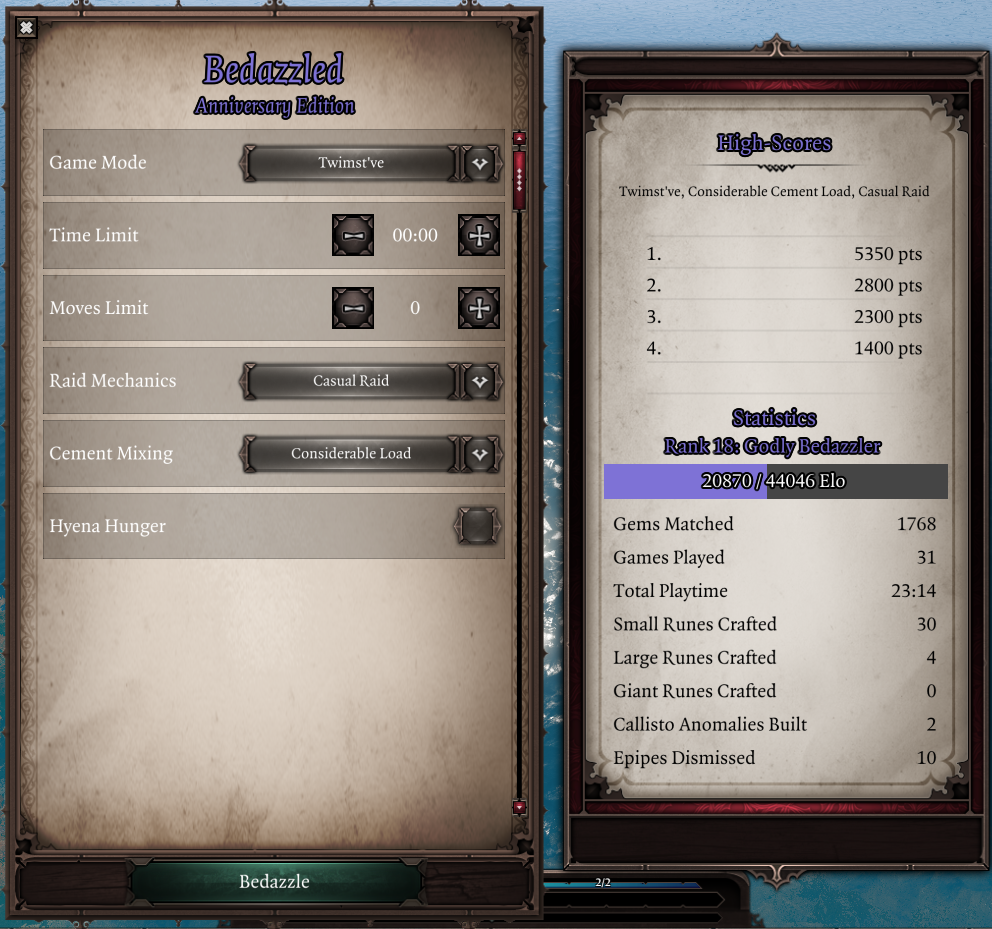

# Bedazzled
Bedazzled is a full-fledged match-3 minigame inspired by the Bejeweled series, supporting multiple gamemodes, modifiers, leaderboards and ELO rankings.

*Bedazzled Classic gameplay.*

Right-click a rune or rune-crafting gem and select the "*Bedazzle*" option from the context menu to get started. 

Just like Epip itself, Bedazzled is customizable and offers multiple gamemodes and modifiers to tailor the experience, accessed from the game's main menu.

Your best scores are tracked, and each match played allows you to climb the ELO ladder to gain prestigious titles *(in case you don't know what ELO is, it's basically an XP system for professionals)*.

## Gamemodes
Bedazzled supports 2 gamemodes:

- *Bedazzled Classic*: swap adjacent gems to create matches.
- *Bedazzled Twimst've*: spin2win by rotating groups of 2x2 gems to make matches.
    - You have a limited "free matches" that allow you to do so even if the move wouldn't create a match, replenishable by crafting runes and cleansing Epipes.

*Bedazzled Twimst've gameplay.*

Matching 4 or more gems of a kind will transform them into powerful runes and artifacts:

- 4 in a row: creates a medium rune, which explodes in a 3x3 area when matched.
- 5 gems in an L shape (any rotation): creates a large rune, which explodes the whole row and column when matched.
- 6 gems in a row: creates a huge rune. Effects are undocumented(?).
- 5 in a row: creates a Callisto Anomaly, which zaps other gems of the swapped kind when swapped.

Both gamemodes support simultaneous moves, in the style of Bejeweled 3. Certain Bejeweled 3 shenanigans like aerial techniques work by coincidence.

## Modifiers
Modifiers can be chosen before starting a game to add extra rules and restrictions to a run. These can be stacked and leaderboards are tracked separately for each combination of gamemode and modifiers.

Modifiers include:

- **Time Limit**: go for high-scores before time runs out
- **Move Limit**: make each of your limited moves count
- **Raid Mechanics**: gems with MMO enrage timers will spawn; if left unmatched, they will bring a fair and balanced instant game over
    - Enabled by default for *Bedazzled Twimst've*
- **Cement Mixer**: immovable objects known as "Epipes" will spawn to urge you to reconnect with reality. Exorcise them with the unstoppable force of runes to gain additional points and soothe enraged gems.
    - Enabled by default for *Bedazzled Twimst've*
- **Hyena Mode**: eldritch 2x2 matches become a thing, as was never intended