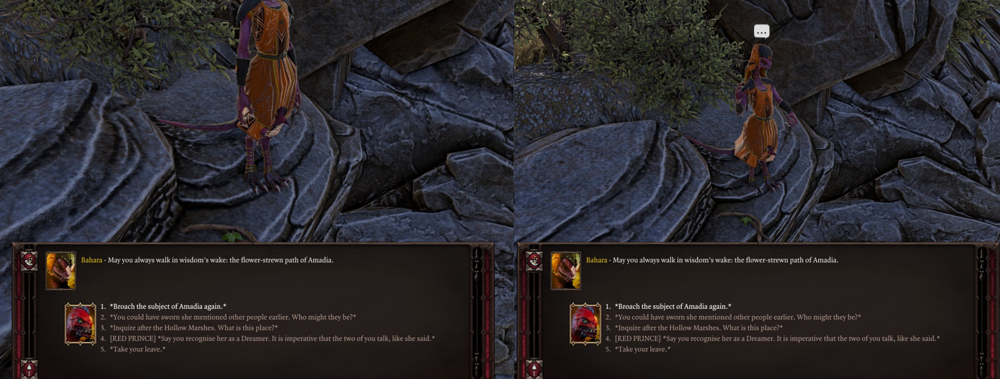

# Camera
The Epip settings menu features a dedicated tab for customizing camera properties such as the zoom, angle, and field of view.

Example of the maximum zoom out level.

## Pitch Controls
An "Adjust Pitch" keybind exists that allows you to change the vertical angle of the camera on the fly while it is held.

Other new settings exist in that same tab to adjust sensitivity, invert the controls as well as to allow the pitch to go negative.

## Angles
For each camera mode, the game accepts two angles: one used when zoomed in as much as possible, and the second used when the camera is zoomed out as much as possible. Position values for these modes are customizable within the "Camera" settings tab.

Any zoom level inbetween the minimum and maximum will have its angle resolved through linear interpolation.

These angles are actually position offsets applied to the camera, with the values being multiplied by the zoom level. This means that raising "Angle value 2" will result in the camera being higher up.

However, the game camera always points towards the ground or the focused character, and as such, raising the Y level also means it will point more towards the ground.

Example of an angle with a low Y (angle value 2)

## Other Features
- The *"Keybind Rotation Speed"* setting allows you to control the rotation speed when using the rotate camera keybinds.
- The *"Preserve position in dialogues"* setting prevents the camera from centering on NPCs in dialogue.
- The vanilla "Close-up dialogue" setting no longer zooms-in the camera obnoxiously close to characters.

<i>Before & after comparison of the vanilla "Close-up Dialogue" setting.</i>

