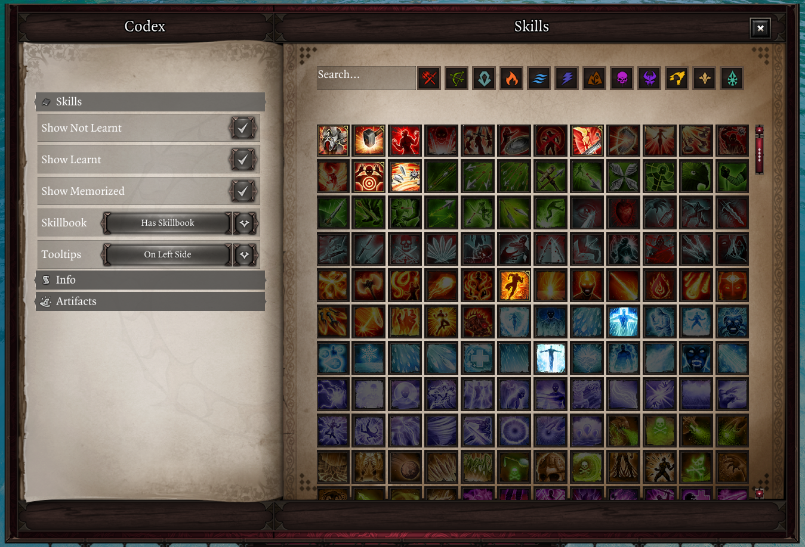
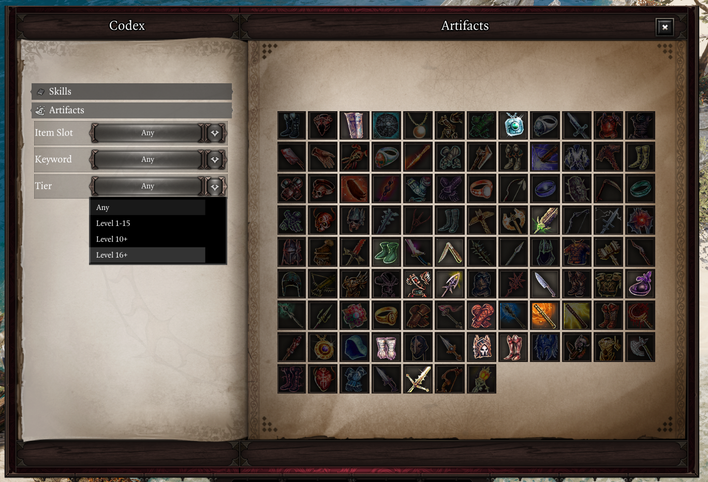
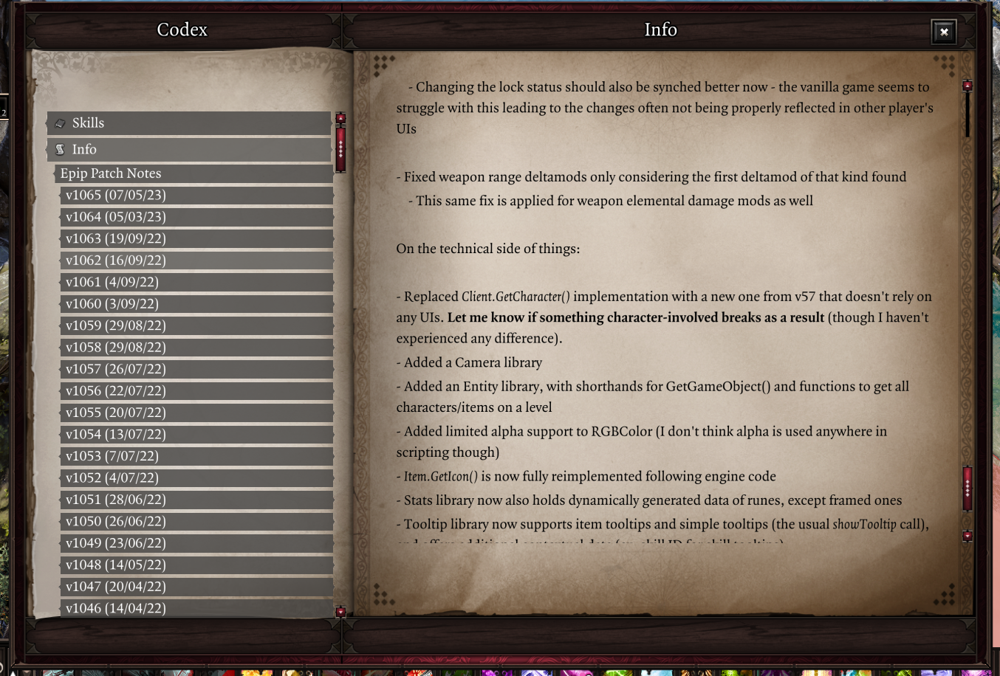

# Codex
The Codex is a new UI that serves as an in-game knowledgebase or reference for various topics. It is opened with ++lctrl+g++ by default.

The Codex is split up into various "sections", navigable througbh the index on the left side of the UI. Each section may also have settings that filter the information displayed. Other mods may add their own sections or extend existing ones.

## Skills
The Skills section displays skills that are obtainable by the player, acting as an extended skillbook UI that lets you consult the tooltips of skills regardless of whether your characters have them.

You may filter skills by school through the buttons at the top, or search them by name or stat object ID. The settings on the left side of the UI let you filter skills based on whether they're learnt, memorized, obtainable through skillbooks, and other criteria.

Skills from the Codex may be dragged onto the hotbar UI. If the *"Allow dragging in unlearnt skills"* setting is enabled, this becomes possible for skills your character doesn't know, allowing you to create placeholders on your hotbar for skills that you plan to acquire later.

## Artifacts
The Artifacts section displays all Artifact items from Epic Encounters. You may filter them by slot and keyword, and Artifacts the party has (either as the item or the rune) are highlighted.

If Derpy's EE2 Tweaks and the Artifact Tiers mods are enabled, you may also filter artifacts by their tier.

## Info
The Info section is used to display textual information of any kind. Currently, it displays patchnotes for Epip versions.

