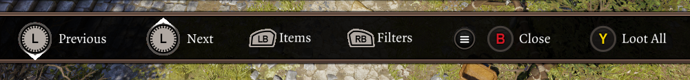
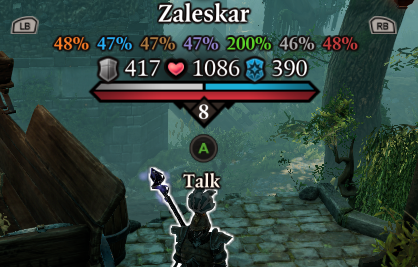

# Controller Support
Implementing controller support for UI mods is a tricky and time-consuming matter, however recent versions of Epip have made large improvements towards being usable with a controller, detailed on this page.

!!! warning ""
    Epip currently only supports using a controller in singleplayer; the vast majority of the mod does not work in splitscreen; local co-op support is a separate matter that is a whole lot harder that would require massive codebase changes, and as such we are not currently planning on tackling it.

## Navigation

The following interactable Epip UIs support controller and keyboard navigation:

- [Settings Menu](SettingsMenu.md), though it is not currently clear which settings have effect while playing with a controller; see below for a (non-comprehensive) list.
    - Interacting with keybind and "set" settings (ex. Animation Cancelling blacklist) is not currently supported.
- [Quick Loot](QuickLoot.md)
- [Quick Find](QuickFind.md)

In Epip UIs with controller support, a new "Navigation Bar" widget at the bottom of the screen displays the UI's controls.

You can disable the Navigation Bar in the settings (*"Show controller Navigation Bar"* in the "Miscellaneous UI" tab) or enable it for keyboard + mouse as well - as any UIs that got this controller support also support keyboard navigation. When playing with a controller, you can also configure which glyphs to show (Xbox or Playstation style) with the *"Controller Icons Style"* setting.

It's worth noting that no convenient ways exist yet to access UIs that require a keybind press, such as Quick Find. Our recommended temporary solution is to create a Steam Input virtual menu to be able to execute the respective keybinds. In v1072, custom radial menus will be added to remedy this.

## Other Features

The following features have special considerations for controller use:

- You can toggle filters for the "Alternative Status Display" by pressing the right stick
- The *"Resistances Display"* setting shows its information by the bars that appear when targeting characters, by their name
    - Opening the context menu for a character while in combat displays the "alternative" information (AP, SP, initiative, etc.)

<i>Resistances display on the controller UI.</i>

The following is a (non-comprehensive) list of other settings/features which have had controller support added for them:

- *"Show Minimap"* setting
- *"Resistances Display"* setting
- *"Immersive Meditation"* setting
- Most tooltip adjustments
