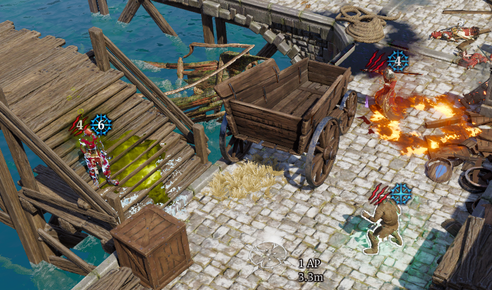
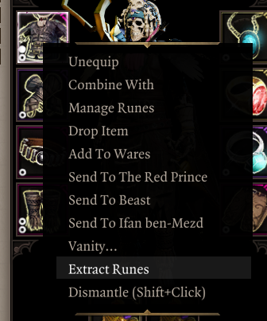
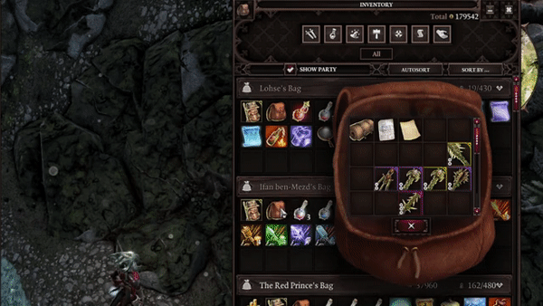
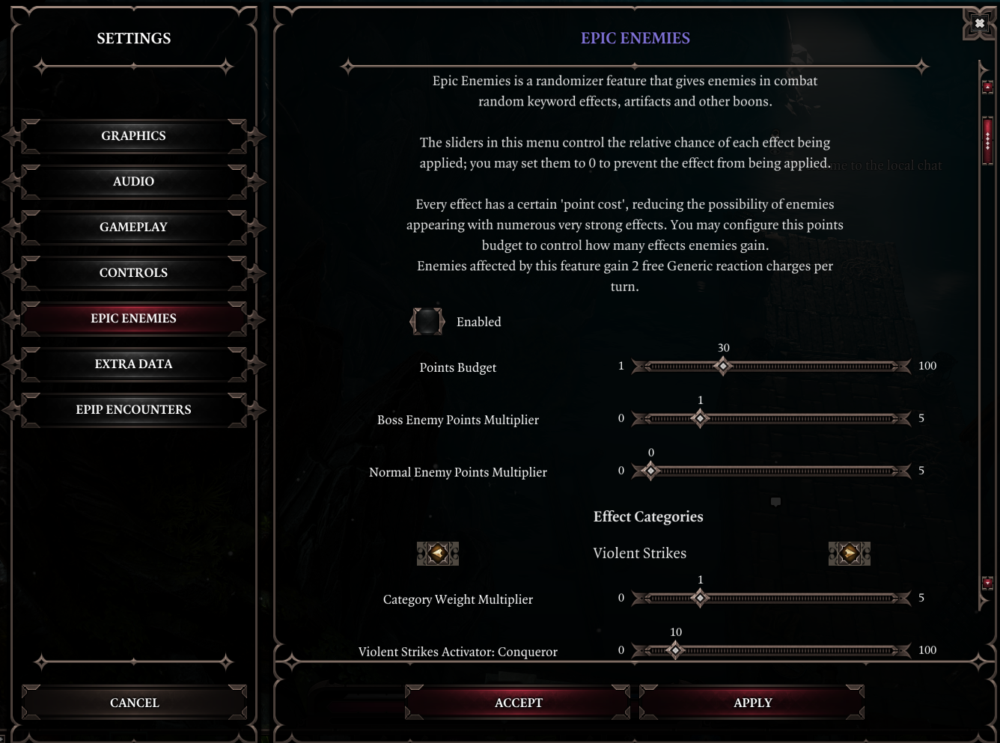
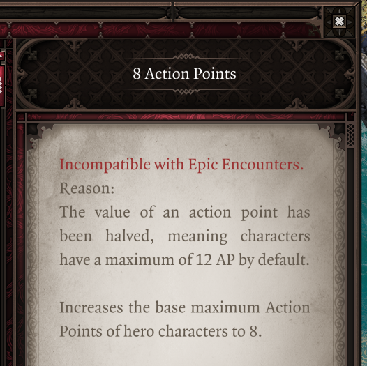

Having started out as a mod for Epic Encounters 2, Epip features numerous QoL improvements targeting it, as well as a few miscellaneous features.

## B/H Overheads
A *"Show B/H"* keybind exists that will display Battered & Harried of nearby characters in combat while held. Stacks that meet the tier 3 requirement will be shown with higher opacity.

## Ascension/Meditate

### Ascension
You can now use the `Esc` key to go back to the previous page in the Ascension UI, or exit it if you're on the default page. A setting exists to make this key always exit the UI (*"Escape Key Closes EE UIs"* in the "Epic Encounters" settings tab).

An "Immersive Meditation" setting can be enabled to hide the minimap and hotbar while within the EE UIs.

Proper controller support for the Ascension UI exists; when not using the pointer mode, you can navigate nodes and wheels with the left stick and use the A & B buttons to interact with elements or go back respectively, with other controls being listed on the [Navigation Bar](../Features/ControllerSupport.md#navigation).

You can still use the pointer mode as before, which you'll need to in order to access less commonly-used elements like the keyword descriptions, the "Deallocate All" button and other EE UIs.

### Greatforge Context Menus
Item context menus now have options to quickly dismantle items, as well as to remove their runes. Doing so still costs the usual amount of gold/splinters respectively.

Containers with equipment in them get a *"Mass Dismantle"* option, letting you rapidly dismantle unwanted gear.

### Greatforge
An option to add sockets to items ("Drill Sockets") has been added. This does not allow you to break the 2 socket limit for one-handed weaponry.

The Empower option now properly scales armor values, however due to technical limitations this will only take effect after a save+reload.

Additionally, an option to rename items ("Engrave") has been added. This is purely cosmetic.

## Tooltips
Many EE-specific adjustments have been made to tooltips, detailed in the [Tooltips](../Features/TooltipAdjustments.md#changes-for-epic-encounters) page.

## Epic Enemies
Epic Enemies is a randomizer feature enabled from the ingame settings menu. It bestows enemies with EE perks such as keyword activators/mutators, artifacts, and more. You can configure the relative chance of each effect being rolled on enemies.

These effects will be applied to enemies when they enter combat. You may use the ["Quick Examine UI](../index.md#quick-examine) to view the perks that each enemy rolled; see its respective section in this site for more info.

## Giftbags and mod incompatibilities
Giftbag mods incompatible with EE are no longer selectable in the UI, to prevent regrets. Gift bags that work but for one reason or another are undesirable show a warning upon attempting to enable them.

Common mods incompatible with EE or its add-ons now show a warning when you load into the game with them enabled.