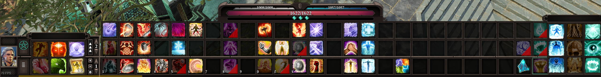
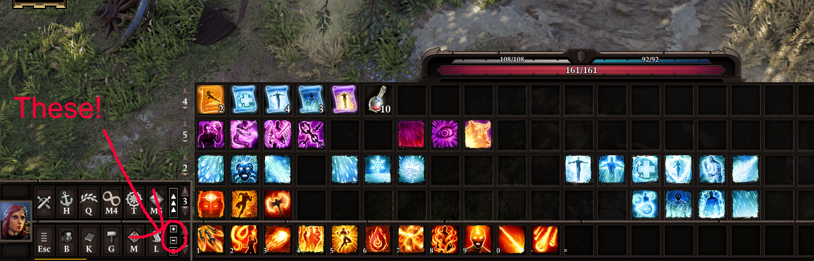
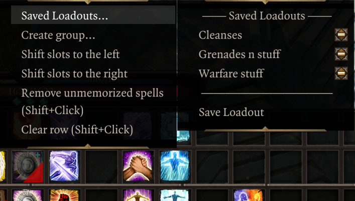
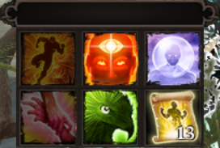
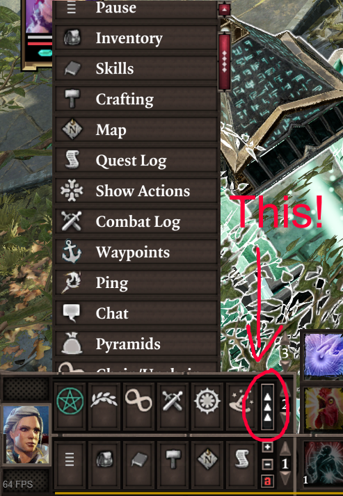

# Hotbar
Epip offers a heavily improved Hotbar UI, featuring multiple bars, custom "action" buttons in the bottom left, additional skill panels shared between characters and numerous functions to make hotbar management easier.

## Multiple Rows

To add/remove rows, click the small +/- icons to the right of the buttons area. You can cycle each row independently through all 5 rows of slots that the game allows. You can have up to 5 rows visible.

You can use the regular hotkeys (F/R by default) to cycle the bottom bar. Holding shift while using them will cycle the second row from the bottom instead. Holding Ctrl will cycle the 3rd row, while holding alt will cycle the 4th one.

## New Controls

Right-click a row on the hotbar to bring up a context menu where you can "push" groups of slots around (great for inserting spells inbetween!), clear unmemorized spells, or save "loadouts" to restore your hotbars in later playthroughs.  

## Skill Groups

"Create group..." option shown in menu above allows you to create spell (or item) groups shared between characters. Very handy for keeping all the essential spells in one place.  

Slots with items assigned to them will collect items from all characters, simplifying management.  

Existing groups can be dragged around by their handle. Right-clicking a Skill Group will bring up a submenu with *Delete* and *Resize* options.  

## Action Bar

The buttons next to the portrait are now customizable; when your hotbar is unlocked, you can drag and drop to rearrange them. Additionally, mods can add their own "actions" there, and there are a few new built-in ones. You can press the middle mouse button to unbind them.  

Right click one of those buttons or click the `^` button to bring up a "drawer" with all the actions that you can drag and drop onto your actions bar. You can also click them to use them directly from there.  

**Action bar has to be unlocked to allow drag and drop! The lock button is located right under the +/- buttons!**  

By default, if you have 2+ rows of hotbar slots, you will also have a second row of these customizable buttons.  
You can disable this in **Options -> Epip Settings -> Hotbar -> Hotbar Buttons Area Sizing**.  

These buttons can be used with keyboard hotkeys; to do so, you must assign keys to them in **Options -> Controls -> Epip Encounters -> Hotbar Action #N (top/bottom row)**.  
You can toggle whether assigned hotkeys are displayed on the buttons in **Options -> Epip Settings -> Hotbar -> Show Action Hotkeys**.

### New Actions

Epip Encounters implements multiple handy new actions, in addition to all vanilla functions:

-  - Pyramids: Uses the teleporter pyramid on current character.
-  - Chain/Unchain: Toggle chaining with your nearby party members. Instant, plays no animation.
-  - Bedroll Rest: Requires **any** of your party members to have a bedroll in inventory.
-  - Vanity: A Vanity menu shortcut.
-  - Respec: Requires **any** of your party members to have a Portable Respec Mirror provided by [this mod](https://steamcommunity.com/sharedfiles/filedetails/?id=1507233042) in inventory.
-  - Meditate
-  - Source Infuse

The purpose of the action bar is to provide a centralized place for modders to add shortcuts/hotkeys to their interfaces or features, eliminating the need for interactable books that clutter your inventory and freeing up space on the hotbar.

[The hotbar improvements are also available as a standalone mod with no EE dependency.](https://steamcommunity.com/sharedfiles/filedetails/?id=2759281297)
