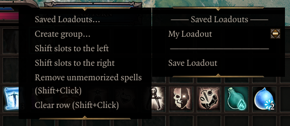

Epip offers a heavily improved Hotbar UI, featuring multiple bars, custom "action" buttons in the bottom left, and numerous functions to make hotbar management easier.

To add/remove rows, click the small +/- icons to the right of the buttons area. You can cycle each row independently through all 5 rows of slots that the game allows. You can have up to 5 rows visible.

You can use the regular hotkeys (F/R by default) to cycle the bottom bar. Holding shift while using them will cycle the second row from the bottom instead. Holding Ctrl will cycle the 3rd row, while holding alt will cycle the 4th one.

The buttons next to the portrait are now customizable; when your hotbar is unlocked, you can drag and drop to rearrange them. Additionally, mods can add their own "actions" there, and there are a few new built-in ones. You can press the middle mouse button to unbind them.

Right click one of those buttons or click the `^` button to bring up a "drawer" with all the actions that you can drag and drop onto your actions bar. You can also click them to use them directly from there.

These buttons can be used with keyboard hotkeys; to do so, you must assign keys to them from the "Keybinds" tab in the [Epip Settings Menu](../Features/SettingsMenu.md). They are labelled "Hotbar Action #N" there.

By default, if you have 2+ rows of hotbar slots, you will also have a second row of these customizable buttons. You can disable this from the settings menu.

Epip implements multiple handy new actions, in addition to some vanilla functions:

- Source Infuse & Meditate
- Toggle Minimap
- Resting (using a bedroll from anywhere in your party inventory - no need to find one for everyone!)
- Toggle Party Link (instantaneous, no animation, and preserves order in the portraits UI)
- Respec (if Portable Respec Mirror mod is installed)

The purpose of the action bar is to provide a centralized place for modders to add shortcuts/hotkeys to their interfaces or features, eliminating the need for interactable books that clutter your inventory and freeing up space on the hotbar.

Right-click a row on the hotbar to bring up a context menu where you can "push" groups of slots around (great for inserting spells inbetween!), clear unmemorized spells, or save "loadouts" to restore your hotbars in later playthroughs.

!!! info ""
    Looking for additional hotbar slots that can be freely positioned anywhere on the screen? Check out the [Hotbar Groups](../Features/HotbarGroups.md) feature.

## Other Changes

- All "engine actions" (flee, lockpick, delay turn, etc.) are available from the vanilla actions drawer.
- A setting exists to allow dragging unlearnt skills onto the hotbar, for example from the [Codex](Codex.md). This is useful for creating placeholders for skills you plan on acquiring later. You can find it in the "Hotbar" tab (*"Allow dragging in unlearnt skills"*).
