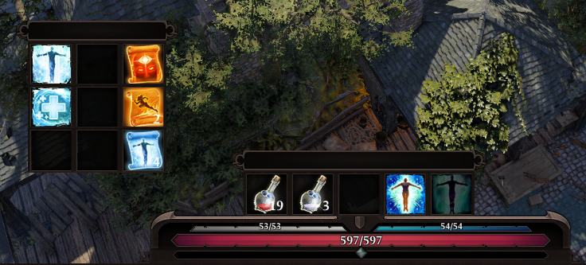
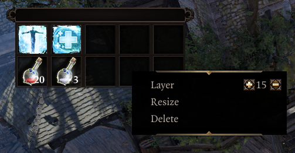

# Hotbar Groups
Hotbar Groups allow you to create detached grids of hotbar slots of any size and freely position them on the screen. The skills and items dragged into these groups are shared across characters, making them ideal for consumables and utility skills that you may have on multiple characters.

Right-click the regular hotbar and select "Create Hotbar Group" to get started. There is no limit on the amount of hotbar groups you can have.

Hotbar Groups may be dragged around using the brown handle on the sides. The relative position of the groups on the screen is saved across sessions.

Right-click a group to bring up a context menu where you can change the group's UI layer (positioning it below or above other UIs), resize the grid of the group, or delete it. Special thanks goes to Cathe for implementing group resizing!

The possibility to create non-shared groups will be available in the future.

## Demonstration

