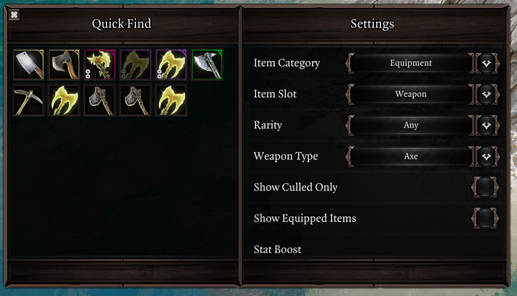

# Quick Find
Quick Find is a new UI that displays a filtered view of the party inventory. You may use it to efficiently search for equipment, consumables and other items through a plethora of filter options.

You may directly use or drag items from the UI. There's no need to organize your inventory when you can find what you need in the blink of an eye!

Quick Find is opened using ++lctrl+f++ by default. You may also right-click an equipped item and select the "Quick Swap..." option to bring up the UI with filters configured to show items that go in the selected item slot.

The following filter options are available:

- Equipment
    - Item slot
    - Rarity (including Artifact)
    - Weapon & armor type (ex. bow, dagger, heavy armor...)
    - Culled items (EE)
    - Equipped items
    - Wares
    - Stat boost: you may do a text search for bonuses such as +Warfare
- Consumables
    - Potions
    - Grenades & scrolls
    - Food & drinks
- Skillbooks
    - Skillbooks with unlearnt skills
    - Ability school
- Containers (backpacks, barrels, etc.)
    - Empty containers
- Miscellaneous
    - Books & Keys
    - Used items (read books & used keys)

The UI may be dragged by the top part, and will keep its position within the same session when re-opened.

By default, only items directly in the party inventory are shown. You may enable the "Recursive Search" option to also search items within backpacks and other containers the party holds.

