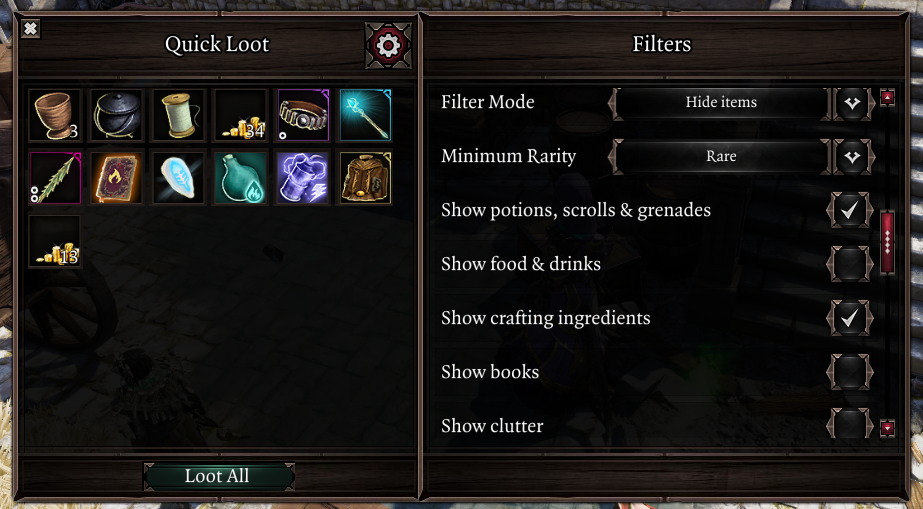

# Quick Loot
Quick Loot is a new UI that allows you to loot items from nearby containers and corpses through a unified UI with a single keybind press.

To use it, hold down the new *"Quick Loot: Start Search"* keybind (unbound by default) to select containers & corpses nearby. The keybind may also be bound from the "Quick Loot" settings tab, which includes other settings such as increasing the default search range and enabling visual feedback for looting.

Various filters exist to avoid picking up undesired items, quickly accessible via the settings button in the UI.

Hovering over items will show their source container/corpse in the tooltip, and you may also use the vanilla "take all" keybind to loot all items in the UI.

Containers and corpses show outlines while within the search radius to make them easier to spot.

!!! info ""
    🎮 The Quick Loot UI supports controllers. When playing with a controller, you may hold down the right-stick to begin searching.

!!! info ""
    Containers that are locked, out of line-of-sight or considered as stealing will not be looted.
