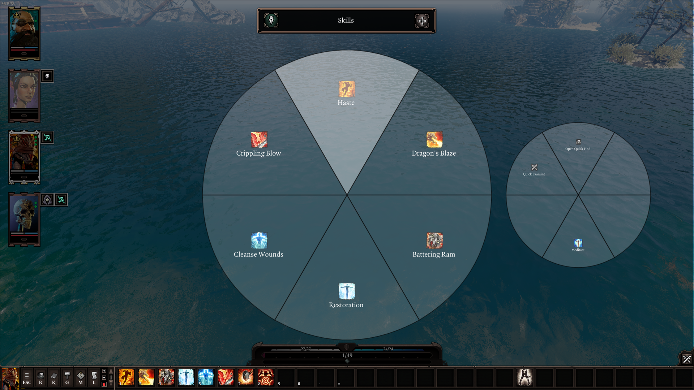

# Radial Menus
Epip offers radial menus as an alternative way of preparing skills or accessing Epip features that would otherwise require keybinds. Radial Menus can be accessed on KB+M by binding the *"Show radial menus"* keybind; when playing with controllers, they can alternatively by pressing the A button while the vanilla radial menu from the right-trigger is open.

You can create multiple menus with a customizable amount of segments, shared across characters. Two types of radial menus exist:

- **Hotbar**: slots of the menu are dynamically filled from your current character's hotbar
- **Custom**: slots are be assigned to skills and Epip keybinds manually
    - Assigning Epip keybinds makes various older Epip features much easier to access on controller, or saves you from needing to bind more keys for keybinds you rarely use

If you have multiple menus, you can switch between them by clicking on the previews of the neighbour ones, or you can use the *"Radial Menus: Next Menu"* and *"Radial Menus: Previous Menu"* keybinds. These keybinds default to mouse wheel up/down, and RB/LB on controller.

Menus can also be edited after their creation by pressing the pencil button by their name.

!!! warning ""
    Epip keybinds that normally require you to hold the buttons or also move the cursor at the same time are not currently supported from Radial Menus.
