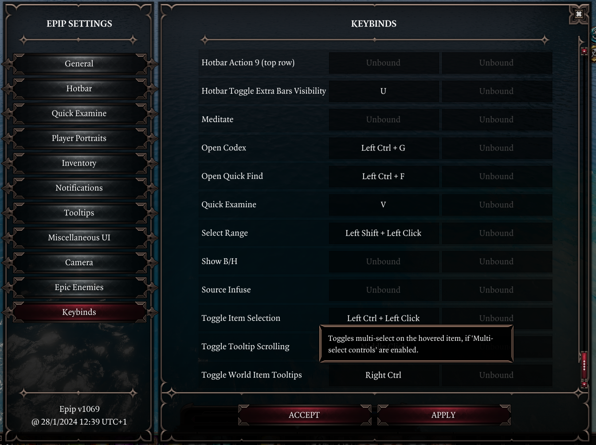

# Settings Menu
Epip is a very large and diverse mod, and it is only natural that not all features will be considered useful or desired by all users. To accommodate this, an in-game settings menu exists that lets you customize which features of the mod are enabled and how they behave. This menu can be accessed from `Pause Menu -> Options -> Epip Settings` while in a session and is split up into themed tabs for easier navigation.

The "Info" tab acts as a landing page and also offers non-intrusive tips on features that are otherwise obscure or easily missable. You may also enable these to show during loading screens.

Additionally, Epip's language may be configured there. Epip currently supports **Russian, Simplified Chinese, Polish, Brazilian Portuguese, and French**, and its language may be set independently of the game's.

! info ""
    Localizations are crowdsourced; anyone is welcome to help! Ask for details in [*#epipeline*](https://discord.gg/SevYmQc573).

The "Keybinds" tab allows you to customize the bindings for all hotkeys that Epip adds. Some hotkeys have descriptions as tooltips when hovered over. For convenience, some hotkeys may also be displayed and rebound from other settings menu tabs, next to settings relevant to them.

Some older options might require a save-and-reload for their changes to apply - you will be warned when applying changes if this is the case.

!!! info "Pro tip"
    You may shift-click the "Options" button in the pause menu to immediately open the Epip Settings Menu without going through the vanilla settings menu.

## Other Changes

- The vanilla game difficulty can now be changed to/from tactician freely at any time from the vanilla "Gameplay" settings tab. The side effects of this have not been studied well, but everything appears to work fine with the exception of already-initialized enemies having missing HP and consumables(?).