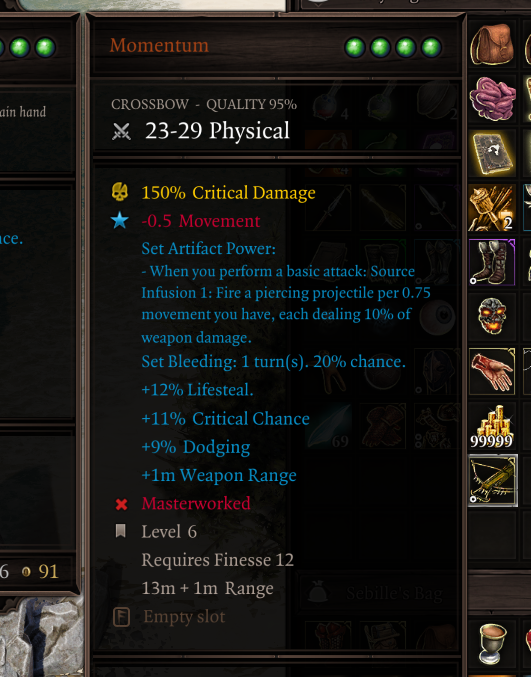

## Tooltip Adjustments
Numerous fixes and additions have been made to tooltips to improve their clarity. Some of these may be toggled off or reconfigured from the "Tooltips" tab in the settings menu.

### General
- Skill tooltips now account for effects that increase or decrease AP costs.
- Status tooltips show who applied the status (if anyone), as well as whether the status comes from an equipped item.
- Deltamods that previously did not show clearly in tooltips (+range, +elemental damage) now have blue labels in tooltips, like others.
- Holding shift will cause skill tooltips to display damage multipliers instead. Does not work for all skills.
- Removed the skull icon introduced by GB5 that appeared on negative status effects (unlikely to have been intentional).
- Added a keybind to scroll tooltips, useful for 3-socket items whose tooltips often overflow the screen.
- Books that have been read and keys that have been used now have a green label in their tooltip.
- Long item tooltips will be top-anchored, helping with the issue of being unable to compare items while wielding a heavily upgraded item.
- When in combat, the cursor now displays a warning when attempting to move to a spot that would cause you to exit combat (roughly 27.5m away from the nearest enemy in 2D distance)
    - This warning also displays when using movement skills (Jump, Rush, Teleport skills)
- Fixed cone and zone-type skill tooltips saying that their range is boosted by Astrologer's Gaze (Far-out Man in vanilla), as they are not actually affected.
- Surface tooltips now show their owner - the character from who the surface scales from.
- Surface tooltips now render on top of the hotbar.
- In developer mode, statuses and skills show their IDs in their tooltips. A debug keybind exists to copy these identifiers to the clipboard.
- Active Defense statuses now show their charges and max charges.
- Holding shift in combat displays partial AP costs for movement.
- Containers (backpacks, barrels, etc.) show the names of the first few items within them. Defaults to previewing up to 3 items.
- A setting exists to display item tooltips in inventory UIs to the sides of the UI rather than by the cursor, accessible from the "Tooltips" tab (*"Inventory Item Tooltips Position"*). This prevents the tooltips from obscuring other items within the UI.
- Delay for simple tooltips appearing is customizable in the settings menu.
- The delay before item and item comparison tooltips display in the inventory UIs is customizable through the *"Inventory Item Tooltip Delay"* and *"Item Comparison Tooltip Delay" settings.
- Background of formatted tooltips can be made opaque through the *"Opaque Background"* setting.
- "+0%" stat increases are no longer shown - this mostly concerns mods that dummy out vanilla behaviours.

### World Tooltips
The item tooltips that are displayed by holding ++lalt++ by default have received many options to improve their usability:

- A keybind has been added to make them toggleable, so you don't need to hold the key all the time.
- A setting exists to enable these tooltips for all items, similar to the "Let there be tooltips" mod, but with compatibility for all modded items.
    - Additional settings exist to filter out types of items you may be not interested in, such as beds, doors, lights, etc.
- You may hide these tooltips for empty looted containers and bodies.
- A setting exists that makes clicking the tooltips open containers rather than pick them up.
- You may highlight tooltips for certain kinds of items in a customizable color to distinguish them.

*Color-coded world item tooltips. Containers, equipment and consumables are all highlighted in a different, customizable color.*

### Changes for Epic Encounters

- "Stat Adjustments" in tooltips are now merged into one line.
- Added a label for items that have been Masterworked.
- While infusing a spell or holding shift, skill tooltips now highlight Source Infusions you don't meet the requirements for. Holding shift also displays your relevant ability score in the tooltip.
- Most statuses that deal damage now show the calculated damage, rather than showing "(before modifiers)".
- Tooltips for randomly generated EE items now show a "quality" label, which indicates how good the damage/armor rolls were for that item. A 100% quality indicates the best roll, possibly only on divine items.
- The word "Set: " has been removed from tooltips due to confusion and redundancy.
- The damage tooltip in the character sheet has been made less confusing by removing the mention of damage from gear and dummied out LW values. Additionally, it now makes it clear that the weapon abilities grant multiplicative damage increases.
- Artifacts display with a special rarity and item color, hand-picked by the EE devs. This change has been made available in the base EE mod as well. Additionally, artifact runes now show a "Cannot equip." warning for slots that they are incompatible with.
- Added a hint in the quest rewards screen which explains that deltamods are only generated after picking the item.
- EE rune crafting materials now have a hint explaining their usage.
- Surface tooltips now have a hint for their damage scaling.

#### Deltamods Display

Holding shift while looking at equipment tooltips will display information about their EE gear modifiers, such as their tier. This display will be improved in the future to be more user-friendly.

For information on how deltamods work in EE, consult [this site](https://www.pinewood.team/ee2gearmods/) as well as [this sheet](https://docs.google.com/spreadsheets/d/1zaLjNqaNqTbzAknvp1BcvxQClNcT-mwGrkvPxNJVC8I/edit#gid=0).

