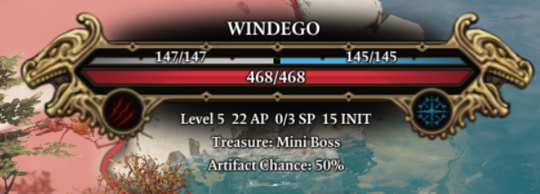
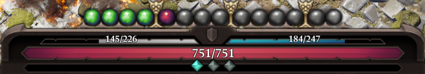
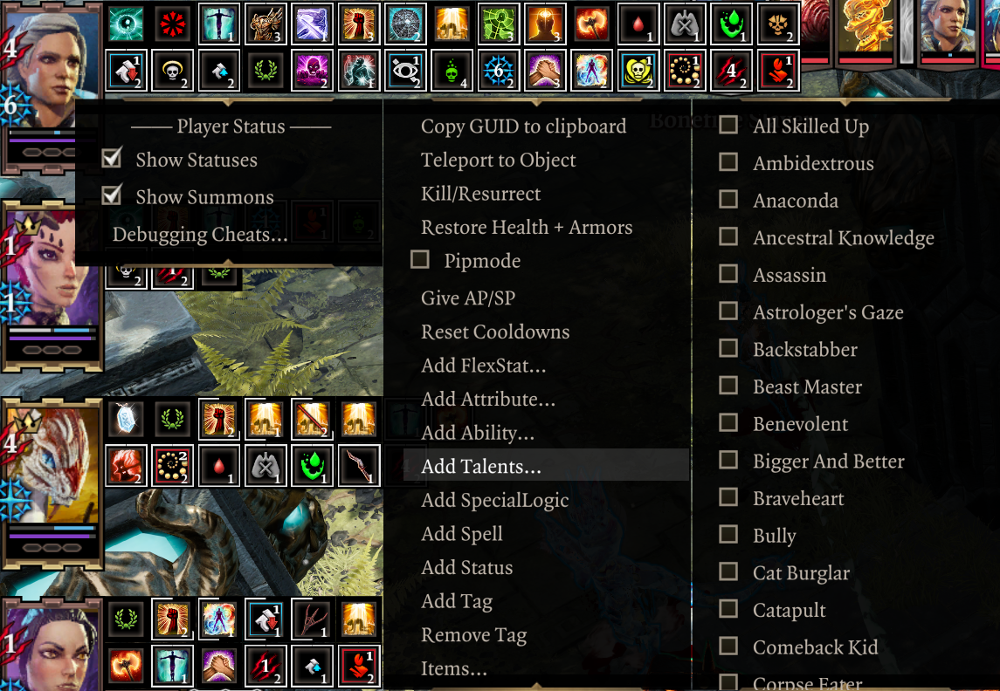
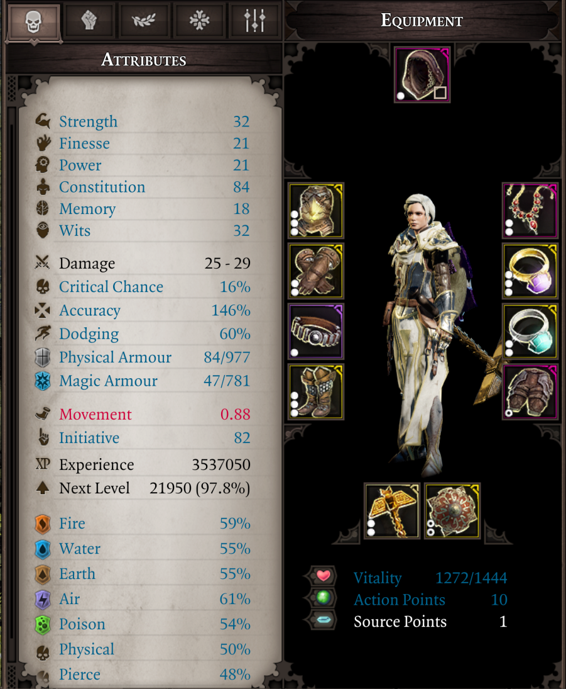
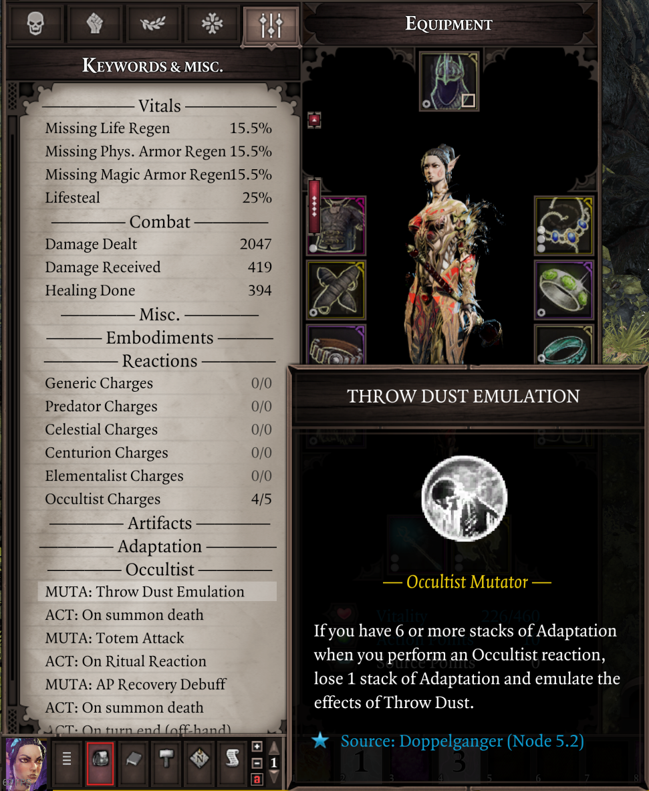
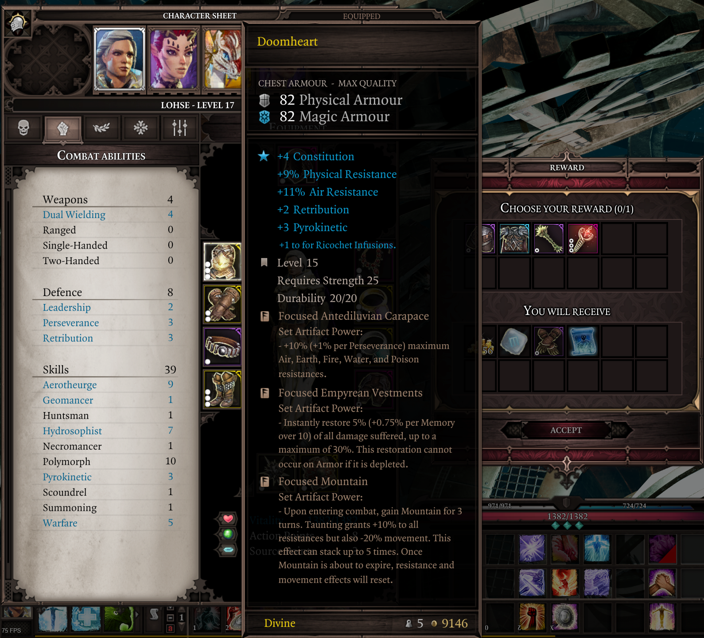

# UI improvements
Epip contains a plethora of functional and cosmetic improvements over the base game UI. Big thanks to Elric for the new art assets used!

## Target Status Bar

### Resistance and B/H Display
The health bar at the top of the screen now shows character's resistances as well as their Battered and Harried stacks. The B/H icons will light up if the target has enough of them to suffer a Tier 3 status, and will blink when the duration of the stacks is 1 turn or fewer.  
Actual B/H statuses are now hidden to reduce clutter.  

### Alternative Display
Holding the "show sneak cones" button (Shift by default) will replace the resistances display with the character's current AP, Source and Initiative - very handy for planning and foreseeing enemy turns. Additionally, it will lower the opacity of status effects on the health bar.  

### Level Display
An option to customize the position of targeted character level display was added.  
*By default it's displayed in alternate status bar mode (while Shift is held).*  

Showcase

Accessible through <b>Options -> Epip settings -> General -> Character Level Display</b>.

<table>
<tr><td>Hidden:            </td><td></td></tr>
<tr><td>After Name:        </td><td></td></tr>
<tr><td>Below Health Bar:  </td><td></td></tr>
<tr><td>When holding Shift:</td><td></td></tr>
</table>

### Aggro Display
An option to display aggro-related information was added. It shows current Taunt source, if exists, as well as whether a character is Preferred, Unpreferred or Ignored by enemies.  
You can adjust whether this info is shown in the default or alternative health bar display.  
*Disabled by default.*  

Showcase

Accessible through <b>Options -> Epip settings -> General -> Show Aggro Information</b>.
<table>
<tr><td>Preferred:   </td><td></td></tr>
<tr><td>Unpreferred: </td><td></td></tr>
<tr><td>Ignored:     </td><td></td></tr>
<tr><td>Taunted:     </td><td></td></tr>
</table>

Aggro tags explanation

AI chooses its targets based on a number of parameters, such as target's effective HP, how easy it is to get to the target and so on. Its behavior is also influenced by aggro tags.

<ul>
<li>No tag: AI has no preference on whether to choose this character as the primary attack target or not. However, AI will actively try to hit this character with AOE attacks. Most characters will not have any aggro tag by default.</li>
<li>Preferred: AI will actively try to make this character its primary attack target. This aggro tag is manually provided to some important NPCs and is not normally obtainable during gameplay.</li>
<li>Unpreferred: AI will try not to make this character its primary target. <b>However, AI will still actively try to AOE this character.</b> This tag is usually acquired by using Subjugated status, and is also manually provided to some characters, mostly summons.</li>
<li>Ignored: AI will try to act as if this character does not exist.</li>
<li>Taunted: this AI will consider the source of Taunt a Preferred target.</li>
</ul>

<b>This information is only relevant for Epic Encounters 2!</b>

### Treasure Display
An option has been added to display noteworthy item drops of enemies and containers on their health bar. For characters, this only shows while holding shift.  
Accessible through **Options -> Epip settings -> General -> Character Level Display**, disabled by default.  

## Player Status Bar
The player health bar now shows its values at all times (you needn't hover over it anymore), and the Physical/Magic Armor text was removed to improve readability.  
Additionally, your AP display now features dividers every 4 AP, making it easier to see at a quick glance how much AP you've got left. Your maximum SP is also shown at all times.  
Further minor graphical tweaks were made, such as properly centering AP/SP displays and adding a dropshadow to AP bar to improve its readability.  

## Player Portraits
The status bar on your characters now wraps onto a second row once there are more than 6 statuses, preventing it from obscuring the middle of the screen during intense fights. Summon portraits no longer show statuses and are shrunk while the status bar is wrapping.  
In the settings you may also enable a Battered/Harried display on these portraits.  

You can right-click your portraits to open a context menu where you can hide the status bar and summons, as well as access the Debug Cheats if you're in developer mode.  

Other settings

<b>Options -> Epip settings -> Player portraits</b>
<table>
<tr><td>Display B/H on player portraits</td><td>
Display nice, big B/H indicators right over player portaits.

Disabled by default.
</td></tr>
<tr><td>Status Opacity in Combat       </td><td>
Make statuses less visible.

Hovering over statuses will always show them at full opacity.

                                                 
                                                

</td></tr>
</table>

## Character Sheet
The character sheet now shows physical and piercing resistances.

The tags tab is replaced with a brand new "Keywords and misc." tab.  
It's full of useful information, such as:

- Remaining reaction charges.
- Currently equipped Artifacts, with descriptions.
- Active keyword activators and mutators, with descriptions.
- Your combat stats. *It's not perfect, but it's a good reference.*
- Other miscellaneous other info, e.g. your passive regeneration rates.

## Rewards UI
An option has been added to allow viewing the character sheet while within the quest rewards screen, allowing you to compare rewards to your party's currently equipped items.  
Located in **Options -> Epip settings -> Inventory -> Show Character Sheet in Reward UI**. Disabled by default.  

