# Vanity
Satisfy all of your cosplay needs with an easy to use, non-intrusive vanity system.  
Unlike some other implementations, this has **absolutely no gameplay side effects**. It even works with Gift Bag 5 armor sets!  
Access its menu by right-clicking any of your equipped items and choosing the "Vanity..." option.  

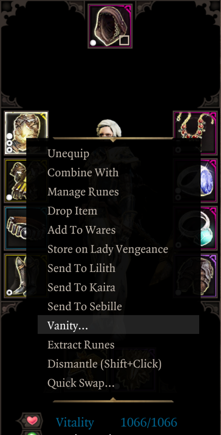

From here you will have access to a number of tabs packed with customization features.  

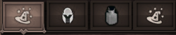

## Transmog Tab 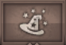

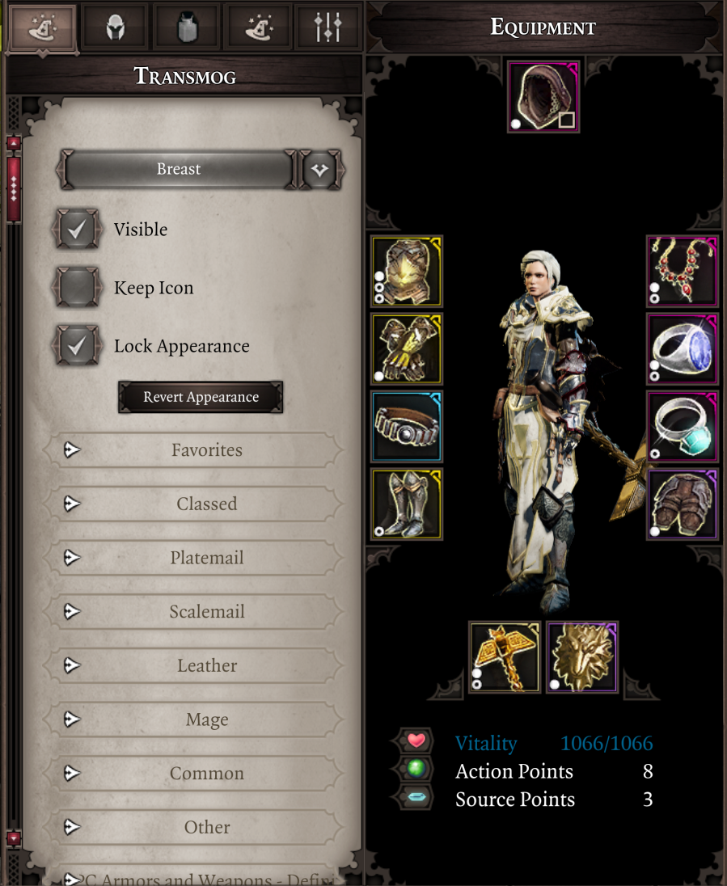

Equipment tab lets you seamlessly transmogrify the appearance of your weapons and armors.  
The item you've used to access this tab is its focus, indicated by the dropdown list at the top. To select another item to tinker with you can use right-click -> Vanity... on it or said dropdown list.  

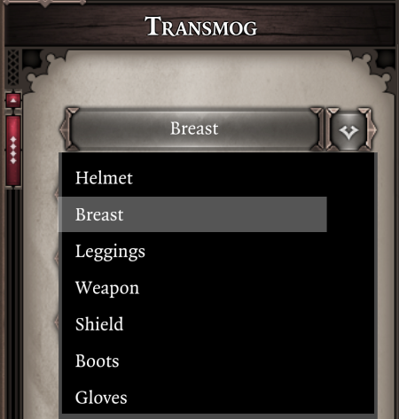

### Basics
Transmog options consist of vanilla armor variants and options added by cosmetic mods. **Support is included for ["Majora's Project Fashion Sins"](https://steamcommunity.com/sharedfiles/filedetails/?id=1815898410), ["Rendal's NPC Armors"](https://steamcommunity.com/sharedfiles/filedetails/?id=1515827226) and ["Visitors from Cyseal"](https://steamcommunity.com/sharedfiles/filedetails/?id=2828485171) mods.**  
Using transmog is as easy as clicking on your desired option, no extra items or materials required.  
**This change is purely cosmetic and has no effect on gameplay! Your equipment will not lose its stats, modifiers nor set effects. Yes, it works with Gift Bag 5 armor sets.**  

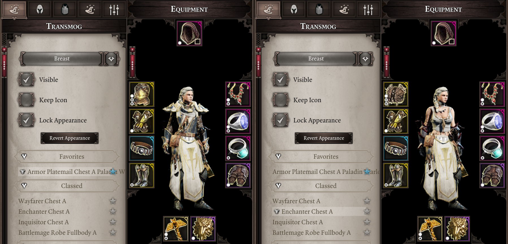  

If you think we've missed some of vanilla variants or want to see support for more third-party mods - feel free to tell us.

### Autotransmog
Found your perfect look? Want to keep it for the rest of the game? "Lock Appearance" option is here for you. When it's ticked newly equipped gear will be automatically transmogrified to match your previous look.  

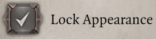

**This option is saved per-slot.**  
**Automatic transmogrification will only happen if you don't have Vanity menu open.**  

### Visibility
Want to go for more outlandish look? Make your equipment invisible with a press of a button! *We trust you to use this option responsibly and only hide your shields and/or weapons for the coolness factor instead of making your characters walk around butt-naked.*  

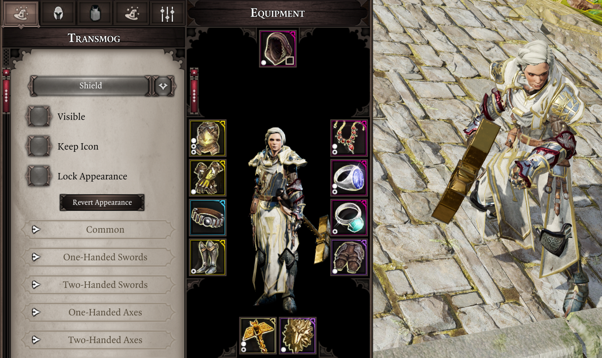

### Keep Icon
For the sake of making inventory management easier you can make transmog - both manual and automatic - preserve equipment icon.  
**This option is saved per-slot.**  

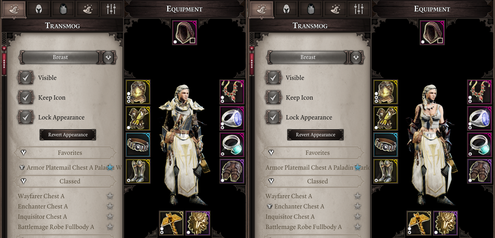

### Elemental Effects
Weapons with elemental damage normally get glowing visual effect applied to them. Don't like it? You can turn it off.  

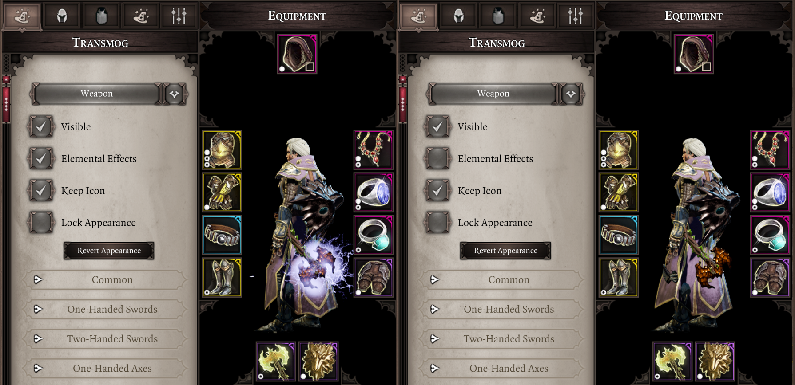

## Outfits Tab 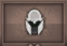
Have you mastered the art of drip? Have you found your ultimate image? Never wanna wear anything else ever again? Save your entire get-up and use it across playthroughs with a few clicks.  

Saved outfits are grouped by intended race and gender, but can be applied to any character.  

Adding a new outfit to your wardrobe is as simple as clicking 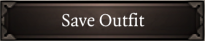{: style="width:auto;height:24px;" } and entering a name.

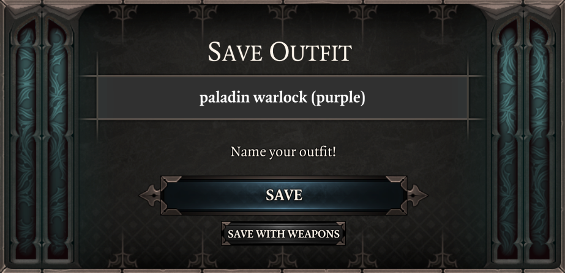

## Dyes Tab 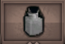
Feeling blue today? Maybe red? Or are you cool and it's time for purple? Worry not! All your coloring needs can be satisfied in the Dyes tab!  

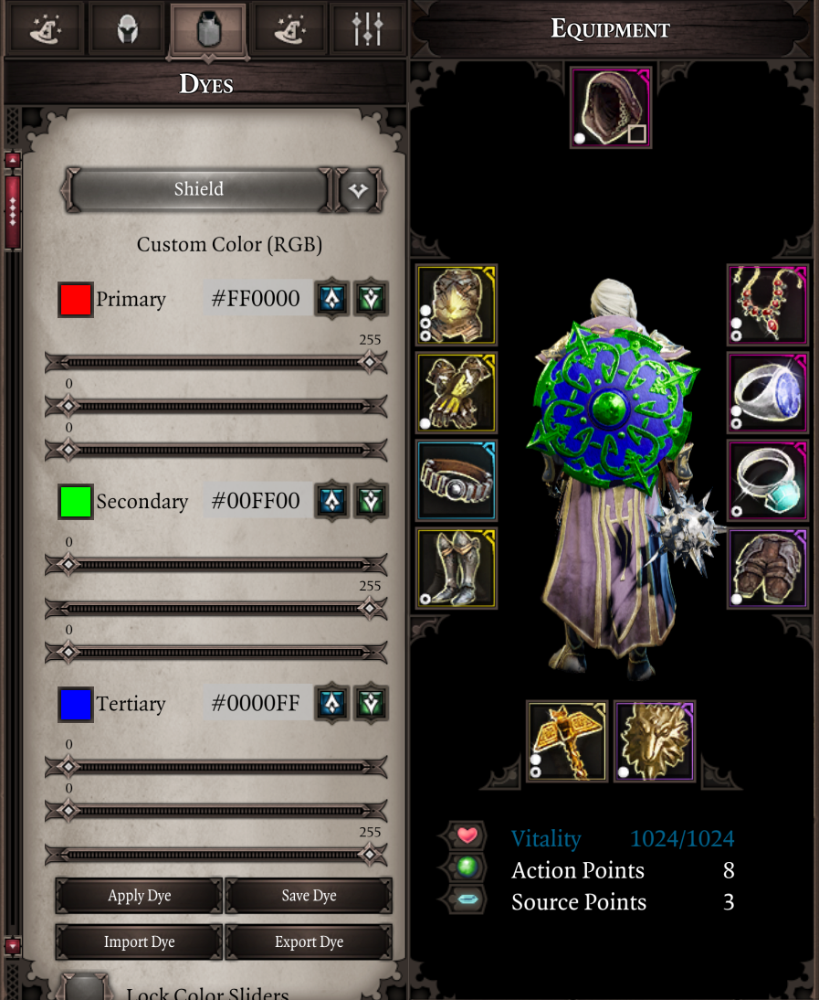

### Basics
Equipment is divided in up to 3 color zones. You can choose your favorite colors for each of them using means provided:  

+ Sliders - the more user-friendly option, drag a bunch of sliders around to adjust RGB values in [0; 255] range. You don't even have to understand how RGB works - a handy preview of a resulting color is always displayed for your convenience.  
+ Hex - if you think you're cool you can always straight-up enter your desired hex code. Whether you conjure them in your mind through otherwordly communion or just look them up in Google - not our problem.  

Once done - press 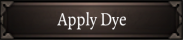{: style="width:auto;height:24px;" } to see the fruits of your labor.

**Important - not all equipment can be dyed and not all dyeable equipment will have all 3 color zones. We are not to be blamed for this, blame Larian instead.**

### Sharing
Found the coolest color combination ever? Wanna share it with your friend? There are several ways to go about this:

+ Copy/paste - see these 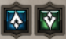{: style="width:auto;height:24px;" }? Up means "copy", down means "paste".
+ Import/export - 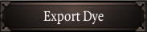{: style="width:auto;height:24px;" } puts a single string representing all 3 color zones into your clipboard, kinda like this **#FF0000-#00FF00-#0000FF**.  
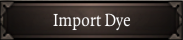{: style="width:auto;height:24px;" } scans your clipboard and if it contains the string in correct format - inputs color codes into their zones.  

### Lock Sliders
By default color sliders will automatically adjust to match currently focused equipment piece whenever you change it. However by ticking 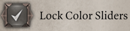{: style="width:auto;height:24px;" } you can prevent this.  
This can be useful for applying one dye to multiple equipment pieces.  

### Saving Dyes and Built-ins
You can save your favorite dyes to reuse them later by pressing 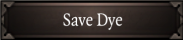{: style="width:auto;height:24px;" } and entering a name.  

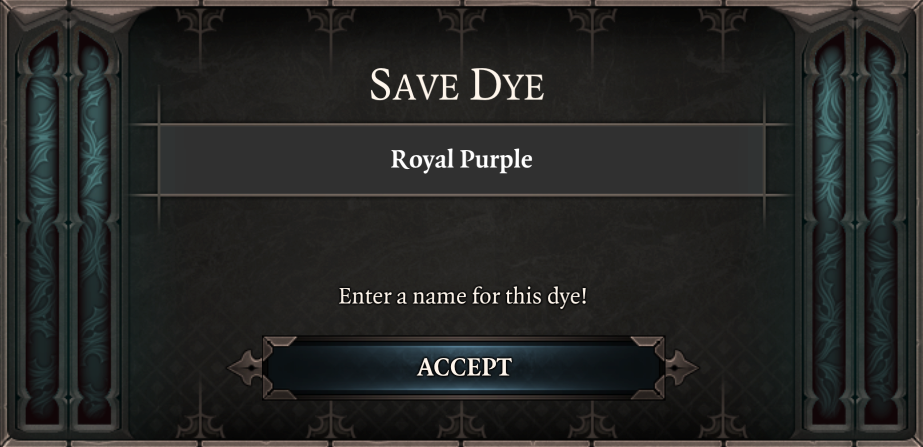

Saved dyes will appear under "Custom Dyes" collapsing list. There also are a few built-in dyes for you to use or take inspiration from.  

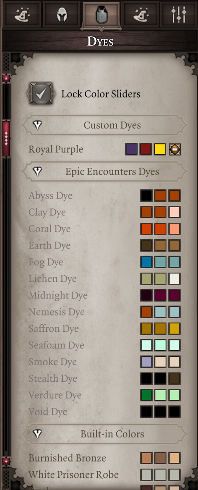

## Auras Tab 
All these drip options were not enough for you? Want to make your presence even more noticeable? Apply permanent visual effects to your character in Auras tab.  

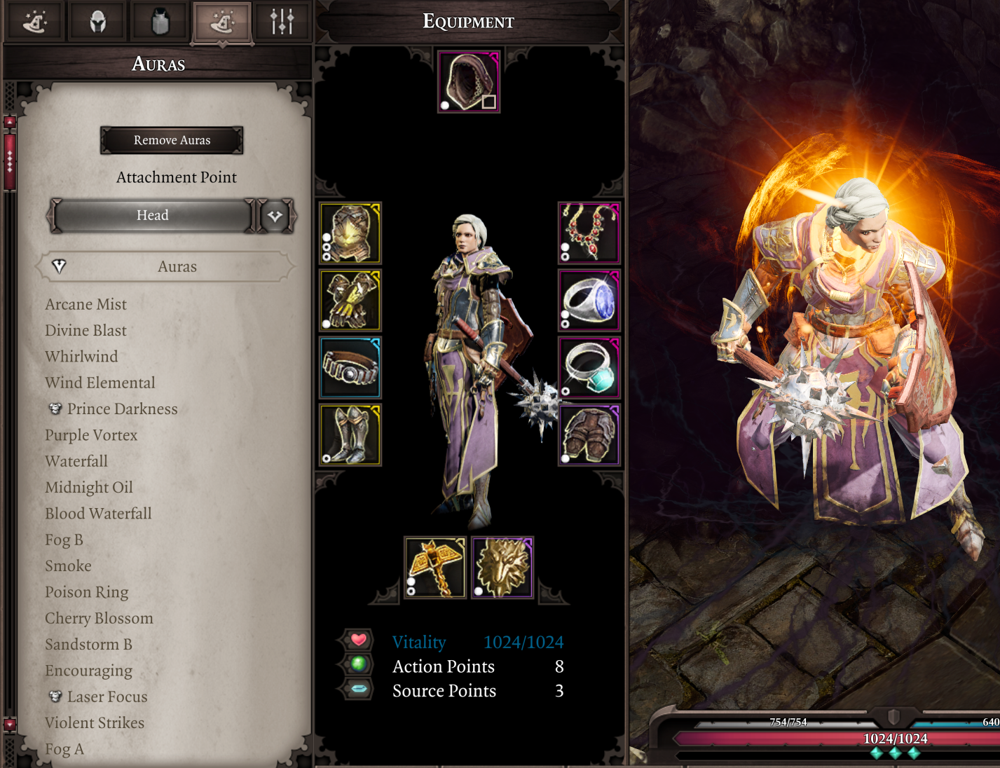

As simple as it gets - choose your attachment point, choose auras to use with it.  

*This feature is in rather experimental stage. It works as intended, but has seen little adoption by players (to our knowledge). Any useful feedback is welcome.*  
