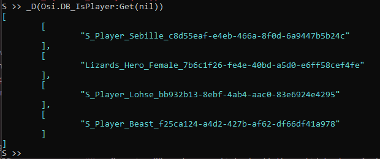
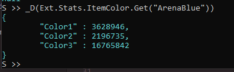
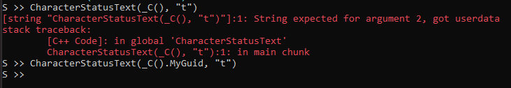
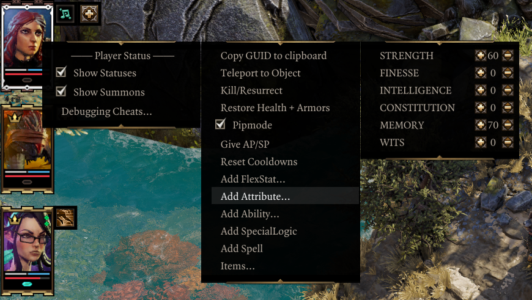
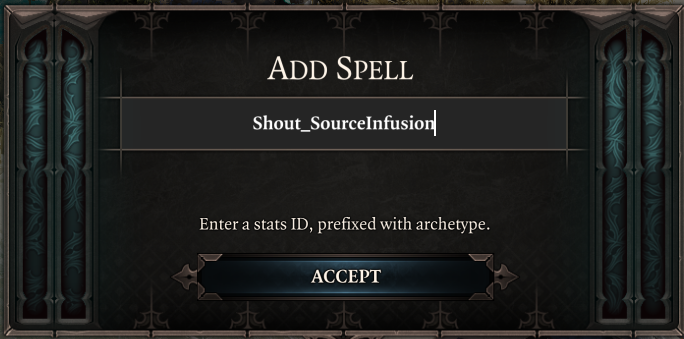

Testing and debugging mods in-game can be made a lot easier with the extender.

## Script Extender Console
Enabled by setting `CreateConsole` to `true` in `OsirisExtenderSettings.json`, the extender console logs messages from the extender, as well as lua scripting and osiris DebugBreaks.

The console can also be used to run lua code (and therefore osiris as well). Pressing enter in the console window will enter the lua console, in server context by default. Typing `server`/`client` switches between the lua contexts.

### Running Osiris
Calls, events and queries from the base game can be called directly, executing right away:

```lua
print(CharacterGetHostCharacter())
```

Note that for queries, no out parameters are specified; they are instead returned as variables. Lua supports multiple returns per call, and the print function will print them all in order. User queries return true for success and false for failure - you have to lookup the return DBs yourself.

For custom symbols, you must add an `Osi.` prefix (the Osi table is used to resolve custom osiris symbols, whereas the Larian ones are in the global table/scope):

```lua
Osi.PROC_AMER_GEN_OpenQueuedMessageBox(CharacterGetHostCharacter(), "Test")
```

DBs can be interacted with in all the usual manners:

- Queried with `Osi.DB_MyDB:Get(param1, param2, ...)`. Use `nil` for placeholders/wildcards.
- Set by calling the symbol: `Osi.DB_MyDB(myValue1, myValue2)`
- Deleted with the delete function: `Osi.DB_MyDB:Delete(param1, param2, ...)`. Once again, `nil` can be used as a wildcard.

Querying DBs returns a list of all the valid tuples. In the console, the `Ext.Dump()` function can be used to print values as json. A useful shorthand for the function is `_D()`:



As of v56, all extender objects can be dumped as well, revealing their mapped properties and methods:



The `_C()` function is a shorthand for returning the currently active character, available on both client and server.

```
S >> print(_C())
esv::Character (00007FF4C7E13200)
```

Note that this returns an extender character object (`esv::Character`), not the GUID. The GUID of most objects is mapped to the `.MyGuid` property, and it's what you have to use for osiris:



The boolean type is automatically converted to `0`/`1` when used in a call, but queries will still return integers.

On the client context, `_E()` returns the character currently being examined in the examine UI.

## Epip Helpers
Epip has some easy-to-use features to make testing ingame easier, if `DeveloperMode` is set to `true` in `OsirisExtenderSettings.json`.

The most important of these is the Force Story Patching setting in the mod's settings menu. It will cause story compilation and patching to occur on any session load, making it far more convenient to test script changes ingame. This and other debug settings are always at the top of the menu, only visible in developer mode.

The other useful, non-UI-related tool is the cheat context menu, accessed by right-clicking a character in the world or a player portrait on the left:



The "Copy GUID to clipboard" option is self-explanatory. "Teleport to object" teleports the character to another character, item, or trigger, by its GUID. You can combine these two options to quickly teleport party members to eachother.

"Pipmode" grants immortality, instantly-refreshing cooldowns, as well as infinite AP and SP. The options following it allow you to grant EE scripted stats to the character, with +/- buttons. Holding the "Show sneak cones" key (shift by default) adds/removes 10 points at a time. **The longer menus can be scrolled with the mouse wheel, though it doesn't look intuitive at the moment.** You may also add SpecialLogic and spells through a popup box:



Lastly, the "Items..." submenu allows you to spawn item templates, generate treasure loot onto yourself, as well as quickly spawning in all artifacts and runes (can take a while to have it all generate!).

## Macros
I have a simple AutoHotkey script for modding, with the following macros:

- `Ctrl+M4`: focuses the console. M4 is the mouse side button that performs the 'back' function.
- `Ctrl+M5`: focuses the game.
- `Shift+M5`: focuses VS Code.
- `Ctrl+R`: resets lua scripts (types `reset` in the console), sets some Epip tables to be available from the global context in the client console, then focuses the game.

```ahk
ConsoleWindowClass := "ConsoleWindowClass"
GameWindowClass := "SDL_app"
ConsoleWindow := "D:OS2 Script Extender Debug Console"

^r::LuaReset()

+XButton2::FocusVSC()
^XButton1::FocusConsole()
^XButton2::FocusGame()

LuaReset()
{
    global ConsoleWindow

    SetKeyDelay, 10

    WinGet, PID, PID, %GameWindow%
    ControlSend, , {enter}reset{enter}, %ConsoleWindow%
    ControlSend, , client{enter}, %ConsoleWindow%

    FocusGame()

    ControlSend, , epip = Mods.EpipEncounters{enter}, %ConsoleWindow%
    ControlSend, , ui = epip.Client.UI{enter}exit{enter}, %ConsoleWindow%
}

FocusGame()
{
    global GameWindowClass

    WinActivate, ahk_class %GameWindowClass%
}

FocusConsole()
{
    global ConsoleWindowClass

    WinActivate, ahk_class %ConsoleWindowClass%
}

FocusVSC()
{
    WinGet, PID, PID, ahk_exe Code.exe
    WinActivate, ahk_pid %PID%
}
```