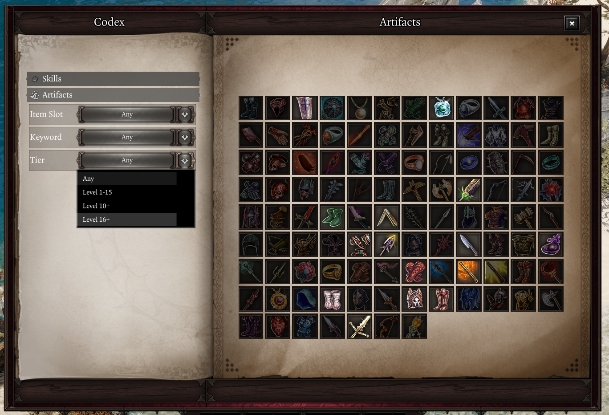

!!! warning "Extender devel version required"
    Requires extender v60. Intended version: `e8f1e8085df4a5f2e8862d2c719be38a5ddf6348e9c910429bccbfd2e6938605`
    To get it, use the following `ScriptExtenderUpdaterConfig.json`:
```json
{
	"UpdateChannel": "Devel",
	"TargetResourceDigest": "e8f1e8085df4a5f2e8862d2c719be38a5ddf6348e9c910429bccbfd2e6938605",
	"TargetVersion": "60.0.0.0",
	"Debug": true
}
```

## v1066 (16/07/23 upload)
[Download here](https://drive.google.com/file/d/15RiJMqoJHTiF8ptIPzjHshTCzQu34ZKW/view?usp=sharing).

This patch adds an Artifacts tab to the Codex.



Artifacts that you own (either equipped or in the party inventory, as item or rune) are highlighted. You may filter artifacts by their slot, associated keywords, as well as tier, if you're using Derpy's Artifact Tiers.

### Other changes and additions

- Added Simplified Chinese localization by Ainsky
    - There are certain issues with this translation, however we have not been able to contact the author yet. Please join the `#epipeline` channel on the EE discord if you authored this translation.
- Enabled mouse controls when using controller
    - This enables you to use UIs that support mouse, such as custom Epip UIs, as well as some reused Larian KB+M UIs such as the player portraits
    - This prevents the mouse from being hidden while idle when using controller (might become a setting later)
- Custom tooltips from Epip UIs now work while using controller
- BH Overheads now show for characters near the camera point, rather than near your selected character
- Significantly reduced stutter from BH Overheads
- Significantly reduced stutter for Epip UIs that use inventory-like slots
    - The time to open Quick Find for the first time should be reduced by 30-35%
    - The Skills Codex should see similar improvement
- Source Infuse and Meditate keybinds are now only shown if EE is enabled

### Fixes
- Fixed the tooltips for various world tooltip options misnaming the "Enable tooltips for all items" option
- Hotbar: fixed chain/unchain actions not working (beta issue)
- Fixed source infuse / meditate keybinds not working (beta issue)
- Examine Menu: fixed critical chance appearing in the wrong place for characters with many resistances
- Quick Examine: fixed resistances text getting cropped out if a character had too many of them
- Fixed the click sound for close buttons not playing in some custom UIs
- Fixed BH Overheads appearing over invisible enemies
- Fixed some sliders in the settings menu having their values cropped out until interacted with
- Fixed positioning of the "Alternative Status Display" when using controller

### Technical stuff
- ArtifactLib: added `IsOwnedByParty()`, `HasKeyword()`, and missing VolatileArmor keyword tags to artifacts
- Added `Profiling` library as well as Feature integration. No GUI exists for this yet, results can only be viewed through the console command
- Added `EnabledFunctor` property to event options, letting listeners only fire conditionally
    - Feature has a method that returns such a functor which checks for `:IsEnabled()`
- Added `ObjectPool` data structure
- Fixed `Text.Round()` for negative values
- Added `Meditate` library (currently barebones, will aid in controller support later)
- Added `SourceInfusion.RequestInfuse()`
- Various annotation fixes, and purging of trailing whitespace
- Improved `Character.GetStatusesFromItems()`, now works with many more status sources (hopefully all)
- Fixed `Combat.GetCombatID()` on server
- Removed the extender IDE files from the project to fix issues with doc generation. In the future, Epip will get its own annotation generator to fix the many issues with the current one
- Improvements to the localization sheet (will be deployed the next time the sheet is updated):
    - Outdated translations will have their cell marked in red background color
    - Rows will be sorted by script and original text (alphabetically)

#### Generic
- Added custom tooltip support to elements, and fixed not being to replace an existing tooltip
- Added `Element:GetParent()` and `Element:GetChildren()`
- Added an experimental `VerticalList` prefab that reimplements the basic VerticalList element functionality.
    - Unfortunately the performance of this is at best tied with the element, but it can serve as an example of how to implement custom containers, should you need for example unusual element positioning.
- Manual `Destroy()` now makes table references unusable
- Fixed `Destroy()` not working properly for elements within `VerticalList`. The other containers will be fixed later.
- Fixed `Text:GetTextSize()`; the flash `textHeight` property was highly inaccurate; it seemingly considered the height as if the text had one more line than it actually did
- Added `Text:GetLineHeight()`
- Added more textures and icons - make sure to redownload the assets folder if you're using the unpacked mod
- The `Slot` element now has certain features such as cooldown animations disabled until they are needed. This signficantly improves performance when creating many slots
    - `HotbarSlot` prefab has been adjusted to support this

## v1066 (1/07/23 upload)

This update adds the Codex UI, which will be an in-game knowledgebase for various topics. Currently it only features a Skills page that displays all player skills in the game, and allows for filtering and searching them. The default keybind for opening the Codex is `LCtrl + G`.


This page also serves as an alternative to the skillbook; you can drag skills out of it to memorize them and assign them to your hotbar.

In the future, you'll also be able to unmemorize and learn skills directly from it, if you have the skillbook.

### Quick Inventory
- Added wand, bow and crossbow filters, which were missing by oversight
- Added sorting for consumables; order is:
    1. Scrolls
    2. Grenades
    3. Arrows
    4. Potions
    5. Food
    6. Drinks
- Fixed searching for resistances not working properly

### Other Changes
- You can now change the layer of a hotbar group through their context menu
- Added a close button to the hotbar group creation/resize UIs
- Runes no longer show the confusing "Set :" prefix
    - This was previously only done for equipment
    - A setting to disable this tweak has also been added

### Fixes
- Fixed TSKs from the gameplay mod still being in Epip; you will need to redownload the gameplay mod if you use it
- Slots within Epip UIs now only play a dragging sound if the slot is not empty
- Fixed some tooltip adjustments not working on tooltips created within Epip UIs
- Fixed Ambidextrous checks (again) which might've lead to incorrect hotbar behaviour with potions and scrolls
- Fixed the Debug Cheats menu showing the wrong talents for characters that weren't the active client character
- Fixed performance issues from the stats tab when picking up items

### Technical Stuff

- Added a way to load lua scripts from a file defined in `Osiris Data/Epip/PersonalScripts.json`; this can be used to load test/debug scripts without needing to include them within the mod. See the `PersonalScripts` feature.
    - Removed various console commands as they are of no use other than personal
- Added `Texture` library, and support for its data structures for Generic
- Various annotation fixes and clean ups
- Added more methods to CombatLib and fixed `GetTurnOrder()`
- Moved Epip's Hotbar actions to a new feature
- Added `GetClassDefinition()` to OOP classes
- Choice settings's `SetValue()` now has validation
- Fixed registering TSKs with a StringKey
- `Library:RegisterTranslatedString()` now returns the TSK
- Fixed `OOP.IsClass()` throwing if the object was not a class
- Added the `Elementable` interface, which lets prefabs behave as if they were elements ("inheriting" Element's methods)
- `Stats.Get()` now allows type-capture
- Added `UI:ToggleVisibility()`
- Added some basic InputLib integration to Feature
- Added the `SettingsWidgets` feature, for rendering settings into Generic UIs as form elements
- Added the `SkillbookTemplates` feature, which lets you query item templates that have a SkillBook use action
- Fixed an error when hovering over a Status prefab whose status had expired

#### Generic
- Added the `Stylable` interface, for defining styles for customizing prefab appearances
- Added the `Button` prefab, which will replace the Button and StateButton elements. Its major advantage is support for styling, as well as the extendability and maintainability that comes from it being implemented in lua rather than flash.
- Various fixes to the Texture element
- Added `GetRawSize()` to some elements
- Fixed return values when calling exposed flash functions from lua
- Reworked CloseButton prefab to use the Button prefab
- Added focus-related events to Text element
- Added lots of UI textures and icons for use with Generic; see the `GenericUITextures` feature
- Added the `SearchBar` prefab

## v1066 (18/06/23 upload)

This version adds an option to replace the status bar by your character's portraits with a new custom UI - see "Alternative status display" in Player Portrait settings.


This by default behaves mostly the same as the regular status bar, with the major exception being no animations for statuses being removed - they might be added if there is demand.

The major advantage of this new UI is status sorting, which was thought to be too difficulty to implement in Larian's UI. Right-click a status to set its sorting priority.


Statuses with a high priority show up in the leftmost position, while statuses with a low priority show up in the rightmost position. Statuses that are tied in priority show in order of application. **You may use this to position important or informational statuses (ex. Source Generation duration or tiered statuses) in a consistent position.**

You may also filter out statuses in this context menu to hide them. Holding shift will temporarily disable this filter, letting you quickly check your hidden statuses and unhide them if necessary. You may also manage this filter within the settings menu.

---

### Other changes and additions

Added a new hotkey that will show BH over the heads of nearby characters while held ("Show B/H" binding; unbound by default):


---

Added an option to display common flags in the enemy health bar ("Display common flags" setting). It will display the following information (if applicable) while holding shift:

- Whether Comeback Kid is available
- Whether Attack of Opportunity is available
- Whether the character is flagged as incapable of joining combat
- The character's AI archetype (ranger, rogue, etc.)
- These flags are not shown if the character doesn't have them


---

Holding shift while looking at equipment tooltips will now display information about their EE gear modifiers, such as their tier. This display will be improved in the future to be more user-friendly.


---

Quick Find has received various improvements:

- Added a filter for Culled items
- Added a filter to hide equipped items
- The UI is now draggable (from the top area)
- The UI is now closed automatically when you drag an item into the Greatforge socket (which you can now do thanks to an extender fix)

---

You can now manually set an icon for an item with Vanity Transmog using the new "Set Icon" button. The "Keep Icon" toggle remains and works alongside it. This uses a new "Icon Picker" UI.


### Other small changes

- Server-side animation cancelling now has special logic to handle some previously problematic skills
    - Projectile, Jump, MultiStrike, ProjectileStrike and Target skills now have special logic to handle cases like multi-projectile/hit skills
- "+X% Weapon Elemental Damage" tooltip now works for any deltamod that adds damage, not just ones from EE
- Hotbar groups can now be resized through their context menu - you can thank Cathe for that
- Changed hotbar slot requirement evaluation to use a new extender call, which should also make it compatible with mods using custom requirements
- Added a Gloves filter to Quick Find, which was previously missing (thanks Cathe)
- Reordered slot filters in Quick Find; armor goes first, then weapons/shield, then jewelry (thanks Cathe)
- Fixed a vanilla bug where undead characters would not see any armor restoration numbers over their head
- Added the `!rainbowoverlays` console command
- Cleaned up some scripting for the default crafting filter; as a sideeffect you will have to reconfigure the setting

Fixes:

- Fixed a regression that caused EE to add permanent stats when using their dyes
    - You can use the `!fixdyestats` console command to remove these extra stats from your current active character; you'll need to run it once for each dye you applied
    - Reminder that Epip has a far more customizable dyes feature in the Vanity UI
- Fixed EE dyes being usable from Vanity even if the party didn't have them
- Fixed hotbar group slots having wrong element layering and all blinking while using any skill
- Fixed some hotbar inaccuracies when using Ambidextrous
- Fixed node stats in the stats tab not disappearing after being removed. This fix is retroactive.
- Fixed Inconspicuous being hidden while not using Derpy's Tweaks
- Fixed "Show loot drops in healthbar" feature possibly not working correctly with Derpy's changes
- Fixed a hotbar error if you unbound the vanilla hotkeys for vanilla actions (inventory, journal, map, etc.)
- Fixed an error when dealing damage through moving items

On the technical side:

- Added OverlayColorsBruteForcer feature, which as the name suggests helps with figuring out the usages of the 50 overlay colors in GlobalSwitches
- ColorLib now contains an enum of most overlay colors used by the game
- Fixed `Character.GetSkillState()` on server
- Added `Damage` library, currently only containing TSKs for damage types - will be used for hit/heal-related business later on
- Craft UI table now has the TSKs for item filters
- Ambidextrous check in `Item.CanUse()` should be more accurate now
- Added `Tick` event to GameStateLib
- Added `BatteredHarried.IsDisplayStatus()`, `Stats.GetStatusName()`, `Color.Lerp()`, `DeltaMods.GetItemDeltaMods()` and an item-only overload to `Item.IsEquipped()`
- Added SPIRIT_VISION icon to StatsLib
- SourceInfusionLib now holds Source Generation status IDs
- Fixed `Stats.GetStatusIcon()` for CONSUME statuses
- It's possible to now register TSKs post-init in features/libraries via `:RegisterTranslatedString()`
- Various annotation fixes, mostly to Stat entries
- Simplified `Client.IsInDialogue()` implementation
- UserVarsLib now supports default values for user and mod variables
- `Item.GetPartyTemplateCount()` now strips GUID prefixes
- Generic:
    - Added CloseButton and DraggingArea prefabs
    - `IggyIcon:SetIcon()` call is NOOP'd if there is no change in the icon setup (texture, width and height), which possibly increases performance in icon-heavy UIs
    - Fixed `Instance:Destroy()`
    - Status prefab now looks a lot closer to the statuses in Larian UIs
    - `IggyIcon:SetAlpha()` now supports `affectChildren` parameter