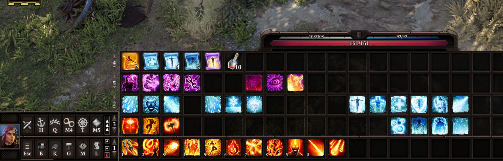
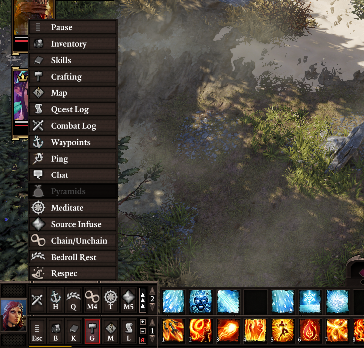
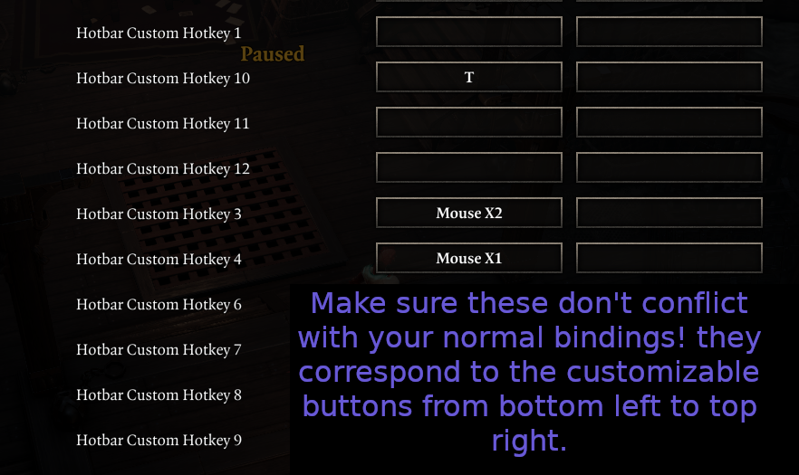
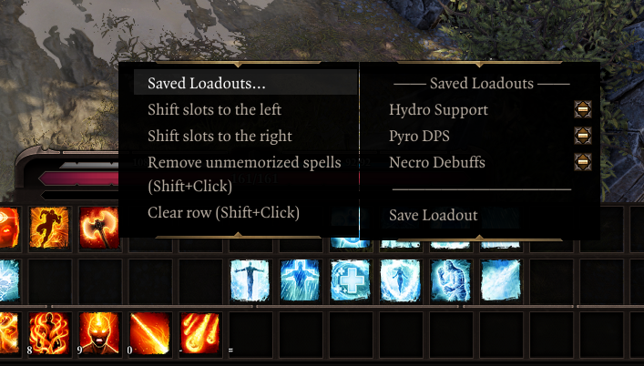

# Standalone Hotbar Mod

The Improved Hotbar mod allows you to have multiple bars at once (up to 5), and adds new functionality to improve the hotbar experience further.

**Requires v56 of the extender! This version of the extender is not public yet, you have to install it manually:**

To get it, create a file named `OsiUpdateChannel.txt` in the same directory where you installed the extender (where `DXGI.dll` is) with the contents:
```json
Devel
```

[Workshop page HERE](https://steamcommunity.com/sharedfiles/filedetails/?id=2759281297)

## Extra Bars



To add more bars, click the small +/- buttons between the buttons and the slots.

You may cycle each bar independently. The original cycling hotkeys cycle the bottom bar; holding shift while doing so (the "Show sneak cones" key) will cycle the bar above it.

**Please report any issues! Either through DM or a comment on the page/discussions section.**

## Action Buttons

The buttons in the bottom left part of the hotbar have been revamped, and are now customizable. In addition to them being re-arrangable by drag-and-dropping **(if the hotbar is unlocked)**, mods can add their own "action buttons" there with custom functionality*.



Right-click these buttons (or click the button with the ^ arrows) to open the "actions drawer", where you can see all the actions that you can **drag-and-drop** to assign them to the buttons at the bottom. You may also click them in the drawer to use them. **To assign keyboard hotkeys to these, go to the controls settings menu and assign the "Hotbar Custom Hotkey" keys.**



These buttons are shared across all your characters; you only need to bind them once, and then can enjoy their convenience from any character.

Several new "actions" are implemented:

- **Resting**: uses a bedroll from the party inventory. No longer do you need to place one on your hotbar nor even have one per character!
- **Pyramids**: opens the Teleporter Pyramid UI. Again, reduces hotbar clutter and saves time spent looking through your inventory to find out where the heck these are.
- **Chain/unchain**: chains/unchains your active character with others nearby instantly.
- **Waypoints**: opens the fast travel menu.
- **Ping**: shortcut to the ping function.
- **Chat/Combat Log**: toggle the respective UIs. The original char button has been yeeted.

Additionally, as a compatibility consideration for older mods, you can drag any skill or item from the hotbar to these buttons to bind them there. This is useful for mods that implement menus through skills or usable items (ex. LL's older mods).

*Documentation pending completion; if someone wants to start making custom buttons with these already let me know; the API won't change.

## Context Menu

Right click a row to open up a context menu where you can perform multiple handy operations, such as clearing it, moving a group of slots to the sides (great for insert new spells inbetween!) or saving/loading a preset.



## Compatibility
Incompatible with mods that modify `hotBar.swf`. This might be worked around in the future if it becomes a concern.

Arena mode and GM mode are untested. Consider them unsupported! **Also note that the mod automatically unbinds some GM keybindings that are used for the customizable buttons the first time you install it (since they clash with some regular game hotkeys).**

Compatibility considerations:

- Weapon Expansion: added an action to open the menu, shifted it slightly up (so the close button is accessible with 2 bars), repositioned the button when you have 2 rows of customizable buttons
- Portable Respec Mirror (Fort Joy Edition): added an action to use the mirror
- Epic Encounters 2: the original actions remain (Source Infuse, Meditate)

## Known issues
- On lower resolutions, a piece of art from the right-most edge might "clip" into the slots area
- Some art is ugly/unfinished
- **Upon making new profiles, the keybindings used for the customizable buttons aren't reset** - check them if your keys start doing weird stuff in a new game!
- Items slotted into the customizable buttons don't display proper names
- Skills slotted into the customizable buttons don't grey out properly, ex. if you don't meet their requirements (doesn't affect their use)
- The console log is spammed during session reloads

Minor incompatibilities with LeaderLib:

- Hotkey keybinds don't show on the customizable buttons
- My custom settings menu is broken (I've excluded it entirely from the mod for now, would like to have some settings for the hotbar though; will look into it later)