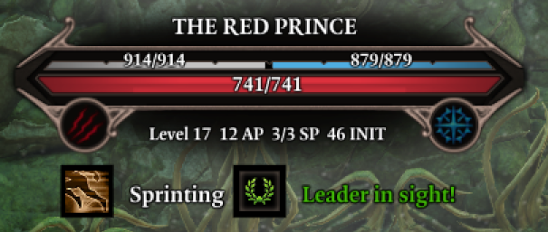
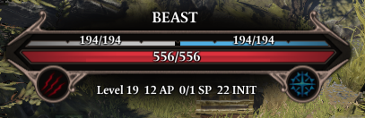
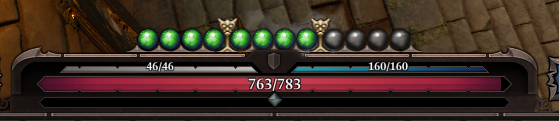
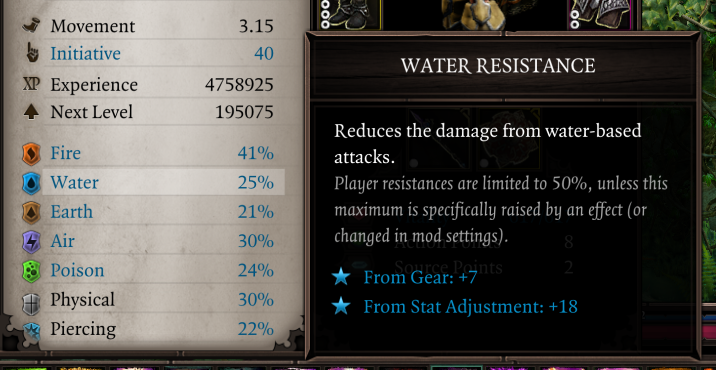
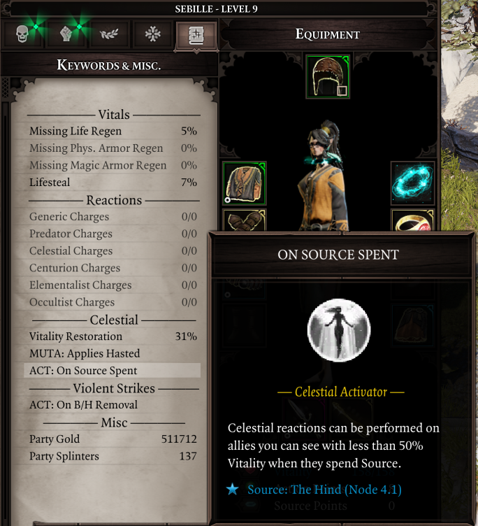
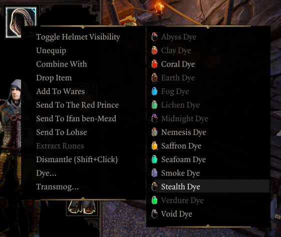
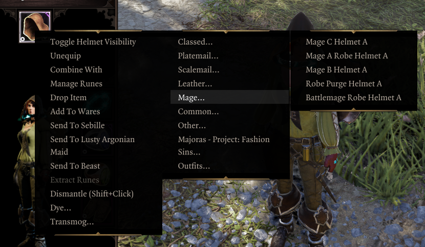

# Epip Encounters

Epip Encounters is an add-on mod for [Epic Encounters 2](https://docs.google.com/document/d/1du5jE2dyDE4B4-Za0wolfe50ReeKXqkqdgG5FvAwKTo/edit#) which introduces numerous Quality of Life changes as well as UI improvements.

## Download

**[Requires Norbyte's Script Extender](https://github.com/Norbyte/ositools/releases/tag/updater_v3). Load after both EE Core and EE Origins.**

[Latest version, v1057](https://drive.google.com/file/d/1oc07bR7WFCG2vV6mp7VzGnN_5Y7qj33z/view?usp=sharing). (26/07/22)

Only English is supported. Text related to gameplay changes will not show up in other languages. Mods that also modify UI are largely incompatible. ["No More Dragging"](https://steamcommunity.com/sharedfiles/filedetails/?id=2546859598) and its expanded container version is compatible, for now.

See the [patchnotes](patchnotes.md) page for patchnotes.

Special thanks to:

- Ameranth for programming help as well as the amazing moddability of EE
- Derpy Moa for motivation and initial ideas
- Norbyte for the Script Extender and it's fantastic UI features
- Elric for his help with designing and drawing new UIs

## Features

This section of the site gets outdated rather quickly; I suggested browsing the latest [patchnotes](patchnotes.md) to get up to speed with latest features. 

### Health Bar
The health bar at the top of the screen now shows a character’s resistances as well as their Battered and Harried stacks. The B/H icons will light up if the target has enough of them to suffer a Tier 3 status, and will blink when the duration of the stacks is 1 turn or fewer. The actual B/H statuses are now hidden in this UI to reduce clutter. Credits to Elric for the new art assets used!

Holding the "show sneak cones" button (shift by default) will replace the resistances display with the character’s current AP, Source and Initiative - very handy for planning and foreseeing enemy turns. Additionally, it will lower the opacity of status effects on the health bar.

The health bar above the hotbar now shows its values at all times (you needn't hover over it anymore), and the Physical/Magic Armor text is removed to improve readability.

### Character Sheets

Your physical and piercing resistances are now shown on the character sheet.

The tags tab is replaced with a brand new "Keywords and misc." tab. You can use it to quickly reference your keyword activators and mutators, as well as reaction charges remaining.

The examine menu now shows Critical Chance, and can be configured to open on the sides of the screen rather than the middle.

### Tooltip Improvements

#### Item Tooltips

The damage stat tooltip in the character sheet now distinguishes the multiplicative bonuses from weapon abilities, and the obsolete Lone Wolf texts are removed.

"Stat Adjustments" from EE scripting are merged into a single line in tooltips.

Long item tooltips will try to fit the screen better, eliminating the issue of being unable to compare items while wielding a heavily upgraded item.

Artifacts display with a special rarity and item color, hand-picked by the EE devs. This change has been made available in the base EE mod as well. Additionally, artifact runes now show a "Cannot equip." warning for slots that they are incompatible with.

Pieces of equipment with randomly-rolled stats now display a "Quality" rating, indicating how well their base damage or armor rolled. A 100% Quality rating is exclusive to Divine items. Their tooltips now also show if they have been Masterworked.

The prefix "Set:" from modifiers is removed to lessen confusion.

The weapon range modifier is now clearly shown amongst the others, and the range at the bottom distinguishes the base weapon range and the added bonus.

#### Skill Tooltips

While preparing an infusion or holding the shift key, skill tooltips will highlight unmet Source Infusion requirements in red.

Holding the shift key will also display the damage multiplier of skills.

Effects that alter the AP costs of skills globally will be reflected appropriately in tooltips.

#### Status Tooltips

Tooltips for damaging statuses now display the damage they will deal approximately, rather than showing the base damage before any modifiers.

### Context Menus
Epip Encounters adds fancy new context menu tech that powers numerous QoL features.

You can Dismantle, Extract Runes and Dye items directly from item context menus. Destructive actions require shift+clicking to confirm for items that are equipped.

Containers with equipment in them get a "Mass Dismantle" option, letting you rapidly dismantle unwanted gear.

A vanity feature is also included. Equipment can also be transmogrified from context menus into any obtainable item visual in the game.

The available visuals are sorted into categories and filtered down to show only the ones compatible with your character's race and gender.

Outfits can be saved and loaded across different profiles, and support for [Majora's Project Fashion Sins](https://steamcommunity.com/workshop/filedetails/?id=1815898410) is included, offering possibly the most convenient way so far to enjoy its ridiculous amount of assets.

A cheat context menu is also available for characters if developer mode is enabled. It may also be accessed from the player portraits's context menu. It includes numerous handy functions, including teleports, copying GUIDs to clipboard, adding EE stats, spawning templates/loot tables, a godmode, and more.

### Player Portraits
The status bar on your characters now wraps onto a second row once there are more than 6 statuses, preventing it from obscuring the middle of the screen during intense fights. Summon portraits no longer show statuses and are shrunk while the status bar is wrapping.

You can right-click your portraits to open a context menu where you can hide the status bar and summons, as well as access the Debug Cheats if you're in developer mode.

In the settings, you may also enable a Battered/Harried display on these portraits.

### Hotbar
Epip Encounters expands the hotbar to allow multiple rows of slots and customizable buttons in the bottom left area.

To add/remove rows, click the small +/- icons to the right of the buttons area. You can cycle each row independently through all 5 rows of slots that the game allows. You can have up to 5 rows visible.

You can use the regular hotkeys (F/R) to cycle the bottom bar. Holding shift (Toggle Sneak Cones) while using them will cycle the second row from the bottom instead.

The buttons next to the portrait are now customizable; when your hotbar is unlocked, you can drag and drop to rearrange them. Additionally, mods can add their own "actions" there, and there are a few new built-in ones. You can press the middle mouse button to unbind them.

Right click one of those buttons or click the ^ button to bring up a "drawer" with all the actions that you can drag and drop onto your actions bar. You can also click them to use them directly from there.

These buttons can be used with keyboard hotkeys; to do so, you must assign keys to them from the game’s input options menu. They are labelled "Hotbar Custom Hotkey #N" there.

By default, if you have 2+ rows of hotbar slots, you will also have a second row of these customizable buttons. You can disable this from the settings menu.

Epip Encounters implements multiple handy new actions, in addition to some vanilla functions:

- Source Infuse & Meditate
- Toggle Minimap
- Resting (using a bedroll from anywhere in your party inventory - no need to find one for everyone!)
- Toggle Party Link (instantaneous, no animation!)
- Respec (if Portable Respec Mirror mod is installed)
- Access Cheat Commander (with the EE version of the mod)

The purpose of the action bar is to provide a centralized place for modders to add shortcuts/hotkeys to their interfaces or features, eliminating the need for interactable books that clutter your inventory and freeing up space on the hotbar.

### Settings
Epip Encounters implements an in-game settings menu to toggle or customize certain features.

Noteworthy settings are:

- Immersive Meditation: hides the minimap and hotbar while you're using the EE interfaces.
- Skill-casting Notifications: allows you to disable the "Enemy has cast Skill" toasts.
- Auto-identify items: automatically identifies new items found, using the party's highest Loremaster score. Can also be configured to ignore Loremaster entirely.
- Fog of war: the dark shroud in unexplored areas can be turned off. If turned back on, your "exploration progress" is preserved.
- The size and duration of overhead text and damage can be adjusted.
- For developers: options for logging of UI calls/invokes, and forcing story patching.

### Miscellaneous Changes

Notifications from characters casting skills in combat are repositioned to show above the hotbar, so as not to obscure the enemy health bars. They can also be disabled in the settings.