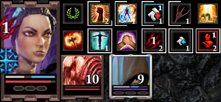
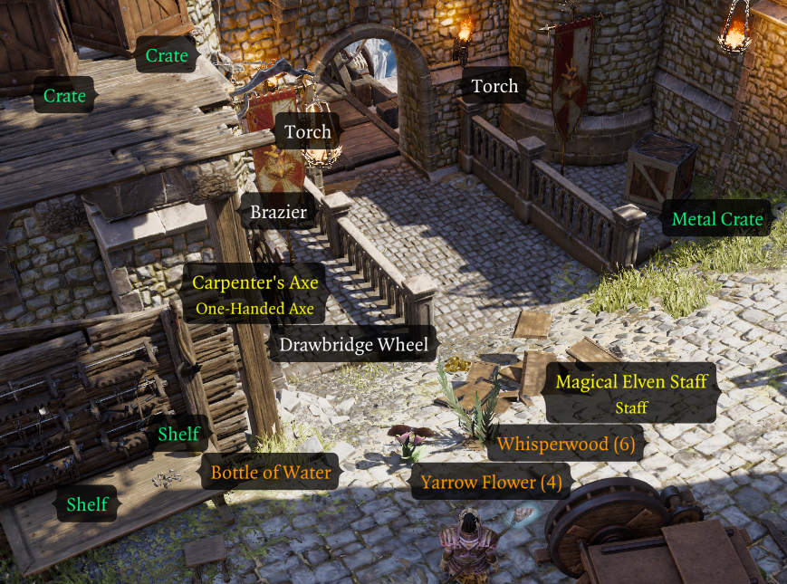

# Epip

Epip is a UI and quality-of-life mod targeting [Epic Encounters 2](https://docs.google.com/document/d/1du5jE2dyDE4B4-Za0wolfe50ReeKXqkqdgG5FvAwKTo/edit#), though it may also be used with the vanilla Divinity: Original Sin 2 game or other overhaul mods.

Epip introduces dozens of usability improvements to the vanilla UIs, as well as numerous new custom UIs to fulfill needs the vanilla ones cannot. See [the features section](#features) for details.

Vast customization for Epip's features is available through an in-game [settings menu](Features/SettingsMenu.md) - you may use as many or as few features as you deem necessary, with most of them being disabled by default.

## Download
**[Requires Norbyte's Script Extender](https://github.com/Norbyte/ositools/releases/tag/updater_v5)**. Load after both EE Core and EE Origins, if you have them.

!!! info ""
    **[Latest version, v1068](patchnotes.md). (26/11/23)**

See the [patchnotes](patchnotes.md) page for patchnotes. Development updates and nightly builds are posted in the [*#epipeline*](https://discord.gg/SevYmQc573) channel on the Epic Encounters discord server.

!!! info "Language support"
    You may change the language from the "General" tab in the [Epip Settings Menu](Features/SettingsMenu.md). Localizations are crowdsourced; if you want to help with them, ask for details in [*#epipeline*](https://discord.gg/SevYmQc573).

Credits & Special Thanks

Special thanks to:

- Ameranth for initial programming help as well as the amazing moddability of EE, without which I (Pip) would've probably never gotten into modding
- Norbyte for the Script Extender, it's fantastic UI features as well as continuous support with all engine-related questions
- Elric for his help with designing and drawing new UIs
- Cathe for contributing to the feature showcases on this website, as well as some code and proof-reading
- Derpy Moa for motivation and initial ideas
- JoienReid, Clibanarius, AQUACORAL and the entire EE community for continuous support, inspiration and bug-reporting

Translators:

- Cathe & JoienReid: Russian
- Ferocidade: Brazilian Portuguese
- Ainsky: Simplified Chinese
- Drayander: French

## Features
Below is a non-exhaustive list of features; I suggest browsing the latest [patchnotes](patchnotes.md) to get up to speed with latest additions. Exploring the in-game [Settings Menu](Features/SettingsMenu.md) is another good way of getting familiar with the mod's features.

!!! info "Settings Info"
    Many features are disabled by default and must be explicitly enabled from the [Settings Menu](Features/SettingsMenu.md).

    This is to make the mod less overwhelming, as well as to respect that not all of its features will appeal to every player.

Major features have dedicated pages for them accessible from the sidebar. This front page is a summary of them and other minor ones.

- **[UI Improvements](Features/UI.md)**: list of improvements to the vanilla UIs as well as some custom UIs.
- **[Hotbar](Features/Hotbar.md)**: improvements to the Hotbar UI: multiple bars, slot management options, loadouts and customizable extra hotkey buttons.
- **[Vanity](Features/Vanity.md)**: exhaustive cosmetic equipment transmog, featuring a menu to browse item models, dyeing, persistent outfits, and much more.
- **[Inventory Multi-Select](Features/InventoryMultiSelect.md)**: allows you to mass-select items in the inventory UIs to speed up inventory management.
- **[Quick Find](Features/QuickFind.md)**: filterable view of the party inventory, making searching for specific items easier.
- **[Hotbar Groups](Features/HotbarGroups.md)**: customizable, shared groups of additional hotbar slots.
- **[Settings Menu](Features/SettingsMenu.md)**: an in-game settings menu that allows you to toggle and customize most of Epip's features.
- **[Animation Cancelling](Features/AnimationCancelling.md)**: speeds up combat by ending player skill animations early.
- **[Epic Encounters QoL](Features/EpicEncountersQoL.md)**: page covering features only applicable to Epic Encounters 2.
- **[Camera](Features/Camera.md)**: settings to tweak the game camera.
- **[Tooltip Adjustments](Features/TooltipAdjustments.md)**: miscellaneous improvements and fixes to tooltips.
- **[Codex](Features/Codex.md)**: an in-game reference for various topics.
- **[Vanilla Fixes](Features/VanillaFixes.md)**: fixes to various vanilla client issues.

The rest of this page offers an overview of the major features and also covers and additions that are not yet categorized into other pages.

## UI

### Target Health Bar
The health bar shown at the top of the screen has been reworked to look better and include more information, showing resistances, Battered/Harried in Epic Encounters, as well as AP, SP, initiative and more while holding ++lshift++ - saving you many trips to the examine UI. More details [here](Features/UI.md#target-status-bar).

### Player Portraits
The player portraits UI has received various improvements:

- The list of statuses will now wrap onto a second row, preventing them from obscuring most of your screen.
- An improved status bar can be enabled through the *"Alternative Status Display"* setting, which allows filtering and manual sorting of statuses by right-clicking them.
- Battered/Harried indicators can be enabled in the settings menu.

More details available [here](Features/UI.md#player-portraits).

### Hotbar
Epip offers a heavily improved Hotbar UI, featuring multiple bars, custom "action" buttons in the bottom left, and numerous functions to make hotbar management easier.

Press the `+`/`-` buttons by the panel in the bottom left to add/remove bars. More details on Hotbar improvements are available in its [dedicated subpage](Features/Hotbar.md).

### Vanity
Epip features an easy-to-use cosmetic item customization system, including armor transmogrification, custom color dyes, quick outfit swapping and auras, all through a new UI integrated into the character sheet.

Right-click an equipped item and select *"Vanity..."* in its context menu to get started, or learn more at the dedicated [feature page](Features/Vanity.md).

### Settings Menu
Epip includes its own [Settings Menu](Features/SettingsMenu.md) UI full of options to toggle or customize its features - you may use as few or many of them as you want.

The Epip Settings Menu also makes custom hotkeys possible, including ones for Meditate & Source Infuse (in Epic Encounters), an examine hotkey, as well as binding the 12 "action buttons" from the [Hotbar UI](Features/Hotbar.md).

### Inventory
Epip offers numerous improvements and options to keep your inventory and items convenient to use, including:

- [Multi-select controls](Features/InventoryMultiSelect.md), allowing fast operations on groups of items, even across different bags/containers.
- A brand new [Quick Find UI](Features/QuickFind.md) that shows a customizable filtered view of the party inventory to find items quicker.
- A setting has been added to enable infinite carry weight for all party members.
- A setting exists to automatically identify items, optionally not requiring any Loremaster.
- Consumable items, like mushrooms and food, no longer require you to use them once for them to show their effects in the tooltip.

*Multi-select demostration.*

### Tooltip Adjustments
Tooltips have received numerous fixes and improvements, displaying a lot of information in a clearer manner, as well as details previously unmentioned such as sources of statuses. You can read about them at their [dedicated page](Features/TooltipAdjustments.md).

*A weapon tooltip showing the various tooltip additions, such as Quality, range and Masterwork indicator.*

### Combat Log
A setting exists to enable various improvements to the Combat Log UI, such as:

- Filtering out individual types of messages, by right-clicking the UI to open a context menu.
- Certain messages have been reworded for clarity and can now "merge" into a single line if they happen in quick succession, improving readability.
- You clear the log from its context menu.

!!! warning ""
    Combat log improvements are currently only available while playing in English.

### World Tooltips
The item tooltips that are displayed by holding ++lalt++ by default have received many options to improve their usability:

- A keybind has been added to make them toggleable, so you don't need to hold the key all the time.
- A setting exists to enable these tooltips for all items, similar to the "Let there be tooltips" mod, but with compatibility for all modded items.
    - Additional settings exist to filter out types of items you may be not interested in, such as beds, doors, lights, etc.
- You may hide these tooltips for empty looted containers and bodies.
- A setting exists that makes clicking the tooltips open containers rather than pick them up.
- You may highlight tooltips for certain kinds of items in a customizable color to distinguish them.

*Color-coded world item tooltips. Containers, equipment and consumables are all highlighted in a different, customizable color.*

### Quick Examine
A new "Quick Examine" UI can be opened with a custom hotkey (defaults to `V`). This panel is mainly used to show the effects enemies have from the ["Epic Enemies"](Features/EpicEncountersQoL.md#epic-enemies) feature, but it can also display the character's artifacts, skills and equipment, useful to check information of your allies in multiplayer.

## Other UI Changes
For other UI changes, see the [General UI Improvements](Features/UI.md) page.

## Miscellaneous
- Certain client-side vanilla issues have been fixed. You may read about them at their [dedicated page](Features/VanillaFixes.md).
- A setting exists to auto-listen to nearby dialogues, enabled from the "Notifications" tab (*"Auto-Listen Dialogues"* and *"Auto-Listen Range Limit"*).
    - Due to limitations within the Extender, this requires a special build from [here](extender.md).
- A setting exists to highlight empty slots in the container inventory UI upon hovering over them, for consistency with the party inventory. Can be enabled from the "Inventory" settings tab (*"Highlight Empty Container Slots"*).
- Discord Rich Presence customization is available in the "Miscellaneous UI" settings tab.
    - You may set both lines to anything you desire, or have them be set to show your character level, area and overhaul.
    

