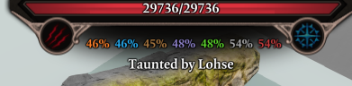
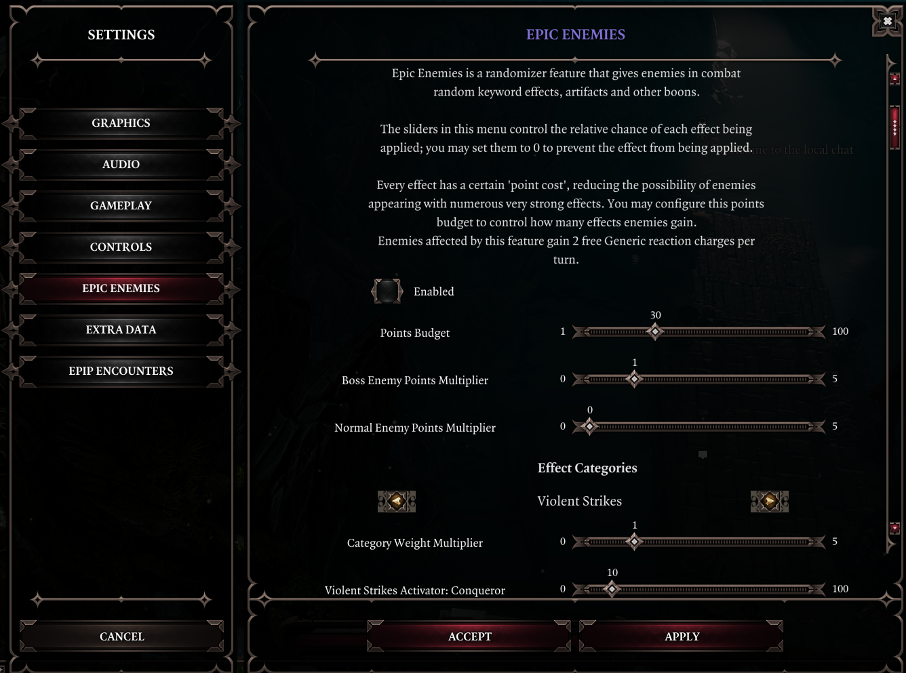

# Epip Encounters

Epip Encounters is an add-on mod for [Epic Encounters 2](https://docs.google.com/document/d/1du5jE2dyDE4B4-Za0wolfe50ReeKXqkqdgG5FvAwKTo/edit#) which introduces numerous Quality of Life changes as well as UI improvements.

## Download

!!! warning "**[Requires Norbyte's Script Extender](https://github.com/Norbyte/ositools/releases/tag/updater_v3). Load after both EE Core and EE Origins.**"

[Latest version, v1063](https://drive.google.com/file/d/1QygJ1P9ynUQ2Fl2h7lL6zifeeT_jEtke/view?usp=sharing). (19/09/22) 

!!! info "Only English is supported. Text related to gameplay changes will not show up in other languages. Mods that also modify UI are largely incompatible. ["No More Dragging"](https://steamcommunity.com/sharedfiles/filedetails/?id=2546859598) and its expanded container version is compatible, for now."

See the [patchnotes](patchnotes.md) page for patchnotes.

Special thanks to:

- Ameranth for programming help as well as the amazing moddability of EE
- Derpy Moa for motivation and initial ideas
- Norbyte for the Script Extender and it's fantastic UI features
- Elric for his help with designing and drawing new UIs

## Features
Below is a non-exhaustive list of features; I suggested browsing the latest [patchnotes](patchnotes.md) to get up to speed with latest additions. 

## UI

### Health Bar
The health bar at the top of the screen now shows a character’s resistances as well as their Battered and Harried stacks. The B/H icons will light up if the target has enough of them to suffer a Tier 3 status, and will blink when the duration of the stacks is 1 turn or fewer. The actual B/H statuses are now hidden in this UI to reduce clutter. Credits to Elric for the new art assets used!

Holding the "show sneak cones" button (shift by default) will replace the resistances display with the character’s current AP, Source and Initiative - very handy for planning and foreseeing enemy turns. Additionally, it will lower the opacity of status effects on the health bar.

The health bar above the hotbar now shows its values at all times (you needn't hover over it anymore), and the Physical/Magic Armor text is removed to improve readability. Additionally, it now features dividers every 4 AP, making it easier to see at a quick glance how much AP you've got left. It now also shows your maximum SP, and the AP/SP indicators are properly centered. Its graphics have also been improved, with the AP bar being easier to read thanks to a dropshadow.

A setting has been added to show target-related information on this health bar, including source of the Taunt status, as well as whether a character is currently unpreferred or ignored by the AI.

### Hotbar
Epip offers a heavily improved Hotbar UI, featuring multiple bars, custom "action" buttons in the bottom left, and numerous functions to make hotbar management easier.

To add/remove rows, click the small +/- icons to the right of the buttons area. You can cycle each row independently through all 5 rows of slots that the game allows. You can have up to 5 rows visible.

You can use the regular hotkeys (F/R by default) to cycle the bottom bar. Holding shift while using them will cycle the second row from the bottom instead. Holding Ctrl will cycle the 3rd row, while holding alt will cycle the 4th one.

The buttons next to the portrait are now customizable; when your hotbar is unlocked, you can drag and drop to rearrange them. Additionally, mods can add their own "actions" there, and there are a few new built-in ones. You can press the middle mouse button to unbind them.

Right click one of those buttons or click the `^` button to bring up a "drawer" with all the actions that you can drag and drop onto your actions bar. You can also click them to use them directly from there.

These buttons can be used with keyboard hotkeys; to do so, you must assign keys to them from Epip's input options menu. They are labelled "Hotbar Action #N" there.

By default, if you have 2+ rows of hotbar slots, you will also have a second row of these customizable buttons. You can disable this from the settings menu.

Epip Encounters implements multiple handy new actions, in addition to some vanilla functions:

- Source Infuse & Meditate
- Toggle Minimap
- Resting (using a bedroll from anywhere in your party inventory - no need to find one for everyone!)
- Toggle Party Link (instantaneous, no animation!)
- Respec (if Portable Respec Mirror mod is installed)

The purpose of the action bar is to provide a centralized place for modders to add shortcuts/hotkeys to their interfaces or features, eliminating the need for interactable books that clutter your inventory and freeing up space on the hotbar.

Right-click a row on the hotbar to bring up a context menu where you can "push" groups of slots around (great for inserting spells inbetween!), clear unmemorized spells, or save "loadouts" to restore your hotbars in later playthroughs.

Additionally, all "engine actions" (except for flee) are available from the vanilla actions drawer.

[The hotbar improvements are also available as a standalone mod with no EE dependency.](https://steamcommunity.com/sharedfiles/filedetails/?id=2759281297)

### Character Sheet
The character sheet now shows physical and piercing resistances.

The tags tab is replaced with a brand new "Keywords and misc." tab. You can use it to quickly reference your keyword activators and mutators, as well as reaction charges remaining.

### Player Portraits
The status bar on your characters now wraps onto a second row once there are more than 6 statuses, preventing it from obscuring the middle of the screen during intense fights. Summon portraits no longer show statuses and are shrunk while the status bar is wrapping.

You can right-click your portraits to open a context menu where you can hide the status bar and summons, as well as access the Debug Cheats if you're in developer mode.

In the settings, you may also enable a Battered/Harried display on these portraits.

### Settings Menu
The settings menu has been expanded to allow mods to add their own settings. Epip includes its own tab full of options to customize its features.

The input menu has received similar treatment, with custom keybindings becoming possible. You must first click the "Controls" tab before you can access custom keybinds added by Epip.

Custom hotkeys include Meditate, Source Infuse, as well as binding the 12 "action buttons" from the Hotbar UI.

Additionally, the difficulty can now be changed to/from tactician freely at any time. The side effects of this have not been studied well, but everything appears to work fine with the exception of already-initialized enemies having missing HP and consumables(?).

### Tooltip Adjustments
- "Stat Adjustments" in tooltips are now merged into one line.
- Added a label for items that have been Masterworked
- While infusing a spell or holding shift, skill tooltips now highlight Source Infusions you don't meet the requirements for. Holding shift also displays your relevant ability score in the tooltip.
- The simple small tooltips appear without a delay
- Skill tooltips now account for effects that increase or decrease AP costs
- Most statuses that deal damage now show the calculated damage, rather than showing "(before modifiers)"
- Status tooltips show who applied the status (if anyone)
- Tooltips for randomly generated items now show a "quality" label, which indicates how good the damage/armor rolls were for that item. A 100% quality indicates the best roll, possibly only on divine items.
- The word "Set:" has been removed from tooltips due to confusion and redundancy.
- Deltamods that previously did not show clearly in tooltips (+range, +elemental damage) now have blue labels in tooltips, like others.
- Holding shift will cause skill tooltips to display damage multipliers instead. Does not work for all skills.
- Removed the skull icon introduced by GB5 that appeared on negative status effects
- Added a keybind to scroll tooltips
- The damage tooltip in the character sheet has been made less confusing by removing the mention of damage from gear and dummied out LW values. Additionally, it now makes it clear that the weapon abilities grant multiplicative damage increases.
- Books that have been read and keys that have been used now have a green label in their tooltip.
- Artifacts display with a special rarity and item color, hand-picked by the EE devs. This change has been made available in the base EE mod as well. Additionally, artifact runes now show a "Cannot equip." warning for slots that they are incompatible with.
- Tooltips for damaging statuses now display the damage they will deal approximately, rather than showing the base damage before any modifiers.
- Long item tooltips will try to fit the screen better, eliminating the issue of being unable to compare items while wielding a heavily upgraded item.
- In developer mode, statuses and skills show their IDs in their tooltips.

### Inventory
A setting has been added to enable infinite carry weight for all party members. You can also enable automatic identifying of items, optionally not requiring any Loremaster.

Consumable items, like mushrooms and food, no longer require you to use them once for them to show their effects in the tooltip.

### Treasure Display
An option has been added to display noteworthy item drops of enemies and containers on their health bar. For characters, this only shows while holding shift.

### Combat Log
You may now filter out individual types of messages in the combat log by right-clicking it. Certain messages have been reworded for clarity and can now "merge" if they happen in quick succession, improving readability. You can also clear the log from the context menu.

### World Tooltips
A keybind has been added to make world item tooltips toggleable, so you don't need to hold alt all the time. Additionally, a setting exists to disable these tooltips for empty containers and bodies.

### Rewards UI
An option has been added to allow viewing the character sheet while within the quest rewards screen, allowing you to compare rewards to your party's currently equipped items.

### Overhead Text and Notifications
Settings have been added to shorten the duration of overhead text, and to change their size (as well as the size of damage numbers).

Notifications from characters casting skills in combat are repositioned to show above the hotbar, so as not to obscure the enemy health bars. They can also be disabled in the settings.

Additionally, you can change the duration of the area transition labels, or disable them entirely.

### Skillbook
You can now unlearn skills by right-clicking them in the skillbook while out of combat. Innate skills cannot be unlearnt.

### Crafting
The crafting UI now remembers your previous tab, instead of always defaulting to showing all items - this is helpful for using the Greatforge. Additionally, you can set the default tab of the UI in the settings menu.

### Gift Bags and mod incompatibilities
Gift bag mods incompatible with EE are no longer selectable, to prevent regrets. Gift bags that work but for one reason or another are undesirable show a warning upon attempting to enable them.

Common mods incompatible with EE now show a warning when you load into the game with them enabled, once per playthrough.

### Quick Examine
A "Quick Examine" panel can be opened with a custom hotkey (defaults to `V`). This panel is mainly used to show the effects enemies have from the "Epic Enemies" feature, but it also displays the character's artifacts, useful to check your ally's effects in multiplayer. More information will be added to this panel in the future.

### Examine
The Examine UI now shows Critical Chance, and can be configured to open on the sides of the screen instead of the center.

Additionally, there is now a keybind to open the examine menu.

### Ingame Patchnotes
A new journal UI can be accessed from the Hotbar actions, or after updating the mod. It lists the patchnotes of Epip, and other mods can add information/patchnotes there freely as well. Updating the mod will also show a prompt to open the UI.

### Chat
Chat commands are added, beginning with a slash (/). The following commands exist:

- `/rp`: shows a message over your current character's head. Great for role-playing.
- `/emote`: plays an animation for your current character. Use `/help emote` to see all emotes.
- `/help`: shows all commands, or help for a particular command.

### Save/Load UI
An alphabetical sorting option as well as a search bar can be enabled in the options for the save/load UI.

## Ascension/Meditate

### Ascension
You can now use the `Esc` key to go back to the previous page in the Ascension UI, or exit it if you're on the default page. An option exists to make this key always exit the UI.

An "Immersive Meditation" setting can be enabled to hide the minimap and hotbar while within the EE UIs.

### Greatforge Context Menus
Item context menus now have options to quickly dismantle items, as well as to remove their runes. Doing so still costs the usual amount of gold/splinters respectively.

Containers with equipment in them get a "Mass Dismantle" option, letting you rapidly dismantle unwanted gear.

### Greatforge
An option to add sockets to items ("Drill Sockets") has been added. This does not allow you to break the 2 socket limit for one-handed weaponry.

The Empower option now properly scales armor values, however this will only take effect after a save+reload.

Additionally, an option to rename items ("Engrave") has been added. This is purely cosmetic.

## Epic Enemies
Epic Enemies is a randomizer feature enabled from the ingame settings menu. It bestows enemies with EE perks such as keyword activators/mutators, artifacts, and more. You can configure the relative chance of each effect being rolled on enemies.

These effects will be applied to enemies when they enter combat. You may use the "Quick Examine" feature to view the perks that each enemy rolled; see its respective section in this site for more info.

## Vanity
Right-click equipped items and select the "Vanity" option to enter a menu with a plethora of customization options.

The first tab allows you to change the item's appearance into other items of the same slot. You can also tick "Lock Appearance" to automatically transmogrify newly equipped items into your currently chosen appearance, when the Vanity menu is closed. **Support is included for "Majora's Project Fashion Sins", "Rendal's NPC Armors" and "Visitors from Cyseal" mods.**

The second tab allows you to save and apply outfits consisting of all equipment slots with visuals. They are organized by intended race and gender, but can be applied onto any character.

The third tab allows you to dye items with a custom color. Items may support up to 3 different colors, but certain items cannot be dyed - this depends on how the model was setup. You may also use EE's dyes from here, and save your own ones and share them with buttons that read/write the color codes to your clipboard.

## Miscellaneous Bug Fixes and Adjustments
Certain vanilla issues have been fixed:

- Summons dying in combat (or being newly spawned) no longer causes your current character to be deselected
- You can now walk into corpses in combat without looting them; you can hold shift if you need to pillage them mid-fight, or disable this in the settings

## Miscellaneous Gameplay Changes
Epip features some minor changes to the base EE gameplay. These are a remnant from before the mod switched to focusing on UX, and will be split off into a separate mod in the future. [You can read about them in the old doc.](https://docs.google.com/document/d/10C39LndW8QwDcfA_bUpq_ZYu_6lt_vkjW7-sFeIuBKU/edit)

## Planned for the future

- Proper controller support for EE UIs (meditate)
- Sorting and filtering statuses on the player portraits
- Inventory improvements: custom filtering and sorting, along with multi-select

## For developers
Epip is built using numerous libraries, making client-side scripting and UI modding easier. This site's documentation of them is heavily WIP. Every UI touched by Epip has a lua table with wrapper APIs to manipulate it. Additionally, multiple utility libraries are available:

- `Client`: contains queries relating to the client.
- `Client.UI`: holds all UI tables; too many to list individually, below are the most noteworthy ones.
    - `Client.UI.MessageBox`: allows you to open your own message boxes, which may also prompt for user string input.
    - `Client.UI.ContextMenu`: allows creating custom context menus, with numerous new types of elements and support for nested menus. Warning: it's a very old API and does not hold up to current standards. A rewrite is pending.
- `Client.Flash`: contains utility methods for handling Flash elements from lua.
- `Client/Server.lua`: allows registering osiris symbol listeners from the client.
- `Osiris`: provides a cleaner way of working with Osiris symbols: allows passing of extender entity objects in place of GUIDs, returning from user queries, and unpacking DB query results.
- `Character`, `Item`: libraries with numerous utility functions for the related entity types.
- `Text`: utility methods for working with text, featuring a super-versatile `Format` function for dealing with those pesky html font tags.
- `Timer`: self-explanatory. Also supports tick-based timers.
- `Coroutine`: improved coroutine table, with the ability to sleep coroutines, either for a certain amount of time or until a condition is met.
- `Color`, `Vector`: utilities for dealing with colors and vectors.
- `Client.UI.Generic`: allows for the creation of UIs using only lua. Work-in-progress (well, everything here is, in a way).
- `Epip`: main mod table, containing registered Features.

### Developer Features
#### Debug Cheats

If the extender developer mode is available, a cheats context menu is added to characters, with numerous handy functions like:

- Copying GUID to clipboard
- Teleporting
- Kill/resurrect
- Next-gen godmode ("Pipmode"), with infinite AP and 0 skill cooldowns
- Adding Flexstats, ExtendedStats, attributes/abilities, skills, statuses and more
- Spawning all artifacts, or specific treasure tables or templates

#### Debug Display
In developer mode, a UI widget with FPS, TPS and mod version info can be enabled from the settings. This widget can be dragged around.

#### Debug Menu
In developer mode, a menu with debugging options for Features can be opened using a keybind (defaults to LCtrl + F). You can use it to change logging levels, disable features, and run tests. Your logging/debug settings are persistent.

#### AI Logging
An option exists to log AI scoring to the console.

#### Console Commands
A few miscellaneous console commands are added:

- `!bruteforceuitypes`: client-side; attempts to find the TypeIDs of all UIs currently instanced, including custom ones
- `!soundtest`: client-side; plays all the sounds defined in the UI sounds lsx and shows their name. Useful for inspiration.
- `!animtest`: server-side; plays all human female animations on the currently controlled character. Cannot be interrupted once started!
- `!worryaboutsuchsmallthings`: tests the performance between `EsvCharacter:HasTag()` and `Osi.IsTagged()`
- `!testactionhandles`: tests string handles for "actions" from the Stats library.