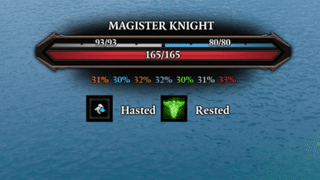
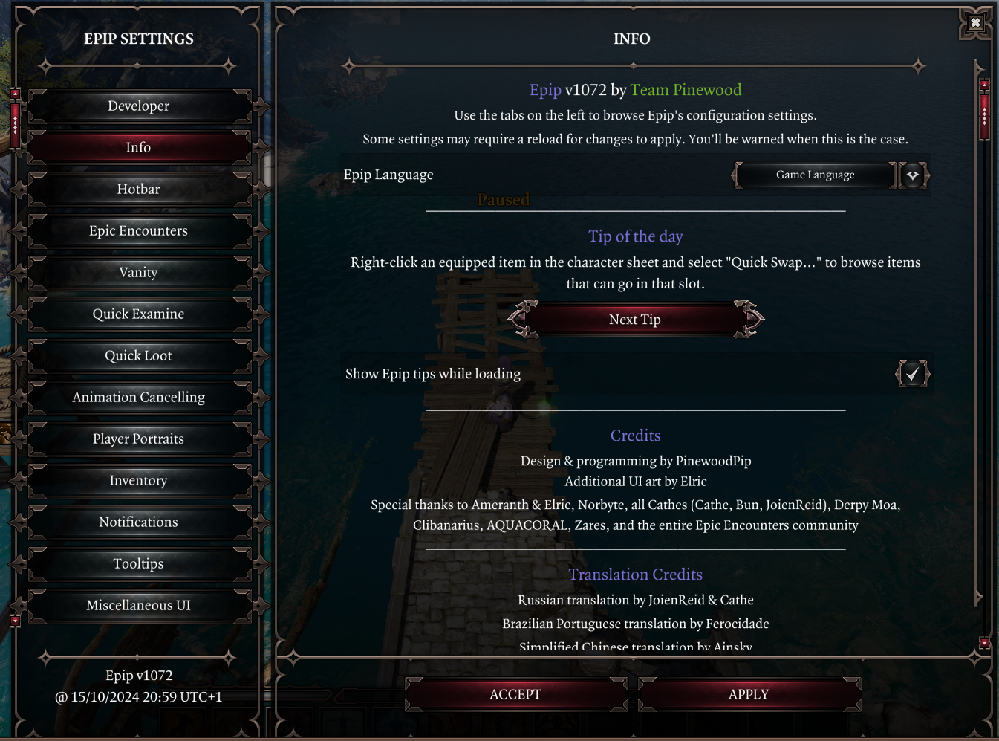

# Epip

Epip is an extensive UI and quality-of-life mod for *Divinity: Original Sin 2* that introduces dozens of usability improvements to vanilla UIs, as well as numerous new custom UIs to fulfill needs the original ones cannot. See [the features section](#features) for details.

Epip implements improvements such as a **larger hotbar**, **multi-select in inventories**, **equipment transmog and RGB dyes**, unlocked camera and much, much more, while staying unintrusive out-of-the-box and deeply customizable.

Vast customization for Epip's features is available through an in-game [settings menu](Features/SettingsMenu.md) - you may use as many or as few features as you like, with most of them being disabled by default.

## Download & links

!!! info ""
    **[Latest release download, v1074](patchnotes.md) (26/10/25, The non-summer non-major update)**

    See the [patchnotes](patchnotes.md) page for the latest additions.

    Development discussion and nightly builds are posted in the [*#epipeline*](https://discord.gg/SevYmQc573) channel on the Epic Encounters discord server.

Language support

You may change the language from the "General" tab in the [Epip Settings Menu](Features/SettingsMenu.md).

Epip currently supports 🇷🇺 Russian, 🇨🇳 Simplified Chinese, 🇵🇱 Polish, 🇧🇷 Brazilian Portuguese, and 🇫🇷 French.

Localizations are crowdsourced; anyone is welcome to help! Ask for details in [*#epipeline*](https://discord.gg/SevYmQc573).

Credits & Special Thanks

Special thanks to:

- Ameranth for initial programming help as well as the amazing moddability of EE, without which I (Pip) would've probably never gotten into modding
- Norbyte for the Script Extender, it's fantastic UI features as well as continuous support with all engine-related questions
- Elric for his help with designing and drawing new UIs
- Cathe for contributing to the feature showcases on this website, as well as some code and proof-reading
- Derpy Moa for motivation and initial ideas
- JoienReid, Clibanarius, AQUACORAL, Farandole and the entire EE community for continuous support, inspiration and bug-reporting

Translators:

- Cathe & JoienReid: Russian
- Ferocidade: Brazilian Portuguese
- Ainsky & HeiMao: Simplified Chinese
- Drayander & Farandole: French
- Nektun: Polish
- AquaVXI: Spanish (partial)

## Features

Epip has dozens of features covering all sort of UI & QoL improvements, with the major ones having their own pages on this site. Exploring the in-game [Settings Menu](Features/SettingsMenu.md) is another good way of getting familiar with what the mod offers.

    <!-- Hotbar -->
    <a class="card" href="Features/Hotbar">
        

            
        

        

            <h3>Improved Hotbar</h3>
            

            
See multiple hotbar rows, save row loadouts and rearrange slots quickly. Never lose track of all your skills!

        

    </a>

    <!-- Healthbar -->
    <a class="card" href="Features/UI#Resistances-and-bh-display">
        

            
        

        

            <h3>Improved Health Bars</h3>
            

            
View character resistances, initiative, AP and more directly by health bars - less trips to the Examine UI!

        

    </a>

    <!-- Multi-select -->
    <a class="card" href="Features/InventoryMultiSelect">
        

            
        

        

            <h3>Inventory Multi-Select</h3>
            

            
Move multiple items at a time across inventories and backpacks, mass-mark them as wares or send to Lady Vengeance.

        

    </a>

    <!-- Vanity -->
    <a class="card" href="Features/Vanity">
        

            
        

        

            <h3>Vanity</h3>
            

            
Transmog equipment, dye it any color, save outfits, swap animations and more from a convenient UI. Unleash your Epip Drip™!

        

    </a>

    <!-- Statuses -->
    <a class="card" href="#player-portraits">
        

            
        

        

            <h3>Improved Status Bar</h3>
            

            
Wrap statuses to a second row, filter out spammy statuses, hide summons and more.

        

    </a>

    <!-- Quick Loot -->
    <a class="card" href="Features/QuickLoot">
        

            
        

        

            <h3>Quick Loot</h3>
            

            
Loot all nearby containers and corpses from a single UI, with loot filters. Spend less time looting, more time adventuring!

        

    </a>

    <!-- Tooltips -->
    <a class="card" href="Features/TooltipAdjustments#world-tooltips">
        

            
        

        

            <h3>Better World Tooltips</h3>
            

            
See world tooltips for all items, filter out empty containers or highlight items of interest.

        

    </a>

    <!-- Bedazzled -->
    <a class="card" href="Features/Bedazzled">
        

            
        

        

            <h3>Bedazzled</h3>
            

            
Take a break from sinning to enjoy a full-fledged match 3 minigame, with multiple gamemodes and ELO rankings.

        

    </a>

    <!-- Camera -->
    <a class="card" href="Features/Camera">
        

            
        

        

            <h3>Camera Improvements</h3>
            

            
Freely rotate the camera, zoom out further, customize angles to experience Rivellon like never before!

        

    </a>

    <!-- Quick Find -->
    <a class="card" href="Features/QuickFind">
        

            
        

        

            <h3>Quick Find</h3>
            

            
Search items from your party inventory with customizable filters. No need to tidy your inventory to find what you need!

        

    </a>

    <!-- Animation Cancelling -->
    <a class="card" href="Features/AnimationCancelling">
        

            
        

        

            <h3>Animation Cancelling</h3>
            

            
Speed up skills & attacks and save time during both your turns and the enemy's!

        

    </a>

    <!-- Settings Menu -->
    <a class="card" href="Features/SettingsMenu">
        

            
        

        

            <h3>Settings Menu</h3>
            

            
Toggle or customize each Epip feature to your liking; don't like a feature? Disable it! Nothing's forced onto you.

        

    </a>

    <!-- Epic Encounters QoL -->
    <a class="card" href="Features/EpicEncountersQoL">
        

            
        

        

            <h3>Epic Encounters 2 QoL</h3>
            

            
Access Meditate & Source Infusion quickly with keybinds, navigate Ascensions with a controller, and do Greatforging right from context menus!

        

    </a>

    <!-- Hotbar Groups -->
    <a class="card" href="Features/HotbarGroups">
        

            
        

        

            <h3>Hotbar Groups</h3>
            

            
Create floating hotbars that are shared across characters. Perfect for consumables and shared skills!

        

    </a>

    <!-- Radial Menus -->
    <a class="card" href="Features/RadialMenus">
        

            
        

        

            <h3>Radial Menus</h3>
            

            
Create custom radial menus to skills or shortcuts with a wheel UI. Great for speeding up skill-casting on controllers!

        

    </a>

    <!-- Codex -->
    <a class="card" href="Features/Codex">
        

            
        

        

            <h3>Codex</h3>
            

            
View tooltips of all skills right in the game even if you don't have them. Perfect for previewing modded skills!

        

    </a>

## Other features
Major features have dedicated pages for them accessible from the sidebar. The rest of this front page is a listing of other minor features not yet categorized into other pages.

!!! info "Settings Info"
    Many features are disabled by default and must be explicitly enabled from the [Settings Menu](Features/SettingsMenu.md).

    This is to make the mod less overwhelming, as well as to respect that not all of its features will appeal to every player.

- **[🧼 General UI Improvements](Features/UI.md)**: improvements to the vanilla UIs as well as some minor custom UIs.
- **[🔧 Vanilla Fixes](Features/VanillaFixes.md)**: fixes to various vanilla client issues.
- **[🎮 Controller Support](Features/ControllerSupport.md)**: information on which Epip features currently support controllers.
- **[❇️ Miscellaneous QoL](Features/MiscellaneousQoL.md)**: list of various quality-of-life improvements that do not fit other feature pages.

## UI

### Target Health Bar
The health bar shown at the top of the screen has been reworked to look better and include more information, showing resistances, Battered/Harried in Epic Encounters, as well as AP, SP, initiative and more while holding ++lshift++ - saving you many trips to the examine UI. More details [here](Features/UI.md#target-status-bar).

### Player Portraits
The player portraits UI has received various improvements:

- The list of statuses will now wrap onto a second row, preventing them from obscuring most of your screen.
- An improved status bar can be enabled through the *"Alternative Status Display"* setting, which allows filtering and manual sorting of statuses by right-clicking them.
- Battered/Harried indicators can be enabled in the settings menu.

More details available [here](Features/UI.md#player-portraits).

### Hotbar
Epip offers a heavily improved Hotbar UI, featuring multiple bars, custom "action" buttons in the bottom left, and numerous functions to make hotbar management easier.

Press the `+`/`-` buttons by the panel in the bottom left to add/remove bars. More details on Hotbar improvements are available in its [dedicated subpage](Features/Hotbar.md).

### Vanity
Epip features an easy-to-use cosmetic item customization system, including armor transmogrification, custom color dyes, quick outfit swapping and auras, all through a new UI integrated into the character sheet.

Right-click an equipped item and select *"Vanity..."* in its context menu to get started, or learn more at the dedicated [feature page](Features/Vanity.md).

### Settings Menu
Epip includes its own [Settings Menu](Features/SettingsMenu.md) UI full of options to toggle or customize its features - you may use as few or many of them as you want.

The Epip Settings Menu also makes custom hotkeys possible, including ones for Meditate & Source Infuse (in Epic Encounters), an examine hotkey, as well as binding the 12 "action buttons" from the [Hotbar UI](Features/Hotbar.md).

### Inventory
Epip offers numerous improvements and options to keep your inventory and items convenient to use, including:

- [Multi-select controls](Features/InventoryMultiSelect.md), allowing fast operations on groups of items, even across different bags/containers.
- A brand new [Quick Find UI](Features/QuickFind.md) that shows a customizable filtered view of the party inventory to find items quicker.
- A setting has been added to enable infinite carry weight for all party members.
- A setting exists to automatically identify items, optionally not requiring any Loremaster.
- Consumable items, like mushrooms and food, no longer require you to use them once for them to show their effects in the tooltip.

*Multi-select demostration.*

### Tooltip Adjustments
Tooltips have received numerous fixes and improvements, displaying a lot of information in a clearer manner, as well as details previously unmentioned such as sources of statuses. You can read about them at their [dedicated page](Features/TooltipAdjustments.md).

*A weapon tooltip showing the various tooltip additions, such as Quality, range and Masterwork indicator.*

### Combat Log
A setting exists to enable various improvements to the Combat Log UI, such as:

- Filtering out individual types of messages, by right-clicking the UI to open a context menu.
- Certain messages have been reworded for clarity and can now "merge" into a single line if they happen in quick succession, improving readability.
- You can clear the log from its context menu.

### World Tooltips
The item tooltips that are displayed by holding ++lalt++ by default have received many options to improve their usability:

- A keybind has been added to make them toggleable, so you don't need to hold the key all the time.
- A setting exists to enable these tooltips for all items, similar to the "Let there be tooltips" mod, but with compatibility for all modded items.
    - Additional settings exist to filter out types of items you may be not interested in, such as beds, doors, lights, etc.
- You may hide these tooltips for empty looted containers and bodies.
- A setting exists that makes clicking the tooltips open containers rather than pick them up.
- You may highlight tooltips for certain kinds of items in a customizable color to distinguish them.

*Color-coded world item tooltips. Containers, equipment and consumables are all highlighted in a different, customizable color.*

### Quick Examine
A new "Quick Examine" UI can be opened with a custom hotkey (defaults to `V`). This panel is mainly used to show the effects enemies have from the ["Epic Enemies"](Features/EpicEncountersQoL.md#epic-enemies) feature, but it can also display the character's artifacts, skills and equipment, useful to check information of your allies in multiplayer.

## Other UI Changes
For other UI changes, see the [General UI Improvements](Features/UI.md) page.

## Miscellaneous
- Certain client-side vanilla issues have been fixed. You may read about them at their [dedicated page](Features/VanillaFixes.md).
- A setting exists to auto-listen to nearby dialogues, enabled from the "Notifications" tab (*"Auto-Listen Dialogues"* and *"Auto-Listen Range Limit"*).
- A setting exists to highlight empty slots in the container inventory UI upon hovering over them, for consistency with the party inventory. Can be enabled from the "Inventory" settings tab (*"Highlight Empty Container Slots"*).
- Discord Rich Presence customization is available in the "Miscellaneous UI" settings tab.
    - You may set both lines to anything you desire, or have them be set to show your character level, area and overhaul.
    

