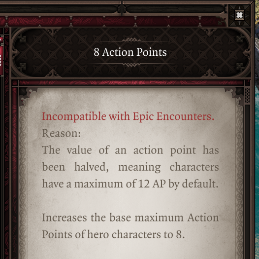

# Epip Encounters

Epip Encounters is a UI and quality-of-life mod targeting [Epic Encounters 2](https://docs.google.com/document/d/1du5jE2dyDE4B4-Za0wolfe50ReeKXqkqdgG5FvAwKTo/edit#), though it may also be used with the vanilla Divinity: Original Sin 2 game or other overhaul mods.

Epip introduces dozens of usability improvements to the vanilla UIs, as well as numerous new custom UIs to fulfill needs the vanilla ones cannot. See [the features section](#features) for details.

Vast customization for Epip's features is available through an in-game settings menu - you may use as many or as few features as you deem necessary.

## Download

!!! info "Language warning"
    Only English is fully supported, however crowdsourced translations are underway.  
    Localization is only possible thanks to the members of our community. If you want to help with it - feel free to contribute at [our translation spreadsheet](https://docs.google.com/spreadsheets/d/1N590ol649CFsMJuU2-UNBqWQP8cONo-CnUCcC1TPRgI/).

    You may change the language from the "General" tab in the Epip settings menu.

**[Requires Norbyte's Script Extender](https://github.com/Norbyte/ositools/releases/tag/updater_v5)**. Load after both EE Core and EE Origins, if you have them.

!!! info ""
    **[Latest version, v1068](patchnotes.md). (26/11/23)**

See the [patchnotes](patchnotes.md) page for patchnotes. Development updates and nightly builds are posted in the [*#epipeline*](https://discord.gg/SevYmQc573) channel on the Epic Encounters discord server.

Credits & Special Thanks

Special thanks to:

- Ameranth for initial programming help as well as the amazing moddability of EE, without which I (Pip) would've probably never gotten into modding
- Norbyte for the Script Extender, it's fantastic UI features as well as continuous support with all engine-related questions
- Elric for his help with designing and drawing new UIs
- Cathe for contributing to the feature showcases on this website, as well as some code and proof-reading
- Derpy Moa for motivation and initial ideas
- JoienReid, Clibanarius, AQUACORAL and the entire EE community for continuous support, inspiration and bug-reporting

Translators:

- Cathe & JoienReid: Russian
- Ferocidade: Brazilian Portuguese
- Ainsky: Simplified Chinese

## Features
Below is a non-exhaustive list of features; I suggest browsing the latest [patchnotes](patchnotes.md) to get up to speed with latest additions. Exploring the in-game settings menu is another good way of getting familiar with the mod's features.

Major features have dedicated pages for them, accessible from the sidebar, or from the following index:

- **[UI Improvements](Features/UI.md)**: list of improvements to the vanilla UIs as well as some custom UIs.
- **[Vanity](Features/Vanity.md)**: exhaustive cosmetic equipment transmog, featuring a menu to browse item models, dyeing, persistent outfits, and much more.
- **[Inventory Multi-Select](Features/InventoryMultiSelect.md)**: allows you to mass-select items in the inventory UIs to speed up inventory management.
- **[Quick Find](Features/QuickFind.md)**: filterable view of the party inventory, making searching for specific items easier.
- **[Hotbar Groups](Features/HotbarGroups.md)**: customizable, shared groups of additional hotbar slots.
- **[Settings Menu](Features/SettingsMenu.md)**: an in-game settings menu that allows you to toggle and customize most of Epip's features.
- **[Animation Cancelling](Features/AnimationCancelling.md)**: speeds up combat by ending player skill animations early.
- **[Camera](Features/Camera.md)**: settings to tweak the game camera.
- **[Tooltip Adjustments](Features/TooltipAdjustments.md)**: miscellaneous improvements and fixes to tooltips.
- **[Codex](Features/Codex.md)**: an in-game reference for various topics.
- **[Vanilla Fixes](Features/VanillaFixes.md)**: fixes to various vanilla client issues.

The rest of this page covers changes and additions that are not (yet) categorized into other pages.

## UI

### Target Status Bar
Health bar shown at the top of the screen has been reworked to look better and include more information. More details [here](Features/UI.md#target-status-bar).

### Player Portraits
Player portraits display has also received some love, most notably - the list of statuses will now wrap onto a second row to prevent it from obscuring most of your screen. More details [here](Features/UI.md#player-portraits).

Epip makes dozens of other UI changes to improve your experience. You can read about the rest of them [here](Features/UI.md).

### Hotbar
Epip offers a heavily improved Hotbar UI, featuring multiple bars, custom "action" buttons in the bottom left, and numerous functions to make hotbar management easier.

To add/remove rows, click the small +/- icons to the right of the buttons area. You can cycle each row independently through all 5 rows of slots that the game allows. You can have up to 5 rows visible.

You can use the regular hotkeys (F/R by default) to cycle the bottom bar. Holding shift while using them will cycle the second row from the bottom instead. Holding Ctrl will cycle the 3rd row, while holding alt will cycle the 4th one.

The buttons next to the portrait are now customizable; when your hotbar is unlocked, you can drag and drop to rearrange them. Additionally, mods can add their own "actions" there, and there are a few new built-in ones. You can press the middle mouse button to unbind them.

Right click one of those buttons or click the `^` button to bring up a "drawer" with all the actions that you can drag and drop onto your actions bar. You can also click them to use them directly from there.

These buttons can be used with keyboard hotkeys; to do so, you must assign keys to them from Epip's input options menu. They are labelled "Hotbar Action #N" there.

By default, if you have 2+ rows of hotbar slots, you will also have a second row of these customizable buttons. You can disable this from the settings menu.

Epip Encounters implements multiple handy new actions, in addition to some vanilla functions:

- Source Infuse & Meditate
- Toggle Minimap
- Resting (using a bedroll from anywhere in your party inventory - no need to find one for everyone!)
- Toggle Party Link (instantaneous, no animation!)
- Respec (if Portable Respec Mirror mod is installed)

The purpose of the action bar is to provide a centralized place for modders to add shortcuts/hotkeys to their interfaces or features, eliminating the need for interactable books that clutter your inventory and freeing up space on the hotbar.

Right-click a row on the hotbar to bring up a context menu where you can "push" groups of slots around (great for inserting spells inbetween!), clear unmemorized spells, or save "loadouts" to restore your hotbars in later playthroughs.

Additionally, all "engine actions" (except for flee) are available from the vanilla actions drawer.

[The hotbar improvements are also available as a standalone mod with no EE dependency.](https://steamcommunity.com/sharedfiles/filedetails/?id=2759281297)

### Settings Menu
The settings menu has been expanded to allow mods to add their own settings. Epip includes its own tab full of options to customize its features.

The input menu has received similar treatment, with custom keybindings becoming possible. You must first click the "Controls" tab before you can access custom keybinds added by Epip. *(In v1066+, this menu is accessible through a "Keybinds" tab in the Epip settings menu instead).*

Custom hotkeys include Meditate, Source Infuse, as well as binding the 12 "action buttons" from the Hotbar UI.

Additionally, the difficulty can now be changed to/from tactician freely at any time. The side effects of this have not been studied well, but everything appears to work fine with the exception of already-initialized enemies having missing HP and consumables(?).

### Tooltip Adjustments
Tooltips have received numerous fixes and improvements, displaying a lot of information in a clearer manner. You can read about them at their [dedicated page](Features/TooltipAdjustments.md).

### Inventory
A setting has been added to enable infinite carry weight for all party members. You can also enable automatic identifying of items, optionally not requiring any Loremaster.

Consumable items, like mushrooms and food, no longer require you to use them once for them to show their effects in the tooltip.

### Combat Log
You may now filter out individual types of messages in the combat log by right-clicking it. Certain messages have been reworded for clarity and can now "merge" if they happen in quick succession, improving readability. You can also clear the log from the context menu.

### World Tooltips
A keybind has been added to make world item tooltips toggleable, so you don't need to hold alt all the time. A setting also exists to disable these tooltips for empty containers and bodies, as well as to make clicking the tooltips open containers rather than pick them up.

Additional settings exist to enable these tooltips for more item types, as well as to highlight certain types of items with a customizable color.

### Overhead Text and Notifications
Settings have been added to shorten the duration of overhead text, and to change their size (as well as the size of damage numbers).

Notifications from characters casting skills in combat are repositioned to show above the hotbar, so as not to obscure the enemy health bars. They can also be disabled in the settings.

Additionally, you can change the duration of the area transition labels, or disable them entirely.

### Skillbook
You can now unlearn skills by right-clicking them in the skillbook while out of combat. Innate skills cannot be unlearnt.

### Crafting
The crafting UI now remembers your previous tab, instead of always defaulting to showing all items - this is helpful for using the Greatforge. Additionally, you can set the default tab of the UI in the settings menu.

### Gift Bags and mod incompatibilities
Gift bag mods incompatible with EE are no longer selectable, to prevent regrets. Gift bags that work but for one reason or another are undesirable show a warning upon attempting to enable them.

Common mods incompatible with EE or its add-ons now show a warning when you load into the game with them enabled.

### Quick Examine
A "Quick Examine" panel can be opened with a custom hotkey (defaults to `V`). This panel is mainly used to show the effects enemies have from the "Epic Enemies" feature, but it also displays the character's artifacts, useful to check your ally's effects in multiplayer. More information will be added to this panel in the future.

### Examine
The Examine UI now shows Critical Chance, and can be configured to open on the sides of the screen instead of the center.

Additionally, there is now a keybind to open the examine menu, and capitalization of the word "Status efects" has been made consistent with the rest of the UI.

### Ingame Patchnotes
A new journal UI can be accessed from the Hotbar actions, or after updating the mod. It lists the patchnotes of Epip, and other mods can add information/patchnotes there freely as well. Updating the mod will also show a prompt to open the UI. *(In v1066+, this UI has been replaced by the Codex).*

### Chat
Chat commands are added, beginning with a slash (/). The following commands exist:

- `/rp`: shows a message over your current character's head. Great for role-playing.
- `/emote`: plays an animation for your current character. Use `/help emote` to see all emotes.
- `/help`: shows all commands, or help for a particular command.

### Save/Load UI
An alphabetical sorting option as well as a search bar can be enabled in the options for the save/load UI.

## Ascension/Meditate

### Ascension
You can now use the `Esc` key to go back to the previous page in the Ascension UI, or exit it if you're on the default page. An option exists to make this key always exit the UI.

An "Immersive Meditation" setting can be enabled to hide the minimap and hotbar while within the EE UIs.

### Greatforge Context Menus
Item context menus now have options to quickly dismantle items, as well as to remove their runes. Doing so still costs the usual amount of gold/splinters respectively.

Containers with equipment in them get a "Mass Dismantle" option, letting you rapidly dismantle unwanted gear.

### Greatforge
An option to add sockets to items ("Drill Sockets") has been added. This does not allow you to break the 2 socket limit for one-handed weaponry.

The Empower option now properly scales armor values, however this will only take effect after a save+reload.

Additionally, an option to rename items ("Engrave") has been added. This is purely cosmetic.

## Epic Enemies
Epic Enemies is a randomizer feature enabled from the ingame settings menu. It bestows enemies with EE perks such as keyword activators/mutators, artifacts, and more. You can configure the relative chance of each effect being rolled on enemies.

These effects will be applied to enemies when they enter combat. You may use the "Quick Examine" feature to view the perks that each enemy rolled; see its respective section in this site for more info.

## Vanity
Easy to use cosmetic customization system, including armor transmogrification, custom RGB dyes, quick outfit swapping and auras.  
Wanna drip as hard as this? Learn more at the dedicated [feature page](Features/Vanity.md).  

## Miscellaneous Bug Fixes and Adjustments
Certain client-side vanilla issues have been fixed. You may read about them at their [dedicated page](Features/VanillaFixes.md).

## For developers
Epip is built using numerous libraries, making client-side scripting and UI modding easier. This site's documentation of them is heavily WIP. Every UI touched by Epip has a lua table with wrapper APIs to manipulate it. Additionally, multiple utility libraries are available:

- `Client`: contains queries relating to the client.
- `Client.UI`: holds all UI tables; too many to list individually, below are the most noteworthy ones.
    - `Client.UI.MessageBox`: allows you to open your own message boxes, which may also prompt for user string input.
    - `Client.UI.ContextMenu`: allows creating custom context menus, with numerous new types of elements and support for nested menus. Warning: it's a very old API and does not hold up to current standards. A rewrite is pending.
- `Client.Flash`: contains utility methods for handling Flash elements from lua.
- `Client/Server.lua`: allows registering osiris symbol listeners from the client.
- `Osiris`: provides a cleaner way of working with Osiris symbols: allows passing of extender entity objects in place of GUIDs, returning from user queries, and unpacking DB query results.
- `Character`, `Item`: libraries with numerous utility functions for the related entity types.
- `Text`: utility methods for working with text, featuring a super-versatile `Format` function for dealing with those pesky html font tags.
- `Timer`: self-explanatory. Also supports tick-based timers.
- `Coroutine`: improved coroutine table, with the ability to sleep coroutines, either for a certain amount of time or until a condition is met.
- `Color`, `Vector`: utilities for dealing with colors and vectors.
- `Client.UI.Generic`: allows for the creation of UIs using only lua. Work-in-progress (well, everything here is, in a way).
- `Epip`: main mod table, containing registered Features.

### Developer Features
#### Debug Cheats

If the extender developer mode is available, a cheats context menu is added to characters, with numerous handy functions like:

- Copying GUID to clipboard
- Teleporting
- Kill/resurrect
- Next-gen godmode ("Pipmode"), with infinite AP and 0 skill cooldowns
- Adding Flexstats, ExtendedStats, attributes/abilities, skills, statuses and more
- Spawning all artifacts, or specific treasure tables or templates

#### Debug Display
In developer mode, a UI widget with FPS, TPS and mod version info can be enabled from the settings. This widget can be dragged around.

#### Debug Menu
In developer mode, a menu with debugging options for Features can be opened using a keybind (defaults to LCtrl + F). You can use it to change logging levels, disable features, and run tests. Your logging/debug settings are persistent.

#### AI Logging
An option exists to log AI scoring to the console.

#### Console Commands
A few miscellaneous console commands are added:

- `!bruteforceuitypes`: client-side; attempts to find the TypeIDs of all UIs currently instanced, including custom ones
- `!soundtest`: client-side; plays all the sounds defined in the UI sounds lsx and shows their name. Useful for inspiration.
- `!animtest`: server-side; plays all human female animations on the currently controlled character. Cannot be interrupted once started!
- `!worryaboutsuchsmallthings`: tests the performance between `EsvCharacter:HasTag()` and `Osi.IsTagged()`
- `!testactionhandles`: tests string handles for "actions" from the Stats library.