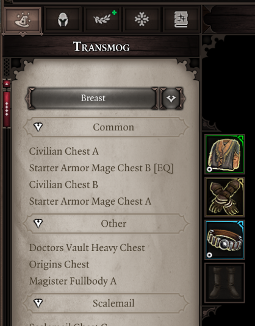
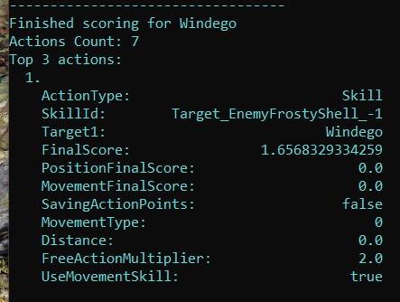

# Changelog

The latest versions of the mod require v56 of the extender.

To get it, create a file named `OsiUpdateChannel.txt` in the same directory where you installed the extender (where `DXGI.dll` is) with the contents:
```json
Devel
```

## v1045 - 1/4/22 Anniversary patch :flashed:
[Download here](https://drive.google.com/file/d/1ae8TmPU6_SfluvLisYRL-enx9JAAEkBS/view?usp=sharing). (1/4/22)

As of today, Epip is now one year old! My attention span for projects tends to be very low (as evidenced by my other EE stuff), but Epip looks to be an exception to that and it's incredible what it has become - all its UI changes were nearly unimaginable just a year ago. Thank you all for the support throughout the months, even at times when the patches were a buggy mess.

Just like the initial release of the mod on April 1st, this anniversary patch is very real, and best experienced on this day of the month.

Changelog:

- Pressing escape while in the EE UIs now backs out of them rather than bring up the pause menu
- The stats tab now shows damage dealt and received in the current fight (or previous fight, when out of combat)
- Added a new bug to the character sheet
- Performance improvements to the hotbar
- Gold/Splinter counter in the stats tab should now be more reliable
- Minor technical changes to make the mod compatible with Descent
- Added a scrollbar to the hotbar buttons drawer
- The hotbar now goes below the inventory and character sheet
- Hotbar cooldown animations should now be smoother
- Fixed bugs with unbinding actions in the hotbar, as well as clearing unmemorized slots
- Fixed muted characters not having their slots greyed out in hotbar
- You can now activate your Epip Encounters license ingame from the options menu
- Tooltips can now be scrolled on one axis with the mouse wheel
- The punisher now drops MicroBoss™ loot to make him feel more optional
- Added a cinematic camera option, on by default
- Reworked the vanity feature: it now opens a custom tab in your character sheet. Browsing templates is a lot more convenient this way. Saved outfits are now categorized by race & gender (doesn't stop you from applying them to anyone though)
	- It wouldn't be an Epip patch if something didn't ship unfinished, which is why I must announce that the promised feature to mark templates as favorite did not make it in.



**On the technical side of things:**

- Added an alias for the `Ext` table to make it easier to type:
```lua
SEX = Ext -- Short for "Script EXtender"
SEX.Print("Welcome to Norbyte's SEX v56 !")
```
- Fixed more inconsistencies with copy/paste in the message boxes
- Added an option to log AI scoring to the console: the top 3 actions will be shown anytime decisions are made. Work-in-progress as some of the AI features in the extender are currently bugged.



- Tooltips for Ascension stats in the stats tab are now created dynamically, so there's no need to edit them if you've edited the description/name
- Added a `Server` table on the client, from which listeners for any Osiris symbol can be created, eliminating the need for boilerplate code on the server side if you need to listen for Osiris stuff.
- Added an `Osiris` table on server to make user queries and DB queries a bit less aids to use in lua:
```lua
-- DBs with only one tuple return their contents directly, rather than as a list
local _, value = Osiris.DB_PIP_EpicStats_DamageDealt(char.MyGuid, nil)

-- User queries can also return variables directly from their output DBs, even for queries with multiple outputs
local value = Osiris.QRY_AMER_KeywordStat_VitalityVoid_GetRadius(char.MyGuid, 1)
```

**On the future side of things:**

Development has slowed down throughout March due to work and studies, but I'm not planning on stopping work on Epip anytime soon, and there are lots of exciting features in the planning stages. There is no time estimate for any of them, they're just things I know I will try out *eventually*. I know creating expectations never ends up well, but for the anniversary I felt it would be nice to write down the ideas I'm planning for the near future:

- **Character sheet overhaul:** the attribute/ability/talent tabs will become easily moddable, for modifying or adding new entries to them. This will pave the way for custom attributes and abilities. The UI currently used for the custom vanity tab will be made generic, so anyone can add their own tabs.
- **Proper controller support for EE UIs:** a large undertaking, but something that looks to be very possible and would be a massive quality of life improvement.
- **Custom journal UI:** will replace the current changelog functionality. The plan is to use the GM mode's journal UI as a base, since it's a slick, full-screen UI with support for nested categories. The functionality will be made generic, you'd be able to use it for more than just changelogs.
- **A way to create UIs just from lua:** work on this already started back in early January; it's used for the \[REDACTED\] in Fort Joy, but it's quite incomplete. The plan is to allow for creation of UIs with backgrounds, text, and all the Larian form elements (buttons, dropdowns, sliders etc.), all without touching any swf.
- More documentation for the source code, namely the remaining UI scripts and the base metatables

Thanks for reading and I hope you have an epic 1st of April.

### 19/2/22 Huge Hotbar rewrite
Rewrote the hotbar UI. This involves mostly technical changes, in preparations for a standalone release.

**Your hotkey keybindings will be reset with this update! Please bind them again.**

Visible changes:

- Fixed the top of the buttons area blocking clicks onto the world and other UIs
- Any skill or item can now be dragged from the hotbar to the customizable buttons to bind it there (useful for old mods that use skills/items to bring up menus)
	- The "use last slot" action has been removed due to this.
- Removed the "view changelog" action
- The slot rendering is now entirely scripted (no help from the engine) which works around a crash and removes the need for an initialization procedure (that annoying "switch to the first row" message)
- Saving your current amount of bars and order should be a lot more reliable (now happens upon pausing the game, instead of a timer)
- Action buttons can now be highlighted or disabled; ex. the pyramids one is disabled if the party has no pyramids
- Added an action to open the pyramids UI
- Fixed the source skill border clipping into other rows
- Added compatibility for Weapon Expansion: adds an action for toggling the menu, and repositions the original button when you have 2 rows of action buttons
- Actions in the drawer are now ordered in a consistent manner
- Added a context menu when you right click a row; from there, you can:
	- "Push" groups of slots to the left/right (useful for inserting skills inbetween slots)
	- Clear rows, or unmemorized skills
	- Save and load "loadouts" of rows. Loadouts can be applied even if your character doesn't currently know all the skills from it.

Other changes:

- Simple tooltips (the ones that go in that very small black box) now appear much faster, rather than being delayed
- Added numerous calls to `Game.Character` and `Game.Item`, mostly related to functionality needed for the hotbar.


### 5/2/22 Docs inauguration patch :flashed:

- Added new stats to the stats tab (more coming later):
	- Party gold, splinters
	- Celestial restoration
	- Vitality Void damage, radius
	- Prosperity threshold
- Rewrote the ingame options menu; the mod's settings now gets its own tab instead of being stuffed into Gameplay
- You can now switch to and from Tactician difficulty at any time from settings
- Improved context menu scrolling
- Touchups to MessageBox, Examine
- Cleaned up Utilities.lua, removed old unused methods
- Removed support for the archaic config file structure (from before the ingame settings menu; very old)
- Created documentation for `Game`, OptionsSettings, MessageBox, StatsTab, Examine, and CharacterSheet

### 26/1/22: birthday patch :flashed:

- Fixed “Teleport to” not working on anything other than characters; it now works with items and triggers as well
- Fixed shields not showing all transmog options
- Fixed more inconsistency issues with context menus on world characters
- Transmog menu now works properly for characters that have had their race/gender changed
- Added an option to show B/H next to player portraits while unsheathed
- Fixed tooltips of damaging statuses for real
- Added an option to force story patching on every load
- Physical/pierce resistances in character sheet now get colored blue/red like how the normal resistances would
- Holding shift now fades out statuses on the enemy health bar
- Temporary solution for scrolling context menus that would leave the screen, with the mouse wheel
- Added something awesome to Fort Joy


#### Technical stuff so it doesn’t look like I’m doing nothing:
- Added utility methods for initializing “Features”
- You can now specify required filesystem overrides and mods for features, with them automatically disabling themselves if these are missing
- Removed GetCharacterDodge function
- Rewrote character sheet resistances script
- Rewrote script for enemy health bar
- Moved Majora’s compatibility to its own script
- Added Game.Character library for character-related stuff
- Moved a lot of old calls to Client
- Started work on a library that allows the creation of UIs purely in lua (no swf/actionscript editing)

### 14/1/22:
- Re-enabled custom icons on the UIs that previously used them, as the extender issues with them have been fixed.
- Added a transmog context menu, can be enabled in settings.
    - Appears on equipment with visuals, including weapons.
    - Submenus display categorized root templates, filtered down to only the ones compatible with your current race/gender/alive/undead.
    - Supports Majora’s Fashion Sins.
    - Can save/load outfits, along with their dyes. Saved outfits are in EPIP_VanityOutfits.json
    - Warning: artifacts and armor set items will not currently work properly when transmogrified. Also, Majora’s tabs tend to overflow the screen.
- Fixed status tooltips in v56
- Fixed extract runes context menu option consuming gold instead of splinters
- Numerous miscellaneous internal changes

### 27/12/21:

- Updated to v56 of the extender. Current issues (with the extender):
    - Anything related to status tooltip editing does not work as Game.Tooltip is borked
    - UIs with custom icons (hotbar, toolip) stop displaying vanilla icons after the first session. Custom icons are disabled for now so as to keep both the hotbar and console usable
- Removed the old console cheats
- Full rewrite of the stats tab; it should be a lot more reliable now (especially in multiplayer) and survives lua resets
- Stats and categories are now defined in Epip.Features.StatsTab.
- Fixed context menu not working on chained characters, and added it to summon portraits
- (maybe) fixed summon portrait display issues
- Custom talents now display in the examine menu
- Organizational changes to tooltip adjustments script
- torturerSkillOverrides was moved to Data.Game.TORTURER_SKILL_OVERRIDES
- statusToSkill was moved to Data.Game.DAMAGING_STATUS_SKILLS

## v1043 (19/12/21)
- Added critical chance to the examine menu, below damage
- Added an option to set the default position of the Examine menu (middle, left, or right of the screen)
- Fixed health bar appearing in character creation
- Added a new context menu option to dismantle all equipment within a container. Only shows up when there's equipment within a container.
- Dismantling through the context menu now requires shift-clicking for any equipped item
- Fixed right-clicking containers bringing up debugging cheats for the character you previously had selected
- Organizational changes to various UI scripts and older features, as preparations for the grand debut of the Epip modding docs

Reuploaded on 22/12/21 with the following fixes:

- More organizational changes (moving Data.UI to Client.UI.Data)
- Fixed immunities in examine showing up in the wrong place
- Undid some recent changes that lead to playerInfo summon display breaking

Reuploaded on 23/12/21 to remove some testing text in character creation, as well as to (maybe?) fix an issue with combat HUD disappearing in new games.

## v1042 (14/12/21)
- Added an option to hide hotbar hotkeys text
- Added an "Immersive Meditation" setting which disables hotbar and minimap UIs while in Amer UIs
- Added shortened names for the remaining numpad keys (multiply, add, minus, etc.)
- Added an auto-identify setting, with 2 modes: always, and only with enough Loremaster. This will instantly identify items when they are generated
- Item tooltips no longer overflow through the top of the screen, making it easier to see the damage stats on items with 3 filled sockets
- Dismantling from the context menu now requires shift-clicking for items with runes inside (as a way to mark them as 'important' and avoid misclicks related to a certain new feature)
- Added a context menu option to items to dye them (requires the dyes to be in the party's inventory)
- Added a context menu to player portraits to hide statuses and summons (not saved between reloads for now)
- Added a context menu option to extract runes from items
- Added a debug menu with cheats for characters, available in the extender's developer mode
	- Accessed by right-clicking a character in the world, or a player portrait in the left portraits UI
	- Allows you to add all sorts of stats, spells, SpecialLogic, spawn items, treasure tables, toggle godmode, and more
- The new context menu tech is quite extensive, and can be toggled off in the settings in case any serious issues arise
- Finesse recovery now works for pay X skills, and sucker punch
	- You can add more exceptions to `DB_PIP_WeaponBasedFinesse_Whitelist((STRING)_Skill)`
- Fixed overhead dialogue durations being wrong when they were changed away from the default value
- Overhead sizes are now always default in Amer UIs
- Fixed origins gaining epic enemies perks for real this time
- Fixed description of Clouded Memory
- Fixed map visibility setting not working after exiting respec
- Fixed being able to toggle minimap within character creation
- Fixed weapon range deltamod tooltip showing up on unidentified items
- Fixed wrong health bar B/H display on dead characters
- The dismantle context menu option should no longer get permanently stuck in case of unidentified shenanigans
- Added a 20% tax to dismantling items from context menus, used to amortize the development costs of the new menus as well as to fund future development of the mod
	- just kidding

## v1041 (23/10/21)
- Added a slider for status overhead duration
- Fixed damage overheads for items not working with the new size settings
- Fixed the talents tab being selected after exiting mirror
- Fixed character sheet not updating the first time it is opened after a respec
- Fixed decimal stat adjustments being lost while merging them into one tooltip
- Fixed character creation talent points display when changing presets
- Fixed 1st hotbar not being clickable after a lua reset
- Fixed hotbar cooldown/active overlays when joining mid-session
	- This should also have fixed the issue with loading a save during a summon turn
- Origins should no longer get Epic Enemies buffs
- Possibly fixed unidentified items showing the weapon range deltamods in the tooltip

## v1040 (19/10/21)
- Added some client APIs for the message box UI and overhead texts (Client.UI.MessageBox and Client.UI.Overheads)
- Added settings for overhead sizes
- Added a setting to bring back the vanilla combat log button (on by default)
- Fixed talents not being hidden properly in the character creation UI (which includes the mirror, it's the same UI)
- Fixed EE stats tab not working for new companions until a reload
- Fixed sliders in the options menu being saved with +1 step than what you've set them to

## v1039 (17/10/21)
- Fixed SI tooltip highlighting not working for a few schools
- Fixed wrong earth damage color in shift-tooltips

## v1038 (16/10/21)
- Added a hotbar hotkey to use the skill/item on the very last slot of your hotbar (right-most in 5th row)
	- Can use this to make a Source Vamp hotkey, for example
- Weapon range deltamods now show up like regular deltamods on the tooltip, and the weapon range display is split up to show both base and extra range
- Holding the show cones button (shift by default) will display skill damage as their multipliers
- When infusing or when the shift key is held, unmet SI requirements will be displayed in red text
- Possibly fixed the "auto-unlock inventories" feature
- Artifact items now show quality
- Added an option to log all UI ExternalInterface calls and invokes to the console, visible in the settings menu if the extender developer mode is enabled
- Started slowly organizing code into sensical libraries; anything in the extended `Game` table should be reliable and will likely not change names
	- Let me know if something that used to work before broke all of a sudden
- Fixed an error in the console when hovering over armor whose subtype could not be determined (ex. the starting tattered equipment)
- Character Creation UI now implements machine learning and blockchain technology to notify you of possible typos in your character names
- Added a WIP custom talents feature. See `EpipTalents.lua` for usage example. You can also hide any non-racial talent.
	- Shortcomings:
	- They will only display on kb+m. No controller UI support yet.
	- They do not show up in the examine UI yet.
	- Requirements are not rechecked while moving ability/attribute points around in the mirror; upon exiting, you will still lose any talents you cannot sustain
	- Can't bind them to deltamods
	- Rarely, the mirror UI might show you having fewer talent points than you do - this should fix itself if you exit the mirror and go back in (if someone has a save where this happens consistently, let me know)
- As a result of the talent UI changes, the bug with unequipping walk-it-off should be fixed

## v1037 (2/10/21)
- Fixed right-most zeros getting culled in stat adjustment tooltips
- Added a new setting to disable fog of war (server-wide, host-only, non-destructive; can be reverted)
	- Minor visual bug: re-enabling FoW will cause the world to go black until you unpause

## v1036 (1/10/21)
- Changed the Damage tooltip in character sheet to be less confusing
- Removed the obsolete "From LW: -0%" tooltip text from character sheet
- Removed the word "Set:" from deltamods
- Added an option to auto-unlock inventories in multiplayer upon loading a save. This setting is per player.
- Fixed negative stat adjustments not being grouped together in tooltips
- Equipment now shows a "Quality" rating in tooltips, which denotes how good its damage/armor roll was. An item with 100% Quality has the best roll (only possible for Divines)
- Trickster's Repertoire now grants invisibility+sneaking until the start of your first turn, and only causes you to sneak starting from your second round. Additionally, at the start of your turns, you always unsneak.
- Changed wording for the Hothead tooltip
- Fixed error spam in console upon reload, and reorganized some code
- Added a lifesteal stat to the stats tab (will update upon changing Necromancy points, or in combat)
- Finished support for preset descriptions in character creation, override CharacterCreation.characterCreationPresetDescriptions in CharacterCreationUI.lua to set them

## v1035 (12/09/21)
- Replaced the config json file with an ingame settings menu, available from the game's normal "Gameplay settings" tab
- Unidentified artifacts now show their rarity as artifact, and use the custom color
- Proteans and Artifact runes now also use the Artifact color, and slots that they cannot be put on have a warning message
- Fixed Trickster's Repertoire breaking sneaking from other effects that cause you to sneak
- Fixed hotbar initialization message (again)

## v1032 (05/09/21)
Small patch with some QoL for dyes and a fix for a Finesse issue.

- Dyeing equipped items will now re-quip them automatically
- Changed the finesse recovery for weapon-based skills to fix an issue with delayed procs if multiple things used its logic
- Removed the option to show enemy lvl in healthbar (still buggy!)

## v1030 (30/08/21)
Monthly patch to appease our ever-so-hungry Derpy overlord.

- Hotbar slot keys now work as expected - ex. pressing "4" will use the fourth skill on the bottom bar, regardless of the row it's set to
- Hotbar actions now show their keybinding, if they have one
	- Vanilla actions (ex. open journal) will always show the vanilla keybind instead of the custom one (it will still work, though)
- Re-enabled the keyboard hotkeys for hotbar actions by default. If you had these disabled previously (or if you're using the mod for the first time), its keys will be unbound upon loading in
- Changed the default hotbar bindings to swap ping with combat log
- Added a hotbar action for Portable Respec Mirror, if its mod is loaded
- Resting from the hotbar now uses the item rather than resting directly (should work with other bedroll mods now)
- Added a toggle for the minimap onto the hotbar
- You can no longer rearrange hotbar actions while the hotbar is locked (except within the skills panel)
- Added a faint blinking animation to the health bar when B/H have 1 turn or less remaining
- Added an option to show level next to character name in the top healthbar (on by default)
- You can now unbind hotbar action buttons with middle-click
- Added handling for when hotbar actions are removed from a save (ex. disabling a mod that adds them)
- Brittle status now shows its calculated damage like DoTs
- Masterworked items now show a warning in the tooltip
- Changed Splintered Arrow icon
- Fixed Escapist being a huntsman skill
- Fix protruding hotbar texture on the bottom bar
- Fixed Trickster's Repertoire removing AP in consecutive turns
- Trickster's Repertoire no longer activates while playing dead
- Fixed artifact names not using the new color (oops)
- Moved the casting notification slightly up so multiline ones don't overlap the health bar
- Fixed dragging items onto the world not working if the hotbar was enabled
- Fixed the add/remove rows button being available on summons after opening the pause menu
- You can no longer use hotbar action hotkeys in dialogues (or other occasions where the UI is entirely hidden), when there is a UI element focused, or when the game is paused
- Fixed name of hotbar slot 6 binding in the input menu
- Fixed Slowed 3 AP penalty stacking

## v1029 (06/08/21)
- Moved the casting notifications to where your health bar is, and added a toggle for them in the settings (defaults to enabled)
- Toggle party link hotbar hotkey is now instant (no casting animation)
- Added a one-row layout to the hotbar actions bar, which is automatically used when you only have one row of skill slots active
	- You can control the behaviour with the new hotbarHotkeysLayout setting: "auto" is the behaviour described above, "single" makes it always use the 1-row layout, "dual" forces it to always be two rows (like how it was before)
	- Keyboard hotkeys remain functional at all times, even if the buttons are hidden
- Fixed "c" displaying on the hotbar button you're dragging
- DoT statuses now show their calculated damage
	- The display fluctuates for a bit after a skill cast, might redo this entirely later to not rely on the engine damage formula
- Centurion Battlestomp can now only be cast if the target is at <10m, and does not consume the ranged charge
- Tried banishing the "Enemy Turn" message again

## v1027, v1028 (30/07/21 and 31/07/21)
This patch contains numerous fixes and the first part of the rework of hotbar hotkeys. Happy birthday Derpy!

- Replaced the tutorials tab in the journal with a patch notes tab
    - See EpipPatchNotes.lua for an example on how to use this in your own mod.
- Artifact tooltips now show "Artifact" as rarity rather than Unique

Hotbar Updates

- Added customizable hotbar action hotkeys/buttons. Drag and drop to rearrange/assign them, right click to bring up a list of all actions. Mods can add their own actions very easily; see HotbarActions.lua for an example.
- To use them with keyboard keys, assign the "Hotbar Hotkey #" keys from the game's controls menu. Rebinding them will be easier in the future. You must also enable them within the config file.
- This rework is a work-in-progress, both in terms of functionality and art; in the future there will also be a 1-row layout.
- The multihotbar is now enabled by default. Set "disableHotbar" to true in the config file to disable it. (the old setting now does nothing)
- Deprecated the Infusion and Meditate hotkeys; please use the hotbar version of them from now on.
- Summons can no longer add hotbar rows
- All the custom elements should now hide during dialogues
- Fixed jankiness when using low resolutions

Fixes

- Fixed player status bar sometimes clipping through portraits and appearing to the left of them
- Fixed stat adjustments tooltip not working properly on resists
- Fixed stat adjustments tooltip eating up all other boosts
- Fixed boss frame in the enemy health bar UI. It should work consistently now
- Leper rune now should properly grant the talent when it's socketed into an equipped item
- Fixed being able to infuse out-of-turn with the hotkey (rest in peace gigabrain infused reaction builds)
- Possibly disabled turn notifications on the hotbar health bar

Known issues

- "Actions" drawer (attack/sneak/sheathe) does not work well along with the default keyboard hotkey, and the menu is not repositioned
- Buttons on the hotbar don't yet light up like they do in vanilla
- Order of actions in drawer is random
- Some hotbar buttons do not have state animations yet
- The title in the patch notes menu will not be the right color the first time after a reload

---

Earlier changelogs are available on the old google doc. Man, v1026 was quite the breakthrough!