# Changelog & Downloads

## v1073 - 1/04/2025 - 4th Anniversary Patch
!!! info ""
    [Download here](https://drive.google.com/file/d/11loWWjIPVtTFBzv-xwUr8wo2MRh2-Dq5/view?usp=drive_link). Place the `.pak` within `\Documents\Larian Studios\Divinity Original Sin 2 Definitive Edition\Mods` as with any other mod.
    
    Load after Epic Encounters Core & Origins if you have it; load order does not matter otherwise.

Contrary to popular belief, v1073 is not the 1073rd release of Epip, but it is our 4th anniversary patch! {: style="width:auto;height:32px;" }

In usual anniversary fashion, we are proud to present even more innovative additions that will change your playthroughs forever - as well as numerous other additions and changes from the past few months.

### Custom Portraits
Unsatifisfied with the portraits the game generates for your characters? Think you can do better? Put your artistic intuitions to work and customize your character's portraits with **Assprite™**, our brand new not-fully-fledged spriting editor!

Right-click a character portrait on the player portraits UI and select "*Set custom portrait...*" to get started.


Assprite empowers you with ~~all~~ some of the tools you need to retouch or completely revamp your portrait shots to your vision, featuring:

- 1️⃣ brush of many possibilities
- Non-greedy paint bucket
- The long-awaited color picker UI
- Undoing doing & redoing undid dones
- AI generation & degeneration tools
- Hardware acceleration & deceleration support
- Loading from PNG & saving & loading to & from DDS, for the busy people
- & More & more

Custom portraits are visible in all UIs that show character portraits, including to other players in multiplayer, and persist throughout saves. If you regret a makeover, you can hit up the Magic Mirror to undo your doings.

<center>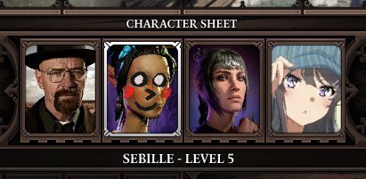</center>

Some tips and disclaimers:

- The texture format the game uses for portraits (BC1 DDS) is very lossy; when editing portraits, we recommend doing changes in one go rather than applying & reloading the portrait multiple times, as the colors will be degraded each time you apply the portrait.
- When using the "Load" function, images need to be 80x100 pixels.
    - PNGs must be 8-bit color with no transparency nor interlacing.
    - DDS images must be BC1-compressed.
- Portraits are saved to `/Documents/Larian Studios/Divinity Original Sin 2 Definitive Edition/Osiris Data`, or the equivalent path.
- After applying a portrait, backups of the new & old portraits are stored under `Osiris Data/Epip/PortraitBackups`. You can re-apply these portraits via the "Load" option.
- Using the Magic Mirror will re-generate the character's portrait. If you haven't explicitly saved the previous portrait, you can try to use the ones from the backup folder.

---

### Challenged Modes
Though generally well-appreciated, Epip has always had one issue with it that really stuck out: low "replayability" in the traditional mod sense.

The vast majority of users tend to use only a single settings loadout they're comfortable with throughout all their playthroughs, leading to a sense of low build variety in an otherwise deep mod.

To address this, this patch introduces a new system that encourages players to step outside of their comfort zone: ***Epip Challenged Modes***.

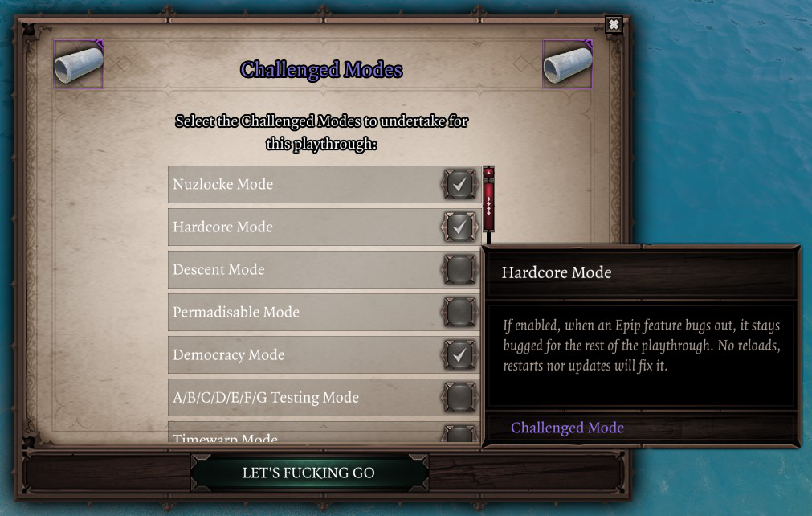
<center><i>Challenged Modes selection UI.</i></center>

Challenged Modes are modifiers that can be chosen at the start of playthroughs to add new rules to Epip's usage, forcing you to re-think your settings and the UIs you use, and explore exotic setting builds you might've never thought of before. This patch adds the following Challenged Modes:

- **Nuzlocke Mode**: start with 3 random settings enabled. For every character level, you can enable 1 additional setting. Pick your features wisely.
- **Hardcore Mode**: if an Epip feature bugs out, it stays bugged for the rest of the playthrough. No reloads, restarts nor updates will fix it.
- **Descent Mode**: start with your normal settings loadout. For every 1 real-life hour, a random setting is disabled. Can you beat the game before your UI descends to the DOS2 equivalent of the cavemen era?
- **Permadisable Mode**: once a setting is disabled, it cannot be enabled again for the rest of the playthrough. If you enable a feature, you have to commit to using it.
- **Democracy Mode**: all settings are set to the most popular choice among all Epip players. These are, perhaps very surprisingly to you, a lot different from yours.
- **A/B/C/D/E/F/G Testing Mode**: all settings are randomized, and you cannot even open the settings menu to see which ones were enabled.
- **Timewarp Mode**: random bugs from previous versions of Epip are re-introduced. Additionally, summon portraits are extra-warped (stretched on more than 2 dimensions).
- **Controlled Mode**: you can only play with a controller. To compensate, your controller's battery is always charged (if it has a battery) or it always plugs in right on the first attempt (if it's USB).

Though not designed to, Challenged Modes can be stacked to produce intentional undefined behaviour. If you're brave, you may reach new UX spiritual heights by undertaking multiple gamemodes at once - but beware, as reaching 7 Gamemode stacks will make you vulnerable to Tier 3 bugs.

All Challenged Modes are disabled by default. We hope you'll find Challenged Modes to be highly "regarded".

!!! info "Availability"
    To prevent overwhelming new players, Challenged Modes are unlocked after beating each major Epip feature at least once, including [Bedazzled](Features/Bedazzled.md). Our analytics show most of you STILL haven't reached Grandmaster rank, so we needed to give you a push.

---

### [Vanity](Features/Vanity.md)
- Transmogs & dyeing is much faster and doesn't cause a flickering effect anymore!
    - Additionally, dyes are applied immediately when changing the sliders, acting as a "live-preview"


<center><i>Live-preview for dyes and weapon animation swaps (in case you missed them last update).</i></center>

- Added a "*Vanity: Copy Appearance*" option to item context menus while Vanity is open, which copies their transmog, icon and color to your corresponding equipped item
    - For weapons and shields, you may choose which hand slot their appearance is copied to
    - For randomly-generated items, the icon you get through this may not be correct at the moment.
- Added a "*Force show hair*" option for helmet transmogs, which will show hair for helmets that normally hide it
- Clicking the color squares in the Dyes tab now opens the new Color Picker UI (though it currently doesn't work with live-preview)
- Fixed an issue with polymorph mods that could cause racial skills to be wrongly given to the player when using Vanity
- When Vanity refreshes character visuals, it should no longer cause racial skills to blink or have their cooldown reset in any case
- Fixed not being able to delete outfits

---

### [Hotbar Groups](Features/HotbarGroups.md)
- Added a "*Lock position*" option in group context menus, which hides the dragging handle
- Hotbar groups are now hidden while in dialogue or meditating (if "*Immersive Meditation*" is enabled)
- Added support for the `UIScaling` vanilla setting
- Fixed groups not considering items in containers, making item slots wrongly grey out / get cleared in that case

---

### [Quick Loot](Features/QuickLoot.md)
- Added a "Show ground items" setting to Quick Loot, which lets you roleplay as a better version of the apportation spell
    - Item tooltips will warn you if picking up the item would overencumber you, and the loot all button will avoid encumbering you & warn you if any items were omited due to this
- Fixed the "Looting GFX" setting being reset randomly

---

## [Bedazzled](Features/Bedazzled.md)
- Added "bruh moments": if you do not make a valid move for ~30 seconds, a bruh moment will occur and the rough location of a valid move will be revealed to you in a dream.

On the topic of Bedazzled, we're hosting a Bedazzled tournament to kick off its 3rd season! Submit a new Bedazzled Twimst've score to [*#epipeline*](https://discord.gg/SevYmQc573) before the 10th of April for a chance to win **YET ANOTHER** key for [Lazy Galaxy 2](https://store.steampowered.com/app/1477950/Lazy_Galaxy_2/), our labor of love whose release turned 3 years old just ~2 weeks ago (and is also on sale right now wink wink)!

!!! info
    Submitted scores must be played on default Bedazzled Twimst've settings and must include a screenshot of the game over screen. You do not need to play on final destination and items may be enabled.

!!! tip "Bonus challenge"
    Submit a video clip of a 6-in-a-row match to win... something, we'll figure out a good prize for it. Point is, I don't think it has happened to anyone before and I just remembered from browsing the source code that it does do something!!!

---

### Other additions and changes
- Added a keybind for [Animation Cancelling](Features/AnimationCancelling.md); defaults to ++rshift++ + ++del++ + ++r++, for consistency with Stardew Valley's
- Finally DMCA'd the Improved Hotbar mod since I was tired of seeing people still using it
- Moved the mod's wiki from Wikia to Miraheze
- Added some keyboard navigation support to the Ascension UI
    - In the aspect wheel: use left/right arrows to cycle options, enter to select one
    - In an aspect graph:
        - Right arrow selects the next node, or the first node not yet obtained if none are selected
        - Left arrow selects the previous node, or the first node if none are selected
        - Hotbar slot keys (ie. the digit keys by default) select subnodes, ex. the 1️⃣ key selects subnode 1; you can also press enter to toggle them while selected.
    - There is no keyboard navigation for the Core yet.
- The "*Remember panel positions*" setting now supports the [Quick Find](Features/QuickFind.md) and [Quick Loot](Features/QuickLoot.md) UIs
- Skill slots in [Radial Menus](Features/RadialMenus.md) now show the skill tooltip on the side of the menu
- In developer mode, holding shift while viewing an item tooltip will show its stats object ID and tags
- Added programmable christmas tree lights to the settings menu, available when it's festive enough
    - You may call this the "Quick Festivities" feature, where the Quick part refers to how rushed it was
    - See `ProgrammableLights/Programs/Default.lua` for an example on how to create your own light patterns
- In the Skills [Codex](Features/Codex.md), you can now search by the statuses that skills directly apply (ie. the ones that show in the blue lines in the tooltip), either by their name or stats ID
- Statuses that come from equipped items no longer also show their character source in their tooltip, since it's redundant
- Rainbow overlays during festivities now cycle through the colors ~3x slower
- As usual, anniversary shenanigans from previous years make a temporary return, so don't panic if you were worried they wouldn't

---

### Fixes
- Fixed typos in "Prosperity" and "Violent Strikes" keywords when their text would appear over characters's heads
- Fixed surface tooltips appearing in the wrong position when not playing with 16:9 aspect ratio
    - No need to thank me, Cathe
- Fixed some UI layering issues with our workaround for the controller area search UI's bugs when custom UIs are present
- Fixed changed settings being discarded when changing tabs in the settings menu
- Fixed a regression from v1072 with the "Escape closes EE UIs" setting that could cause characters to get stuck in the UI area
- Fixed the Hotbar wrongly allowing skills from expired polymorph statuses to be used
    - Interestingly, this is a bug with the game itself that the vanilla hotbar happens to not allow to occur
- Fixed NPC [Animation Cancelling](Features/AnimationCancelling.md) causing softlocks in Windego and Dallis fights
- Fixed a bug in the fix for +AP costs that allowed you to basic-attack yourself, and made the fix only apply when strictly necessary (when you can't pay `normalActionCost + apCostBoost * 2` AP)
- Fixed some benign error and warning messages when shift was pressed during loading screens or hovering over abilities in the character sheet

<details markdown="1">
<summary>Technical stuff</summary>
- Disabled all scripts in editor since the extender barely works there at all
    - This should make Epip less annoying to have set as a dependency while in-editor
- Resetting lua now hides all message boxes, ensuring you cannot soft-lock yourself when resetting with custom message boxes open
- Fixed various inaccuracies in the PNG decoder
- Fixed Item.GetItemInPartyInventory() recursiveness
- Item.GetPartyTemplateCount() is now recursive
- TooltipLib now supports ability tooltips
- The GiftbagsWarning feature now has APIs to make it usable by other mods
- Added HSV support to ColorLib, as well as IsHexColorCode()
- Added ColorPicker UI
- Fixed some textures in GenericUITextures being in the wrong tables
- Animation Cancelling now supports blacklisting specific characters
- Added Charcter.SetSkillCooldown()
- Added numerous CommonStrings TSKs, as well as some for EE concepts
- Added Image prefab
- Added "Color" setting type and SettingWidgets integration
- VectorLib: added :Floor(), :Ceil() and :Round()
- Generic:
    - Added SetTextFormat(), SetFocused() and SetMaxCharacters() to Text
    - Added Texture:SetSize()
    - Added Element:GetMousePosition()
    - Fixed UI position not being considered for :GetScreenPosition()
- Fixed inserting new elements in FormattedTooltip:InsertAfter()
- Minor cleanups and annotation adjustments
</details>

## v1072 - 20/10/2024

This update adds supports for custom radial menus, as well as expanding controller support with natural controller navigation for Epic Encounters's Ascension UI. As usual, numerous other features and fixes are included.

The [extender fork](extender.md) has received a minor update with functionality needed for some of the new features. It remains optional to use.

!!! warning ""
    Due to internal changes, you may need to rebind certain Epip keybinds after installing this update.

### Radial Menus
Support for creating custom radial menus has been added for both KB+M and controller. These menus offer you a new way of using skills and Epip keybinds using just a single keybind and mouse/stick movement.


Radial menus can be opened via the new *"Show radial menus"* keybind on KB+M; on controller, you can access them by pressing A while the vanilla radial menu from the right-trigger is open.

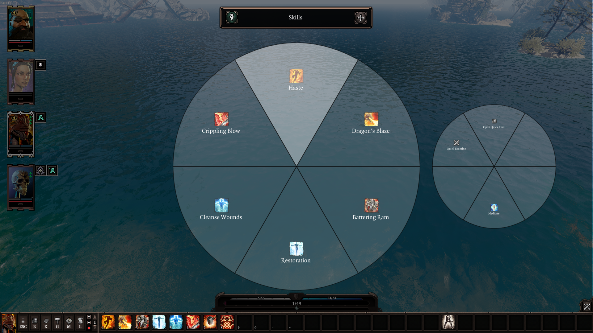

You can create multiple menus with a customizable amount of segments, shared across characters. Two types of radial menus exist:

- **Hotbar**: slots of the menu are dynamically filled from your current character's hotbar
- **Custom**: slots are be assigned to skills and Epip keybinds manually
    - This makes various older Epip features much easier to access on controller, or saves you from needing to bind more keys for keybinds you rarely use

If you have multiple menus, you can switch between them by clicking on the previews of the neighbour ones, or you can use the *"Radial Menus: Next Menu"* and *"Radial Menus: Previous Menu"* keybinds. These keybinds default to mouse wheel up/down, and RB/LB on controller.

Menus can also be edited after their creation by pressing the pencil button by their name.

!!! warning ""
    Epip keybinds that normally require you to hold the buttons or also move the cursor at the same time are not currently supported from Radial Menus.

Support for per-character menus, reordering menus, displaying skill cooldowns and binding items is planned for future releases.

### Ascension Controller Support
This update adds proper controller support to Epic Encounters 2's Ascension UI, enabled when the cursor is not in the pointer mode.


You can use left stick to navigate nodes/carousels/subnodes, A & B buttons to interact and go back respectively, with other controls being listed on the Navigation Bar.

You can still use the pointer mode as before, which you'll need to in order to access less commonly-used elements like the keyword descriptions, the "Deallocate All" button and other EE UIs.

### Settings Menu
The "General" settings tab has become the "Info" tab, acting as a credits + landing page, as the previous tab was largely a remnant of simpler days where we didn't have enough settings to warrant specialized tabs.

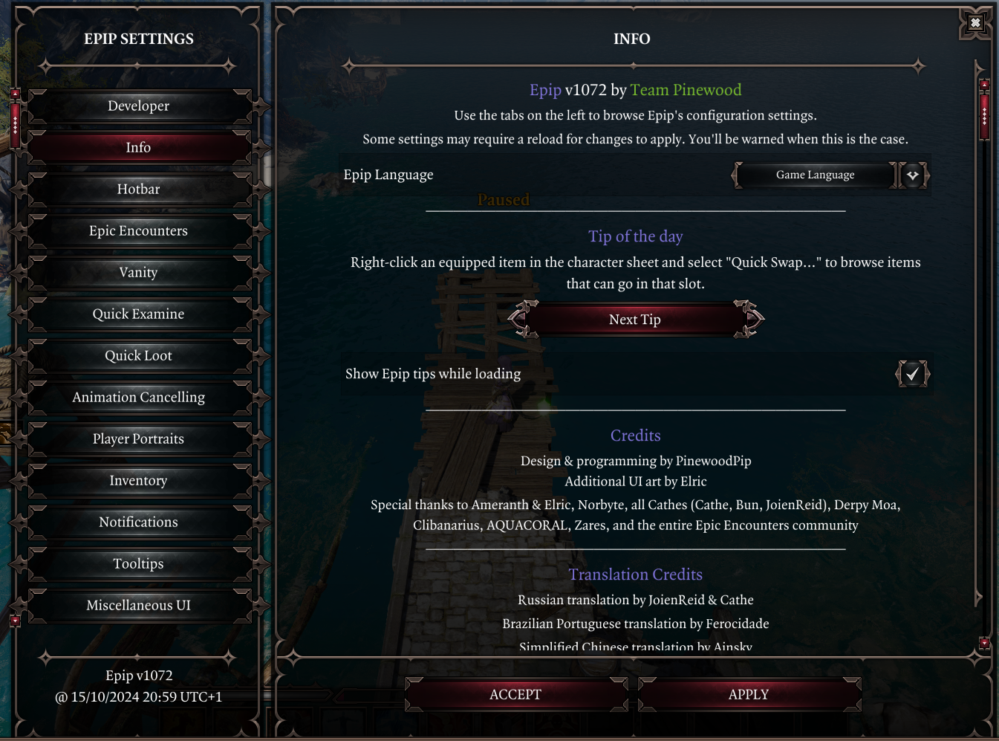

The Info tab displays random Epip usage tips, mainly to promote obscure or easily-overlooked features in a non-intrusive manner. A setting exists there to show these tips during loading screens as well (*"Show Epip tips while loading"*), off by default.

Settings that were previously there have been moved to other tabs, mainly "Miscellaneous UI"; settings that were not UI-related were moved to a new "Miscellaneous QoL" tab instead.

- The *"Infinite Carry Weight"* setting had been moved to this new tab as well as it's not technically UI-related.

### Animation Cancelling
- Added an animation cancelling setting for NPCs (*"Cancel NPC animations"*), which takes advantage of extender tech to work on all skills just like the player version does
    - Cancels both skill and attack animations, and does not use the blacklist setting
    - Configurable by the host player only
- Added a setting for cancelling basic attacks (*"Cancel attack animations"*)
    - The previous animation cancelling setting has been renamed to *"Cancel skill animations"*, and you'll have to re-enable it as the ID has changed

### Vanity
- When using the updated version of the [extender fork](extender.md), you can now change your weapon animations from the Transmog menu when selecting the Weapon item slot
- Fixed Vanity Transmog swapping hands of weapons while dual-wielding


<center><i>Weapon animation swap showcase.</i></center>

### Quick Loot
- When using the updated version of the [extender fork](extender.md), containers and corpses now show outlines while within the search radius
- Adjusted the yellow overlay effect to be somewhat more in sync with when the items enter the radius
- Fixed being able search and loot while dead

### Hotbar
- Numerous optimizations have been made to increase performance:
    - The Hotbar now only updates when necessary rather than every few frames, and updates are ~20% faster
    - Icons are no longer updated when there's no change
    - Various other minor speedups have been made to related code
    - If you previously experienced lower performance when using Epip, these changes should significantly cut down on its impact
- Fixed slot greyout issues with mods that use Extender custom requirements; these are now updated every 0.2s
- Fixed vanilla hotkey buttons not getting disabled when they should be
- Fixed combat-only skills being greyed out when loading a save that was in combat
- Adjusted the vanilla keybind labels so they don't appear cropped with the larger font some languages use
- Fixed slots not updating after a skill cast if *"Disable slots while casting"* was enabled; the setting is now also disabled by default for consistency with vanilla behaviour

### Camera
- Added a setting to prevent the camera from centering on NPCs in dialogue (*"Preserve position in dialogues"* in the "Camera" tab)
- Fixed the *"Keybind Rotation Speed"* setting not working if the rotate keybind was bound to a mouse button, and also fixed it not working when using the secondary vanilla bindings

### Other additions and adjustments
- When in combat, the cursor now displays a warning when attempting to move to a spot that would cause you to exit combat (roughly 27.5m away from the nearest enemy in 2D distance)
    - This warning also displays when using movement skills (Jump, Rush, Teleport skills)
- Added a *"Fast-forward dialogues"* keybind which automatically picks dialogue options, in the "Miscellaneous UI" tab, unbound by default
    - This is essentially a button-mashing macro, as fast as possible
    - You can configure which options to pick (first, last or random) with the *"Fast-forward strategy"* setting next to it
- French localization is now complete, thanks to Bern'
- Spanish localization has gotten a lot more lines; we're not currently sure who to thank for this, but thank you!
- Added a *"Toggle Minimap"* keybind, which functions the same as the setting
- The "Alternative Status Display" now refreshes every 0.2 seconds rather than every 10 frames, greatly reducing its performance impact
- Holding shift while pressing the vanilla "Options" button in the pause menu will open the Epip settings menu directly
- Added a potential fix for a vanilla bug where the controller area search UI could have bugged item interaction behaviour
- The mod is now just called "Epip" in the mod menu, since that's what everyone and their mom calls it
- Added settings for toggling Epip's UI file overrides for the character sheet and player portraits UI individually, at the bottom of the "Miscellaneous UI" tab (*"Character Sheet Overrides"* & *"Player Portraits Overrides"*), enabled by default to preserve existing behaviour
    - This can be useful to allow other mods's changes to these UI files to apply, at the cost of some Epip functionality becoming unavailable
- Using a skill from the [Codex](Features/Codex.md) now closes the UI
- The "Store on Lady Vengeance" option when using multi-select is now accurate in custom campaigns when using an updated version of the [extender fork](extender.md)
- Added icons for some keybinds, currently only used for Radial Menus
- The *"Allow walking to corpses in combat"* setting is now disabled by default to stay inline with the "keep defaults as close to vanilla as possible" policy
- The *"AP Divider Interval"* setting now defaults to 4 in Divinity Farandole since they recently switched to the DOS1-style AP granularity
- "Cannot equip." label in Artifact rune tooltips is now translatable
- The Debug Display now shows Lua RAM usage
- Starting local co-op now displays a warning that Epip does not support it

### Other fixes
- Fixed items being cleared from Hotbar Groups when playing as summons (as well as any other possible jank related to getting a summon's party)
- Fixed summons being able to use items from Hotbar Groups
- Fixed Hotbar Groups not getting greyed out when it's not your turn
- Fixed some tooltips in Epip UIs not hiding while using a controller
- Quick Find now blocks input when playing with a controller, so inputs don't also get send to the world
- Fixed keybind IDs not being prefixed with their script name as was intended, making them prone to conflicts
    - Unfortunately you'll need to rebind most of your Epip keybinds as a result
- If there's an error while renaming an item with Engrave, it should no longer cause a softlock with the message box
- The default *"Toggle tooltip scrolling"* keybind (middle-mouse) should no longer cause conflicts if you use middle-mouse for other keybinds (ex. the *"Adjust Camera Pitch"* keybind)
- Fixed some positioning issues with custom simple tooltips
- Fixed various benign console errors, including numerous ones when playing with a controller
- Fixed character names getting blanked out if they have a handle but aren't in an `.xml` translation when the enemy health bar UI was brought up for them
- Fixed some settings being referred to by inconsistent names
- Fixed character names in Epip UIs being incorrect for some origins
- Fixed item comparison tooltips in Epip UIs not comparing the gear to the correct character
- Fixed the first custom Epip tooltip in a session failing to show 
- Fixed "Send to Lady Vengeance" being available when multi-selecting in the tutorial ship, if the [extender fork](extender.md) is not installed

### Custom Scripts
Made it easier to load lua scripts without needing to make a mod pak via the new "Custom Scripts" settings tab. This allows you to write small Lua snippets to quickly customize or extend Epip's functionality, or to write test scripts for your own mod's purposes.

- Place scripts in `Osiris Data/CustomScripts` and use the "Add script" button in the tab to register them, then save & reload to reload the scripts
- You can toggle custom scripts and change their load order from this settings tab
- Scripts loading (or failing to load) is logged to console
- Developer mode is not necessary to use this feature, making this more "plug & play"
- To migrate from the older iteration of this feature ("Personal Scripts"), rename `PersonalScripts.json` to `CustomScripts.json`, put your scripts in the new folder and adjust paths within the json to be relative to it

<details markdown="1">
<summary>Technical stuff</summary>
- Added controller MsgBox UI API
- ClientLib now has events for starting/ending local co-op
- Fixed raw string net payloads causing an error
- Added `StickMoved` event to InputLib and `GetStickPosition()`
- Fixed `Text.Format()` when passing a TSK
- Fixed StatsLib not using the Extender requirements `Evalutate()` function in all cases
- Fixed InputAction IDs not being prefixed when registered through Features
- HotbarActions: fixed error when an action was not registered on server - it's no longer considered necessary to do so
- Added SkillPicker feature, for requesting the user to select a skill (currently only ones from their skillbook)
- Small optimizations to InputLib
- Minor cleanups, removed some old unnecessary globals and files
- Added `Client.PrepareSkill()`, which supports controllers
- Added `Skill` setting type and support for it for SettingWidgets
- Generic:
    - UI creation now takes a table config param, which allows setting initial visibility and layer
    - Text prefab now supports TSKs for `:SetLabel()`
    - Fixed `SetScale()` on Button prefab
    - Added `Form.Slot` prefab
    - Slot prefab now allows customizing which objects can be dragged-in
    - Spinner prefab now supports navigation
    - TooltipLib is now used for hiding tooltips, fixing this for controllers
    - Current stylable prefabs now expose their styles as a table for auto-completion
- Generic Navigation:
    - Non-wrapping lists no longer consume inputs at their ends
    - NavigationBar now supports stacking multiple supported UIs; the most recently-open one will be used
    - Fixed dpad textures for NavigationBar
    - Fixed GenericComponent input consumption
</details>

## v1071 - 28/07/2024

This update lays out the foundations for controller support, making various Epip UIs and features usable with a controller for the first time. In addition to that, a new ["Quick Loot"](#quick-loot) feature has been added, as well as a comprehensive Polish translation by Nektun.

In other news, we've recently also released an [Epip-style mod for DOS1](https://www.pinewood.team/ep1p/). Check it out if you also enjoy the prequel.

## Controller support

The settings menu can now be accessed from the controller settings menu, and it supports controller and keyboard navigation.

There is currently no clear indicator of which settings are applicable, but numerous old ones that previously weren't or had some inaccessible features now work with controllers:

- *"Show Minimap"* setting
- *"Resistances Display"* setting
    - Resistances are shown by the name of characters
    - Opening the context menu for a character while in combat displays the "alternative" information (AP, SP, initiative, etc.)
- *"Immersive Meditation"* setting
- [Quick Find](Features/QuickFind.md) UI
- Most tooltip adjustments
- You can now toggle filters for the "Alternative Status Bar" by pressing the right stick

<center>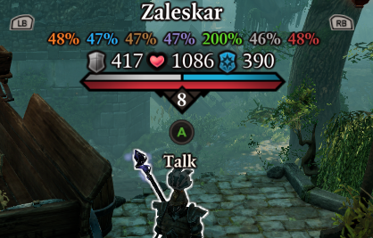</center>
<center><i>Resistances display on the controller UI.</i></center>

In Epip UIs with controller support, a new "Navigation Bar" widget at the bottom of the screen displays the UI's controls.

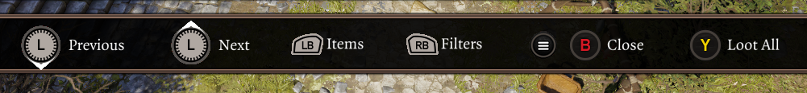

You can disable the Navigation Bar in the settings (*"Show controller Navigation Bar"* in the "Miscellaneous UI" tab) or enable it for keyboard + mouse as well - as any UIs that got this controller support also support keyboard navigation. When playing with a controller, you can also configure which glyphs to show (Xbox or Playstation style) with the *"Controller Icons Style"* setting.

It's worth noting that no convenient ways exist yet to access UIs that require a keybind press, such as Quick Find. Our recommended temporary solution is to create a Steam Input virtual menu to be able to execute the respective keybinds. In v1072, custom radial menus will be added to remedy this.

Interacting with keybind and "set" settings (ex. Animation Cancelling blacklist) is not currently supported.

## Quick Loot
A new "Quick Loot" UI has been added, which allows you to loot items from nearby containers and corpses through a unified UI with a single keybind press.

<center></center>

To use it, hold down the new *"Quick Loot: Start Search"* keybind (unbound by default) to select containers & corpses nearby. You may also configure the keybind from the new "Quick Loot" settings tab as well as increase the default search range and enable visual feedback for looting.

Various filters exist to avoid picking up undesired items, quickly accessible via the settings button in the UI.

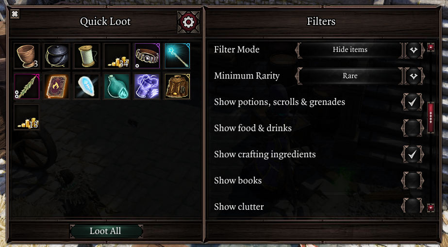

Hovering over items will show their source container/corpse in the tooltip, and you may also use the vanilla "take all" keybind to loot all items in the UI.

The Quick Loot UI supports controllers. When playing with a controller, you may hold down the right-stick to begin searching.

Note that containers that are locked, out of line-of-sight or considered as stealing will not be looted.

## Inventories
- You can now open containers (ex. backpacks) in the trade UI by right-clicking them; left-clicking items within will offer them for trade
    - ++lctrl++ + ++m1++ on a container will instead offer all the items inside for trade

<center>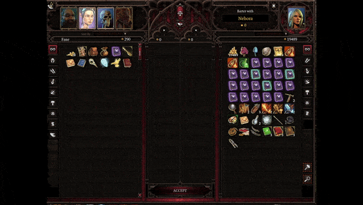</center>

- Multi-select improvements:
    - Added support for dragging items in and out of containers that are not owned by the party, ex. barrels in the world and the Lady Vengeance chest
        - Due to quirks with these, items dragged in & out of them will go to the first available slot rather than hovered one
    - The "Store on Lady Vengeance" context menu option no longer shows up in Fort Joy

## Camera
- Added a setting to control the rotation speed when using the rotate camera keybinds (*"Keybind Rotation Speed"*)
- Added a setting to prevent the zoom level from changing when entering dialogue (*"Preserve zoom level in dialogues"*)
- Added settings for minimum zoom distance
- The vanilla "Close-up dialogue" setting no longer zooms-in the camera obnoxiously close to characters
- Fixed stuttering when changing the pitch without moving the camera to the sides


<center><i>Before & after comparison of the vanilla "Close-up Dialogue" setting.</i></center>

## Vanity
- Added a setting to revert the appearance of items when they are unequipped; "*Revert appearance of unequipped items*" in the new "Vanity" settings tab; disabled by default
    - This can be helpful to keep your inventory readable when using transmogs that alter icons heavily
- Reduced stuttering when transmogging or dyeing items
- Appearance is now refreshed when toggling your helmet
- Most of the UI is now translatable
- Fixed the UI closing when the selected item is unequipped
- Fixed default equipment colors being wrong when not using EE
- Fixed issues with item models that mask their own equip slots, ex. full-body armors from Majora's Fashion Sins
- Fixed racial skills disappearing from the hotbar when refreshing Vanity appearances

## Hotbar
- Fixed slots being visible beyond the edge of the hotbar when using aspect ratios shorter than 16:9
- Fixed the "endpiece" at the right appearing after exiting dialogue in cases when it shouldn't

## Other changes and additions
- Added Polish translation by Nektun
- Added partial Spanish translation by AquaVXI
- Chain/unchain hotbar action now preserves order of party members in the UI, rather than shuffling them around
- Added a setting to render each icon in the skillbook UI separately, which fixes the issue of icons disappearing when using too many mods that add more - *"Render icons individually"* setting in the "Miscellaneous UI" tab, disabled by default
- Epip features that show character names should now show the translated names
- Stat tooltips no longer show "+0%" effects (ex. from vanilla perks deprecated in EE)
- Improved consistency of setting names; settings that start with a verb no longer capitalize all words
- The scrollable area of the settings menu tabs has been adjusted to not crop out buttons
- Epic Enemies effects are now translatable
- Merging EE stat adjustment tooltips now works with translation mods
- Custom tooltips in Epip UIs now support refreshing them with the shift key, though there aren't any uses of this yet
    - Currently only works on unmemorized skills (the left panel)
- You are now warned if you're using an outdated version of the Extender fork
    - If you were using it before, v1071 requires you to update by redownloading it

## Other fixes
- Potentially fixed a rare issue with Animation Cancelling and AP refund effects (ex. the Executioner talent) that could cause a character's turn to end prematurely
- Fixed positioning simple tooltips in Epip UIs (ex. highscore dates in Bedazzled)
- Fixed the language setting not warning you that you need to reload the game
- Fixed the caret resetting when typing in text settings
- Fixed warnings in the gift bags UI not using translations
- Fixed the "Escape closes EE UIs" setting not working
- Added safeguards against opening the party inventory UI while loading (which can rarely cause a crash for non-hosts)
- Fixed the save/load UI breaking showing no saves after deleting one
- Fixed "Save/Load UI Improvements" not working in the save UI
- Possibly prevented a rare crash that could occur for non-hosts while loading
- Fixed the "General" settings tab not using a translatable name
- Fixed numerous console error messages when playing with a controller

<details markdown="1">
<summary>Technical stuff</summary>
- EpicEnemies:
    - Added Priority field for effects; effects will roll in order of priority tiers, climbing down tiers when no more eligible effects remain in the current one.
    - Added Prerequisites field for effects, which allows defining effects that must be present beforehand (or be paid for on-the-spot) for an effect to be eligible.
    - Added AI type requirement field for effects
    - Added Artifacts and KeywordStats fields for effects
    - Added support for providing lists of SpecialLogic for effects
    - Changed class names, deprecated EFFECTS field in favor of new GetRegisteredEffects()
    - Refactored hooks and events to use new system
    - The Quick Examine widget now shows effect IDs
- TooltipLib:
    - Added support for showStatTooltip UI calls
- Client.IsActiveCombatant() no longer relies on UIs
    - This should make it more robust when the EE flee effect is involved
- Various cleanups, annotation adjustments and removals of obsolete scripts and snippets (ex. in Vanity)
- IDEAnnotations now has better support for enums/bitfields, and some signatures of Extender methods have been fixed
- ModLib now has some popular campaign GUIDs
- EntityLib now has level IDs of Origins levels
- The Set data structure now aliases indexing to Contains()
- table lib:
    - Optimized join()
- Added `OOP.RegisterDeprecatedKeyRedirect()`
- Various refactorings to Vanity, mostly to standardize reverting appearances
- Added `EMPTY` table global
- Host status can now be determined on controller UI
- Added controller GameMenu, MainMenu UI tables
- CharacterLib: added GetDisplayName(), GetLootableItems()
- Generic:
    - Added PooledContainer prefab, largely inspired by the Quick Find grid
    - Added Text:IsFocused()
    - Added more button, frame and miscellaneous textures, as well as Playstation input icons
    - Disabled pooling until rare issues with it are ironed out
    - Navigation:
        - Subclasses are now registered to Navigation library rather than Generic
        - Added ScrollList component
        - General polishing and robustness improvements, especially when elements are destroyed (ex. List now clamps focused index)
        - Consolidated input events into "actions"
        - Added NavigationBar widget
        - List no longer has up/down events
        - Fixed creating components for prefabs
        - FormElements now emulate mouse events for navigation, displaying tooltips - though they are still positioned by the cursor.
        - Added support for Sliders for legacy element navigation
</details>

## v1070 - 1/04/24 (more or less)

v1070 is the 1070th release of Epip (aka "The Easter patch") and marks the third anniversary of the mod, but most importantly, the first anniversary of our infamous Bedazzled minigame! And what better way to celebrate Easter than with some bedazzling new additions to it?

### Bedazzled
Bedazzled has received its first expansion, adding a new gamemode, modifiers, statistics, Elo ranking and more!

!!! info ""
    Out of the loop? Simply right-click a rune or rune-crafting gem and select the "Bedazzle" option in the context menu to get started.

<center></center>

Changes & additions:

#### Gamemodes & modifiers

A new game mode has been added: *Bedazzled Twimst've*

- Spin2win by rotating groups of 2x2 gems to make matches
- You have a limited amount of "free moves" to rotate gems even if doing so would not create matches, to ease setting up runes and cascades
    - Crafting runes and destroying Epipes grants additional free moves
- The original Bedazzled experience is now known as the *Classic* gamemode

<center></center>
<center>*Bedazzled Twimst've gameplay.*</center>

---

*Modifiers* have been added, which change the rules of the game or add restrictions. These are customizable for both gamemodes and include:

- **Time Limit**: go for high-scores before time runs out
- **Move Limit**: make each of your limited moves count
- **Raid Mechanics**: gems with MMO enrage timers will spawn; if left unmatched, they will bring a fair and balanced instant game over
    - Enabled by default for Bedazzled Twimst've
- **Cement Mixer**: immovable objects known as "Epipes" will spawn to urge you to reconnect with reality. Exorcise them with the unstoppable force of runes to gain additional points and soothe enraged gems.
    - Enabled by default for Bedazzled Twimst've
- **Hyena Mode**: eldritch 2x2 matches become a thing, as was never intended

#### Main Menu

A main menu has been added, unlocked after playing at least 1 game. The menu lets you select the gamemode to play, configure modifiers, view high-scores and lifetime statistics.

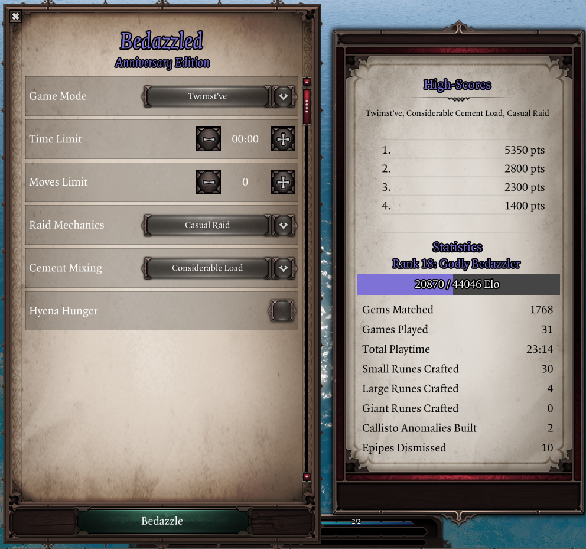

Multiple high-scores are now tracked, for each possible combination of gamemode and modifier configurations. Old scores are preserved as Classic mode scores.

##### Elo Rating
Elo rating has been implemented to represent your relative Bedazzled skill. Each game finished increases your Elo based on your score, and reaching Elo milestones will grant you noble titles in recognition of your expertise.

<center>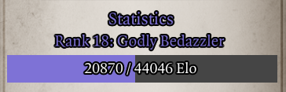</center>

Players who had Bedazzled scores set before this update will retroactively gain Elo based on their 5 best scores. All other scrubs begin at 0 Elo.

#### Other changes
- Bedazzled can now also be accessed by right-clicking any rune, to make it easier to play without EE
- Copied over the gem and rune icons from EE, so that the game is properly playable without EE (it was not intended to be accessible previously)
- Added a decorative frame around the gem area

### Other changes and additions

!!! info ""
    Some additions might only be available once the anniversary party starts in your timezone.

- The Abeyance status tooltip now shows buffered damage
- Added a potential fix for being unable to use basic attacks while under the effects of increased AP costs, similar to our fix for using items
- Added Catalan to the translation sheet
- Added Herobrine (disabled by default)
- Added a setting to enable all settings by default, in the "Haha you wish" settings tab (disabled by default)
- EE status damage tooltips now use translated damage type names
- Added ingame rewards if you also own Ep1p on the same Steam account
- Added support for the iPhone 12(?), [for the ~46 Epip users using it](img/iphone12_resolution.png)
- Holding shift while pressing +/- buttons in spinner UI elements now increments/decrements the value by 5 steps
- The settings menu has been renamed to "Quick Accessibility" for consistency and to get on with the new UX trends
    - Similary, the "Keybinds" tab is now "Quick Keybinds", which also makes it more precise
- Added a screensaver feature to reduce monitor burn-in, enabled if you idle for a while
- Subscribers to the $500 Patreon tier can now view all my Red Prince porn in a new tab within the [Codex](Features/Codex.md)
- Items that can be absorbed by Gale now show a hint in their tooltips
- The Punisher has regained his voice, just in time for the anniversary party
- Re-enabled party mode (the one from my birthday)
- As usual, anniversary shenanigans from previous years make a temporary return, so don't panic

### Fixes
- Fixed the Discord Rich Presence line 2 setting being misnamed
- Fixed the Epic Enemies settings tab not being scrollable (regression within the selector UI element)
- Fixed EE regeneration stats showing in the Stats Tab without EE
- Fixed the main menu being opened when clicking the send chat message button if "Unfocus after sending messages" setting was enabled but the chat field was not focused

<details markdown="1">
<summary>Technical stuff</summary>
- [Added Github Actions auto-build](https://github.com/PinewoodPip/epip-ci/actions/runs/6147355340)
- Fixed some benign errors and removed empty scripts (which would cause error messages when using the pak)
- Minor annotation adjustments as usual
- Added a `Testing` library, intended to replace the old Feature testing methods in the future
- Vectors now support scalar multiplication via operand
- SettingWidgets now supports defining different visual representation for a setting type; ClampedValue supports being displayed as a Spinner this way.
- Refactorings to Generic Spinner: now inherits from FormElement, supports styling and a hook for the value label
- Tons of technical changes to Bedazzled to improve moddability and support new features
</details>

## v1069 - 1/02/24

This patch contains various fixes, a few new features as well as polishing for older ones.

!!! info "Do not get too excited"
    Despite the version number ending in "69", this version does not add sex to the mod.

### Camera
- Added a keybind to change the camera pitch (vertical angle), *"Adjust Camera Pitch"*, located in the "Camera" tab and unbound by default
	- While held, moving the mouse up/down will change the pitch; this basically lets you change it on the fly
	- Other new settings exist in that same tab to adjust sensitivity, invert the controls as well as to allow the pitch to go negative
		- A negative pitch allows you to look straight up; this clips the camera into the ground, and therefore is disabled by default for aesthetic reasons
<center></center>

### Quick Examine
- Added a new widget that displays the equipped items of player characters, enabled by default
    - The order in which items appear can be set through the *"Equipment Slots Order"* setting in the Quick Examine tab
<center>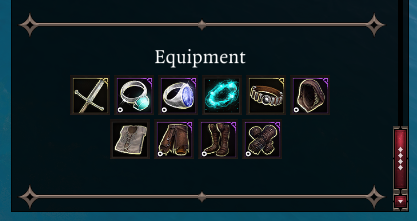</center>
- The grid-like widgets now use a consistent appearance, and the size of icons has been increased for readability
- The related settings are now translatable and use more consistent wording

### Vanity
- Added a button to remove dyes
- Fixed wrong item appearances being used for polymorphed characters
- Fixed the armor toggle within character creation not working correctly

### Player Health Bar
- Added a setting to control every how many action points the golden divider appears in the AP bar, accessible from the "Hotbar" tab (*"AP Divider Interval"*).
	- Defaults to 4 in EE (as before) and never otherwise, as it didn't make sense for vanilla people to have that every 4 AP as well (was pretty much an oversight)
- The AP bar is now centered better
- The UI is now repositioned immediately after resolution changes
- Fixed positioning when UIScaling was >1

### Settings Menu
- The tab buttons are now more compact and support scrolling (once we add more of them)
- The apply button now tells you whether you need to reload the game for changes to take effect
- Most settings throughout Epip UIs (ex. Settings Menu and Quick Find) can be right-clicked to reset them to the default value
- Keybind settings now show "Unbound" for unbound slots, and light up when hovered over for better UX
- The useless cancel button has been replaced with text showing the Epip version and build date
- Fixed some text not wrapping in the settings menu after changing tabs

### Hotbar
- Fixed slots not considering changes to SP costs, causing them to be grayed out incorrectly when these were applied (ex. Apotheosis in vanilla)
- Fixed slots being grayed out while possessing GM mode NPCs that didn't meet skill ability requirements (which they don't have to, apparently)
- Fixed a leftover vanilla graphic sometimes appearing to the right of the bar
- Fixed the combat log button being visible in dialogue and improved its positioning to fix visual gaps

### Quick Find
- Slightly sped up equipment filters
- The default value for the item slot setting is now "Any" instead of "Helmet"
- Fixed a bug in Epip UIs that caused dropdowns to fire change events twice
    - As a direct consequence, the Quick Find and Codex UIs now basically update 2x faster when changing the dropdown settings

### Other changes and additions
- Added French translations by Drayander
- Physical & piercing (no longer "pierce") resistances in character sheet are now translated
- When holding shift to show skill damage multipliers in tooltips, the damage types are now translated, the colors should be consistent with the ones the game uses and this feature now also works for skills that reference the damage of other skills (which includes most scripted skills and others such as Flaming Tongues)
- The Flanked status now shows the amount of flankers in its tooltip
- Skill tooltips now reflect statuses that change SP costs, like the previous feature that did so for AP cost boosts
- Added English as an explicit language option
    - This allows you to play the game in a different language but keep Epip in English
- The name of the "Fix Astrologer's Gaze / Far Out Man range" setting is now dynamic and shows the name of the talent based on your active mods to avoid confusion
- Epip keybinds are now considered as "released" once you release any of the keys needed for them, instead of all keys needing to be released
	- This change only matters for keybinds that need to be held for them to do something
- Multiple old strings have been made translatable
- Giftbag compatibility warnings have become translatable
- The "Enable world tooltips for all items" setting has been moved up to be the first one within its settings category, and its description has become translatable
- The Animation Cancelling setting is now a simple checkbox and works like the "server-side" option did. The "client-side" option has been removed as it was a failed experiment
    - You're going to have to re-enable the setting
- For GM mode: added a setting to automatically apply bonuses to rolls based on character attributes, accessed from a new "Game Master" settings tab (*"Automatic Roll Bonus"*)
- Added a new UI to paint surfaces, accessible in developer mode through the *"Toggle Surface Painter"* and *"Paint Surface"* keybinds (unbound by default)

### Other fixes
- Fixed some Epip tooltips not being positioned correctly when UIScaling was changed
- Fixed Hotbar Groups not being restored properly after lua resets
- Removed Origins (the vanilla campaign) as dependency (was an oversight from the gameplay mod era)
- Fixed cooldowns not appearing in the Quick Examine skills widget
- Fixed backgrounds for scrollbars not displaying correctly in Epip UIs
- Fixed some typos in some setting tooltips
- Fixed developer keybinds showing up in the keybinds settings tab outside of developer mode

<details markdown="1">
<summary>Technical stuff</summary>
- Fixed some error spam from Auto-Identify
- Fixed `Item.GetEquippedSlot()` when slot to return was supposed to be `nil`
- Added `Color` alias for `RGBColor` and `classname` alias for OOP class names (`string`)
- Added `Client.UI.Time.GetDateFromString()`
    - Date stuff will likely soon be moved to a proper library
- Fixed unsubscribing event listeners during Throw(), which would possibly prevent further ones from firing during that throw
- SettingWidgets now supports ClampedNumber, rendering them as sliders
    - It is also possible to set them to not set the setting values directly, useful for systems that manage them (ex. Settings Menu)
    - Fixed element IDs not considering the module, leading to possible ID conflicts
- Slight refactoring to HotbarTweaks with a negligible performance increase for dragging in unlearnt skills
- Added extra sanity checks to prevent the first hotbar row from being considered "not visible"
- `Item.GetEquippedSlot()` now consistently returns a string type (never an enum)
- Library:RegisterTranslatedString() now has a table-only overload
    - Other similar calls will likely get the same treatment for readability
- The UserVars library now has a workaround for uservars not being synched to clients joining mid-session
- UserVars are now cleared for dying summons to reduce savegame bloat
- Cleanups to HotbarGroups in preparation for a future expansion; scripts have been moved and Group now inherits from GenericUI_Instance instead of holding
- Added AOO to the table of hardcoded statuses with no icons in StatsLib
- New calls within StatsLib: `GetItemColor()`
- New calls within CharacterLib: `GetSkillAPCost()`
- Added UI.GM.Roll
- DamageLib now has damage type colors and name handles
- CameraLib now has getters and setters for position switches
- `Text.GetTranslatedString()` now warns instead of errorring when used during module load
- Various annotation fixes and improvements
- InputLib:
	- Fixed mouse movement events not using Vector
- OOP: added static `ImplementsClass()` method and Class overloads for `Class:ImplementsClass()` & `Class:IsClass()`
- Generic legacy tooltips now use type IDs consistent with the Tooltip library
- Refactored Quick Examine to use Class for the widgets, and added a Grid widget to reduce code duplication
- Fixed default error message for interfacing with destroyed tables
- Logging methods from Library have been moved to Class
- Epip features are now auto-muted outside of Epip developer mode
- The Generic Textures test UI now has a tab for input icons, and the script has been cleaned up a bit
- ColorLib now ensures RGB values are integers
- TextLib:
    - Added Casing formatting option
    - TSKs can now be used as Text for recursive formatting
- Removed old & unused status sorting scripts
- Generic:
    - `Destroy()` now also calls itself recursively on child elements for sanity
    - Added more textures and styles
    - Added LoadingFlower prefab, mostly for fun
    - Button prefab styles now support offsets for labels when they are pressed
    - Button now supports passing TSKs directly to `SetLabel()` - similar Epip calls will likely get the same treatment in the future
</details>

## v1068 - 26/11/23
This patch contains various fixes for older features, as well as a few new requested features.

### Vanity
- Transmogging should now correctly use the "masks" of the chosen appearance
    - This fixes incorrect behaviour when using items or transmogs that hid other item slots (ex. dresses hiding gloves or leggings)
- Fixed "Lock appearance" not working correctly for off-hand weapons
- The "built-in" dyes tab is now sorted alphabetically, and uses more human-readable names
- You no longer need to remove transmog to drill items
- Fixed the "built-in" tab only displaying item colors used by armor
- Fixed a regression from the last patch related to racial skill cooldowns that would break transmogging for undead characters
- Fixed character sheet icons not being updated when transmogging items with "Lock appearance"

### Enemy Health Bar
- Added a setting to control when and how resistances are displayed under the bar, accessed from the "General" tab (*"Resistances Display"*)
    - It's now possible to only show non-0 resistances, or show them all but only if any are not 0, or hide them entirely
    - Defaults to the previous behaviour (displaying all resistances at all times)
- Various strings displayed there are now translatable (aggro status, stat acronyms, level label)

### Other changes and additions
- Added a setting to display item tooltips in inventory UIs to the sides of the UI rather than by the cursor, accessible from the "Tooltips" tab (*"Inventory Item Tooltips Position"*)
- Added settings to control the delay before item and item comparison tooltips display in the inventory UIs, accessed from the "Tooltips" tab (*"Inventory Item Tooltip Delay"* and *"Item Comparison Tooltip Delay"*)
- The tooltips for weapon range deltamods are now translatable, and the tooltip itself should now also work for non-EE deltamods

### Other fixes
- Fixed the tooltip for the "Filtered Statuses" setting not specifying it affects the Alternative Status Display only
- Fixed the "Display B/H on player portraits" and "Escape Key Closes EE UIs" settings displaying if EE was not enabled
- Statuses in the enemy health bar will no longer overlap with the B/H indicator if there is no text displayed below the bar
- Fixed equipped items being unequipped when drag-and-dropping them into the Greatforge
- The Alternative Status Display and Settings Menu are now positioned correctly if the `UIScaling` game setting is not 1
- The settings menu is now repositioned when opening it, adjusting the positioning if the resolution was changed
- The "Quick Swap" option to access Quick Find is no longer displayed on items that cannot be unequipped (ex. Source Collars)
- Possibly fixed the party wheel menu not working in splitscreen

<details markdown="1">
<summary>Technical stuff</summary>

- Examine UI: added `GetItem()`, `TooltipRequested` event and expanded entry type enum
- Added class annotations to `Features.EnemyHealthBarExtraInfo` as well as `GetResistances` hook
- IDEAnnotations: enum table values are now a union of `Enum<MyEnum>|MyEnum`
- Added a workaround for an extender bug with UserVars that causes it to trigger the "Journal updated" notification
- TooltipLib: fixed dummy tooltip data not being cleared before rendering custom tooltips
- CharacterLib: add `CORPSELESS_DEATH_TYPES` set
- ColorLib: added colors for skill school footer tooltips
- Minor style and annotation fixes

</details>

## v1067 - 18/10/23

### Inventory Multi-Select
- The container inventory UI is now supported, with the same functionality as the party inventory one
- The keybinds can now be rebound, either from the keybinds tab or directly from the "Inventory" settings tab
- Dragging multiple items to the bottom slots of an inventory now works as expected, rather than stopping once visible slots are exhausted
- Fixed selecting items very quickly in the party inventory causing you to use the item
- Fixed items not being filtered properly when marked/unmarked as wares
    - Unfortunately, this requires them to be re-added to the character inventory, which will move them to the first available slot.

### World Tooltip "Open Containers" Setting
- Fixed opening containers not working when characters were close enough to the container to open it without moving
- You may now switch to a different container or cancel with left-click while moving to open one, simulating vanilla behaviour

### Other changes and additions
- Added an option to auto-listen to nearby dialogues, enabled from the "Notifications" tab (*"Auto-Listen Dialogues"* and *"Auto-Listen Range Limit"*)
    - Due to limitations with the extender, these options are only available when using [the custom build](extender.md).
- The "Toggle World Tooltips" keybind now works if the vanilla keybinding is changed, and is now possibly less janky
- Epip keybinds now support binding left-click in button chords
- Added a setting to highlight empty slots in the container inventory UI upon hovering over them, for consistency with the party inventory. Can be enabled from the "Inventory" settings tab (*"Highlight Empty Container Slots"*)

### Fixes
- Fixed Meistr's note (and other items not tagged as books) not being considered a book for the respective Quick Find filter
- Fixed "Book read."/"Key used." tooltips having an inconsistent appearance
- Fixed Discord Rich Presence overhaul mode when within subregions that have no name
- Fixed "Toggle World Tooltips" not re-enabling tooltips after exiting dialogue
- Fixed Physical and Piercing resistances in the character sheet appearing multiple times and having the wrong icons
- Fixed Discord Rich Presence periodically closing some UIs when it was set to the overhaul mode
- Fixed the difficulty dropdown in vanilla gameplay settings not using translated strings, as well as being unlocked in Honour mode

<details markdown="1">
<summary>Technical stuff</summary>

- Added `Epip.IsPipFork()`
- OsirisIDEAnnotationGenerator: "bool" params in Osiris annotations are now a integer|boolean union
- IDEAnnotations now better supports Ext.Enums
- WorldTooltip now handles duplicated events better when it comes to cancelling them
- Minor annotations fixes and cleanups
- CharacterSheet: fixed hooks firing when there is no update, added stat icons enum
- Added `Input.GetCurrentAction()`
- Minor additions to some libraries

</details>

## v1066 - 30/09/23

!!! info ""
    This patch was reuploaded on 1/10/23 to fix an issue when playing with a controller.

Due to Extender shenanigans, the development of v1066 spanned ~3 months and 12 beta releases; it would be a tremendous amount of work to aggregate all changes, so they are laid out in chronological order as previously shown on the beta page.

### 30/09/23
#### Changes and additions
- Added customization for Discord Rich Presence, available from the "Miscellaneous UI" settings tab
	- You may set both lines to anything you desire, or have them be set to show your character level, area and overhaul

<center></center>

- The Quick Find UI is now layered below the book UI

#### Fixes
- If the "Open containers" world tooltip setting is enabled, attempting to open containers you can't reach will no longer teleport your character to them


<details markdown="1">
<summary>Technical stuff</summary>

- Removed the cheats keybind until the feature is more complete
- Minor annotation and style fixes
- __Setup() and __Test() have been moved from Feature to Library
- UI tables are now Libraries instead of Features

</details>

### 25/09/23 beta upload
#### Changes and additions
- The "Open containers" world tooltip setting now allows the move-to action to be cancelled using right-click or the escape key
- The auto-identify setting will now try to identify all items in the party inventory when it is enabled and when a save is loaded, as well as when unidentified items are added to the party inventory
- The search bar from "Save/Load UI Improvements" now automatically clears the hint text when you focus it
- The "Show empty containers" world tooltip setting should now work in all languages
- Warnings for unavailable Source Infusions in skill tooltips as well as ability score displays are now translatable and support Joien's translation mod
- The UI for binding Epip keybinds now uses a black panel rather than a buggy-looking one

#### Fixes
- Fixed surface tooltips "sticking" if you moved the mouse away from them before surface ownership data was retrieved
- Fixed Hotbar Loadouts context menu when you have >6 loadouts saved
- Fixed the "Stat-sharing notifications" setting not working in some languages (ex. Korean)
- Fixed names of items within containers breaking if "Preview Container Items" was set to >0
- Fixed movement AP costs having an extra space in some languages while shift was held

<details markdown="1">
<summary>Technical stuff</summary>

- Fixed error spam in the title screen from EnemyHealthBar stuff
- Errors during `Library:__Setup()` won't stop other scripts's setup from being ran

#### Generic
- Added `Element:GetChildIndex()`
- The order of `Element:GetChildren()` is now updated when child index of the children changes
- Added `GetOptions()` and `IsOpen()` to ComboBox
- Navigation:
    - Fixed recursive unfocusing
    - Added LegacyElementNavigation class to aid with the creation of components for legacy element types
    - Replacing components is now allowed; ex. you can have a default component on a prefab, but have a specific UI replace it with another
    - FormElement and its current derived classes now have a default component

</details>

### 21/09/23 beta upload

#### Changes and additions
- Increased the speed of Mass Dismantle
- Added a setting to use opaque backgrounds for skill/item/status tooltips, in the "Tooltips" settings tab ("*Opaque Background*")
- Added a setting to remember the position of character sheet and party inventory UIs between sessions, in the "Miscellaneous UI" settings tab ("*Remember Panel Positions*")
- The Codex Skills tab now has an option to show skill tooltips on the left page instead of by the cursor
- Numerous old tooltip-related strings are now translateable (and already translated into some languages)

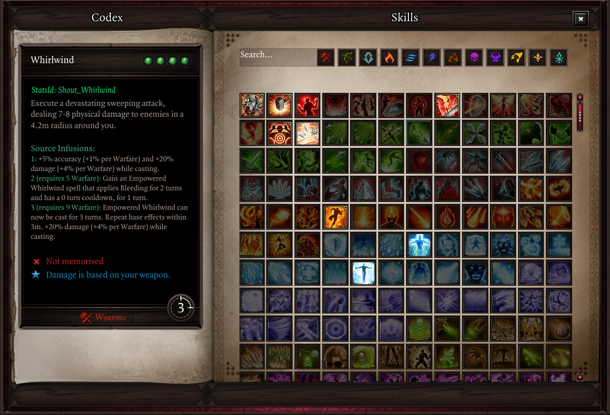
<center>*Codex setting to show tooltips on the left, with opaque background enabled.*</center>

#### Fixes
- Fixed context menu positioning on resolutions other 16:9 and 1080p
- Hopefully fixed context menus overflowing through the bottom edge of the screen
- Fixed Alternative Status Display not hiding the vanilla one when characters are recruited
- Fixed Epip keybinds triggering while a message box is open
- Fixed Vanity Transmog "keep appearance" option resetting racial skill cooldowns
- Fixed some skills still having descriptions from Epip Gameplay

<details markdown="1">
<summary>Technical stuff</summary>

- Fixed error spam in the title screen from HotbarTweaks
- Added `UI:GetPath()`, `UI:FlashPositionToScreen()`, and `Client.GetUI()`
- Fixed `Vector.ScalarProduct()`
- Added `Character.GetSkill()`
- Added events for dragging UIs to `PointerLib`

#### Generic
- Up/Down IggyEvents are now distinguished
- Added the foundation of the KB/controller navigation system and basic components
- Added `Grid:GetGridSize()`
- `Element.Type` now uses the class name
- Added `Element:GetGlobalPosition()` and `Element:GetScreenPosition()`

</details>


### 10/09/23 beta upload

#### Fixes
- Fixed issues with Alternative Status Display tooltips appearing over other UIs
- Hopefully fixed custom context menus for window sizes above 1080p, including ultrawide
- Fixed the "Previous" and "Next" buttons in the Epic Enemies settings tab behaving the same way (both scrolled in the same direction)
- Fixed the "Show Action Hotkeys" hotbar setting not working

<details markdown="1">
<summary>Technical stuff</summary>
- Fixes and cleanups to remove IDE warnings in old code. Functionality unaffected (if anything, some possible unnoticed bugs from typos have been fixed).
</details>

### 08/09/23 beta upload

#### Quick Find
- Added a "Containers" filter, that displays items such as backpacks or barrels
    - Empty containers may be filtered out
- Added a recursive search option, which will find items within containers that are in the party inventory

#### Other additions and changes
- Added a setting that shows the names of items within containers in their tooltips, enabled from the "Tooltips" tab (*"Preview Container Items"*). Previews up to 3 items by default.

- Added a setting to allow slots from higher hotbar rows to be used when holding ++shift++/++ctrl++/++alt++/++cmd++ while pressing the vanilla slot keys. For example, pressing ++shift+2++ will use the second slot on the second bar. Enabled from the "Hotbar" tab (*"Select upper bars with modifier keys"*).
- Added support for Gamemaster Mode
- Updated localization

#### Fixes
- The fix for being unable to use items properly when under the effects of +AP Costs now works correctly when using items from context menus
- Fixed some issues with the Alternative Status Display when travelling between acts
- Fixed Preferred AI tag not showing up in the enemy health bar with "Show Aggro Information" enabled
- Fixed certain Epip tooltips such as "+Elemental Weapon Damage" and "+Weapon Range" showing up on unidentified items
- Fixed custom context menus not working correctly on items placed in the world
- Fixed custom context menus being able to overflow through the right edge of the screen
- Fixed numbers in the stats tab not getting grayed out in some cases and not being rounded, possibly overflowing outside the UI
- Fixed some item tooltips showing an empty line after their item level
- "Show loot drops in health bar" setting is no longer visible outside of EE (as it doesn't do anything without it)

<details markdown="1">
<summary>Technical stuff</summary>
- Various small changes to support GM mode (commit a4f82c4)
- Fixed `Item.GetContainerItems()` erroring if no predicate was passed.
- Added `:Format()` to TSKs, as well as `FormatOptions`
- Added `InputEventBinding:ToKeyCombination()`
- Added `Input.GetBoundActions()`
- `Osi.RegisterListener()` is now properly annotated by IDEAnnotations
- `Item.GetItemsInPartyInventory()` now has a recursive option
- Added `Item.GetDisplayName()`
- Added `Item.IsIdentified()`
- Added an API for `ContainerInventory` UI
- Numerous changes to the Epip table:
    - Added `ShutUp()`
    - Features can be fetched by non-stripped ID
    - Deprecated `AddFeature()`
    - `Epip.VERSION` now uses `Mod.GetStoryVersion()` instead of being a static field
    - `GetFeature()` no longer errors by default if the feature is not found, unless a new param is passed
    - Added `ImportGlobals()`

#### Generic
- Added more frame and panel textures
- Added `texture_importer.py` for importing texture resources without using the editor
</details>

### 02/09/23 beta upload

#### Inventory Multi-Select
An option to enable multi-select controls for the party inventory UI has been added, enabled from the "Inventory" settings tab.


Use ++ctrl+m1++ to select/deselect items. If at least one item is selected, ++shift+m1++ will select a range of items between the mouse and the first selected item.

Right-click selected items to access a context menu with operations, or drag and drop them to inventory slots, player inventory tabs, or container items to move them.

<center>
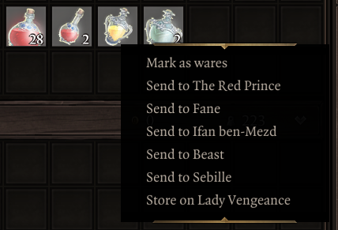
</center>

#### Other additions and changes

- Added a setting to play a notification when another player joins dialogue, to make it harder to miss. You may enable it in the "Notifications" tab.
- The hotbar action for using pyramids now has the following priority for picking the pyramid to use:
    1. Pyramid within the inventory of the character that pressed the button
    2. Pyramids within other characters controlled by the same user
    3. Other pyramids in party inventory

#### Fixes
- Fixed hotbar bedroll and pyramids actions not working if EE was not enabled
- Fixed camera settings not being saved after clicking "Reset to defaults"
- Fixed status tooltips appearing far away from the cursor in the Alternative Status Display
- Fixed some labels being cut off in the settings menu

<details markdown="1">
<summary>Technical stuff</summary>
- TextLib no longer removes outdated translations from localization templates
- Added `PlayerInfo.GetPlayerElements()`, and hooks for `updateInfos`
- Fixed a regression causing the prompt for opening the Fishing log to not work
- QuickInventory: fixed built-in Generic events being hidden
- Added align options to `Tooltip.ShowStatusTooltip()`, moved it to separate script (other tooltip types will follow)
- `Library:Error()` now blames user code in the stack; the new `Library:InternalError()` blames the function itself
- Fixed comments for aliases in generated IDE annotations
- OsirisIDEAnnotationGenerator now supports all symbol types from the header, uses lowercase for parameter names, avoids parameter name duplication and has an option to generate annotations intended for the `Osiris` library
- Fixed `Item` not actually being a library
- Clarified the usage of `Item.GetOwner()`

#### Generic
- Instances now come with an empty `Hooks` table
- Fixed `Text:SetType()` not applying until the text was changed (didn't affect Text prefab)
- Spinner: cleaned up script, implemented Elementable, changed default colors to white
</details>

### 26/08/23 beta upload

#### New Features & Changes
- Added a setting to allow dragging unlearnt skills onto the hotbar, ex. from the codex. This is useful for creating placeholders. You can find it in the "Hotbar" tab.
- Made various strings from older features translatable, mostly tooltip-related ones
- Holding shift to see precise AP costs for movement should now work in other languages
- The setting to disable loremaster shared notifications should now work in other languages
- Added a setting to disable the "Masterworked" tooltip

Due to some reorganization, you will have to rebind the B/H Overheads hotkey.

##### Quick Find
- The position of the UI no longer resets to the screen center every time it's opened
- Added a wares filter
- Added a scrollbar to the settings panel, for when there are too many of them
- Improved performance when changing settings
- Stat filter now has a tooltip
- Fixed searching for "two-handed" and "single-handed" stat boosts not working

#### Fixes
- Fixed the "Gear modifiers are added after choosing your reward" and surface damage scaling tooltips appearing when not using EE
- Fixed performance degradation in the Codex Info section
- Fixed physical armor reduction using the wrong color when holding shift to see damage multipliers in skill tooltips

<details markdown="1">
<summary>Technical stuff</summary>
- Removed some old UI files
- Added HTML-related methods to `Text.HTML`
- `Text.Format()` now mentions relative font sizes being supported, and the `FormatData`` class now has all fields marked as optional for clarity
- Fixed align option in `Text.Format()`
- Added a new IDE annotations generator for Extender classes and libraries; see `Features.IDEAnnotations` and `!ideannotations`
    - Fixes various issues with the built-in generator, ex. aliases for enums
- Minor annotation fixes and cleansing of unholy trailing space
- Hotbar: added new methods and `SlotHovered` event
- InputLib: action names and descriptions now support TSKs
- DebugMenu configuration is now saved upon exiting
- `Feature:Disable()` has been reworked into `Feature:SetEnabled()` and now properly supports re-enabling
- `Event:Unsubscribe()` now removes all nodes with the passed ID
- TooltipLib now has some methods copied over from Game.Tooltip to workaround certain mods yeeting them

#### Generic
- AnchoredText: added `inactivecolor` and `activecolor` attributes to `<a>`, for auto-coloring anchors based on state
- Texture: implemented `SetAlpha()`
- GenericUITextures now has a UI that previews registered textures and styles, opened using `!genericstyles` or a new developer keybind (defaults to ++lctrl+l++)
- Added support for pooling Text elements, improving performance in cases where they are destroyed and recreated (ex. Codex Info section)
- Fixed `SetChildIndex()` for lists and out-of-range indexes (ex. passing 999 now properly sets the element as last)
- Added `SortByChildIndex()` to lists (except Grid)
- FormElement now implements Elementable

</details>

### 12/08/23 beta upload

#### New Features & Changes

- When holding shift during combat, your remaining free movement distance is displayed, and decimal AP costs are now also displayed with the Pawn talent
- Added a new setting that speeds up picking items through clicking their world tooltips; you may find it underneath the Animation Cancelling setting
- In the mods menu, "Targets story mode" tooltip is now "Targets campaign mode" to prevent confusion

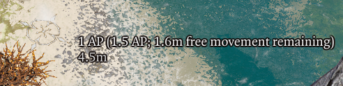

##### Quick Inventory
- Added a "Miscellaneous" filter, which currently shows books and keys
    - You may filter out read books and used keys

##### Codex
The Codex has received a new "Info" section, where textual information will be placed. Currently, it contains Epip changelogs; the previous UI for these has been removed. The "Epip has been updated" message box will now take you to this UI instead.


##### World Tooltips

- Added a filter for lights (torches, braziers, etc.)
- Added a filter for beds, within the same setting that filters chairs and doors

#### Fixes
- Fixed non-English languages still having gameplay mod string overrides
- Fixed an issue that was causing custom tooltips that were positioned near the mouse to "stick" to their initial place

#### Technical stuff

- Fixed `Library:Error()` erroring (lol)
- Codex's sidebar can now be extended by Sections
- Minor cleanups and annotation fixes
- ExtraData in Stats library is now parsed from mod files
- A few minor new calls were added to some libraries
- Choice settings no longer throw when an invalid value is set; this helps with migrating choice IDs of existing settings
- QuickInventory UI now has a RenderSettings event, solving the open-closed violation of the settings panel

##### Generic

- Added the AnchoredText prefab, which enables events when hovering or click text with `<a>` HTML tags
- `SettingWidgets` feature now supports setting descriptions as tooltips
- Passing `nil` to `SetTooltip()` is now supported, removing the tooltip properly
- Added a MouseMove event; this is spammy, so it is opt-in
- Added `Text:IsMouseWithinRange()` and `Text:IsMouseWithinKeyword()`
- Text prefab now inherits events from the element, and supports the `setSize` parameter
- Size overrides are now considered for GetRawWidth/GetRawHeight
    - The size overrides are getting a bit weird to handle, so this might change in the future
- Button prefab's Pressed event is now thrown after state changes
- Cleaned up the Text element, possibly improving preformance a tiny bit

### 5/08/23 beta upload

#### Changes & additions

- Added a setting to show surface tooltips above the hotbar UI, enabled by default
- When creating Hotbar Groups, the labels in the UI now use a black text color

#### Fixes

- Vanity: fixed transmogged armors showing up after the character's corpse was destroyed, which also lead to materials persisting on them
- Codex: fixed skills with a name that's not a string key being filtered out (ex. skills that had their name directly set in Lua)
- Fixed some artifacts having the wrong keywords declared in Epip (which affected Codex filtering), and added keywords to many artifacts which previously didn't have them
- Marked more scripts as EE-only
    - You should no longer see giftbag warnings if EE is not enabled

#### Technical stuff

- Minor annotation fixes for CombatLog
- Fixed some TooltipAdjustments TSKs being registered on the wrong library
- Added more DB methods to `Osiris`
- Updated the Osiris calls used by the StatsTab feature, hopefully removing all deprecation warnings

##### Generic

- Added more textures and button styles
- Texture: width and height overrides can be specified separately (ex. can pass `-1, 100` as params to `SetTexture()`)
- Fixed field visibility of `Stylable._Style` (now protected), added `GetStyles()`
- Added the `SlicedTexture` prefab, which will replace `TiledBackground` and `Divider`. Only a few textures are built-in for it right now

### 29/07/23 beta upload

#### Punisher
- Added voice acting, available for a limited time only as it hurts my throat to do such an edgy voice all the time

#### Custom Hotkeys
The custom hotkeys system has been reworked. They are now accessed via a tab within the Epip settings menu, rather than the game's controls menu. This will offer them more flexibility in the future.

You will have to reconfigure your previous bindings.

#### Quick Find
- Added a rarity filter
- Added a setting to close the UI when you click something in the world
- The close button now plays a sound when clicked
- Considerably improved performance once again

#### Other changes and additions
- The settings menu now has some margin on the leftmost labels of settings
- Slight performance improvements to the Codex
- Small (~5%) performance improvement to all Generic UIs (most custom Epip UIs)

#### Fixes
- Fixed Portable Respec Mirror hotbar action not working
- Fixed the Alternative Statuses Display showing up in the respec screen
- Fixed tooltips not being hidden if you exit the settings menu with escape key
- Fixed sliders in the settings menu not being vertically centered
- Fixed being able to scroll too far in Quick Find and the Codex if you go from having a lot of slots to only having a few
- Fixed massive FPS drops in the Epip settings menu

#### Technical stuff
- Added hooks to the Overhead UI
- Fixed cases of trying to fetch vanilla TSKs during module load
- Added vararg to all logging methods in Library/Feature
- Added `Feature:__Initialize()` as well as a hook for before/after it; this will be the intended moment to initialize feature fields from now on (for easier patching)
- Added `RegisterAction()` to HotbarActions to make it easier to use
- Extracted TSKs for HotbarActions
- Codex: added an interface for grid-like sections, reducing code duplication
- Moved some Generic classes to separate files, cleaned up annotations
- Fix a missing nil check in PersonalScripts
- Deprecated the `REQUIRED_MODS` field in Feature
- Added a Hook alias for Event; the previous Hook class is now LegacyHook
- Consolidated previous ViewportChanged events into a single one within Client

Generic:

- Changed layout to `fitVertical`
- Added support for capturing input events ("Iggy Events")
    - A more sophisticated system for creating navigation will be added in the future
- Added FormTextHolder prefab (for input settings menu)
- Added more width/height-related calls
- `SetPositionRelativeToParent()` now considers size overrides
- Fixed destroying children within containers for all remaining container types
    - Previously only Grid had this consideration, where in practice it was the only place it mattered, as it set the visibility of elements it positioned - which it no longer does either
- Improved `Text:GetTextSize()` accuracy yet again - all cases of short text being cropped horizontally should now be solved
- Fixed annotations for exposed Element methods
- Marked listeners as private methods
- Removed obsolete events
- Containers now use `GetWidth()`/`GetHeight()` to fetch element sizes, meaning they not only respect size overrides (which they already did) but also overrides of the function itself
    - Containers now override this to return the width/height of the visible content itself, rather than using the calculated flash values. This fixes the case of scrollbars being oversized

### 16/07/23 beta upload
This patch adds an Artifacts tab to the Codex.


Artifacts that you own (either equipped or in the party inventory, as item or rune) are highlighted. You may filter artifacts by their slot, associated keywords, as well as tier, if you're using Derpy's Artifact Tiers.

#### Other changes and additions

- Added Simplified Chinese localization by Ainsky
    - There are certain issues with this translation, however we have not been able to contact the author yet. Please join the `#epipeline` channel on the EE discord if you authored this translation.
- Enabled mouse controls when using controller
    - This enables you to use UIs that support mouse, such as custom Epip UIs, as well as some reused Larian KB+M UIs such as the player portraits
    - This prevents the mouse from being hidden while idle when using controller (might become a setting later)
- Custom tooltips from Epip UIs now work while using controller
- BH Overheads now show for characters near the camera point, rather than near your selected character
- Significantly reduced stutter from BH Overheads
- Significantly reduced stutter for Epip UIs that use inventory-like slots
    - The time to open Quick Find for the first time should be reduced by 30-35%
    - The Skills Codex should see similar improvement
- Source Infuse and Meditate keybinds are now only shown if EE is enabled

#### Fixes
- Fixed the tooltips for various world tooltip options misnaming the "Enable tooltips for all items" option
- Hotbar: fixed chain/unchain actions not working (beta issue)
- Fixed source infuse / meditate keybinds not working (beta issue)
- Examine Menu: fixed critical chance appearing in the wrong place for characters with many resistances
- Quick Examine: fixed resistances text getting cropped out if a character had too many of them
- Fixed the click sound for close buttons not playing in some custom UIs
- Fixed BH Overheads appearing over invisible enemies
- Fixed some sliders in the settings menu having their values cropped out until interacted with
- Fixed positioning of the "Alternative Status Display" when using controller

#### Technical stuff
- ArtifactLib: added `IsOwnedByParty()`, `HasKeyword()`, and missing VolatileArmor keyword tags to artifacts
- Added `Profiling` library as well as Feature integration. No GUI exists for this yet, results can only be viewed through the console command
- Added `EnabledFunctor` property to event options, letting listeners only fire conditionally
    - Feature has a method that returns such a functor which checks for `:IsEnabled()`
- Added `ObjectPool` data structure
- Fixed `Text.Round()` for negative values
- Added `Meditate` library (currently barebones, will aid in controller support later)
- Added `SourceInfusion.RequestInfuse()`
- Various annotation fixes, and purging of trailing whitespace
- Improved `Character.GetStatusesFromItems()`, now works with many more status sources (hopefully all)
- Fixed `Combat.GetCombatID()` on server
- Removed the extender IDE files from the project to fix issues with doc generation. In the future, Epip will get its own annotation generator to fix the many issues with the current one
- Improvements to the localization sheet (will be deployed the next time the sheet is updated):
    - Outdated translations will have their cell marked in red background color
    - Rows will be sorted by script and original text (alphabetically)

##### Generic
- Added custom tooltip support to elements, and fixed not being to replace an existing tooltip
- Added `Element:GetParent()` and `Element:GetChildren()`
- Added an experimental `VerticalList` prefab that reimplements the basic VerticalList element functionality.
    - Unfortunately the performance of this is at best tied with the element, but it can serve as an example of how to implement custom containers, should you need for example unusual element positioning.
- Manual `Destroy()` now makes table references unusable
- Fixed `Destroy()` not working properly for elements within `VerticalList`. The other containers will be fixed later.
- Fixed `Text:GetTextSize()`; the flash `textHeight` property was highly inaccurate; it seemingly considered the height as if the text had one more line than it actually did
- Added `Text:GetLineHeight()`
- Added more textures and icons - make sure to redownload the assets folder if you're using the unpacked mod
- The `Slot` element now has certain features such as cooldown animations disabled until they are needed. This signficantly improves performance when creating many slots
    - `HotbarSlot` prefab has been adjusted to support this

### 1/07/23 beta upload

This update adds the Codex UI, which will be an in-game knowledgebase for various topics. Currently it only features a Skills page that displays all player skills in the game, and allows for filtering and searching them. The default keybind for opening the Codex is ++lctrl+g++.


This page also serves as an alternative to the skillbook; you can drag skills out of it to memorize them and assign them to your hotbar.

In the future, you'll also be able to unmemorize and learn skills directly from it, if you have the skillbook.

#### Quick Inventory
- Added wand, bow and crossbow filters, which were missing by oversight
- Added sorting for consumables; order is:
    1. Scrolls
    2. Grenades
    3. Arrows
    4. Potions
    5. Food
    6. Drinks
- Fixed searching for resistances not working properly

#### Other Changes
- You can now change the layer of a hotbar group through their context menu
- Added a close button to the hotbar group creation/resize UIs
- Runes no longer show the confusing "Set :" prefix
    - This was previously only done for equipment
    - A setting to disable this tweak has also been added

#### Fixes
- Fixed TSKs from the gameplay mod still being in Epip; you will need to redownload the gameplay mod if you use it
- Slots within Epip UIs now only play a dragging sound if the slot is not empty
- Fixed some tooltip adjustments not working on tooltips created within Epip UIs
- Fixed Ambidextrous checks (again) which might've lead to incorrect hotbar behaviour with potions and scrolls
- Fixed the Debug Cheats menu showing the wrong talents for characters that weren't the active client character
- Fixed performance issues from the stats tab when picking up items

#### Technical Stuff

- Added a way to load lua scripts from a file defined in `Osiris Data/Epip/PersonalScripts.json`; this can be used to load test/debug scripts without needing to include them within the mod. See the `PersonalScripts` feature.
    - Removed various console commands as they are of no use other than personal
- Added `Texture` library, and support for its data structures for Generic
- Various annotation fixes and clean ups
- Added more methods to CombatLib and fixed `GetTurnOrder()`
- Moved Epip's Hotbar actions to a new feature
- Added `GetClassDefinition()` to OOP classes
- Choice settings's `SetValue()` now has validation
- Fixed registering TSKs with a StringKey
- `Library:RegisterTranslatedString()` now returns the TSK
- Fixed `OOP.IsClass()` throwing if the object was not a class
- Added the `Elementable` interface, which lets prefabs behave as if they were elements ("inheriting" Element's methods)
- `Stats.Get()` now allows type-capture
- Added `UI:ToggleVisibility()`
- Added some basic InputLib integration to Feature
- Added the `SettingsWidgets` feature, for rendering settings into Generic UIs as form elements
- Added the `SkillbookTemplates` feature, which lets you query item templates that have a SkillBook use action
- Fixed an error when hovering over a Status prefab whose status had expired

##### Generic
- Added the `Stylable` interface, for defining styles for customizing prefab appearances
- Added the `Button` prefab, which will replace the Button and StateButton elements. Its major advantage is support for styling, as well as the extendability and maintainability that comes from it being implemented in lua rather than flash.
- Various fixes to the Texture element
- Added `GetRawSize()` to some elements
- Fixed return values when calling exposed flash functions from lua
- Reworked CloseButton prefab to use the Button prefab
- Added focus-related events to Text element
- Added lots of UI textures and icons for use with Generic; see the `GenericUITextures` feature
- Added the `SearchBar` prefab

### 18/06/23 beta upload

This version adds an option to replace the status bar by your character's portraits with a new custom UI - see "Alternative status display" in Player Portrait settings.


This by default behaves mostly the same as the regular status bar, with the major exception being no animations for statuses being removed - they might be added if there is demand.

The major advantage of this new UI is status sorting, which was thought to be too difficulty to implement in Larian's UI. Right-click a status to set its sorting priority.


Statuses with a high priority show up in the leftmost position, while statuses with a low priority show up in the rightmost position. Statuses that are tied in priority show in order of application. **You may use this to position important or informational statuses (ex. Source Generation duration or tiered statuses) in a consistent position.**

You may also filter out statuses in this context menu to hide them. Holding shift will temporarily disable this filter, letting you quickly check your hidden statuses and unhide them if necessary. You may also manage this filter within the settings menu.

---

#### Other changes and additions

Added a new hotkey that will show BH over the heads of nearby characters while held ("Show B/H" binding; unbound by default):


---

Added an option to display common flags in the enemy health bar ("Display common flags" setting). It will display the following information (if applicable) while holding shift:

- Whether Comeback Kid is available
- Whether Attack of Opportunity is available
- Whether the character is flagged as incapable of joining combat
- The character's AI archetype (ranger, rogue, etc.)
- These flags are not shown if the character doesn't have them


---

Holding shift while looking at equipment tooltips will now display information about their EE gear modifiers, such as their tier. This display will be improved in the future to be more user-friendly.


---

Quick Find has received various improvements:

- Added a filter for Culled items
- Added a filter to hide equipped items
- The UI is now draggable (from the top area)
- The UI is now closed automatically when you drag an item into the Greatforge socket (which you can now do thanks to an extender fix)

---

You can now manually set an icon for an item with Vanity Transmog using the new "Set Icon" button. The "Keep Icon" toggle remains and works alongside it. This uses a new "Icon Picker" UI.


#### Other small changes

- Server-side animation cancelling now has special logic to handle some previously problematic skills
    - Projectile, Jump, MultiStrike, ProjectileStrike and Target skills now have special logic to handle cases like multi-projectile/hit skills
- "+X% Weapon Elemental Damage" tooltip now works for any deltamod that adds damage, not just ones from EE
- Hotbar groups can now be resized through their context menu - you can thank Cathe for that
- Changed hotbar slot requirement evaluation to use a new extender call, which should also make it compatible with mods using custom requirements
- Added a Gloves filter to Quick Find, which was previously missing (thanks Cathe)
- Reordered slot filters in Quick Find; armor goes first, then weapons/shield, then jewelry (thanks Cathe)
- Fixed a vanilla bug where undead characters would not see any armor restoration numbers over their head
- Added the `!rainbowoverlays` console command
- Cleaned up some scripting for the default crafting filter; as a side-effect you will have to reconfigure the setting

Fixes:

- Fixed a regression that caused EE to add permanent stats when using their dyes
    - You can use the `!fixdyestats` console command to remove these extra stats from your current active character; you'll need to run it once for each dye you applied
    - Reminder that Epip has a far more customizable dyes feature in the Vanity UI
- Fixed EE dyes being usable from Vanity even if the party didn't have them
- Fixed hotbar group slots having wrong element layering and all blinking while using any skill
- Fixed some hotbar inaccuracies when using Ambidextrous
- Fixed node stats in the stats tab not disappearing after being removed. This fix is retroactive.
- Fixed Inconspicuous being hidden while not using Derpy's Tweaks
- Fixed "Show loot drops in healthbar" feature possibly not working correctly with Derpy's changes
- Fixed a hotbar error if you unbound the vanilla hotkeys for vanilla actions (inventory, journal, map, etc.)
- Fixed an error when dealing damage through moving items

On the technical side:

- Added OverlayColorsBruteForcer feature, which as the name suggests helps with figuring out the usages of the 50 overlay colors in GlobalSwitches
- ColorLib now contains an enum of most overlay colors used by the game
- Fixed `Character.GetSkillState()` on server
- Added `Damage` library, currently only containing TSKs for damage types - will be used for hit/heal-related business later on
- Craft UI table now has the TSKs for item filters
- Ambidextrous check in `Item.CanUse()` should be more accurate now
- Added `Tick` event to GameStateLib
- Added `BatteredHarried.IsDisplayStatus()`, `Stats.GetStatusName()`, `Color.Lerp()`, `DeltaMods.GetItemDeltaMods()` and an item-only overload to `Item.IsEquipped()`
- Added SPIRIT_VISION icon to StatsLib
- SourceInfusionLib now holds Source Generation status IDs
- Fixed `Stats.GetStatusIcon()` for CONSUME statuses
- It's possible to now register TSKs post-init in features/libraries via `:RegisterTranslatedString()`
- Various annotation fixes, mostly to Stat entries
- Simplified `Client.IsInDialogue()` implementation
- UserVarsLib now supports default values for user and mod variables
- `Item.GetPartyTemplateCount()` now strips GUID prefixes
- Generic:
    - Added CloseButton and DraggingArea prefabs
    - `IggyIcon:SetIcon()` call is NOOP'd if there is no change in the icon setup (texture, width and height), which possibly increases performance in icon-heavy UIs
    - Fixed `Instance:Destroy()`
    - Status prefab now looks a lot closer to the statuses in Larian UIs
    - `IggyIcon:SetAlpha()` now supports `affectChildren` parameter

## v1065 - 07/05/23
Requires extender v59+.

!!! error "Standalone usage warning"
    **If you have the Improved Hotbar mod, you must disable it to use Epip**. All of its functions are already in Epip (+ like 9 months worth of updates that the workshop mod never got). See the [front page](index.md) and the [changelog](patchnotes.md) if you're new to Epip.

[Download here](https://drive.google.com/file/d/1NLEjkgnKlc6r4dDZw_AUHT1cdXVKhTmL/view?usp=sharing).

With this version, EE has been removed as a dependency. It's now possible to use Epip in a non-EE playthrough and the main features will work. There may be quirks that need ironing out, ex. references to features or settings that only make sense in EE - please report these.

This also means that the remaining gameplay changes have been removed. If you wish to keep them, use [this mod](https://drive.google.com/file/d/1HqxEzlXaZa4AMRpCybDPvZ2IyFjAL0J0/view?usp=sharing).

The following patchnotes are the merged patchnotes of all beta versions of the patch, excluding the April Fools one.

By the way, due to logistics changes, you will have to re-enable immersive meditation in the settings, if you had it on.

- Animation cancelling now has 2 modes: client-side (v1065 behaviour) and server-side (old behaviour). The server-side option uses the lower delay that was used previously.
- Changed how hotbar row count and visibility is saved
    - This might not work in multiplayer due to extender shenanigans
- Custom status UI elements are now bigger (ex. in Quick Examine)
- Added a new rune crafting system; simply right-click a rune material and select the new option in the dropdown menu to get started.
- Reworked the stats tab; should be less prone to bugging out in multiplayer now
    - Also fixed the gold & splinter stat
- The incompatible mods warnings now show on every load, rather than once per playthrough
- Updated localizations and added Brazilian Portuguese, translated by Ferocidade
- Character sheet skew during anniversaries is now less extreme
- Removed the "cinematic combat" option

Fixes:

- Fixed some log spam related to status icons
- Fixed hotbar loadouts not working
- Non-english languages should no longer have broken artifact descriptions
    - The cause was fetching the TSKs during module load, which causes a bug that overwrites the string.
- Fixed Quick Examine not being openable for the same character twice in a row
- Fixed vanity dyes not applying to slots that vanilla armor (without transmog) would hide/mask
- Fixed error if an item was transmogged into a template that no longer existed
- Fixed a typo in the settings to fix Astrologer's Gaze tooltip


On the technical side of things:

- Added `ActionReleased` event to Input library
- Added `GetIcon()` to BatteredHarried library
- Added `GetLevelID()` to Entity library
- Largely decoupled the logic for custom keybinds away from the UI itself (onto InputLib)
- Added `EpicEncounters.DeltaMods` library with dynamically-generated data about EE deltamods
- Added DragDropStateChanged event to Pointer lib
- Equipped artifacts are now tracked using UserVars instead of tags
- Generic:
    - Added `RepositionElements()` to Grid
    - Added `Destroy()` to UI instances
- Fixes and additions to PlayerInfo methods
- Moved various functionality from Feature up to its parent class Library (UserVars, ModVars)
- Fixed some warning spam related to status icons
- Various new checks to disable EE features when playing vanilla
- Fixed setting ID conflict issues in the settings menu
- Various fixes to debug cheats
- Reworked the doc generation script again; the doc appearance has changed considerably, and now supports hotlinking to functions
- Added support for multiple inheritance to classes made with the OOP library
- Generic UIs can be fetched by string ID now (oops)
- Added `Character.Events.ItemEquipped`
- Updated the Generic example script and documentation
- Net payloads now have methods to fetch the associated character and/or item
- Added `Osiris.GetFirstFact()`
- Added new calls to CharacterLib: `IsOrigin()`, `IsPlayer()`
- Small changes to annotations and rewrites of code that was using deprecated stuff
- Began work on a new cheats system and UI
- Added `Client.IsCursorOverUI()` and `Client.GetActiveUI()`
- Added `Input.IsTextFieldFocused()`
- Added skillstate-related methods to CharacterLib
- Reworked hotbar prepared/casting skill checks to not require server information
- Added `Client.Events.SkillStateChanged`


## v1064 - 05/03/23
[Download here](https://drive.google.com/file/d/1ni4yRX1TTPHxrqZ0mhbrimyFGXkdZsPL/view?usp=share_link).

Requires extender v58+.

Quick Examine improvements:

- Added display for AP, SP, and initiative
- Added resistances display
- Added numerous settings: opacity, width/height, hiding certain widgets. You can find them in a new tab in the settings menu
- Minor graphical touch-ups
- Added a setting to set the default position of the UI; this position will be used after reloading
- Added a statuses bar (toggleable)
- Added a light stroke to the resistances text
- Added a B/H display, with buffered damage towards the next stack
- Now shows your ally's skills and their cooldowns
	- Tooltips will show the damage as if they were used by them, but Epip features (like viewing which source infusions are available) likely do not work properly currently


- Reworked the settings menu and underlying system
	- Your previous setting values will be lost
	- The settings menu is now separate from the vanilla UI, prevent conflicts with mods that may overwrite the vanilla one
	- Settings have been reorganized into separate tabs
	- Settings are now saved per-profile, in `Osiris Data/Epip/{profile GUID}/`
    - In the settings menu, the current tab's button is now highlighted (replicating vanilla behaviour)
    - Reworked the settings menu to be more easily expandable and changed the appearance of settings
        - Tabs with a large amount of options (ex. Epic Enemies) might suffer stutters while opening them, similar to Quick Find. This is an issue with the UI framework that will be investigated later.

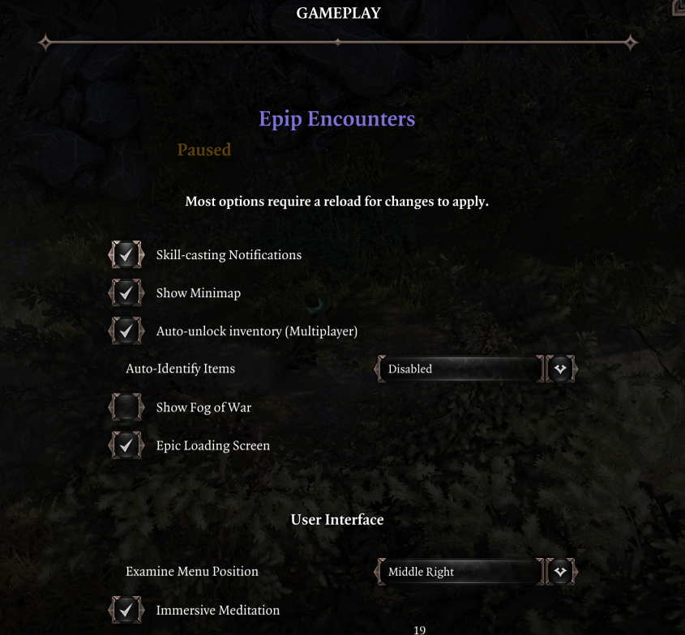

- Added a new UI that shows a filtered view of the party inventory
	- Opened with Ctrl+F by default (configurable in input menu)
	- Can filter equipment by slot, consumables by scrolls/grenades/potions, and skillbooks by school
    - Weapons and armor can be filtered by type (ex. sword, leather armor...)
	- Equipment can be searched by their stat boosts (supports only vanilla modifiers for now)
	- Right-click an equipped item to open the UI with filters set to that item's slot, to quickly replace gear

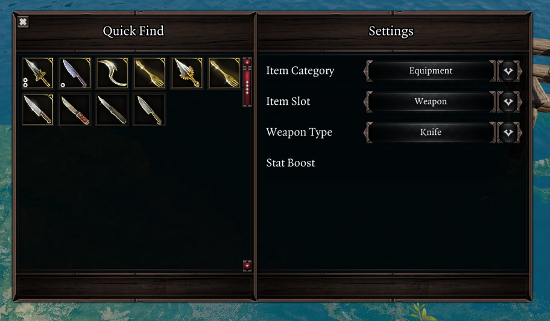

- Vanity internals have been reworked, with multiple changes as a result:
	- Dyes no longer require deltamods and thus should no longer be lost to shenanigans or bloat the savefile
	- Transmogrifying no longer requires the item to be transformed and therefore should no longer have any gameplay side effects
		- As a result, you are no longer prevented from transmogrifying GB5 sets
	- Transmogrifying weapons into another type (ex. dagger -> bow) will have them show in the proper location while sheathed
	- Added an option to keep the icon while transmogrifying
	- Fixed an issue with dyes not being loaded properly from oufits
	- Added an option to hide any armor slot's visuals
		- Due to an engine quirk, changing visibility is not properly reflected in the character sheet until you switch characters
    - Removed support for vanity dyes from before v1063; items still using them will appear purple
    - Added an "Auras" tab to Vanity, where you can apply visual effects to your character, onto various bones

- Added an option for animation-cancelling for player characters
    - A new setting exists to blacklist skills from being affected. A more user-friendly way of adding entries will be added in a future version
- Added a setting that controls how character level is displayed in the health bar; defaults to current behaviour (below bar, when holding shift). Includes the option to hide the level entirely.
- Reworked the "show minimap" setting; should be more reliable now
- You can now drag + drop items onto the Greatforge socket
- "Status effects" in the vanilla examine UI is now capitalized, for consistency with the rest of the headers
- Began removing gameplay changes from original versions of Epip. Since the focus of the mod has changed over to UI and QoL, gameplay changes no longer make sense within the project, and impede it from being used without EE.
	- Removed changes to Battle Stomp, Bless, Circle of Protection, Escapist, Siphon Poison, Summon Soul Wolf, Wolf Howl, Break the Shackles
	- Removed changes to Elementalist damage
	- Removed changes to Leper
	- Reverted stat changes to Boneshaped Crusher and Soul Wolf
	- Removed Sight and Hearing FlexStat entries
- Clicking a status on a player portrait or Quick Examine will now center the camera on the status's source (if any)
- "Copy identifier" keybind no longer copies template GUID
- Added Russian translation by Cathe & JoienReid
	- Currently only spans the settings menu and some vanity features
	- Since playing in non-English currently has certain issues with add-ons, a new setting has been added to display text from Epip in a language different than the game's.
- Level-up progress in character sheet is now shown with a percentage
- Added settings for disabling most of the tooltip adjustments Epip offers
- Surface tooltips should be more reliable
- Combat log improvements are now enabled by default
- Enemy health bar now uses a vanilla-ish appearance if EE is disabled (no fancy gargoyle boss frame)
- B/H indicators in player portraits are now only shown in combat (instead of when unsheathed) and are disabled if EE is disabled
- Removed the meme loading screen option
- Skill tooltips for zone-type skills no longer erroneously say their range is increased by Astrologer's Gaze

Fixes:

- Fixed icons on the minimap flickering
- Fixed layouts being saved for summons and party followers
- Layouts should now be synchronized better in multiplayer, and survive a lua reset
- Layouts now save when the pause menu is opened, rather than when the game is paused (which basically never happens in multiplayer)
	- There's probably a dozen other features that made this mistake; they will be fixed in the future
- Fixed the "points available" blip in the character sheet not being hidden when within vanity, if you had a lot of tabs registered
- Fixed the draggable area of Quick Examine being smaller than intended
- Fixed QuickExamine not being draggable all the way to the right of the screen
- Fixed the "Epip Settings" button not appearing on all tabs of the vanilla settings menu
- Fixed Trickster's Repertoire unsneaking characters that do not have the talent
- Fixed developer-only settings being visible outside of developer mode
- Hotbar: fixed hotkeys settings being deleted in some cases
- Disabled the save/load improvements during game over to fix a softlock (no known workaround)
- Fixed tooltips of player portraits and XP bar not working properly
	- Due to engine jank, these will not be affected by the delay settings
- Fixed engine actions (attack, flee, etc.) being draggable to hotbar hotkeys
- Fixed some small visual bugs with the enemy health bar
- Fixed some small visual issues with custom item slots in UIs
- Fixed some console log spam
- Fixed hit chance not displaying when hovering over characters in combat
- Fixed some items being grayed out in hotbar groups
- Fixed "immersive meditation" and other EE UI features not working for characters that have been transformed
- Fixed unique items being dismantle-able with "mass dismantle"
- Fixed item context menus being misreported as character menus if you hovered over a character recently
	- Possibly fixes the issue of options like "mass dismantle" not appearing
- The "infinite carry weight setting" should now work properly for clients that join mid-session
	- Other features that face problems in multiplayer are possibly suffering from the same bug and will be fixed in the future
- Fixed transmogged helmets not being toggleable from the character sheet UI
- Fixed "revert appearance" in vanity not working properly

On the technical side of things:

- Added an `Image` library with PNG decoding
- Added ImageViewer feature, intended for displaying results of images decoded with `Image`
- Improved reliability of `Client.GetMousePosition()` (replaced with Ext implementation)
- Added a Set data structure
- Added `Vector.ScalarProduct()`
- Added a `Color` element to Generic
- Added `ClearElements()` to Generic's Grid
- Added `SetVisible()` to Generic elements
- Added `Set` and `Map` settings types
- Added a debug hotkey for copying the pointer's world position
- Added a `Interfaces` library for common interfaces
- Generic: fixed ScrollList not supporting centering of elements
- Generic: added LabelledIcon prefab
- QuickExamine: added Widget interface
- StatsLib: added data of immunites
- TooltipLib: added support for status tooltips
- QuickExamine: split up some parts of BasicInfo into separate widgets
- Generic: fix downsizing IggyIcon
- Generic: added a Status prefab, for displaying status effects
- TooltipLib: added `ShowStatusTooltip()`
- Moved various functionality from EnemyHealthBar to a feature (EnemyHealthBarExtraInfo)
- Fixed TextLib's Format() not accepting decimal text sizes
- Added a setting to simulate EE being disabled (applies to Epip scripts only)
- Removed checks for Improved Hotbar mod
- Added an event for statuses being applied to CharacterLib
- Added a feature to generate Osiris event annotations for lua
	- The IDE annotations folder in Epip has been updated to include them
	- This might be expanded to support PROCs and QRYs later
- Added an OOP library for working with classes
	- Feature now supports registering and fetching class tables in an elegant manner
- Started splitting up Feature into 2 classes to fix interface segregation violation
- Fixed OsirisLib calls not working with 0 parameters
- Various script cleanups (mostly for Hotbar and EnemyHealthBar)
- Added TSKs for older settings
- Changed TSK integration in Feature: the keys are no longer required to be a handle; they can be any string, letting you index the TranslatedStrings table with auto-completion
	- TSK objects now have a GetString() method to resolve them
	- `TSK` table within Feature will be deprecated soon
- Added a feature to play client-side effects upon hovering over entities
- Added libraries for EE-related mechanics (BatteredHarried, SourceInfusion), and moved relevant methods to them
- Fixed `Character.GetEquippedItems()` not returning the advertised type
- Added a DatabaseSync feature for synchronizing database contents to the client
	- Might be merged into the osiris library in the future
- Added a UserVars library, with Feature integration
- Added support for function signatures without bodies to the doc generator, fixed subclasses not being detected properly
- Added methods related to drag-drop to PointerLib
- Generic:
	- Moved annotations to separate file, solving various IDE warnings
	- Added support for tweening
- Fixed Stats.MeetsRequirements() not working with attribute requirements
- Added `ShowItemTooltip()` to Tooltip lib
- Generic:
	- The HotbarSlot prefab is a now more general-purpose inventory-like slot, showing rarity, rune slots, and with options to block drag-and-drop
	- Fixed culling issues with IggyIcon
	- Added support for scrollRects
	- ComboBox events now throw their option ID instead of just index
	- Added SetChildIndex()
- Removed swf overrides for `textDisplay` and `notification` UIs, as well as cleaned up their respective lua scripts
- Fixed error messages from using keys the game doesn't support (ex. media keys)
- Added annotations for basic stats objects
- Added `AMER_Loot_CallistoAnomaly` icon - special thanks to Elric
- Fixed UserVars not synchronizing
- Fixed `GameState.IsLoading()` not working
- Various changes to annotations
- Features can now declare which game states they should be enabled with, which will cause `:IsEnabled()` to return `false` under unsupported states
- Rewrote `Osiris` table. Tuples returned from DB queries are now an object and it's possible to distinguish DBs/QRYs with the same name but different arity
- Rewrote `Item.GetEquipmentSubtype()` to be a lot more reliable, and fixed it failing to identify clubs
- Generic: added the Texture element
- Generic: added more prefabs for "form elements", and added inheritance to them
- Unsubscribing event listeners with an ID that is not subscribed no longer triggers a warning
- Added IDE annotations for the global Ext functions (like `_C()`)
- Added a "DefaultTable" data structure (inspired by python's defaultdict; a table with a default value when indexing)
- Removed UI override for the settings menu (LeaderLib menu might work now? no promises)
- Debug menu now supports fiddling with the UI scripts to an extent
- Osiris table now parses parameters for DB set/delete operations
- InputLib: added methods to fetch game input event definitions and bindings
	- The ancient script previously used to do this has been removed, along with some other redundant ones
- Improvements to the doc generation script (which shall debut here soon); it can now export "subclasses" of a class (the auxiliary data structs)
- Added a generic developer input binding for hooking quick tests onto it
- TooltipLib: added a way to render custom formatted tooltips
- TooltipLib: added a method to render skill tooltips, as if the engine were doing it
- Minor cleanups of some scripts
- Fixed iggy icons in Slot elements being culled out for Generic UIs
- Added methods to check if a component is an item/char to EntityLib
- You can now specify a player index when using methods in PointerLib (though I do not know in which scenario multiple pointers can exist; splitscreen co-op perhaps?)
- The localization system now supports contextual metadata for ease of translation, and integration for it has been added to the Feature table
	- You can define TSKs in `TranslatedStrings` and query them by indexing `TSK` within the feature
	- TSKs defined this way support aliases that are valid only within the context of the feature, preventing collisions
- Added a python script to import/export Epip translation files in `Mods\EpipEncounters_7d32cb52-1cfd-4526-9b84-db4867bf9356\Story\RawFiles\Python\localization.py`
- Added `GetTurnOrder()` to Combat library
- Added `Client.WorldPositionToScreen()`

Improvements to doc generator script:

- Added support for net messages
- Better support for hooks/events
- Private methods are now hidden
- Symbols are now sorted by context (first Shared, then Client, then Server)
- Can now be used externally (importable)
- Added support for overloads

## v1063 - 19/09/22

- If "Unfocus after sending messages" is enabled, holding shift while sending a chat message will keep the chat focused
- Fixed settings not saving if you didn't visit the camera settings tab

On the technical side of things:

- Added operator overload annotations for `RGBColor`, `Vector`
- `Vector.Create()` accepts an existing array as a parameter (only one)
- Added TSK-related methods to `Text`
    - This includes a localization system for strings in scripts; you can generate templates for localizing with `Text.GenerateLocalizationTemplate()` and they will be loaded from `Mods/MyMod_MyGuid/Localization/Epip/MyTargetLanguage/ModTable.json`, where `ModTable` is the mod table whose strings you've localized using the template
        - Support for this within Epip will be added throughout future updates; currently only some camera settings support this
    - You can generate fresh GUIDs or TSK handles with `!guid` and `!tskhandle` commands (on client context); they'll be copied to the clipboard

## v1062 - 16/09/22

- Surface tooltips with an owner now show a hint regarding how the damage scales
- "Active Defense" statuses (ex. Empyrean Tears) now show remaining charges
- EE rune materials now show how to use them to craft runes
- Added a setting to configure the delay of simple tooltips appearing
    - This affects tooltips of items in the world, as well as label tooltips in UIs (these 2 types are individually configurable)
- Added a settings tab for camera settings
    - You can change the maximum zoom out distance, as well as the view angles
- Items in the quest reward screen now show a hint regarding modifier generation
- Added new Greatforge graphics for Engrave - special thanks to Cathe and Elric!
- Fixed a vanilla bug with the character sheet that caused the second ring slot to not play equip animations
    - Additionally, the graphics involved should now be better centered
- Re-added the option to auto-unlock inventories
    - Changing the lock status should also be synched better now - the vanilla game seems to struggle with this leading to the changes often not being properly reflected in other player's UIs
- Fixed weapon range deltamods only considering the first deltamod of that kind found
    - This same fix is applied for weapon elemental damage mods as well

On the technical side of things:

- Replaced `Client.GetCharacter()` implementation with a new one from v57 that doesn't rely on any UIs. **Let me know if something character-involved breaks as a result** (though I haven't experienced any difference).
- Added a Camera library
- Added an Entity library, with shorthands for GetGameObject() and functions to get all characters/items on a level
- Added limited alpha support to RGBColor (I don't think alpha is used anywhere in scripting though)
- `Item.GetIcon()` is now fully reimplemented following engine code
- Stats library now also holds dynamically generated data of runes, except framed ones
- Tooltip library now supports item tooltips and simple tooltips (the usual `showTooltip` call), and offers additional contextual data (ex. skill ID for skill tooltips)
- Started work on a new UI-independent settings library with per-profile settings support; not yet used

## v1061 - 4/09/22

- Added new settings for world item tooltips:
    - Emphasizing containers, consumables and/or equipment by changing their color
        - This setting will not work for items that would result in a crime upon interaction; they will remain red.
    - Enabling world tooltips for all items (similar to the "Let there be tooltips" mod)
    - Filtering out clutter (particularly the one added by the setting above): chairs, doors, non-interactable items
    - Option to open containers upon clicking their tooltip, rather than picking them up

- Added an option to exit the chat UI after sending a message (so you don't need to press escape manually)
- Added an option to disable notifications for sharing civils ("X shares Loremaster/LC with Z")
- Searching saves is now case-insensitive
- Added a ping counter to the debug display
    - Since the server only responds to net messages once per game tick, the counter will basically always show around 33ms in singleplayer

- Fixed "Show empty containers/bodies" not actually working on items
- Fixed another case of an infinite loop of switching characters
- Fixed the "toggle world tooltips" keybind not working (+ crashing the game)
- Fixed some character sheet tooltips appearing in the vanity UI

On the technical side of things:

- Osiris library now converts boolean values to integer in calls
- Added `HasFlag()`, `IsContainer()` to Item library
- Added initial groundwork for an inventory expansion

## v1060 - 3/09/22

- Added a better frame for the hotbar health bar, and shadows for the AP bar (thanks Elric)
- Added a keybind to bring up the examine UI (the real one)
- Added all engine actions (the ones you see in the controller UI) to the hotbar actions drawer (the vanilla one, bound to `X`), except for flee
- Reordered some keybindings
- Added "Let there be tooltips" to the list of EE-incompatible mods
- Fixed character-specific context menus appearing on items
- Fixed the save/load overlay not disappearing in multiplayer when the UI is closed
- Fixed a possible edge case with walking over corpses in combat that would result in the corpse not being lootable after combat
- Fixed the dragging area for the debug display being too large
- Fixed an issue with character control switching rapidly
- Fixed hotbar tooltips not showing keybinds
- Removed the "Special Binding 1 & 2" keys since they are no longer used

On the technical side of things:

- Added data for all InputEvents to `Input` as well as possibly the world's biggest alias
- Added an `IO` table
- Began modernizing the context menu APIs
- Added a Pointer library, currently deals only with `Ext.UI.GetPickingState()`-related matters
- Added `table.lua` and `math.lua` containing the extensions to the respective built-in tables
- RGBColor creation now clamps the color values
- Implemented __eq, __add and __sub for RGBColor
- Various fixes for outdated/clashing IDE class names
- Fixed an infinite loop when using the default buttons for `MessageBox`
- Added a table for `combatTurn` UI
    - Unfortunately this UI does not appear to hold any character handles, making it not very useful.

## v1059 - 29/08/22

- Fixed an issue with using items in hotbar groups after reloading
- Fixed item amounts displaying incorrectly in hotbar groups
- Fixed an issue with the unlearn skills prompt appearing while the UI is closed

On the technical side of things:

- Added "Actions" (ground attack, sheathe/unsheathe, etc.) to the Stats library

## v1058 - 29/08/22

Versions from this one onwards require extender v57.

New features:

- Consumables like food and mushrooms now show their effects by default; there's no need to eat them once for them to appear in the tooltip
- Added a setting to enable infinite carry weight
- You can now right-click skills in the skillbook while out of combat to unlearn them
- Added a keybind to toggle world item tooltips (so you don't need to hold the alt key)
- Surface tooltips now show their owner (who the surface damage scales from and who owns its applied statuses)
- Added a setting to disable the "Item Received" notifications
- Added a setting to allow viewing the character sheet while in the quest rewards UI; this lets you compare your equipped items with the rewards.
- Vanity: transmog and dyes no longer require items to be re-equipped, making it overall faster to try on different looks
- Added an option to hide empty corpses/containers from the world item tooltips (the ones that appear from the alt key)
- Added a setting to allow you to walk *onto* corpses while in combat without looting them. You may still loot them while holding shift. This setting is enabled by default.
- The fix to character control being lost upon creating new summons now also applies to having your summons be killed
- Added an option to play a sound effect when a chat message is received, so they're easier to notice
- Empowering items now properly scales their armor values, but this will only take effect after a reload
- Fixed the vanilla bug that prevented you from using items in certain conditions if you had +AP Cost effects 
- Added a keybind to scroll the fancy item/skill tooltips
- ACTIVE_DEFENSE statuses (ex. Empyrean Tears) now show max charges in the tooltip
- Holding shift while moving in combat now shows approximate decimal AP costs
- Status tooltips now show if they were applied by an equipped item
- Fixed the tooltip color for effects that alter AP costs. They now display in green if they reduce AP costs, and red if they increase them.
- The custom input menu has been reworked to use new extender tech; all keys supported by the game are now bindable, including modifier keys like alt/ctrl. Your previous bindings will be wiped upon updating.
- Added new modifier keys to cycle bars on the hotbar: ctrl cycles 3rd bar (from bottom), alt cycles 4th one, gui (Windows key) cycles 5th one
- Added an "Engrave" option to the Greatforge which lets you rename items. This is purely visual.
    - It does not currently have a custom graphic. It will appear as another "Drill Sockets" in the Greatforge wheel.
- Minor visual adjustments to QuickExamine
- The Epip settings menu is slightly more organized now
- Added more mods to the incompatible mods warning: DU, Greed, Multihotbars

Hotbar:

- Slots can no longer be used while holding modifier keys. This means you can use shift/ctrl/alt + number keys as a custom keybind without it interfering with the hotbar.
- Fixed loadouts not saving empty gaps inbetween slots
- You can't cycle hidden bars anymore
- Added custom slot groups. Right-click a row on the hotbar to create one. These are shared across all your characters. Right-click them to delete them. Known issues:
    - Items there do not display tooltips yet

Fixes:

- Fixed tooltips for Vanity tabs
- Fixed negative status effects displaying wrong ever since GB5
- Epip's artifact tooltips (in Quick Examine, stats tab, etc.) now have a period at the end of them
- Hotkey to exit Meditate is now escape, instead of escape / right-click.
- Fixed action names on the hotbar buttons
- Fixed some character sheet tooltips appearing while in the Vanity menu

Stuff for developer mode:

- Added a keybind to copy identifiers (GUID for chars/items, stat ID for skills) of the object over your mouse
- Added a settings menu to change Data.txt values ingame. Most of them apply instantly / upon character stat recalculation, but some may require a session reload.
- Talents show their IDs in tooltips
- The cheats context menu now lets you add talents
- Added an option to enable a widget that shows FPS, TPS, and relevant mod versions
- Added a keybind to open a debug menu from which you can toggle debug mode on features, disable them (or their logging), and run tests (a new feature of the Feature table)

On the technical side of things:

- Osiris library now supports built-in symbols (calls and queries) and extender objects are converted to their GUID when being passed
- Added a Vector library (with some cool arithmetic operator overloads)
- Added a new tooltip library (WIP), advantage include preventing tooltips and manipulating surface tooltips, viewing source UI of a tooltip
- SubscribableEvent nodes can now be removed based on a predicate function, and preventable events are supported
- Fixed some log spam related to the hotbar
- Added groundwork for the Epip Housing(TM) feature
- Slight modernization to Net library: the payload is now passed as the first parameter, and IDE hints are available by defining the net msg as a class with the payload's table fields
- Timer lib is now available on the server, and a tick-based timer option has been added, as well as option to repeat / pause them
- Added a better coroutine table with sleeping (either for X seconds, or until a condition is met)
- Added a new Epip.RegisterFeature() call which can keep track of the source mod of a feature
- Added a new Input library using v57 RawInput
- Added more hooks to CharacterSheet UI in preparations for custom talents 2.0 (and other stats)
- Added ExtraData tables to Stats library
- Added PartyInventory hooks
- Removed numerous archaic/unused scripts, like the custom talents ones
- GenericUI:
    - Added more bg options for TiledBackground
    - Added new elements: Slider, Grid
    - Events now have proper IDE support, and no more issues with inheritance
    - Element creation now has proper IDE support, if you instantiate elements using their class name
    - Added more position-related calls
    - Element visuals now use string IDs, and unused visuals are set off-stage (less possibility for jank)
    - Fixed button size issues
    - Removed minimum size for black background
    - Fixed stack overflow issue with lists
    - Added support for skill tooltips
    - Fixed issues with MouseUp on the slot element
    - Changed mouse events to use the roll ones
    - Added proper support for prefabs, with the following implemented:
        - Spinner
        - Text (offers simpler initialization of Text elements)
        - HotbarSlot (with many improvements to bring it closer to hotbar behavior)
        - FormHorizontalList
        - LabelledCheckbox
        - LabelledDropdown
        - LabelledTextField

## v1057 - 26/07/22

- Fixed the annoying issue of control being switched to new summons in combat while it's still your turn
- Crafting UI now remembers your last tab (equipment/consumables etc.)
- Added a setting to set the default tab for the crafting UI
- The hotbar now shows a warning for unmemorized skills, as well as skills from items that have been unequipped
- Fixed some changelogs ingame not showing up
- Added an option to enable some improvements to the save/load menu: alphabetical sorting and search. The search bar supports lua patterns and is case-sensitive

On the technical side of things:

- The hotbar updates periodically again to fix some issues, and should no longer break completely when a single slot/action fails to render

## v1056 - 22/07/22

- Stats Tab:
    - Added Voracity stats
    - Added Artifacts
- Quick Examine now shows Artifacts for your allies as well (useful in multiplayer)
- Vanity: added support for "Visitors from Cyseal" mod, though the mod currently appears to have some issue with replacing some item icons
- Fixed a freeze with Immersive Meditation
- Fixed another grey out issue with the hotbar (skills with weapon damage but no weapon requirement)
- Fixed the category weight sliders in Epic Enemies not being saved
- Fixed the "Show Minimap" option appearing twice in the options menu
- Fixed some issues with controllers
- Skills show their IDs in tooltips in developer mode

On the technical side of things:

- Added `StopPropagation()` to the new event table
- Added a wrapper for checking developer mode, with an option to use an additional check; WIP and testing features will be locked behind it, meaning the rest of the features (like the cheats menu) can be used without problems
- Added a few new utility methods
- Started work on further giga brain hotbar improvements

## v1055 - 20/07/22

- Added an option to reduce the opacity of the player status bars while in combat
- Vanity UI now closes when you go into combat
- Status tooltips now show source (if it's a character)
- Re-added the hotbar actions drawer (the one with force-attack / sheathe / sneak)
- Added a Vanity action to the hotbar
- Added new Combat Log filters: critical hits and dodge
- Status tooltips now show ID and Type while in developer mode
- Added embodiments to the stats tab
- Read books and used keys now show a label in their tooltip (not retroactive)
- Fixed Max SP check being inaccurate on the enemy health bar
- Added new divider sprites for the player health bar
- Player health bar now shows maximum SP, and the SP counters are centered
- Fix item use cost not being considered while greying out slots on the hotbar
- Fixed consumable items not greying out properly in the hotbar
- Fixed hotbar issues with Luminary, Musketeer mods
- Temorarily removed the option to auto-unlock party inventories due to crashes in v56 from sync rewrites

On the technical side of things:

- Removed more log spam from Hotbar/Input
- Moved a bunch of tables around, removed archaic scripts/global functions
- Added some Larian colors to the `Color` table
- Added an icons enum to `Hotbar`
- More work on the new UI system: event listeners, Slot element
- Added `GetExtType()` for checking the type of an extender object
- Added `GameState` table
- Started transitioning to using a better event system, using a modification of the v56 SubscribableEvent table
- Updated IDE helper files

## v1054 - 13/07/22

- Added a "Quick Examine" UI. Currently it only shows the Epic Enemies perks characters that have them. It is invoked by a keybind while hovering over a character; default is `v`.
    - You may use the lock button to prevent its selected character from changing whenever you hover over a new one; if you do that, you will need to press the keybinding manually to change targets.
	- You can drag the UI around by holding down left click on the upper part (the one with the character name)
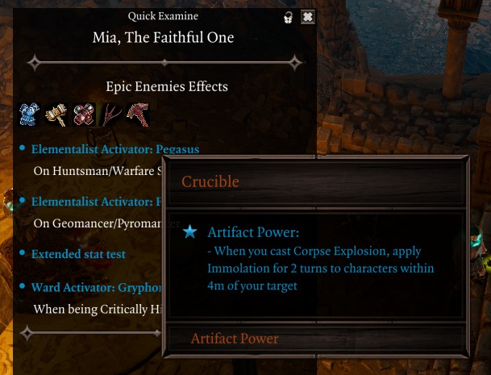

- Artifact powers in Epic Enemies now have descriptions
- Hotbar now greys out unusable item skills (ex. arrows)
- Switching characters or clicking slots on the hotbar now attempts to fix desync issues (the one where your clicks go to the wrong rows)
- Fixed a freeze when using a controller
- Temporarily removed the Awesome Soccer minigame

On the technical side of things:

- Added a new lua-based UI system; currently supports backgrounds, text, buttons, state buttons, the common list types (vertical, horizontal, scrolling), dividers, and icons

## v1053 - 07/07/22

- Added an option to show aggro effects on the top health bar: taunt source/target as well as AI preference tags
- Centered the AP orbs on the bottom health bar, and added special dividers every 4 AP
- Pipmode no longer gives infinite AP to non-player characters
- Added a cheat to apply statuses
- Reworded +elemental damage tooltips on weapons
- Fixed offhand items not auto-transmogging properly
- Fixed some summons still getting Epic Enemies perks, as well as party followers
- Fixed skills that require shield not being greyed out while muted

Hotbar:

- Loadouts are now sorted alphabetically
- Added a setting for disabling slots while casting
- Fixed occasional flashing for slots on cooldown
- Fixed hotkeys being blocked if any controlled char is in dialogue

On the technical side of things:

- Added better annotations for UI/Feature tables (works with inheritance now)
- Added wrapper calls to get/set stats regardless of whether they're actual stat objects or the special types (DeltaMod, TreasureTable, etc.)
- Moved `RemoveTrailingZeros()` to `Text`
- Reduced some extender log spam from stats
- Fixed warning spam when enemies were preparing skills

## v1052 - 05/07/22

Epic Enemies:

- Reworked the Epic Enemies feature. It is now configured through the regular settings menu, not the EE one. If you're continuing an old save, the options in your EE menu will remain, but they will no longer do anything.
    - The amount of effects enemies gain is now customizable
    - The weighted chance of each perk appearing can be customized individually - it's also possible to adjust the chances for whole groups of effects at once (ex. all Centurion effects)
    - All artifacts can now be made available to enemies
    - Effects with conditional activations are supported, and can grant a variety of other perks (statuses, stats, summons, etc.) though there are no new effects that use this yet - new content will be added soon

Hotbar:

- The "active skill" animation on the hotbar should be more reliable now (and no longer appears if you click spells in the spellbook)
- Fixed shield skills not greying out when disarmed

On the technical side of things:

- Removed the infamous empty net script
- Cleaned up script loading on the server
- Generated new IDE helpers for built-in v56 types
- OptionsSettings UI now has less thicc text labels so you can actually write stuff there without taking up the whole screen

Known issues:

- Artifact effects in Epic Enemies have no descriptions (text keys are really unreliable apparently)
- Switching tabs in the Epic Enemies settings menu scrolls you to the top
- Epic Enemies no longer gives extra Predator range

## v1051 - 28/06/22

Small bug fixes, and a moderate QoL addition for vanity dyes.

- Added Ctrl+C/V support to the dye tab text fields
- Fixed Epic Enemies tooltip (thanks Pancarte)
- Fixed outfits ignoring transmog restrictions
- Fixed vanity dye slider text values sometimes not moving around
- Fixed items transmogged into artifacts gaining the special tooltip color (this will require an EE Core update to fully work)

On the technical side of things:

- Cleaned up `MessageBox`

## v1050 - 26/06/22

A small assortment of huge vanity improvements!

Vanity:

- Added a button to delete custom dyes
- Switching characters no longer closes the UI
- The current tab is remembered when switching items through the context menu
- Added a toggle to prevent the sliders from being set to the item's current color (makes it easier to reuse a dye on multiple items)
- Added fields to enter colors in hexadecimal
- Added buttons to copy/paste colors
- Added buttons to import/export dyes to/from the clipboard
- Sliders can now detect the default color of an item that hasn't been dyed before
- Added a checkbox to auto-transmog equipped items to your old item's appearance **while the UI is not open** (so you can switch out items in the UI without needing to toggle it off)
- Fixed the Vanity option appearing on non-equipped items

Other:

- Added keybinds for the debug teleport (no longer uses the ping key)
- Custom keybinds no longer fire while in dialogue

On the technical side of things:

- Added support for dev-only keybinds
- Moved `Flash` table to `Client`
- Added a `Color` table
- Created a github repository: [https://github.com/PinewoodPip/EpipEncounters/commits/main](https://github.com/PinewoodPip/EpipEncounters/commits/main)

## v1049 - 23/06/22

- Added an option to enable improvements to the combat log. Messages can be filtered by type, and certain messages will be merged into one line if they occur one after another, such as surface damage and healing. **This option will only work when playing in english**, unless someone is willing to help me make string patterns for other languages.
	- Right-click the combat log to set your filters. You can also clear the log from that menu.
	- When damage messages are merged into one line, they will display the amount of hits that were merged at the end. The exception to this is damage that occurs within 25ms of eachother, such as weapon attacks with coatings. These are counted as a single hit.
	- Messages parsed by the new combat log system will now have a consistent base color, gray, instead of randomly using white.
	- Some messages have been slightly reworded for consistency
- Added options in the cheat menu to add/remove tags. You can use this to clear a character's main character status by removing the `AVATAR` tag.
- Added a button in the debug sections of the options menu to warp to AMER_Test
- AMER_Test got Pinewood'd a bit
- Weapon tooltips now show +elemental damage modifiers
- Updated Derpy's treasure table displays
- Removed the option to disable custom context menus
- Fixed keyword source tooltips being off-by-one
- Hotbar action button tooltips now show their keybind (without shortening)
- Removed the automatic unbinding for GM keybinds, since they are no longer used for the hotbar
- Added chat commands:
	- /rp displays a message over your character's head
	- /emote performs an animation
	- /help lists help for all commands
- Added a new tab in the controls menu where you can bind hotbar action hotkeys as well as standalone hotkeys for Meditate and Source Infuse. **You must rebind your hotbar hotkeys**
- Two keybinds previously used by the hotbar are now reserved as special keys that can be bound in the new custom keybinds UI. The purpose of them is to allow extra mouse buttons and other special bindings to be used with the new system until it is improved.
- Fixed numerous problems while playing with controllers
- Added a setting to make the Escape key close the Amer UIs entirely rather than popping page
- Fixed a hotbar refresh issue when pushing slots around
- Fixed hotbar action buttons no longer properly showing active/inactive state
- Removed the option to disable wrapping statuses (it has not actually worked for a long time) as well as the vanity menu

Vanity:

- Added custom RGB dyes to the dyes tab
- Added all built-in ItemColor entries as selectable dyes
- Saving now also happens when you add/delete an outfit or a dye
- You can no longer transmog GB5 items
- Fixed spears not being available in the transmog menu
- Fixed the vanity option not appearing for non-shield offhands
- Added a button to delete outfits
- Fixed positioning of the vanity UI while playing on resolutions other than 1080p, or when dragging the character sheet
- Fixed saving outfits with weapons not working
- Removed the dye context menu for real
- The UI now shows a message if you select an empty slot, instead of opening a message box
- Slight changes to positioning of elements
- Improved performance
- The character sheet unallocated points notifications are now hidden while in the UI

Other:

- Fixed a bug with hotbar action buttons resetting
- Added a "Healing done" stat to the stats tab
- The "Damage dealt" stat now also considers your owned summons

On the technical side of things:

- Reworked how the selected item is tracked in the Vanity UI
- Reworked all tabs of Vanity to be separate, independent features
- Added initial groundwork for supporting controllers in Amer's UIs
- Added APIs for `chatLog`, `optionsInput`
- `_Feature:DebugLog()` is now polymorphic like the regular print function
- Added the `Input` UI, with possibilities for tracking text keys from the keyboard, and intercepting interface events
- Added FlexStats for sight and hearing, ranging from -128 to +128 (except for sight which goes to +2048)
- Added support for saving settings on the server
- Removed unused ItemColor stats
- Removed unused PersistentVars table
- Hooks can now be set to only return the first non-nil value (and stop propagation after that)
- Cleaned up the client bootstrap script
- Added an !animtest command on server, auto-playing all female human animations on the host character. There's no stopping it once started, so be careful!
- Added a !soundtest command on the client, which tests all UI sounds. Might've been added before this version, I don't recall exactly when it was implemented.
- Added some sick ASCII signatures to the bootstrap scripts, as well as a readme

## v1048 - 14/05/22

- Added a warning upon loading a save with mods known to be problematic
- Graying out hotbar slots while casting skills should now work similarly to before
- Added Derpy's scripted encounters to the Treasure Table Display
- Added an option to disable area transition labels or change their duration. It now also hides immediately if you hover over a character/item to bring up its healthbar
- Possibly fixed a significant stuttering issue with the hotbar
- Added a button to revert a transmog'd item's appearance (not retroactive; will only work on newly transmogged items)
- Changing tabs in the Vanity UI now plays a sound
- Rounded the numbers in the Treasure Table Display
- Added a dyes tab to the vanity menu
	- RGB sliders are not finished yet (you can use them in developer mode, but they will not be saved)

On the technical side:

- Fixed a net error message upon loading into the main menu
- Fixed a startup error related to the Osiris table
- Added UIObject flag helper methods to the UI table (though Norbyte confirmed these will be usable like other enums in the future)
- Added ways to set and delete tuples to the Osiris table with :Set() and :Delete(); :Get() queries the DB (previous usage still works).
- Osiris table's DB queries now return the list of tuples as the last return value, always
- Added a separate UI for querying time from flash
- Fixed time functions not accounting for daylight savings (iggy oversight)
- Added annotations for the _Feature table/class
- Added a `Text` library with a handy format function
- Improvements to events and hooks: libraries can now hold their events and hooks as tables in `Event` and `Hooks` fields respectively, from which you can easily see all listener types available and register listeners. Doing it this way enables auto-completion and intellisense/EmmyLua annotations for listener parameters, which was not possible before. Old libraries will slowly be updated to use this, and the old method of registering listeners will stay.

The standalone hotbar mod will be updated tomorrow (15th May).

## v1047 - 20/04/22
- Added an option to show artifact/protean chances on enemy health bars when the "Show Sneak Cones" (shift by default) key is held. Also works on containers, without needing the key to be held. 
- Fixed an issue with some setup event being unreliable (likely the source of many hotbar problems)
- Fixed some events being fired once per user
- Fixed equip animations in the character sheet
- Client timers are now truly client-side
    - As a result hotkey'd skills on the hotbar should now have a lot less delay
- Fixed hotbar not being greyed out for dead characters
- Fixed "None"-type weapons not being considered melee, causing incarnate bull rush to appear grayed out in the hotbar
- Fixed another large performance issue with the stats tab

## v1046 - 14/04/22

- Added a new journal UI, replaces the quest log for changelogs. Access it from the hotbar
- Fixed Inconspicuous not being hidden in character creation
- Hotbar config (hotkeys) now also saves when you save the game, not just when the game is paused
- Incompatible giftbags can no longer be enabled (you should still be able to disable them, if you had them)
- Added a way to mark templates as favorites in the vanity UI, moving them to a special category
- Vanity UI now shows categories in a consistent order
- Small change to stats tab to make stats editable post-SessionLoaded
- Character sheet now goes below the hotbar again
- Increased the hotbar's "refresh rate", fixing an issue with slots being clickable when they shouldn't
- Fixed the hotbar drawer locking up your scroll wheel
- Renamed the transmog context menu option to "Vanity", made it only usable on equipped items
- Added support for Rendal's NPC Armors to the vanity UI
- Reduced logging when developer mode is off
- You can no longer open the vanity menu while in combat
- Your currently equipped template in the vanity menu is now indicated by an icon instead of a suffix
- Fixed Immersive Meditation ignoring the setting
- Fixed a performance issue with the stats tab

## v1045 - 1/4/22 Anniversary patch :flashed:

As of today, Epip is now one year old! My attention span for projects tends to be very low (as evidenced by my other EE stuff), but Epip looks to be an exception to that and it's incredible what it has become - all its UI changes were nearly unimaginable just a year ago. Thank you all for the support throughout the months, even at times when the patches were a buggy mess.

Just like the initial release of the mod on April 1st, this anniversary patch is very real, and best experienced on this day of the month.

Changelog:

- Pressing escape while in the EE UIs now backs out of them rather than bring up the pause menu
- The stats tab now shows damage dealt and received in the current fight (or previous fight, when out of combat)
- Added a new bug to the character sheet
- Performance improvements to the hotbar
- Gold/Splinter counter in the stats tab should now be more reliable
- Minor technical changes to make the mod compatible with Descent
- Added a scrollbar to the hotbar buttons drawer
- The hotbar now goes below the inventory and character sheet
- Hotbar cooldown animations should now be smoother
- Fixed bugs with unbinding actions in the hotbar, as well as clearing unmemorized slots
- Fixed muted characters not having their slots greyed out in hotbar
- You can now activate your Epip Encounters license ingame from the options menu
- Tooltips can now be scrolled on one axis with the mouse wheel
- The punisher now drops MicroBoss™ loot to make him feel more optional
- Added a cinematic camera option, on by default
- Reworked the vanity feature: it now opens a custom tab in your character sheet. Browsing templates is a lot more convenient this way. Saved outfits are now categorized by race & gender (doesn't stop you from applying them to anyone though)
	- It wouldn't be an Epip patch if something didn't ship unfinished, which is why I must announce that the promised feature to mark templates as favorite did not make it in.


**On the technical side of things:**

- Added an alias for the `Ext` table to make it easier to type:
```lua
SEX = Ext -- Short for "Script EXtender"
SEX.Print("Welcome to Norbyte's SEX v56 !")
```
- Fixed more inconsistencies with copy/paste in the message boxes
- Added an option to log AI scoring to the console: the top 3 actions will be shown anytime decisions are made. Work-in-progress as some of the AI features in the extender are currently bugged.


- Tooltips for Ascension stats in the stats tab are now created dynamically, so there's no need to edit them if you've edited the description/name
- Added a `Server` table on the client, from which listeners for any Osiris symbol can be created, eliminating the need for boilerplate code on the server side if you need to listen for Osiris stuff.
- Added an `Osiris` table on server to make user queries and DB queries a bit less aids to use in lua:
```lua
-- DBs with only one tuple return their contents directly, rather than as a list
local _, value = Osiris.DB_PIP_EpicStats_DamageDealt(char.MyGuid, nil)

-- User queries can also return variables directly from their output DBs, even for queries with multiple outputs
local value = Osiris.QRY_AMER_KeywordStat_VitalityVoid_GetRadius(char.MyGuid, 1)
```

**On the future side of things:**

Development has slowed down throughout March due to work and studies, but I'm not planning on stopping work on Epip anytime soon, and there are lots of exciting features in the planning stages. There is no time estimate for any of them, they're just things I know I will try out *eventually*. I know creating expectations never ends up well, but for the anniversary I felt it would be nice to write down the ideas I'm planning for the near future:

- **Character sheet overhaul:** the attribute/ability/talent tabs will become easily moddable, for modifying or adding new entries to them. This will pave the way for custom attributes and abilities. The UI currently used for the custom vanity tab will be made generic, so anyone can add their own tabs.
- **Proper controller support for EE UIs:** a large undertaking, but something that looks to be very possible and would be a massive quality of life improvement.
- **Custom journal UI:** will replace the current changelog functionality. The plan is to use the GM mode's journal UI as a base, since it's a slick, full-screen UI with support for nested categories. The functionality will be made generic, you'd be able to use it for more than just changelogs.
- **A way to create UIs just from lua:** work on this already started back in early January; it's used for the \[REDACTED\] in Fort Joy, but it's quite incomplete. The plan is to allow for creation of UIs with backgrounds, text, and all the Larian form elements (buttons, dropdowns, sliders etc.), all without touching any swf.
- More documentation for the source code, namely the remaining UI scripts and the base metatables

Thanks for reading and I hope you have an epic 1st of April.

### 19/2/22 Huge Hotbar rewrite
Rewrote the hotbar UI. This involves mostly technical changes, in preparations for a standalone release.

**Your hotkey keybindings will be reset with this update! Please bind them again.**

Visible changes:

- Fixed the top of the buttons area blocking clicks onto the world and other UIs
- Any skill or item can now be dragged from the hotbar to the customizable buttons to bind it there (useful for old mods that use skills/items to bring up menus)
	- The "use last slot" action has been removed due to this.
- Removed the "view changelog" action
- The slot rendering is now entirely scripted (no help from the engine) which works around a crash and removes the need for an initialization procedure (that annoying "switch to the first row" message)
- Saving your current amount of bars and order should be a lot more reliable (now happens upon pausing the game, instead of a timer)
- Action buttons can now be highlighted or disabled; ex. the pyramids one is disabled if the party has no pyramids
- Added an action to open the pyramids UI
- Fixed the source skill border clipping into other rows
- Added compatibility for Weapon Expansion: adds an action for toggling the menu, and repositions the original button when you have 2 rows of action buttons
- Actions in the drawer are now ordered in a consistent manner
- Added a context menu when you right click a row; from there, you can:
	- "Push" groups of slots to the left/right (useful for inserting skills inbetween slots)
	- Clear rows, or unmemorized skills
	- Save and load "loadouts" of rows. Loadouts can be applied even if your character doesn't currently know all the skills from it.

Other changes:

- Simple tooltips (the ones that go in that very small black box) now appear much faster, rather than being delayed
- Added numerous calls to `Game.Character` and `Game.Item`, mostly related to functionality needed for the hotbar.


### 5/2/22 Docs inauguration patch :flashed:

- Added new stats to the stats tab (more coming later):
	- Party gold, splinters
	- Celestial restoration
	- Vitality Void damage, radius
	- Prosperity threshold
- Rewrote the ingame options menu; the mod's settings now gets its own tab instead of being stuffed into Gameplay
- You can now switch to and from Tactician difficulty at any time from settings
- Improved context menu scrolling
- Touchups to MessageBox, Examine
- Cleaned up Utilities.lua, removed old unused methods
- Removed support for the archaic config file structure (from before the ingame settings menu; very old)
- Created documentation for `Game`, OptionsSettings, MessageBox, StatsTab, Examine, and CharacterSheet

### 26/1/22: birthday patch :flashed:

- Fixed “Teleport to” not working on anything other than characters; it now works with items and triggers as well
- Fixed shields not showing all transmog options
- Fixed more inconsistency issues with context menus on world characters
- Transmog menu now works properly for characters that have had their race/gender changed
- Added an option to show B/H next to player portraits while unsheathed
- Fixed tooltips of damaging statuses for real
- Added an option to force story patching on every load
- Physical/pierce resistances in character sheet now get colored blue/red like how the normal resistances would
- Holding shift now fades out statuses on the enemy health bar
- Temporary solution for scrolling context menus that would leave the screen, with the mouse wheel
- Added something awesome to Fort Joy


#### Technical stuff so it doesn't look like I'm doing nothing:
- Added utility methods for initializing “Features”
- You can now specify required filesystem overrides and mods for features, with them automatically disabling themselves if these are missing
- Removed GetCharacterDodge function
- Rewrote character sheet resistances script
- Rewrote script for enemy health bar
- Moved Majora's compatibility to its own script
- Added Game.Character library for character-related stuff
- Moved a lot of old calls to Client
- Started work on a library that allows the creation of UIs purely in lua (no swf/actionscript editing)

### 14/1/22:
- Re-enabled custom icons on the UIs that previously used them, as the extender issues with them have been fixed.
- Added a transmog context menu, can be enabled in settings.
    - Appears on equipment with visuals, including weapons.
    - Submenus display categorized root templates, filtered down to only the ones compatible with your current race/gender/alive/undead.
    - Supports Majora's Fashion Sins.
    - Can save/load outfits, along with their dyes. Saved outfits are in EPIP_VanityOutfits.json
    - Warning: artifacts and armor set items will not currently work properly when transmogrified. Also, Majora's tabs tend to overflow the screen.
- Fixed status tooltips in v56
- Fixed extract runes context menu option consuming gold instead of splinters
- Numerous miscellaneous internal changes

### 27/12/21:

- Updated to v56 of the extender. Current issues (with the extender):
    - Anything related to status tooltip editing does not work as Game.Tooltip is borked
    - UIs with custom icons (hotbar, toolip) stop displaying vanilla icons after the first session. Custom icons are disabled for now so as to keep both the hotbar and console usable
- Removed the old console cheats
- Full rewrite of the stats tab; it should be a lot more reliable now (especially in multiplayer) and survives lua resets
- Stats and categories are now defined in Epip.Features.StatsTab.
- Fixed context menu not working on chained characters, and added it to summon portraits
- (maybe) fixed summon portrait display issues
- Custom talents now display in the examine menu
- Organizational changes to tooltip adjustments script
- torturerSkillOverrides was moved to Data.Game.TORTURER_SKILL_OVERRIDES
- statusToSkill was moved to Data.Game.DAMAGING_STATUS_SKILLS

## v1043 (19/12/21)
- Added critical chance to the examine menu, below damage
- Added an option to set the default position of the Examine menu (middle, left, or right of the screen)
- Fixed health bar appearing in character creation
- Added a new context menu option to dismantle all equipment within a container. Only shows up when there's equipment within a container.
- Dismantling through the context menu now requires shift-clicking for any equipped item
- Fixed right-clicking containers bringing up debugging cheats for the character you previously had selected
- Organizational changes to various UI scripts and older features, as preparations for the grand debut of the Epip modding docs

Reuploaded on 22/12/21 with the following fixes:

- More organizational changes (moving Data.UI to Client.UI.Data)
- Fixed immunities in examine showing up in the wrong place
- Undid some recent changes that lead to playerInfo summon display breaking

Reuploaded on 23/12/21 to remove some testing text in character creation, as well as to (maybe?) fix an issue with combat HUD disappearing in new games.

## v1042 (14/12/21)
- Added an option to hide hotbar hotkeys text
- Added an "Immersive Meditation" setting which disables hotbar and minimap UIs while in Amer UIs
- Added shortened names for the remaining numpad keys (multiply, add, minus, etc.)
- Added an auto-identify setting, with 2 modes: always, and only with enough Loremaster. This will instantly identify items when they are generated
- Item tooltips no longer overflow through the top of the screen, making it easier to see the damage stats on items with 3 filled sockets
- Dismantling from the context menu now requires shift-clicking for items with runes inside (as a way to mark them as 'important' and avoid misclicks related to a certain new feature)
- Added a context menu option to items to dye them (requires the dyes to be in the party's inventory)
- Added a context menu to player portraits to hide statuses and summons (not saved between reloads for now)
- Added a context menu option to extract runes from items
- Added a debug menu with cheats for characters, available in the extender's developer mode
	- Accessed by right-clicking a character in the world, or a player portrait in the left portraits UI
	- Allows you to add all sorts of stats, spells, SpecialLogic, spawn items, treasure tables, toggle godmode, and more
- The new context menu tech is quite extensive, and can be toggled off in the settings in case any serious issues arise
- Finesse recovery now works for pay X skills, and sucker punch
	- You can add more exceptions to `DB_PIP_WeaponBasedFinesse_Whitelist((STRING)_Skill)`
- Fixed overhead dialogue durations being wrong when they were changed away from the default value
- Overhead sizes are now always default in Amer UIs
- Fixed origins gaining epic enemies perks for real this time
- Fixed description of Clouded Memory
- Fixed map visibility setting not working after exiting respec
- Fixed being able to toggle minimap within character creation
- Fixed weapon range deltamod tooltip showing up on unidentified items
- Fixed wrong health bar B/H display on dead characters
- The dismantle context menu option should no longer get permanently stuck in case of unidentified shenanigans
- Added a 20% tax to dismantling items from context menus, used to amortize the development costs of the new menus as well as to fund future development of the mod
	- just kidding

## v1041 (23/10/21)
- Added a slider for status overhead duration
- Fixed damage overheads for items not working with the new size settings
- Fixed the talents tab being selected after exiting mirror
- Fixed character sheet not updating the first time it is opened after a respec
- Fixed decimal stat adjustments being lost while merging them into one tooltip
- Fixed character creation talent points display when changing presets
- Fixed 1st hotbar not being clickable after a lua reset
- Fixed hotbar cooldown/active overlays when joining mid-session
	- This should also have fixed the issue with loading a save during a summon turn
- Origins should no longer get Epic Enemies buffs
- Possibly fixed unidentified items showing the weapon range deltamods in the tooltip

## v1040 (19/10/21)
- Added some client APIs for the message box UI and overhead texts (Client.UI.MessageBox and Client.UI.Overheads)
- Added settings for overhead sizes
- Added a setting to bring back the vanilla combat log button (on by default)
- Fixed talents not being hidden properly in the character creation UI (which includes the mirror, it's the same UI)
- Fixed EE stats tab not working for new companions until a reload
- Fixed sliders in the options menu being saved with +1 step than what you've set them to

## v1039 (17/10/21)
- Fixed SI tooltip highlighting not working for a few schools
- Fixed wrong earth damage color in shift-tooltips

## v1038 (16/10/21)
- Added a hotbar hotkey to use the skill/item on the very last slot of your hotbar (right-most in 5th row)
	- Can use this to make a Source Vamp hotkey, for example
- Weapon range deltamods now show up like regular deltamods on the tooltip, and the weapon range display is split up to show both base and extra range
- Holding the show cones button (shift by default) will display skill damage as their multipliers
- When infusing or when the shift key is held, unmet SI requirements will be displayed in red text
- Possibly fixed the "auto-unlock inventories" feature
- Artifact items now show quality
- Added an option to log all UI ExternalInterface calls and invokes to the console, visible in the settings menu if the extender developer mode is enabled
- Started slowly organizing code into sensical libraries; anything in the extended `Game` table should be reliable and will likely not change names
	- Let me know if something that used to work before broke all of a sudden
- Fixed an error in the console when hovering over armor whose subtype could not be determined (ex. the starting tattered equipment)
- Character Creation UI now implements machine learning and blockchain technology to notify you of possible typos in your character names
- Added a WIP custom talents feature. See `EpipTalents.lua` for usage example. You can also hide any non-racial talent.
	- Shortcomings:
	- They will only display on kb+m. No controller UI support yet.
	- They do not show up in the examine UI yet.
	- Requirements are not rechecked while moving ability/attribute points around in the mirror; upon exiting, you will still lose any talents you cannot sustain
	- Can't bind them to deltamods
	- Rarely, the mirror UI might show you having fewer talent points than you do - this should fix itself if you exit the mirror and go back in (if someone has a save where this happens consistently, let me know)
- As a result of the talent UI changes, the bug with unequipping walk-it-off should be fixed

## v1037 (2/10/21)
- Fixed right-most zeros getting culled in stat adjustment tooltips
- Added a new setting to disable fog of war (server-wide, host-only, non-destructive; can be reverted)
	- Minor visual bug: re-enabling FoW will cause the world to go black until you unpause

## v1036 (1/10/21)
- Changed the Damage tooltip in character sheet to be less confusing
- Removed the obsolete "From LW: -0%" tooltip text from character sheet
- Removed the word "Set:" from deltamods
- Added an option to auto-unlock inventories in multiplayer upon loading a save. This setting is per player.
- Fixed negative stat adjustments not being grouped together in tooltips
- Equipment now shows a "Quality" rating in tooltips, which denotes how good its damage/armor roll was. An item with 100% Quality has the best roll (only possible for Divines)
- Trickster's Repertoire now grants invisibility+sneaking until the start of your first turn, and only causes you to sneak starting from your second round. Additionally, at the start of your turns, you always unsneak.
- Changed wording for the Hothead tooltip
- Fixed error spam in console upon reload, and reorganized some code
- Added a lifesteal stat to the stats tab (will update upon changing Necromancy points, or in combat)
- Finished support for preset descriptions in character creation, override CharacterCreation.characterCreationPresetDescriptions in CharacterCreationUI.lua to set them

## v1035 (12/09/21)
- Replaced the config json file with an ingame settings menu, available from the game's normal "Gameplay settings" tab
- Unidentified artifacts now show their rarity as artifact, and use the custom color
- Proteans and Artifact runes now also use the Artifact color, and slots that they cannot be put on have a warning message
- Fixed Trickster's Repertoire breaking sneaking from other effects that cause you to sneak
- Fixed hotbar initialization message (again)

## v1032 (05/09/21)
Small patch with some QoL for dyes and a fix for a Finesse issue.

- Dyeing equipped items will now re-quip them automatically
- Changed the finesse recovery for weapon-based skills to fix an issue with delayed procs if multiple things used its logic
- Removed the option to show enemy lvl in healthbar (still buggy!)

## v1030 (30/08/21)
Monthly patch to appease our ever-so-hungry Derpy overlord.

- Hotbar slot keys now work as expected - ex. pressing "4" will use the fourth skill on the bottom bar, regardless of the row it's set to
- Hotbar actions now show their keybinding, if they have one
	- Vanilla actions (ex. open journal) will always show the vanilla keybind instead of the custom one (it will still work, though)
- Re-enabled the keyboard hotkeys for hotbar actions by default. If you had these disabled previously (or if you're using the mod for the first time), its keys will be unbound upon loading in
- Changed the default hotbar bindings to swap ping with combat log
- Added a hotbar action for Portable Respec Mirror, if its mod is loaded
- Resting from the hotbar now uses the item rather than resting directly (should work with other bedroll mods now)
- Added a toggle for the minimap onto the hotbar
- You can no longer rearrange hotbar actions while the hotbar is locked (except within the skills panel)
- Added a faint blinking animation to the health bar when B/H have 1 turn or less remaining
- Added an option to show level next to character name in the top healthbar (on by default)
- You can now unbind hotbar action buttons with middle-click
- Added handling for when hotbar actions are removed from a save (ex. disabling a mod that adds them)
- Brittle status now shows its calculated damage like DoTs
- Masterworked items now show a warning in the tooltip
- Changed Splintered Arrow icon
- Fixed Escapist being a huntsman skill
- Fix protruding hotbar texture on the bottom bar
- Fixed Trickster's Repertoire removing AP in consecutive turns
- Trickster's Repertoire no longer activates while playing dead
- Fixed artifact names not using the new color (oops)
- Moved the casting notification slightly up so multiline ones don't overlap the health bar
- Fixed dragging items onto the world not working if the hotbar was enabled
- Fixed the add/remove rows button being available on summons after opening the pause menu
- You can no longer use hotbar action hotkeys in dialogues (or other occasions where the UI is entirely hidden), when there is a UI element focused, or when the game is paused
- Fixed name of hotbar slot 6 binding in the input menu
- Fixed Slowed 3 AP penalty stacking

## v1029 (06/08/21)
- Moved the casting notifications to where your health bar is, and added a toggle for them in the settings (defaults to enabled)
- Toggle party link hotbar hotkey is now instant (no casting animation)
- Added a one-row layout to the hotbar actions bar, which is automatically used when you only have one row of skill slots active
	- You can control the behaviour with the new hotbarHotkeysLayout setting: "auto" is the behaviour described above, "single" makes it always use the 1-row layout, "dual" forces it to always be two rows (like how it was before)
	- Keyboard hotkeys remain functional at all times, even if the buttons are hidden
- Fixed "c" displaying on the hotbar button you're dragging
- DoT statuses now show their calculated damage
	- The display fluctuates for a bit after a skill cast, might redo this entirely later to not rely on the engine damage formula
- Centurion Battlestomp can now only be cast if the target is at <10m, and does not consume the ranged charge
- Tried banishing the "Enemy Turn" message again

## v1027, v1028 (30/07/21 and 31/07/21)
This patch contains numerous fixes and the first part of the rework of hotbar hotkeys. Happy birthday Derpy!

- Replaced the tutorials tab in the journal with a patch notes tab
    - See EpipPatchNotes.lua for an example on how to use this in your own mod.
- Artifact tooltips now show "Artifact" as rarity rather than Unique

Hotbar Updates

- Added customizable hotbar action hotkeys/buttons. Drag and drop to rearrange/assign them, right click to bring up a list of all actions. Mods can add their own actions very easily; see HotbarActions.lua for an example.
- To use them with keyboard keys, assign the "Hotbar Hotkey #" keys from the game's controls menu. Rebinding them will be easier in the future. You must also enable them within the config file.
- This rework is a work-in-progress, both in terms of functionality and art; in the future there will also be a 1-row layout.
- The multihotbar is now enabled by default. Set "disableHotbar" to true in the config file to disable it. (the old setting now does nothing)
- Deprecated the Infusion and Meditate hotkeys; please use the hotbar version of them from now on.
- Summons can no longer add hotbar rows
- All the custom elements should now hide during dialogues
- Fixed jankiness when using low resolutions

Fixes

- Fixed player status bar sometimes clipping through portraits and appearing to the left of them
- Fixed stat adjustments tooltip not working properly on resists
- Fixed stat adjustments tooltip eating up all other boosts
- Fixed boss frame in the enemy health bar UI. It should work consistently now
- Leper rune now should properly grant the talent when it's socketed into an equipped item
- Fixed being able to infuse out-of-turn with the hotkey (rest in peace gigabrain infused reaction builds)
- Possibly disabled turn notifications on the hotbar health bar

Known issues

- "Actions" drawer (attack/sneak/sheathe) does not work well along with the default keyboard hotkey, and the menu is not repositioned
- Buttons on the hotbar don't yet light up like they do in vanilla
- Order of actions in drawer is random
- Some hotbar buttons do not have state animations yet
- The title in the patch notes menu will not be the right color the first time after a reload

## v1025, v1026 - THE GREAT INTERFACE UPDATE (06/07/21)
Many UI quality-of-life changes, as well as features for modders. The UI changes were untested on controllers. Most will not apply (status wrapping works, but reverts the frames to the square ones).

- The character sheet now displays physical and piercing resistances
- The health bar when you hover over an enemy now shows B/H, with the icons lighting up when you have enough stacks for a T3. If you hold shift, the resistance display is replaced by AP, SP and Initiative info. Special thanks to Elric for the new art assets!
- The B/H statuses are now hidden in that UI, to reduce clutter.

- Added hotkeys for Meditate, Source Infusion and toggling additional hotbars. You can bind them from the game's normal controls screen. The hotbar hotkey allows you to temporarily toggle the additional bars from the multibar feature, explained below.
- You can dismantle non-uniques from your inventory by right-clicking them and selecting the new Dismantle option at the bottom (work-in-progress, can get ‘stuck' sometimes; simply use it again on another item and both should be dismantled)
- Presets in character creation now support descriptions (see the modding section on how to add these; Derpy's mod soon will)
- "Stat Adjustments" in tooltips are merged into one line
- Skill and item tooltips now reflect the +1ap costs from Slowed III (using items is still bugged; I'm pretty sure that's en engine issue)
- The health bars at the bottom now always show their values (no need to hover)
- Added a new stats tab in the character sheet with EE-related stats, like reaction charges and missing regeneration. Will also show your keyword activators and mutators. You can expand/collapse the stat tabs by left-clicking them.
- The player portraits on the left now wrap their status displays onto a second row once a character has >6 statuses. Each row tries to maintain an equal amount of statuses (they never wrap onto a third row).
- Unfortunately, to make this work I had to hide summon statuses there. You can still see them in the middle of the screen or on the tooltip of their portrait. I might be able to remedy this in the future, it just needs more research.
- Summon portraits will be shrunk once the player's statuses wrap.
	- You can disable this in the config file.

- Added a work-progress multihotbar; you must enable it from the config file in  Documents\Larian Studios\Divinity Original Sin 2 Definitive Edition\Osiris Data\Config_EpipEncounters.json (it will be generated on first load). I don't promise any stability at the moment. Multiplayer is untested.
	- You can add up to 4 extra bars, and reorder them. Multihotbar layouts are synchronized to the host (savegame) every 8 mins.
- The first time you load a save with the setting active, you will have to manually switch all characters to the first hotbar row before the multihotbar will be enabled. This is to circumvent a crash. You will only need to do this once per playthrough (and anytime you disable and re-enable the feature)
- If the extra rows get in the way, remember there is a hotkey to temporarily toggle them.

Known issues with the multihotbar:

- Resizing window does not update the health bar position properly, neither the bars
	- The extra rows will not show icons if your resolution does not have space for all 29 slots in a row
- You can click outside of the bar to the right to select slots from upper rows
- In dialogues, you can still see the hotbar cycling buttons
- Combat log button positioning is not adjusted

Fixes in this patch:

- Added SP refund to Reactive Shot tooltip
- Updated the infusion deltamod removal to use the new removal PROC (should be compatible with Derpy's deltamod additions now)
- Fixed Opportunist charge script after Amer's patch, and removed the patching procedure from the new versioning system (hopefully there are no more issues with this)
- Updated the GoTS script to work with the new basic attack script
- Fixed Leper rune having old Incons (this might not be retroactive)
- Added the AP penalty to Slowed III tooltip
	- No clue how to do so for the journal
- Updated Horrid Wilting SI reaction script
- The modded centurion activator now mentions the 1 ranged charge
- Thirst accumulated AP is now lost on death or combat exit

For modders:

- Added Utilities.lua, a table which contains helper methods for adding features in way that is compatible with multiple mods, and some UI helpers
	- Can be accessed with Mods[“EpipEncounters”].Utilities
	- Calls to its methods are not persistent, and you must always make them when the lua engine loads, before the StatsLoaded / SessionLoaded events. In other words, call its methods from the main lua body, not from any listener.
	- AddArtifactToTreasure() has been moved here.
- Added AddSkillbook(), which functions similarly to the previous method and adds a skillbook to a trader table. Params are the item id (without the I_ prefix that you'd normally use for tables) and the school name, as it appears ingame (capitalized)
- You can modify the characterCreationPresetDescriptions subtable to add descriptions to the presets in character creation. The table is commented with the preset that corresponds to the index in the preset selector.
- No documentation currently exists for the new stats tab, but do let me know if you want to add your own mod's stats to this panel.
- Added GetConfig(), which retrieves a json config file for your mod. Takes two params: the suffix of the config file, and a table containing its default values, for patching old configs with new settings

Known issues:

- Picking a talent will not update the new stats
- Preset descriptions do not appear until you switch presets at least once
- Changing name in character creation causes the skills to disappear (fixed by changing tabs)
- Dismantling from right click can get ‘stuck' on some items - this can be fixed by dismantling another one.
- Character creation spits a few errors on startup, these are completely harmless (some element is not yet initialized at that point, unsure which one)
- New stats fail to update when starting a new playthrough (harmless)
- With multiple controlled summons, the gap between their portraits changes when you switch between them

## v1020 (25/04/21)

- Boneshaped Crusher now has All-In
- Removed Incons from talent menus and characters that had it; you will be refunded Talent Points for characters that had it. Special thanks to Focus for the UI editing help.
- Leper now grants Trickster's Repertoire instead of old Inconspicuous
- Ending combat with the new incons now automatically unsneaks
- Added (hopefully) all the text changes that were missing (infused reactions, artifacts, some talents)
- Reactive Shot SI3 refunds 1SP
- Added descriptions of the Epic Enemies effects to the condensed tooltip (thanks Derpy)
- Presence mutator from Epic Enemies now grants all Presence effects
- The custom loading screen is now toggleable, and off by default. To re-enable it, edit EpipEncountersConfig.json in Documents\Larian Studios\Divinity Original Sin 2 Definitive Edition\Osiris Data
- For modders: added a function to safely add artifacts to the ST_AMER_UNI treasuretable. Simply call Mods[“EpipEncounters”].AddArtifactToTreasure(statsID) (ex. AddArtifactToTreasure("UNI_AMER_Abyss") ) before the StatsLoaded engine event. You can copy TreasureTables.lua into your mod to use it, if you don't want to have Epip Encounters as a dependency. If I implement more helpers like this, I'll split them off into their own mod.
- Fixed opportunist script not running
- Fixed Chthonian not appearing as a status on Epic Enemies
- Fixed Greatforge item validation breaking
	- Warning for other modders: if you're overloading an existing query with Lua, do not do so directly from Ext.NewQuery(), as there is no way to define queries that expect specific params. This causes issues with negating queries. Instead, create a wrapper query in osiris that uses NRD_ModQuery.

## v1010 (17/04/21)
Note: you will need the latest EE update (the one for modders) for the text changes to work properly. Also, you will not see the usual “Epip Encounters has been updated” message as the normal EE one will show up instead.

- Break the Shackles cleanses dazzled
- Inconspicuous rework, as a rework of Master Fletcher (now named Trickster's Repertoire):
- You sneak and become invisible for free at the start of combat, until the end of your first turn. At the end of your turn, sneak for free. At the start of your turns, if you were sneaking from this effect, you stop sneaking. Additionally, your special arrows count as basic attacks and you have a 33% chance to recover a special arrow after shooting it.
- Old inconspicuous remains available. At least for now.

- Apotheosis SI3 is now exclusive from the previous SIs, but lasts until your source gen depletes
- Escapist skill costs 0AP, has 5m range, up from 4m
- Opportunist grants 2 free generic reaction charges, up from 1
- Added a tutorial for when you get an infused reaction node for the first time (kekw)
- Executioner grants 2 AP, up from 1
- Charity is now once per round per character, rather than once per round
- Added meta skills to print SP and resistances
- Added correct text for most changes (ascension, artifacts and executioner are still missing)
- Fixed using Clouded Memories from bags not consuming them
- Fixed finesse recovery for weapon-based skills activating per-target rather than per skill cast
- I'm surprised no one tried whirlwind while this lasted
- Fixed Prototrophize not granting SP when under infinite SG
- It will still extend SG when you're at max sp. I'm not sure what the behaviour should be in that case.

## v1001 (3/04/21)
- Fixed Drill Sockets merging damage types for weapons
- Fixed permanent Prosperity keyword from Hothead talent - loading a save will recalculate your legitimate sources

---

Older versions of the mod can be found [here](https://drive.google.com/drive/folders/13rN97wZFWoyaxgBDwtgxymenjXwezBF5?usp=sharing).
