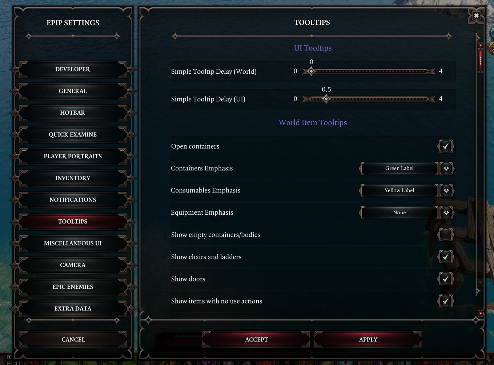

# Changelog

Older versions of the mod can be found [here](https://drive.google.com/drive/folders/13rN97wZFWoyaxgBDwtgxymenjXwezBF5?usp=sharing).

## v1065 - 07/05/23
Requires extender v59+.

!!! error "Standalone usage warning"
    **If you have the Improved Hotbar mod, you must disable it to use Epip**. All of its functions are already in Epip (+ like 9 months worth of updates that the workshop mod never got). See the [front page](index.md) and the [changelog](patchnotes.md) if you're new to Epip.

[Download here](https://drive.google.com/file/d/1NLEjkgnKlc6r4dDZw_AUHT1cdXVKhTmL/view?usp=sharing).

With this version, EE has been removed as a dependency. It's now possible to use Epip in a non-EE playthrough and the main features will work. There may be quirks that need ironing out, ex. references to features or settings that only make sense in EE - please report these.

This also means that the remaining gameplay changes have been removed. If you wish to keep them, use [this mod](https://drive.google.com/file/d/1HqxEzlXaZa4AMRpCybDPvZ2IyFjAL0J0/view?usp=sharing).

The following patchnotes are the merged patchnotes of all beta versions of the patch, excluding the April Fools one.

By the way, due to logistics changes, you will have to re-enable immersive meditation in the settings, if you had it on.

- Animation cancelling now has 2 modes: client-side (v1065 behaviour) and server-side (old behaviour). The server-side option uses the lower delay that was used previously.
- Changed how hotbar row count and visibility is saved
    - This might not work in multiplayer due to extender shenanigans
- Custom status UI elements are now bigger (ex. in Quick Examine)
- Added a new rune crafting system; simply right-click a rune material and select the new option in the dropdown menu to get started.
- Reworked the stats tab; should be less prone to bugging out in multiplayer now
    - Also fixed the gold & splinter stat
- The incompatible mods warnings now show on every load, rather than once per playthrough
- Updated localizations and added Brazilian Portuguese, translated by Ferocidade
- Character sheet skew during anniversaries is now less extreme
- Removed the "cinematic combat" option

Fixes:

- Fixed some log spam related to status icons
- Fixed hotbar loadouts not working
- Non-english languages should no longer have broken artifact descriptions
    - The cause was fetching the TSKs during module load, which causes a bug that overwrites the string.
- Fixed Quick Examine not being openable for the same character twice in a row
- Fixed vanity dyes not applying to slots that vanilla armor (without transmog) would hide/mask
- Fixed error if an item was transmogged into a template that no longer existed
- Fixed a typo in the settings to fix Astrologer's Gaze tooltip


On the technical side of things:

- Added `ActionReleased` event to Input library
- Added `GetIcon()` to BatteredHarried library
- Added `GetLevelID()` to Entity library
- Largely decoupled the logic for custom keybinds away from the UI itself (onto InputLib)
- Added `EpicEncounters.DeltaMods` library with dynamically-generated data about EE deltamods
- Added DragDropStateChanged event to Pointer lib
- Equipped artifacts are now tracked using UserVars instead of tags
- Generic:
    - Added `RepositionElements()` to Grid
    - Added `Destroy()` to UI instances
- Fixes and additions to PlayerInfo methods
- Moved various functionality from Feature up to its parent class Library (UserVars, ModVars)
- Fixed some warning spam related to status icons
- Various new checks to disable EE features when playing vanilla
- Fixed setting ID conflict issues in the settings menu
- Various fixes to debug cheats
- Reworked the doc generation script again; the doc appearance has changed considerably, and now supports hotlinking to functions
- Added support for multiple inheritance to classes made with the OOP library
- Generic UIs can be fetched by string ID now (oops)
- Added `Character.Events.ItemEquipped`
- Updated the Generic example script and documentation
- Net payloads now have methods to fetch the associated character and/or item
- Added `Osiris.GetFirstFact()`
- Added new calls to CharacterLib: `IsOrigin()`, `IsPlayer()`
- Small changes to annotations and rewrites of code that was using deprecated stuff
- Began work on a new cheats system and UI
- Added `Client.IsCursorOverUI()` and `Client.GetActiveUI()`
- Added `Input.IsTextFieldFocused()`
- Added skillstate-related methods to CharacterLib
- Reworked hotbar prepared/casting skill checks to not require server information
- Added `Client.Events.SkillStateChanged`


## v1064 - 05/03/23
[Download here](https://drive.google.com/file/d/1ni4yRX1TTPHxrqZ0mhbrimyFGXkdZsPL/view?usp=share_link).

Requires extender v58+.

Quick Examine improvements:

- Added display for AP, SP, and initiative
- Added resistances display
- Added numerous settings: opacity, width/height, hiding certain widgets. You can find them in a new tab in the settings menu
- Minor graphical touch-ups
- Added a setting to set the default position of the UI; this position will be used after reloading
- Added a statuses bar (toggleable)
- Added a light stroke to the resistances text
- Added a B/H display, with buffered damage towards the next stack
- Now shows your ally's skills and their cooldowns
	- Tooltips will show the damage as if they were used by them, but Epip features (like viewing which source infusions are available) likely do not work properly currently


- Reworked the settings menu and underlying system
	- Your previous setting values will be lost
	- The settings menu is now separate from the vanilla UI, prevent conflicts with mods that may overwrite the vanilla one
	- Settings have been reorganized into separate tabs
	- Settings are now saved per-profile, in `Osiris Data/Epip/{profile GUID}/`
    - In the settings menu, the current tab's button is now highlighted (replicating vanilla behaviour)
    - Reworked the settings menu to be more easily expandable and changed the appearance of settings
        - Tabs with a large amount of options (ex. Epic Enemies) might suffer stutters while opening them, similar to Quick Find. This is an issue with the UI framework that will be investigated later.



- Added a new UI that shows a filtered view of the party inventory
	- Opened with Ctrl+F by default (configurable in input menu)
	- Can filter equipment by slot, consumables by scrolls/grenades/potions, and skillbooks by school
    - Weapons and armor can be filtered by type (ex. sword, leather armor...)
	- Equipment can be searched by their stat boosts (supports only vanilla modifiers for now)
	- Right-click an equipped item to open the UI with filters set to that item's slot, to quickly replace gear


- Vanity internals have been reworked, with multiple changes as a result:
	- Dyes no longer require deltamods and thus should no longer be lost to shenanigans or bloat the savefile
	- Transmogrifying no longer requires the item to be transformed and therefore should no longer have any gameplay side effects
		- As a result, you are no longer prevented from transmogrifying GB5 sets
	- Transmogrifying weapons into another type (ex. dagger -> bow) will have them show in the proper location while sheathed
	- Added an option to keep the icon while transmogrifying
	- Fixed an issue with dyes not being loaded properly from oufits
	- Added an option to hide any armor slot's visuals
		- Due to an engine quirk, changing visibility is not properly reflected in the character sheet until you switch characters
    - Removed support for vanity dyes from before v1063; items still using them will appear purple
    - Added an "Auras" tab to Vanity, where you can apply visual effects to your character, onto various bones

- Added an option for animation-cancelling for player characters
    - A new setting exists to blacklist skills from being affected. A more user-friendly way of adding entries will be added in a future version
- Added a setting that controls how character level is displayed in the health bar; defaults to current behaviour (below bar, when holding shift). Includes the option to hide the level entirely.
- Reworked the "show minimap" setting; should be more reliable now
- You can now drag + drop items onto the Greatforge socket
- "Status effects" in the vanilla examine UI is now capitalized, for consistency with the rest of the headers
- Began removing gameplay changes from original versions of Epip. Since the focus of the mod has changed over to UI and QoL, gameplay changes no longer make sense within the project, and impede it from being used without EE.
	- Removed changes to Battle Stomp, Bless, Circle of Protection, Escapist, Siphon Poison, Summon Soul Wolf, Wolf Howl, Break the Shackles
	- Removed changes to Elementalist damage
	- Removed changes to Leper
	- Reverted stat changes to Boneshaped Crusher and Soul Wolf
	- Removed Sight and Hearing FlexStat entries
- Clicking a status on a player portrait or Quick Examine will now center the camera on the status's source (if any)
- "Copy identifier" keybind no longer copies template GUID
- Added Russian translation by Cathe & JoienReid
	- Currently only spans the settings menu and some vanity features
	- Since playing in non-English currently has certain issues with add-ons, a new setting has been added to display text from Epip in a language different than the game's.
- Level-up progress in character sheet is now shown with a percentage
- Added settings for disabling most of the tooltip adjustments Epip offers
- Surface tooltips should be more reliable
- Combat log improvements are now enabled by default
- Enemy health bar now uses a vanilla-ish appearance if EE is disabled (no fancy gargoyle boss frame)
- B/H indicators in player portraits are now only shown in combat (instead of when unsheathed) and are disabled if EE is disabled
- Removed the meme loading screen option
- Skill tooltips for zone-type skills no longer erroneously say their range is increased by Astrologer's Gaze

Fixes:

- Fixed icons on the minimap flickering
- Fixed layouts being saved for summons and party followers
- Layouts should now be synchronized better in multiplayer, and survive a lua reset
- Layouts now save when the pause menu is opened, rather than when the game is paused (which basically never happens in multiplayer)
	- There's probably a dozen other features that made this mistake; they will be fixed in the future
- Fixed the "points available" blip in the character sheet not being hidden when within vanity, if you had a lot of tabs registered
- Fixed the draggable area of Quick Examine being smaller than intended
- Fixed QuickExamine not being draggable all the way to the right of the screen
- Fixed the "Epip Settings" button not appearing on all tabs of the vanilla settings menu
- Fixed Trickster's Repertoire unsneaking characters that do not have the talent
- Fixed developer-only settings being visible outside of developer mode
- Hotbar: fixed hotkeys settings being deleted in some cases
- Disabled the save/load improvements during game over to fix a softlock (no known workaround)
- Fixed tooltips of player portraits and XP bar not working properly
	- Due to engine jank, these will not be affected by the delay settings
- Fixed engine actions (attack, flee, etc.) being draggable to hotbar hotkeys
- Fixed some small visual bugs with the enemy health bar
- Fixed some small visual issues with custom item slots in UIs
- Fixed some console log spam
- Fixed hit chance not displaying when hovering over characters in combat
- Fixed some items being grayed out in hotbar groups
- Fixed "immersive meditation" and other EE UI features not working for characters that have been transformed
- Fixed unique items being dismantle-able with "mass dismantle"
- Fixed item context menus being misreported as character menus if you hovered over a character recently
	- Possibly fixes the issue of options like "mass dismantle" not appearing
- The "infinite carry weight setting" should now work properly for clients that join mid-session
	- Other features that face problems in multiplayer are possibly suffering from the same bug and will be fixed in the future
- Fixed transmogged helmets not being toggleable from the character sheet UI
- Fixed "revert appearance" in vanity not working properly

On the technical side of things:

- Added an `Image` library with PNG decoding
- Added ImageViewer feature, intended for displaying results of images decoded with `Image`
- Improved reliability of `Client.GetMousePosition()` (replaced with Ext implementation)
- Added a Set data structure
- Added `Vector.ScalarProduct()`
- Added a `Color` element to Generic
- Added `ClearElements()` to Generic's Grid
- Added `SetVisible()` to Generic elements
- Added `Set` and `Map` settings types
- Added a debug hotkey for copying the pointer's world position
- Added a `Interfaces` library for common interfaces
- Generic: fixed ScrollList not supporting centering of elements
- Generic: added LabelledIcon prefab
- QuickExamine: added Widget interface
- StatsLib: added data of immunites
- TooltipLib: added support for status tooltips
- QuickExamine: split up some parts of BasicInfo into separate widgets
- Generic: fix downsizing IggyIcon
- Generic: added a Status prefab, for displaying status effects
- TooltipLib: added `ShowStatusTooltip()`
- Moved various functionality from EnemyHealthBar to a feature (EnemyHealthBarExtraInfo)
- Fixed TextLib's Format() not accepting decimal text sizes
- Added a setting to simulate EE being disabled (applies to Epip scripts only)
- Removed checks for Improved Hotbar mod
- Added an event for statuses being applied to CharacterLib
- Added a feature to generate Osiris event annotations for lua
	- The IDE annotations folder in Epip has been updated to include them
	- This might be expanded to support PROCs and QRYs later
- Added an OOP library for working with classes
	- Feature now supports registering and fetching class tables in an elegant manner
- Started splitting up Feature into 2 classes to fix interface segregation violation
- Fixed OsirisLib calls not working with 0 parameters
- Various script cleanups (mostly for Hotbar and EnemyHealthBar)
- Added TSKs for older settings
- Changed TSK integration in Feature: the keys are no longer required to be a handle; they can be any string, letting you index the TranslatedStrings table with auto-completion
	- TSK objects now have a GetString() method to resolve them
	- `TSK` table within Feature will be deprecated soon
- Added a feature to play client-side effects upon hovering over entities
- Added libraries for EE-related mechanics (BatteredHarried, SourceInfusion), and moved relevant methods to them
- Fixed `Character.GetEquippedItems()` not returning the advertised type
- Added a DatabaseSync feature for synchronizing database contents to the client
	- Might be merged into the osiris library in the future
- Added a UserVars library, with Feature integration
- Added support for function signatures without bodies to the doc generator, fixed subclasses not being detected properly
- Added methods related to drag-drop to PointerLib
- Generic:
	- Moved annotations to separate file, solving various IDE warnings
	- Added support for tweening
- Fixed Stats.MeetsRequirements() not working with attribute requirements
- Added `ShowItemTooltip()` to Tooltip lib
- Generic:
	- The HotbarSlot prefab is a now more general-purpose inventory-like slot, showing rarity, rune slots, and with options to block drag-and-drop
	- Fixed culling issues with IggyIcon
	- Added support for scrollRects
	- ComboBox events now throw their option ID instead of just index
	- Added SetChildIndex()
- Removed swf overrides for `textDisplay` and `notification` UIs, as well as cleaned up their respective lua scripts
- Fixed error messages from using keys the game doesn't support (ex. media keys)
- Added annotations for basic stats objects
- Added `AMER_Loot_CallistoAnomaly` icon - special thanks to Elric
- Fixed UserVars not synchronizing
- Fixed `GameState.IsLoading()` not working
- Various changes to annotations
- Features can now declare which game states they should be enabled with, which will cause `:IsEnabled()` to return `false` under unsupported states
- Rewrote `Osiris` table. Tuples returned from DB queries are now an object and it's possible to distinguish DBs/QRYs with the same name but different arity
- Rewrote `Item.GetEquipmentSubtype()` to be a lot more reliable, and fixed it failing to identify clubs
- Generic: added the Texture element
- Generic: added more prefabs for "form elements", and added inheritance to them
- Unsubscribing event listeners with an ID that is not subscribed no longer triggers a warning
- Added IDE annotations for the global Ext functions (like `_C()`)
- Added a "DefaultTable" data structure (inspired by python's defaultdict; a table with a default value when indexing)
- Removed UI override for the settings menu (LeaderLib menu might work now? no promises)
- Debug menu now supports fiddling with the UI scripts to an extent
- Osiris table now parses parameters for DB set/delete operations
- InputLib: added methods to fetch game input event definitions and bindings
	- The ancient script previously used to do this has been removed, along with some other redundant ones
- Improvements to the doc generation script (which shall debut here soon); it can now export "subclasses" of a class (the auxiliary data structs)
- Added a generic developer input binding for hooking quick tests onto it
- TooltipLib: added a way to render custom formatted tooltips
- TooltipLib: added a method to render skill tooltips, as if the engine were doing it
- Minor cleanups of some scripts
- Fixed iggy icons in Slot elements being culled out for Generic UIs
- Added methods to check if a component is an item/char to EntityLib
- You can now specify a player index when using methods in PointerLib (though I do not know in which scenario multiple pointers can exist; splitscreen co-op perhaps?)
- The localization system now supports contextual metadata for ease of translation, and integration for it has been added to the Feature table
	- You can define TSKs in `TranslatedStrings` and query them by indexing `TSK` within the feature
	- TSKs defined this way support aliases that are valid only within the context of the feature, preventing collisions
- Added a python script to import/export Epip translation files in `Mods\EpipEncounters_7d32cb52-1cfd-4526-9b84-db4867bf9356\Story\RawFiles\Python\localization.py`
- Added `GetTurnOrder()` to Combat library
- Added `Client.WorldPositionToScreen()`

Improvements to doc generator script:

- Added support for net messages
- Better support for hooks/events
- Private methods are now hidden
- Symbols are now sorted by context (first Shared, then Client, then Server)
- Can now be used externally (importable)
- Added support for overloads

## v1063 - 19/09/22

- If "Unfocus after sending messages" is enabled, holding shift while sending a chat message will keep the chat focused
- Fixed settings not saving if you didn't visit the camera settings tab

On the technical side of things:

- Added operator overload annotations for `RGBColor`, `Vector`
- `Vector.Create()` accepts an existing array as a parameter (only one)
- Added TSK-related methods to `Text`
    - This includes a localization system for strings in scripts; you can generate templates for localizing with `Text.GenerateLocalizationTemplate()` and they will be loaded from `Mods/MyMod_MyGuid/Localization/Epip/MyTargetLanguage/ModTable.json`, where `ModTable` is the mod table whose strings you've localized using the template
        - Support for this within Epip will be added throughout future updates; currently only some camera settings support this
    - You can generate fresh GUIDs or TSK handles with `!guid` and `!tskhandle` commands (on client context); they'll be copied to the clipboard

## v1062 - 16/09/22

- Surface tooltips with an owner now show a hint regarding how the damage scales
- "Active Defense" statuses (ex. Empyrean Tears) now show remaining charges
- EE rune materials now show how to use them to craft runes
- Added a setting to configure the delay of simple tooltips appearing
    - This affects tooltips of items in the world, as well as label tooltips in UIs (these 2 types are individually configurable)
- Added a settings tab for camera settings
    - You can change the maximum zoom out distance, as well as the view angles
- Items in the quest reward screen now show a hint regarding modifier generation
- Added new Greatforge graphics for Engrave - special thanks to Cathe and Elric!
- Fixed a vanilla bug with the character sheet that caused the second ring slot to not play equip animations
    - Additionally, the graphics involved should now be better centered
- Re-added the option to auto-unlock inventories
    - Changing the lock status should also be synched better now - the vanilla game seems to struggle with this leading to the changes often not being properly reflected in other player's UIs
- Fixed weapon range deltamods only considering the first deltamod of that kind found
    - This same fix is applied for weapon elemental damage mods as well

On the technical side of things:

- Replaced `Client.GetCharacter()` implementation with a new one from v57 that doesn't rely on any UIs. **Let me know if something character-involved breaks as a result** (though I haven't experienced any difference).
- Added a Camera library
- Added an Entity library, with shorthands for GetGameObject() and functions to get all characters/items on a level
- Added limited alpha support to RGBColor (I don't think alpha is used anywhere in scripting though)
- `Item.GetIcon()` is now fully reimplemented following engine code
- Stats library now also holds dynamically generated data of runes, except framed ones
- Tooltip library now supports item tooltips and simple tooltips (the usual `showTooltip` call), and offers additional contextual data (ex. skill ID for skill tooltips)
- Started work on a new UI-independent settings library with per-profile settings support; not yet used

## v1061 - 4/09/22

- Added new settings for world item tooltips:
    - Emphasizing containers, consumables and/or equipment by changing their color
        - This setting will not work for items that would result in a crime upon interaction; they will remain red.
    - Enabling world tooltips for all items (similar to the "Let there be tooltips" mod)
    - Filtering out clutter (particularly the one added by the setting above): chairs, doors, non-interactable items
    - Option to open containers upon clicking their tooltip, rather than picking them up

- Added an option to exit the chat UI after sending a message (so you don't need to press escape manually)
- Added an option to disable notifications for sharing civils ("X shares Loremaster/LC with Z")
- Searching saves is now case-insensitive
- Added a ping counter to the debug display
    - Since the server only responds to net messages once per game tick, the counter will basically always show around 33ms in singleplayer

- Fixed "Show empty containers/bodies" not actually working on items
- Fixed another case of an infinite loop of switching characters
- Fixed the "toggle world tooltips" keybind not working (+ crashing the game)
- Fixed some character sheet tooltips appearing in the vanity UI

On the technical side of things:

- Osiris library now converts boolean values to integer in calls
- Added `HasFlag()`, `IsContainer()` to Item library
- Added initial groundwork for an inventory expansion

## v1060 - 3/09/22

- Added a better frame for the hotbar health bar, and shadows for the AP bar (thanks Elric)
- Added a keybind to bring up the examine UI (the real one)
- Added all engine actions (the ones you see in the controller UI) to the hotbar actions drawer (the vanilla one, bound to `X`), except for flee
- Reordered some keybindings
- Added "Let there be tooltips" to the list of EE-incompatible mods
- Fixed character-specific context menus appearing on items
- Fixed the save/load overlay not disappearing in multiplayer when the UI is closed
- Fixed a possible edge case with walking over corpses in combat that would result in the corpse not being lootable after combat
- Fixed the dragging area for the debug display being too large
- Fixed an issue with character control switching rapidly
- Fixed hotbar tooltips not showing keybinds
- Removed the "Special Binding 1 & 2" keys since they are no longer used

On the technical side of things:

- Added data for all InputEvents to `Input` as well as possibly the world's biggest alias
- Added an `IO` table
- Began modernizing the context menu APIs
- Added a Pointer library, currently deals only with `Ext.UI.GetPickingState()`-related matters
- Added `table.lua` and `math.lua` containing the extensions to the respective built-in tables
- RGBColor creation now clamps the color values
- Implemented __eq, __add and __sub for RGBColor
- Various fixes for outdated/clashing IDE class names
- Fixed an infinite loop when using the default buttons for `MessageBox`
- Added a table for `combatTurn` UI
    - Unfortunately this UI does not appear to hold any character handles, making it not very useful.

## v1059 - 29/08/22

- Fixed an issue with using items in hotbar groups after reloading
- Fixed item amounts displaying incorrectly in hotbar groups
- Fixed an issue with the unlearn skills prompt appearing while the UI is closed

On the technical side of things:

- Added "Actions" (ground attack, sheathe/unsheathe, etc.) to the Stats library

## v1058 - 29/08/22

Versions from this one onwards require extender v57.

New features:

- Consumables like food and mushrooms now show their effects by default; there's no need to eat them once for them to appear in the tooltip
- Added a setting to enable infinite carry weight
- You can now right-click skills in the skillbook while out of combat to unlearn them
- Added a keybind to toggle world item tooltips (so you don't need to hold the alt key)
- Surface tooltips now show their owner (who the surface damage scales from and who owns its applied statuses)
- Added a setting to disable the "Item Received" notifications
- Added a setting to allow viewing the character sheet while in the quest rewards UI; this lets you compare your equipped items with the rewards.
- Vanity: transmog and dyes no longer require items to be re-equipped, making it overall faster to try on different looks
- Added an option to hide empty corpses/containers from the world item tooltips (the ones that appear from the alt key)
- Added a setting to allow you to walk *onto* corpses while in combat without looting them. You may still loot them while holding shift. This setting is enabled by default.
- The fix to character control being lost upon creating new summons now also applies to having your summons be killed
- Added an option to play a sound effect when a chat message is received, so they're easier to notice
- Empowering items now properly scales their armor values, but this will only take effect after a reload
- Fixed the vanilla bug that prevented you from using items in certain conditions if you had +AP Cost effects 
- Added a keybind to scroll the fancy item/skill tooltips
- ACTIVE_DEFENSE statuses (ex. Empyrean Tears) now show max charges in the tooltip
- Holding shift while moving in combat now shows approximate decimal AP costs
- Status tooltips now show if they were applied by an equipped item
- Fixed the tooltip color for effects that alter AP costs. They now display in green if they reduce AP costs, and red if they increase them.
- The custom input menu has been reworked to use new extender tech; all keys supported by the game are now bindable, including modifier keys like alt/ctrl. Your previous bindings will be wiped upon updating.
- Added new modifier keys to cycle bars on the hotbar: ctrl cycles 3rd bar (from bottom), alt cycles 4th one, gui (Windows key) cycles 5th one
- Added an "Engrave" option to the Greatforge which lets you rename items. This is purely visual.
    - It does not currently have a custom graphic. It will appear as another "Drill Sockets" in the Greatforge wheel.
- Minor visual adjustments to QuickExamine
- The Epip settings menu is slightly more organized now
- Added more mods to the incompatible mods warning: DU, Greed, Multihotbars

Hotbar:

- Slots can no longer be used while holding modifier keys. This means you can use shift/ctrl/alt + number keys as a custom keybind without it interfering with the hotbar.
- Fixed loadouts not saving empty gaps inbetween slots
- You can't cycle hidden bars anymore
- Added custom slot groups. Right-click a row on the hotbar to create one. These are shared across all your characters. Right-click them to delete them. Known issues:
    - Items there do not display tooltips yet

Fixes:

- Fixed tooltips for Vanity tabs
- Fixed negative status effects displaying wrong ever since GB5
- Epip's artifact tooltips (in Quick Examine, stats tab, etc.) now have a period at the end of them
- Hotkey to exit Meditate is now escape, instead of escape / right-click.
- Fixed action names on the hotbar buttons
- Fixed some character sheet tooltips appearing while in the Vanity menu

Stuff for developer mode:

- Added a keybind to copy identifiers (GUID for chars/items, stat ID for skills) of the object over your mouse
- Added a settings menu to change Data.txt values ingame. Most of them apply instantly / upon character stat recalculation, but some may require a session reload.
- Talents show their IDs in tooltips
- The cheats context menu now lets you add talents
- Added an option to enable a widget that shows FPS, TPS, and relevant mod versions
- Added a keybind to open a debug menu from which you can toggle debug mode on features, disable them (or their logging), and run tests (a new feature of the Feature table)

On the technical side of things:

- Osiris library now supports built-in symbols (calls and queries) and extender objects are converted to their GUID when being passed
- Added a Vector library (with some cool arithmetic operator overloads)
- Added a new tooltip library (WIP), advantage include preventing tooltips and manipulating surface tooltips, viewing source UI of a tooltip
- SubscribableEvent nodes can now be removed based on a predicate function, and preventable events are supported
- Fixed some log spam related to the hotbar
- Added groundwork for the Epip Housing(TM) feature
- Slight modernization to Net library: the payload is now passed as the first parameter, and IDE hints are available by defining the net msg as a class with the payload's table fields
- Timer lib is now available on the server, and a tick-based timer option has been added, as well as option to repeat / pause them
- Added a better coroutine table with sleeping (either for X seconds, or until a condition is met)
- Added a new Epip.RegisterFeature() call which can keep track of the source mod of a feature
- Added a new Input library using v57 RawInput
- Added more hooks to CharacterSheet UI in preparations for custom talents 2.0 (and other stats)
- Added ExtraData tables to Stats library
- Added PartyInventory hooks
- Removed numerous archaic/unused scripts, like the custom talents ones
- GenericUI:
    - Added more bg options for TiledBackground
    - Added new elements: Slider, Grid
    - Events now have proper IDE support, and no more issues with inheritance
    - Element creation now has proper IDE support, if you instantiate elements using their class name
    - Added more position-related calls
    - Element visuals now use string IDs, and unused visuals are set off-stage (less possibility for jank)
    - Fixed button size issues
    - Removed minimum size for black background
    - Fixed stack overflow issue with lists
    - Added support for skill tooltips
    - Fixed issues with MouseUp on the slot element
    - Changed mouse events to use the roll ones
    - Added proper support for prefabs, with the following implemented:
        - Spinner
        - Text (offers simpler initialization of Text elements)
        - HotbarSlot (with many improvements to bring it closer to hotbar behavior)
        - FormHorizontalList
        - LabelledCheckbox
        - LabelledDropdown
        - LabelledTextField

## v1057 - 26/07/22

- Fixed the annoying issue of control being switched to new summons in combat while it's still your turn
- Crafting UI now remembers your last tab (equipment/consumables etc.)
- Added a setting to set the default tab for the crafting UI
- The hotbar now shows a warning for unmemorized skills, as well as skills from items that have been unequipped
- Fixed some changelogs ingame not showing up
- Added an option to enable some improvements to the save/load menu: alphabetical sorting and search. The search bar supports lua patterns and is case-sensitive

On the technical side of things:

- The hotbar updates periodically again to fix some issues, and should no longer break completely when a single slot/action fails to render

## v1056 - 22/07/22

- Stats Tab:
    - Added Voracity stats
    - Added Artifacts
- Quick Examine now shows Artifacts for your allies as well (useful in multiplayer)
- Vanity: added support for "Visitors from Cyseal" mod, though the mod currently appears to have some issue with replacing some item icons
- Fixed a freeze with Immersive Meditation
- Fixed another grey out issue with the hotbar (skills with weapon damage but no weapon requirement)
- Fixed the category weight sliders in Epic Enemies not being saved
- Fixed the "Show Minimap" option appearing twice in the options menu
- Fixed some issues with controllers
- Skills show their IDs in tooltips in developer mode

On the technical side of things:

- Added `StopPropagation()` to the new event table
- Added a wrapper for checking developer mode, with an option to use an additional check; WIP and testing features will be locked behind it, meaning the rest of the features (like the cheats menu) can be used without problems
- Added a few new utility methods
- Started work on further giga brain hotbar improvements

## v1055 - 20/07/22

- Added an option to reduce the opacity of the player status bars while in combat
- Vanity UI now closes when you go into combat
- Status tooltips now show source (if it's a character)
- Re-added the hotbar actions drawer (the one with force-attack / sheathe / sneak)
- Added a Vanity action to the hotbar
- Added new Combat Log filters: critical hits and dodge
- Status tooltips now show ID and Type while in developer mode
- Added embodiments to the stats tab
- Read books and used keys now show a label in their tooltip (not retroactive)
- Fixed Max SP check being inaccurate on the enemy health bar
- Added new divider sprites for the player health bar
- Player health bar now shows maximum SP, and the SP counters are centered
- Fix item use cost not being considered while greying out slots on the hotbar
- Fixed consumable items not greying out properly in the hotbar
- Fixed hotbar issues with Luminary, Musketeer mods
- Temorarily removed the option to auto-unlock party inventories due to crashes in v56 from sync rewrites

On the technical side of things:

- Removed more log spam from Hotbar/Input
- Moved a bunch of tables around, removed archaic scripts/global functions
- Added some Larian colors to the `Color` table
- Added an icons enum to `Hotbar`
- More work on the new UI system: event listeners, Slot element
- Added `GetExtType()` for checking the type of an extender object
- Added `GameState` table
- Started transitioning to using a better event system, using a modification of the v56 SubscribableEvent table
- Updated IDE helper files

## v1054 - 13/07/22

- Added a "Quick Examine" UI. Currently it only shows the Epic Enemies perks characters that have them. It is invoked by a keybind while hovering over a character; default is `v`.
    - You may use the lock button to prevent its selected character from changing whenever you hover over a new one; if you do that, you will need to press the keybinding manually to change targets.
	- You can drag the UI around by holding down left click on the upper part (the one with the character name)


- Artifact powers in Epic Enemies now have descriptions
- Hotbar now greys out unusable item skills (ex. arrows)
- Switching characters or clicking slots on the hotbar now attempts to fix desync issues (the one where your clicks go to the wrong rows)
- Fixed a freeze when using a controller
- Temporarily removed the Awesome Soccer minigame

On the technical side of things:

- Added a new lua-based UI system; currently supports backgrounds, text, buttons, state buttons, the common list types (vertical, horizontal, scrolling), dividers, and icons

## v1053 - 07/07/22

- Added an option to show aggro effects on the top health bar: taunt source/target as well as AI preference tags
- Centered the AP orbs on the bottom health bar, and added special dividers every 4 AP
- Pipmode no longer gives infinite AP to non-player characters
- Added a cheat to apply statuses
- Reworded +elemental damage tooltips on weapons
- Fixed offhand items not auto-transmogging properly
- Fixed some summons still getting Epic Enemies perks, as well as party followers
- Fixed skills that require shield not being greyed out while muted

Hotbar:

- Loadouts are now sorted alphabetically
- Added a setting for disabling slots while casting
- Fixed occasional flashing for slots on cooldown
- Fixed hotkeys being blocked if any controlled char is in dialogue

On the technical side of things:

- Added better annotations for UI/Feature tables (works with inheritance now)
- Added wrapper calls to get/set stats regardless of whether they're actual stat objects or the special types (DeltaMod, TreasureTable, etc.)
- Moved `RemoveTrailingZeros()` to `Text`
- Reduced some extender log spam from stats
- Fixed warning spam when enemies were preparing skills

## v1052 - 05/07/22

Epic Enemies:

- Reworked the Epic Enemies feature. It is now configured through the regular settings menu, not the EE one. If you're continuing an old save, the options in your EE menu will remain, but they will no longer do anything.
    - The amount of effects enemies gain is now customizable
    - The weighted chance of each perk appearing can be customized individually - it's also possible to adjust the chances for whole groups of effects at once (ex. all Centurion effects)
    - All artifacts can now be made available to enemies
    - Effects with conditional activations are supported, and can grant a variety of other perks (statuses, stats, summons, etc.) though there are no new effects that use this yet - new content will be added soon

Hotbar:

- The "active skill" animation on the hotbar should be more reliable now (and no longer appears if you click spells in the spellbook)
- Fixed shield skills not greying out when disarmed

On the technical side of things:

- Removed the infamous empty net script
- Cleaned up script loading on the server
- Generated new IDE helpers for built-in v56 types
- OptionsSettings UI now has less thicc text labels so you can actually write stuff there without taking up the whole screen

Known issues:

- Artifact effects in Epic Enemies have no descriptions (text keys are really unreliable apparently)
- Switching tabs in the Epic Enemies settings menu scrolls you to the top
- Epic Enemies no longer gives extra Predator range

## v1051 - 28/06/22

Small bug fixes, and a moderate QoL addition for vanity dyes.

- Added Ctrl+C/V support to the dye tab text fields
- Fixed Epic Enemies tooltip (thanks Pancarte)
- Fixed outfits ignoring transmog restrictions
- Fixed vanity dye slider text values sometimes not moving around
- Fixed items transmogged into artifacts gaining the special tooltip color (this will require an EE Core update to fully work)

On the technical side of things:

- Cleaned up `MessageBox`

## v1050 - 26/06/22

A small assortment of huge vanity improvements!

Vanity:

- Added a button to delete custom dyes
- Switching characters no longer closes the UI
- The current tab is remembered when switching items through the context menu
- Added a toggle to prevent the sliders from being set to the item's current color (makes it easier to reuse a dye on multiple items)
- Added fields to enter colors in hexadecimal
- Added buttons to copy/paste colors
- Added buttons to import/export dyes to/from the clipboard
- Sliders can now detect the default color of an item that hasn't been dyed before
- Added a checkbox to auto-transmog equipped items to your old item's appearance **while the UI is not open** (so you can switch out items in the UI without needing to toggle it off)
- Fixed the Vanity option appearing on non-equipped items

Other:

- Added keybinds for the debug teleport (no longer uses the ping key)
- Custom keybinds no longer fire while in dialogue

On the technical side of things:

- Added support for dev-only keybinds
- Moved `Flash` table to `Client`
- Added a `Color` table
- Created a github repository: [https://github.com/PinewoodPip/EpipEncounters/commits/main](https://github.com/PinewoodPip/EpipEncounters/commits/main)

## v1049 - 23/06/22

- Added an option to enable improvements to the combat log. Messages can be filtered by type, and certain messages will be merged into one line if they occur one after another, such as surface damage and healing. **This option will only work when playing in english**, unless someone is willing to help me make string patterns for other languages.
	- Right-click the combat log to set your filters. You can also clear the log from that menu.
	- When damage messages are merged into one line, they will display the amount of hits that were merged at the end. The exception to this is damage that occurs within 25ms of eachother, such as weapon attacks with coatings. These are counted as a single hit.
	- Messages parsed by the new combat log system will now have a consistent base color, gray, instead of randomly using white.
	- Some messages have been slightly reworded for consistency
- Added options in the cheat menu to add/remove tags. You can use this to clear a character's main character status by removing the `AVATAR` tag.
- Added a button in the debug sections of the options menu to warp to AMER_Test
- AMER_Test got Pinewood'd a bit
- Weapon tooltips now show +elemental damage modifiers
- Updated Derpy's treasure table displays
- Removed the option to disable custom context menus
- Fixed keyword source tooltips being off-by-one
- Hotbar action button tooltips now show their keybind (without shortening)
- Removed the automatic unbinding for GM keybinds, since they are no longer used for the hotbar
- Added chat commands:
	- /rp displays a message over your character's head
	- /emote performs an animation
	- /help lists help for all commands
- Added a new tab in the controls menu where you can bind hotbar action hotkeys as well as standalone hotkeys for Meditate and Source Infuse. **You must rebind your hotbar hotkeys**
- Two keybinds previously used by the hotbar are now reserved as special keys that can be bound in the new custom keybinds UI. The purpose of them is to allow extra mouse buttons and other special bindings to be used with the new system until it is improved.
- Fixed numerous problems while playing with controllers
- Added a setting to make the Escape key close the Amer UIs entirely rather than popping page
- Fixed a hotbar refresh issue when pushing slots around
- Fixed hotbar action buttons no longer properly showing active/inactive state
- Removed the option to disable wrapping statuses (it has not actually worked for a long time) as well as the vanity menu

Vanity:

- Added custom RGB dyes to the dyes tab
- Added all built-in ItemColor entries as selectable dyes
- Saving now also happens when you add/delete an outfit or a dye
- You can no longer transmog GB5 items
- Fixed spears not being available in the transmog menu
- Fixed the vanity option not appearing for non-shield offhands
- Added a button to delete outfits
- Fixed positioning of the vanity UI while playing on resolutions other than 1080p, or when dragging the character sheet
- Fixed saving outfits with weapons not working
- Removed the dye context menu for real
- The UI now shows a message if you select an empty slot, instead of opening a message box
- Slight changes to positioning of elements
- Improved performance
- The character sheet unallocated points notifications are now hidden while in the UI

Other:

- Fixed a bug with hotbar action buttons resetting
- Added a "Healing done" stat to the stats tab
- The "Damage dealt" stat now also considers your owned summons

On the technical side of things:

- Reworked how the selected item is tracked in the Vanity UI
- Reworked all tabs of Vanity to be separate, independent features
- Added initial groundwork for supporting controllers in Amer's UIs
- Added APIs for `chatLog`, `optionsInput`
- `_Feature:DebugLog()` is now polymorphic like the regular print function
- Added the `Input` UI, with possibilities for tracking text keys from the keyboard, and intercepting interface events
- Added FlexStats for sight and hearing, ranging from -128 to +128 (except for sight which goes to +2048)
- Added support for saving settings on the server
- Removed unused ItemColor stats
- Removed unused PersistentVars table
- Hooks can now be set to only return the first non-nil value (and stop propagation after that)
- Cleaned up the client bootstrap script
- Added an !animtest command on server, auto-playing all female human animations on the host character. There's no stopping it once started, so be careful!
- Added a !soundtest command on the client, which tests all UI sounds. Might've been added before this version, I don't recall exactly when it was implemented.
- Added some sick ASCII signatures to the bootstrap scripts, as well as a readme

## v1048 - 14/05/22

- Added a warning upon loading a save with mods known to be problematic
- Graying out hotbar slots while casting skills should now work similarly to before
- Added Derpy's scripted encounters to the Treasure Table Display
- Added an option to disable area transition labels or change their duration. It now also hides immediately if you hover over a character/item to bring up its healthbar
- Possibly fixed a significant stuttering issue with the hotbar
- Added a button to revert a transmog'd item's appearance (not retroactive; will only work on newly transmogged items)
- Changing tabs in the Vanity UI now plays a sound
- Rounded the numbers in the Treasure Table Display
- Added a dyes tab to the vanity menu
	- RGB sliders are not finished yet (you can use them in developer mode, but they will not be saved)

On the technical side:

- Fixed a net error message upon loading into the main menu
- Fixed a startup error related to the Osiris table
- Added UIObject flag helper methods to the UI table (though Norbyte confirmed these will be usable like other enums in the future)
- Added ways to set and delete tuples to the Osiris table with :Set() and :Delete(); :Get() queries the DB (previous usage still works).
- Osiris table's DB queries now return the list of tuples as the last return value, always
- Added a separate UI for querying time from flash
- Fixed time functions not accounting for daylight savings (iggy oversight)
- Added annotations for the _Feature table/class
- Added a `Text` library with a handy format function
- Improvements to events and hooks: libraries can now hold their events and hooks as tables in `Event` and `Hooks` fields respectively, from which you can easily see all listener types available and register listeners. Doing it this way enables auto-completion and intellisense/EmmyLua annotations for listener parameters, which was not possible before. Old libraries will slowly be updated to use this, and the old method of registering listeners will stay.

The standalone hotbar mod will be updated tomorrow (15th May).

## v1047 - 20/04/22
- Added an option to show artifact/protean chances on enemy health bars when the "Show Sneak Cones" (shift by default) key is held. Also works on containers, without needing the key to be held. 
- Fixed an issue with some setup event being unreliable (likely the source of many hotbar problems)
- Fixed some events being fired once per user
- Fixed equip animations in the character sheet
- Client timers are now truly client-side
    - As a result hotkey'd skills on the hotbar should now have a lot less delay
- Fixed hotbar not being greyed out for dead characters
- Fixed "None"-type weapons not being considered melee, causing incarnate bull rush to appear grayed out in the hotbar
- Fixed another large performance issue with the stats tab

## v1046 - 14/04/22

- Added a new journal UI, replaces the quest log for changelogs. Access it from the hotbar
- Fixed Inconspicuous not being hidden in character creation
- Hotbar config (hotkeys) now also saves when you save the game, not just when the game is paused
- Incompatible giftbags can no longer be enabled (you should still be able to disable them, if you had them)
- Added a way to mark templates as favorites in the vanity UI, moving them to a special category
- Vanity UI now shows categories in a consistent order
- Small change to stats tab to make stats editable post-SessionLoaded
- Character sheet now goes below the hotbar again
- Increased the hotbar's "refresh rate", fixing an issue with slots being clickable when they shouldn't
- Fixed the hotbar drawer locking up your scroll wheel
- Renamed the transmog context menu option to "Vanity", made it only usable on equipped items
- Added support for Rendal's NPC Armors to the vanity UI
- Reduced logging when developer mode is off
- You can no longer open the vanity menu while in combat
- Your currently equipped template in the vanity menu is now indicated by an icon instead of a suffix
- Fixed Immersive Meditation ignoring the setting
- Fixed a performance issue with the stats tab

## v1045 - 1/4/22 Anniversary patch :flashed:

As of today, Epip is now one year old! My attention span for projects tends to be very low (as evidenced by my other EE stuff), but Epip looks to be an exception to that and it's incredible what it has become - all its UI changes were nearly unimaginable just a year ago. Thank you all for the support throughout the months, even at times when the patches were a buggy mess.

Just like the initial release of the mod on April 1st, this anniversary patch is very real, and best experienced on this day of the month.

Changelog:

- Pressing escape while in the EE UIs now backs out of them rather than bring up the pause menu
- The stats tab now shows damage dealt and received in the current fight (or previous fight, when out of combat)
- Added a new bug to the character sheet
- Performance improvements to the hotbar
- Gold/Splinter counter in the stats tab should now be more reliable
- Minor technical changes to make the mod compatible with Descent
- Added a scrollbar to the hotbar buttons drawer
- The hotbar now goes below the inventory and character sheet
- Hotbar cooldown animations should now be smoother
- Fixed bugs with unbinding actions in the hotbar, as well as clearing unmemorized slots
- Fixed muted characters not having their slots greyed out in hotbar
- You can now activate your Epip Encounters license ingame from the options menu
- Tooltips can now be scrolled on one axis with the mouse wheel
- The punisher now drops MicroBoss loot to make him feel more optional
- Added a cinematic camera option, on by default
- Reworked the vanity feature: it now opens a custom tab in your character sheet. Browsing templates is a lot more convenient this way. Saved outfits are now categorized by race & gender (doesn't stop you from applying them to anyone though)
	- It wouldn't be an Epip patch if something didn't ship unfinished, which is why I must announce that the promised feature to mark templates as favorite did not make it in.


**On the technical side of things:**

- Added an alias for the `Ext` table to make it easier to type:
```lua
SEX = Ext -- Short for "Script EXtender"
SEX.Print("Welcome to Norbyte's SEX v56 !")
```
- Fixed more inconsistencies with copy/paste in the message boxes
- Added an option to log AI scoring to the console: the top 3 actions will be shown anytime decisions are made. Work-in-progress as some of the AI features in the extender are currently bugged.


- Tooltips for Ascension stats in the stats tab are now created dynamically, so there's no need to edit them if you've edited the description/name
- Added a `Server` table on the client, from which listeners for any Osiris symbol can be created, eliminating the need for boilerplate code on the server side if you need to listen for Osiris stuff.
- Added an `Osiris` table on server to make user queries and DB queries a bit less aids to use in lua:
```lua
-- DBs with only one tuple return their contents directly, rather than as a list
local _, value = Osiris.DB_PIP_EpicStats_DamageDealt(char.MyGuid, nil)

-- User queries can also return variables directly from their output DBs, even for queries with multiple outputs
local value = Osiris.QRY_AMER_KeywordStat_VitalityVoid_GetRadius(char.MyGuid, 1)
```

**On the future side of things:**

Development has slowed down throughout March due to work and studies, but I'm not planning on stopping work on Epip anytime soon, and there are lots of exciting features in the planning stages. There is no time estimate for any of them, they're just things I know I will try out *eventually*. I know creating expectations never ends up well, but for the anniversary I felt it would be nice to write down the ideas I'm planning for the near future:

- **Character sheet overhaul:** the attribute/ability/talent tabs will become easily moddable, for modifying or adding new entries to them. This will pave the way for custom attributes and abilities. The UI currently used for the custom vanity tab will be made generic, so anyone can add their own tabs.
- **Proper controller support for EE UIs:** a large undertaking, but something that looks to be very possible and would be a massive quality of life improvement.
- **Custom journal UI:** will replace the current changelog functionality. The plan is to use the GM mode's journal UI as a base, since it's a slick, full-screen UI with support for nested categories. The functionality will be made generic, you'd be able to use it for more than just changelogs.
- **A way to create UIs just from lua:** work on this already started back in early January; it's used for the \[REDACTED\] in Fort Joy, but it's quite incomplete. The plan is to allow for creation of UIs with backgrounds, text, and all the Larian form elements (buttons, dropdowns, sliders etc.), all without touching any swf.
- More documentation for the source code, namely the remaining UI scripts and the base metatables

Thanks for reading and I hope you have an epic 1st of April.

### 19/2/22 Huge Hotbar rewrite
Rewrote the hotbar UI. This involves mostly technical changes, in preparations for a standalone release.

**Your hotkey keybindings will be reset with this update! Please bind them again.**

Visible changes:

- Fixed the top of the buttons area blocking clicks onto the world and other UIs
- Any skill or item can now be dragged from the hotbar to the customizable buttons to bind it there (useful for old mods that use skills/items to bring up menus)
	- The "use last slot" action has been removed due to this.
- Removed the "view changelog" action
- The slot rendering is now entirely scripted (no help from the engine) which works around a crash and removes the need for an initialization procedure (that annoying "switch to the first row" message)
- Saving your current amount of bars and order should be a lot more reliable (now happens upon pausing the game, instead of a timer)
- Action buttons can now be highlighted or disabled; ex. the pyramids one is disabled if the party has no pyramids
- Added an action to open the pyramids UI
- Fixed the source skill border clipping into other rows
- Added compatibility for Weapon Expansion: adds an action for toggling the menu, and repositions the original button when you have 2 rows of action buttons
- Actions in the drawer are now ordered in a consistent manner
- Added a context menu when you right click a row; from there, you can:
	- "Push" groups of slots to the left/right (useful for inserting skills inbetween slots)
	- Clear rows, or unmemorized skills
	- Save and load "loadouts" of rows. Loadouts can be applied even if your character doesn't currently know all the skills from it.

Other changes:

- Simple tooltips (the ones that go in that very small black box) now appear much faster, rather than being delayed
- Added numerous calls to `Game.Character` and `Game.Item`, mostly related to functionality needed for the hotbar.


### 5/2/22 Docs inauguration patch :flashed:

- Added new stats to the stats tab (more coming later):
	- Party gold, splinters
	- Celestial restoration
	- Vitality Void damage, radius
	- Prosperity threshold
- Rewrote the ingame options menu; the mod's settings now gets its own tab instead of being stuffed into Gameplay
- You can now switch to and from Tactician difficulty at any time from settings
- Improved context menu scrolling
- Touchups to MessageBox, Examine
- Cleaned up Utilities.lua, removed old unused methods
- Removed support for the archaic config file structure (from before the ingame settings menu; very old)
- Created documentation for `Game`, OptionsSettings, MessageBox, StatsTab, Examine, and CharacterSheet

### 26/1/22: birthday patch :flashed:

- Fixed Teleport to not working on anything other than characters; it now works with items and triggers as well
- Fixed shields not showing all transmog options
- Fixed more inconsistency issues with context menus on world characters
- Transmog menu now works properly for characters that have had their race/gender changed
- Added an option to show B/H next to player portraits while unsheathed
- Fixed tooltips of damaging statuses for real
- Added an option to force story patching on every load
- Physical/pierce resistances in character sheet now get colored blue/red like how the normal resistances would
- Holding shift now fades out statuses on the enemy health bar
- Temporary solution for scrolling context menus that would leave the screen, with the mouse wheel
- Added something awesome to Fort Joy


#### Technical stuff so it doesn't look like I'm doing nothing:
- Added utility methods for initializing Features
- You can now specify required filesystem overrides and mods for features, with them automatically disabling themselves if these are missing
- Removed GetCharacterDodge function
- Rewrote character sheet resistances script
- Rewrote script for enemy health bar
- Moved Majora's compatibility to its own script
- Added Game.Character library for character-related stuff
- Moved a lot of old calls to Client
- Started work on a library that allows the creation of UIs purely in lua (no swf/actionscript editing)

### 14/1/22:
- Re-enabled custom icons on the UIs that previously used them, as the extender issues with them have been fixed.
- Added a transmog context menu, can be enabled in settings.
    - Appears on equipment with visuals, including weapons.
    - Submenus display categorized root templates, filtered down to only the ones compatible with your current race/gender/alive/undead.
    - Supports Majora's Fashion Sins.
    - Can save/load outfits, along with their dyes. Saved outfits are in EPIP_VanityOutfits.json
    - Warning: artifacts and armor set items will not currently work properly when transmogrified. Also, Majora's tabs tend to overflow the screen.
- Fixed status tooltips in v56
- Fixed extract runes context menu option consuming gold instead of splinters
- Numerous miscellaneous internal changes

### 27/12/21:

- Updated to v56 of the extender. Current issues (with the extender):
    - Anything related to status tooltip editing does not work as Game.Tooltip is borked
    - UIs with custom icons (hotbar, toolip) stop displaying vanilla icons after the first session. Custom icons are disabled for now so as to keep both the hotbar and console usable
- Removed the old console cheats
- Full rewrite of the stats tab; it should be a lot more reliable now (especially in multiplayer) and survives lua resets
- Stats and categories are now defined in Epip.Features.StatsTab.
- Fixed context menu not working on chained characters, and added it to summon portraits
- (maybe) fixed summon portrait display issues
- Custom talents now display in the examine menu
- Organizational changes to tooltip adjustments script
- torturerSkillOverrides was moved to Data.Game.TORTURER_SKILL_OVERRIDES
- statusToSkill was moved to Data.Game.DAMAGING_STATUS_SKILLS

## v1043 (19/12/21)
- Added critical chance to the examine menu, below damage
- Added an option to set the default position of the Examine menu (middle, left, or right of the screen)
- Fixed health bar appearing in character creation
- Added a new context menu option to dismantle all equipment within a container. Only shows up when there's equipment within a container.
- Dismantling through the context menu now requires shift-clicking for any equipped item
- Fixed right-clicking containers bringing up debugging cheats for the character you previously had selected
- Organizational changes to various UI scripts and older features, as preparations for the grand debut of the Epip modding docs

Reuploaded on 22/12/21 with the following fixes:

- More organizational changes (moving Data.UI to Client.UI.Data)
- Fixed immunities in examine showing up in the wrong place
- Undid some recent changes that lead to playerInfo summon display breaking

Reuploaded on 23/12/21 to remove some testing text in character creation, as well as to (maybe?) fix an issue with combat HUD disappearing in new games.

## v1042 (14/12/21)
- Added an option to hide hotbar hotkeys text
- Added an "Immersive Meditation" setting which disables hotbar and minimap UIs while in Amer UIs
- Added shortened names for the remaining numpad keys (multiply, add, minus, etc.)
- Added an auto-identify setting, with 2 modes: always, and only with enough Loremaster. This will instantly identify items when they are generated
- Item tooltips no longer overflow through the top of the screen, making it easier to see the damage stats on items with 3 filled sockets
- Dismantling from the context menu now requires shift-clicking for items with runes inside (as a way to mark them as 'important' and avoid misclicks related to a certain new feature)
- Added a context menu option to items to dye them (requires the dyes to be in the party's inventory)
- Added a context menu to player portraits to hide statuses and summons (not saved between reloads for now)
- Added a context menu option to extract runes from items
- Added a debug menu with cheats for characters, available in the extender's developer mode
	- Accessed by right-clicking a character in the world, or a player portrait in the left portraits UI
	- Allows you to add all sorts of stats, spells, SpecialLogic, spawn items, treasure tables, toggle godmode, and more
- The new context menu tech is quite extensive, and can be toggled off in the settings in case any serious issues arise
- Finesse recovery now works for pay X skills, and sucker punch
	- You can add more exceptions to `DB_PIP_WeaponBasedFinesse_Whitelist((STRING)_Skill)`
- Fixed overhead dialogue durations being wrong when they were changed away from the default value
- Overhead sizes are now always default in Amer UIs
- Fixed origins gaining epic enemies perks for real this time
- Fixed description of Clouded Memory
- Fixed map visibility setting not working after exiting respec
- Fixed being able to toggle minimap within character creation
- Fixed weapon range deltamod tooltip showing up on unidentified items
- Fixed wrong health bar B/H display on dead characters
- The dismantle context menu option should no longer get permanently stuck in case of unidentified shenanigans
- Added a 20% tax to dismantling items from context menus, used to amortize the development costs of the new menus as well as to fund future development of the mod
	- just kidding

## v1041 (23/10/21)
- Added a slider for status overhead duration
- Fixed damage overheads for items not working with the new size settings
- Fixed the talents tab being selected after exiting mirror
- Fixed character sheet not updating the first time it is opened after a respec
- Fixed decimal stat adjustments being lost while merging them into one tooltip
- Fixed character creation talent points display when changing presets
- Fixed 1st hotbar not being clickable after a lua reset
- Fixed hotbar cooldown/active overlays when joining mid-session
	- This should also have fixed the issue with loading a save during a summon turn
- Origins should no longer get Epic Enemies buffs
- Possibly fixed unidentified items showing the weapon range deltamods in the tooltip

## v1040 (19/10/21)
- Added some client APIs for the message box UI and overhead texts (Client.UI.MessageBox and Client.UI.Overheads)
- Added settings for overhead sizes
- Added a setting to bring back the vanilla combat log button (on by default)
- Fixed talents not being hidden properly in the character creation UI (which includes the mirror, it's the same UI)
- Fixed EE stats tab not working for new companions until a reload
- Fixed sliders in the options menu being saved with +1 step than what you've set them to

## v1039 (17/10/21)
- Fixed SI tooltip highlighting not working for a few schools
- Fixed wrong earth damage color in shift-tooltips

## v1038 (16/10/21)
- Added a hotbar hotkey to use the skill/item on the very last slot of your hotbar (right-most in 5th row)
	- Can use this to make a Source Vamp hotkey, for example
- Weapon range deltamods now show up like regular deltamods on the tooltip, and the weapon range display is split up to show both base and extra range
- Holding the show cones button (shift by default) will display skill damage as their multipliers
- When infusing or when the shift key is held, unmet SI requirements will be displayed in red text
- Possibly fixed the "auto-unlock inventories" feature
- Artifact items now show quality
- Added an option to log all UI ExternalInterface calls and invokes to the console, visible in the settings menu if the extender developer mode is enabled
- Started slowly organizing code into sensical libraries; anything in the extended `Game` table should be reliable and will likely not change names
	- Let me know if something that used to work before broke all of a sudden
- Fixed an error in the console when hovering over armor whose subtype could not be determined (ex. the starting tattered equipment)
- Character Creation UI now implements machine learning and blockchain technology to notify you of possible typos in your character names
- Added a WIP custom talents feature. See `EpipTalents.lua` for usage example. You can also hide any non-racial talent.
	- Shortcomings:
	- They will only display on kb+m. No controller UI support yet.
	- They do not show up in the examine UI yet.
	- Requirements are not rechecked while moving ability/attribute points around in the mirror; upon exiting, you will still lose any talents you cannot sustain
	- Can't bind them to deltamods
	- Rarely, the mirror UI might show you having fewer talent points than you do - this should fix itself if you exit the mirror and go back in (if someone has a save where this happens consistently, let me know)
- As a result of the talent UI changes, the bug with unequipping walk-it-off should be fixed

## v1037 (2/10/21)
- Fixed right-most zeros getting culled in stat adjustment tooltips
- Added a new setting to disable fog of war (server-wide, host-only, non-destructive; can be reverted)
	- Minor visual bug: re-enabling FoW will cause the world to go black until you unpause

## v1036 (1/10/21)
- Changed the Damage tooltip in character sheet to be less confusing
- Removed the obsolete "From LW: -0%" tooltip text from character sheet
- Removed the word "Set:" from deltamods
- Added an option to auto-unlock inventories in multiplayer upon loading a save. This setting is per player.
- Fixed negative stat adjustments not being grouped together in tooltips
- Equipment now shows a "Quality" rating in tooltips, which denotes how good its damage/armor roll was. An item with 100% Quality has the best roll (only possible for Divines)
- Trickster's Repertoire now grants invisibility+sneaking until the start of your first turn, and only causes you to sneak starting from your second round. Additionally, at the start of your turns, you always unsneak.
- Changed wording for the Hothead tooltip
- Fixed error spam in console upon reload, and reorganized some code
- Added a lifesteal stat to the stats tab (will update upon changing Necromancy points, or in combat)
- Finished support for preset descriptions in character creation, override CharacterCreation.characterCreationPresetDescriptions in CharacterCreationUI.lua to set them

## v1035 (12/09/21)
- Replaced the config json file with an ingame settings menu, available from the game's normal "Gameplay settings" tab
- Unidentified artifacts now show their rarity as artifact, and use the custom color
- Proteans and Artifact runes now also use the Artifact color, and slots that they cannot be put on have a warning message
- Fixed Trickster's Repertoire breaking sneaking from other effects that cause you to sneak
- Fixed hotbar initialization message (again)

## v1032 (05/09/21)
Small patch with some QoL for dyes and a fix for a Finesse issue.

- Dyeing equipped items will now re-quip them automatically
- Changed the finesse recovery for weapon-based skills to fix an issue with delayed procs if multiple things used its logic
- Removed the option to show enemy lvl in healthbar (still buggy!)

## v1030 (30/08/21)
Monthly patch to appease our ever-so-hungry Derpy overlord.

- Hotbar slot keys now work as expected - ex. pressing "4" will use the fourth skill on the bottom bar, regardless of the row it's set to
- Hotbar actions now show their keybinding, if they have one
	- Vanilla actions (ex. open journal) will always show the vanilla keybind instead of the custom one (it will still work, though)
- Re-enabled the keyboard hotkeys for hotbar actions by default. If you had these disabled previously (or if you're using the mod for the first time), its keys will be unbound upon loading in
- Changed the default hotbar bindings to swap ping with combat log
- Added a hotbar action for Portable Respec Mirror, if its mod is loaded
- Resting from the hotbar now uses the item rather than resting directly (should work with other bedroll mods now)
- Added a toggle for the minimap onto the hotbar
- You can no longer rearrange hotbar actions while the hotbar is locked (except within the skills panel)
- Added a faint blinking animation to the health bar when B/H have 1 turn or less remaining
- Added an option to show level next to character name in the top healthbar (on by default)
- You can now unbind hotbar action buttons with middle-click
- Added handling for when hotbar actions are removed from a save (ex. disabling a mod that adds them)
- Brittle status now shows its calculated damage like DoTs
- Masterworked items now show a warning in the tooltip
- Changed Splintered Arrow icon
- Fixed Escapist being a huntsman skill
- Fix protruding hotbar texture on the bottom bar
- Fixed Trickster's Repertoire removing AP in consecutive turns
- Trickster's Repertoire no longer activates while playing dead
- Fixed artifact names not using the new color (oops)
- Moved the casting notification slightly up so multiline ones don't overlap the health bar
- Fixed dragging items onto the world not working if the hotbar was enabled
- Fixed the add/remove rows button being available on summons after opening the pause menu
- You can no longer use hotbar action hotkeys in dialogues (or other occasions where the UI is entirely hidden), when there is a UI element focused, or when the game is paused
- Fixed name of hotbar slot 6 binding in the input menu
- Fixed Slowed 3 AP penalty stacking

## v1029 (06/08/21)
- Moved the casting notifications to where your health bar is, and added a toggle for them in the settings (defaults to enabled)
- Toggle party link hotbar hotkey is now instant (no casting animation)
- Added a one-row layout to the hotbar actions bar, which is automatically used when you only have one row of skill slots active
	- You can control the behaviour with the new hotbarHotkeysLayout setting: "auto" is the behaviour described above, "single" makes it always use the 1-row layout, "dual" forces it to always be two rows (like how it was before)
	- Keyboard hotkeys remain functional at all times, even if the buttons are hidden
- Fixed "c" displaying on the hotbar button you're dragging
- DoT statuses now show their calculated damage
	- The display fluctuates for a bit after a skill cast, might redo this entirely later to not rely on the engine damage formula
- Centurion Battlestomp can now only be cast if the target is at <10m, and does not consume the ranged charge
- Tried banishing the "Enemy Turn" message again

## v1027, v1028 (30/07/21 and 31/07/21)
This patch contains numerous fixes and the first part of the rework of hotbar hotkeys. Happy birthday Derpy!

- Replaced the tutorials tab in the journal with a patch notes tab
    - See EpipPatchNotes.lua for an example on how to use this in your own mod.
- Artifact tooltips now show "Artifact" as rarity rather than Unique

Hotbar Updates

- Added customizable hotbar action hotkeys/buttons. Drag and drop to rearrange/assign them, right click to bring up a list of all actions. Mods can add their own actions very easily; see HotbarActions.lua for an example.
- To use them with keyboard keys, assign the "Hotbar Hotkey #" keys from the game's controls menu. Rebinding them will be easier in the future. You must also enable them within the config file.
- This rework is a work-in-progress, both in terms of functionality and art; in the future there will also be a 1-row layout.
- The multihotbar is now enabled by default. Set "disableHotbar" to true in the config file to disable it. (the old setting now does nothing)
- Deprecated the Infusion and Meditate hotkeys; please use the hotbar version of them from now on.
- Summons can no longer add hotbar rows
- All the custom elements should now hide during dialogues
- Fixed jankiness when using low resolutions

Fixes

- Fixed player status bar sometimes clipping through portraits and appearing to the left of them
- Fixed stat adjustments tooltip not working properly on resists
- Fixed stat adjustments tooltip eating up all other boosts
- Fixed boss frame in the enemy health bar UI. It should work consistently now
- Leper rune now should properly grant the talent when it's socketed into an equipped item
- Fixed being able to infuse out-of-turn with the hotkey (rest in peace gigabrain infused reaction builds)
- Possibly disabled turn notifications on the hotbar health bar

Known issues

- "Actions" drawer (attack/sneak/sheathe) does not work well along with the default keyboard hotkey, and the menu is not repositioned
- Buttons on the hotbar don't yet light up like they do in vanilla
- Order of actions in drawer is random
- Some hotbar buttons do not have state animations yet
- The title in the patch notes menu will not be the right color the first time after a reload

## v1025, v1026 - THE GREAT INTERFACE UPDATE (06/07/21)
Many UI quality-of-life changes, as well as features for modders. The UI changes were untested on controllers. Most will not apply (status wrapping works, but reverts the frames to the square ones).

- The character sheet now displays physical and piercing resistances
- The health bar when you hover over an enemy now shows B/H, with the icons lighting up when you have enough stacks for a T3. If you hold shift, the resistance display is replaced by AP, SP and Initiative info. Special thanks to Elric for the new art assets!
- The B/H statuses are now hidden in that UI, to reduce clutter.

- Added hotkeys for Meditate, Source Infusion and toggling additional hotbars. You can bind them from the game's normal controls screen. The hotbar hotkey allows you to temporarily toggle the additional bars from the multibar feature, explained below.
- You can dismantle non-uniques from your inventory by right-clicking them and selecting the new Dismantle option at the bottom (work-in-progress, can get stuck' sometimes; simply use it again on another item and both should be dismantled)
- Presets in character creation now support descriptions (see the modding section on how to add these; Derpy's mod soon will)
- "Stat Adjustments" in tooltips are merged into one line
- Skill and item tooltips now reflect the +1ap costs from Slowed III (using items is still bugged; I'm pretty sure that's en engine issue)
- The health bars at the bottom now always show their values (no need to hover)
- Added a new stats tab in the character sheet with EE-related stats, like reaction charges and missing regeneration. Will also show your keyword activators and mutators. You can expand/collapse the stat tabs by left-clicking them.
- The player portraits on the left now wrap their status displays onto a second row once a character has >6 statuses. Each row tries to maintain an equal amount of statuses (they never wrap onto a third row).
- Unfortunately, to make this work I had to hide summon statuses there. You can still see them in the middle of the screen or on the tooltip of their portrait. I might be able to remedy this in the future, it just needs more research.
- Summon portraits will be shrunk once the player's statuses wrap.
	- You can disable this in the config file.

- Added a work-progress multihotbar; you must enable it from the config file in  Documents\Larian Studios\Divinity Original Sin 2 Definitive Edition\Osiris Data\Config_EpipEncounters.json (it will be generated on first load). I don't promise any stability at the moment. Multiplayer is untested.
	- You can add up to 4 extra bars, and reorder them. Multihotbar layouts are synchronized to the host (savegame) every 8 mins.
- The first time you load a save with the setting active, you will have to manually switch all characters to the first hotbar row before the multihotbar will be enabled. This is to circumvent a crash. You will only need to do this once per playthrough (and anytime you disable and re-enable the feature)
- If the extra rows get in the way, remember there is a hotkey to temporarily toggle them.

Known issues with the multihotbar:

- Resizing window does not update the health bar position properly, neither the bars
	- The extra rows will not show icons if your resolution does not have space for all 29 slots in a row
- You can click outside of the bar to the right to select slots from upper rows
- In dialogues, you can still see the hotbar cycling buttons
- Combat log button positioning is not adjusted

Fixes in this patch:

- Added SP refund to Reactive Shot tooltip
- Updated the infusion deltamod removal to use the new removal PROC (should be compatible with Derpy's deltamod additions now)
- Fixed Opportunist charge script after Amer's patch, and removed the patching procedure from the new versioning system (hopefully there are no more issues with this)
- Updated the GoTS script to work with the new basic attack script
- Fixed Leper rune having old Incons (this might not be retroactive)
- Added the AP penalty to Slowed III tooltip
	- No clue how to do so for the journal
- Updated Horrid Wilting SI reaction script
- The modded centurion activator now mentions the 1 ranged charge
- Thirst accumulated AP is now lost on death or combat exit

For modders:

- Added Utilities.lua, a table which contains helper methods for adding features in way that is compatible with multiple mods, and some UI helpers
	- Can be accessed with Mods[EpipEncounters].Utilities
	- Calls to its methods are not persistent, and you must always make them when the lua engine loads, before the StatsLoaded / SessionLoaded events. In other words, call its methods from the main lua body, not from any listener.
	- AddArtifactToTreasure() has been moved here.
- Added AddSkillbook(), which functions similarly to the previous method and adds a skillbook to a trader table. Params are the item id (without the I_ prefix that you'd normally use for tables) and the school name, as it appears ingame (capitalized)
- You can modify the characterCreationPresetDescriptions subtable to add descriptions to the presets in character creation. The table is commented with the preset that corresponds to the index in the preset selector.
- No documentation currently exists for the new stats tab, but do let me know if you want to add your own mod's stats to this panel.
- Added GetConfig(), which retrieves a json config file for your mod. Takes two params: the suffix of the config file, and a table containing its default values, for patching old configs with new settings

Known issues:

- Picking a talent will not update the new stats
- Preset descriptions do not appear until you switch presets at least once
- Changing name in character creation causes the skills to disappear (fixed by changing tabs)
- Dismantling from right click can get stuck' on some items - this can be fixed by dismantling another one.
- Character creation spits a few errors on startup, these are completely harmless (some element is not yet initialized at that point, unsure which one)
- New stats fail to update when starting a new playthrough (harmless)
- With multiple controlled summons, the gap between their portraits changes when you switch between them

## v1020 (25/04/21)

- Boneshaped Crusher now has All-In
- Removed Incons from talent menus and characters that had it; you will be refunded Talent Points for characters that had it. Special thanks to Focus for the UI editing help.
- Leper now grants Trickster's Repertoire instead of old Inconspicuous
- Ending combat with the new incons now automatically unsneaks
- Added (hopefully) all the text changes that were missing (infused reactions, artifacts, some talents)
- Reactive Shot SI3 refunds 1SP
- Added descriptions of the Epic Enemies effects to the condensed tooltip (thanks Derpy)
- Presence mutator from Epic Enemies now grants all Presence effects
- The custom loading screen is now toggleable, and off by default. To re-enable it, edit EpipEncountersConfig.json in Documents\Larian Studios\Divinity Original Sin 2 Definitive Edition\Osiris Data
- For modders: added a function to safely add artifacts to the ST_AMER_UNI treasuretable. Simply call Mods[EpipEncounters].AddArtifactToTreasure(statsID) (ex. AddArtifactToTreasure("UNI_AMER_Abyss") ) before the StatsLoaded engine event. You can copy TreasureTables.lua into your mod to use it, if you don't want to have Epip Encounters as a dependency. If I implement more helpers like this, I'll split them off into their own mod.
- Fixed opportunist script not running
- Fixed Chthonian not appearing as a status on Epic Enemies
- Fixed Greatforge item validation breaking
	- Warning for other modders: if you're overloading an existing query with Lua, do not do so directly from Ext.NewQuery(), as there is no way to define queries that expect specific params. This causes issues with negating queries. Instead, create a wrapper query in osiris that uses NRD_ModQuery.

## v1010 (17/04/21)
Note: you will need the latest EE update (the one for modders) for the text changes to work properly. Also, you will not see the usual Epip Encounters has been updated message as the normal EE one will show up instead.

- Break the Shackles cleanses dazzled
- Inconspicuous rework, as a rework of Master Fletcher (now named Trickster's Repertoire):
- You sneak and become invisible for free at the start of combat, until the end of your first turn. At the end of your turn, sneak for free. At the start of your turns, if you were sneaking from this effect, you stop sneaking. Additionally, your special arrows count as basic attacks and you have a 33% chance to recover a special arrow after shooting it.
- Old inconspicuous remains available. At least for now.

- Apotheosis SI3 is now exclusive from the previous SIs, but lasts until your source gen depletes
- Escapist skill costs 0AP, has 5m range, up from 4m
- Opportunist grants 2 free generic reaction charges, up from 1
- Added a tutorial for when you get an infused reaction node for the first time (kekw)
- Executioner grants 2 AP, up from 1
- Charity is now once per round per character, rather than once per round
- Added meta skills to print SP and resistances
- Added correct text for most changes (ascension, artifacts and executioner are still missing)
- Fixed using Clouded Memories from bags not consuming them
- Fixed finesse recovery for weapon-based skills activating per-target rather than per skill cast
- I'm surprised no one tried whirlwind while this lasted
- Fixed Prototrophize not granting SP when under infinite SG
- It will still extend SG when you're at max sp. I'm not sure what the behaviour should be in that case.

## v1001 (3/04/21)
- Fixed Drill Sockets merging damage types for weapons
- Fixed permanent Prosperity keyword from Hothead talent - loading a save will recalculate your legitimate sources